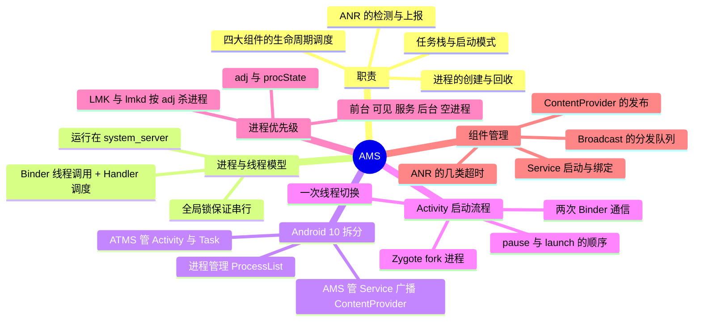

# AMS（ActivityManagerService）



> AMS 是 Android 的"组件调度中枢"：所有跨进程的组件启动请求最终都汇聚到 system_server 里的它，由它决定进程要不要创建、任务栈怎么摆、谁先谁后。而它最核心的一条优化主线，就是**让"跨进程启动组件"尽可能少走几次 Binder、少切几次线程**。

---

## 一、职责与位置

### 1. 职责范围

| 职责 | 说明 |
| --- | --- |
| 组件生命周期调度 | Activity 的启动/暂停/停止、Service 的启动与绑定、Broadcast 的注册与分发、ContentProvider 的发布 |
| 进程管理 | 按需向 Zygote 请求 fork 新进程、维护进程优先级、内存紧张时回收进程 |
| 任务栈管理 | Task/ActivityStack 的维护、启动模式与 Intent Flag 的处理 |
| 状态与 ANR | 维护系统运行状态（最近任务、崩溃信息），检测并上报各类超时导致的 ANR |

### 2. 进程与线程模型

- AMS 运行在 **system_server** 进程中，与 PMS、WMS、InputManagerService 等系统服务是"邻居"，彼此之间可以直接方法调用而不是 Binder 通信；
- 应用通过 `IActivityManager` / `IActivityTaskManager` 这些 AIDL 接口调用它，**调用发生在 system_server 的 Binder 线程**；AMS 内部用**全局锁**（`synchronized`，Android 11 起抽出为 `ActivityManagerGlobalLock` 标记类）保证所有状态变更串行；
- 因此 AMS 中不能有真正的耗时操作——它一旦长时间持锁，全系统的组件启动都会被卡住。进程启动这类工作会通过 `mHandler` 调度、必要时等待（`wait()`/`notify()`）。

> 面试常问："AMS 的方法是运行在哪个线程上的？" 准确回答是：**被 Binder 线程调用，靠全局锁而非单一线程保证串行**；其中一部分工作会 post 到 system_server 主线程执行。

### 3. Android 10 的拆分：ATMS 与 AMS

Android 10（API 29）之前，`ActivityManagerService` 一个类管所有事（被认为是 god object）。Android 10 起拆成两块：

| 服务 | 职责 | 应用侧接口 |
| --- | --- | --- |
| `ActivityTaskManagerService`（ATMS） | Activity 的启动与生命周期、Task/栈管理、启动模式 | `IActivityTaskManager` |
| `ActivityManagerService`（AMS） | Service、Broadcast、ContentProvider、进程管理、ANR | `IActivityManager` |
| `ProcessList` | 进程创建与优先级计算 | 内部类 |

所以 `startActivity` 在 Q 之后走的是 `ActivityTaskManager.getService().startActivity()`，而 `startService`/`bindService`/`sendBroadcast` 仍然走 `ActivityManager.getService()`。两者都在 system_server 里，共享 `ActivityTaskManagerGlobalLock`。

---

## 二、Activity 的启动流程

这是 AMS 环节最核心的高频题。

### 1. 整体链路

```
[App 进程]
Activity.startActivity
  → Instrumentation.execStartActivity
  → IActivityTaskManager.startActivity()           ① 第一次 Binder（App → system_server）

[system_server]
ATMS.ActivityStarter.execute()
  → 权限检查、用 PMS 解析 Intent（resolveActivity）
  → 处理启动模式与 Intent Flag，创建 ActivityRecord
  → 通知当前栈顶 Activity pause（onPause）
  → 目标进程不存在 → ProcessList.startProcessLocked
      → ZygoteProcess.start()                        ② socket 通知 Zygote fork 新进程

[App 进程（新）]
ActivityThread.main → attachApplication
  → ATMS.attachApplicationLocked
      → bindApplication（创建 Application、installContentProviders）
      → scheduleLaunchActivity
  → ApplicationThread.scheduleLaunchActivity            ③ 第二次 Binder（system_server → App）
  → ActivityThread.H（切回主线程）                      ④ 一次线程切换
  → handleLaunchActivity → performLaunchActivity
      → 反射创建 Activity、attach（绑定 Context）
      → Instrumentation.callActivityOnCreate → onCreate
  → handleResumeActivity → WindowManagerGlobal.addView
      → ViewRootImpl.setView → WMS.addWindow（见 WMS 篇）
```

### 2. 四个关键词

| 关键词 | 说明 |
| --- | --- |
| **两次 Binder 通信** | App → ATMS 发起启动请求；ATMS → App 回调 `scheduleLaunchActivity` |
| **一次线程切换** | 回调发生在 App 进程的 Binder 线程，必须经 `ActivityThread.H` 切到主线程才能创建 Activity |
| **一次 socket 通信** | 新进程的创建走的是 `ZygoteProcess` 与 Zygote 的 **socket**，不是 Binder（fork 不能跨线程，只能由单线程的 Zygote 来做） |
| **一次反射创建** | Activity 实例由系统通过 `ClassLoader` 反射创建，不是 new 出来的 |

### 3. 生命周期切换顺序

启动 Activity B 时（A 是当前前台）：

```
A.onPause → B.onCreate → B.onStart → B.onResume → A.onStop
```

- 老版本是**严格串行**的：等 A 暂停完成才继续启动 B；
- 新版本对这里做过优化（pause 与后续启动可以并行推进），但**用户可见的生命周期顺序不变**——这是面试时被追问"会不会出现 A 没 onStop 就 onResume 了 B"的标准答案：会，`A.onStop` 完全可能晚于 `B.onResume`。

### 4. 为什么要有 Token

ATMS 在创建 `ActivityRecord` 时同时产生一个 `IBinder` 类型的 **Token**（`ActivityRecord.Token`，本质上是一个 `WindowToken`）：

- 它是 Activity 在系统侧的"身份证"，App 侧拿到的 `Activity` 会持有它；
- 后续添加窗口时，WMS 会用它校验"这个窗口是否属于一个真实的、已启动的 Activity"——**没有有效 Token 添加应用窗口就会抛 `BadTokenException`**（见 [WMS](../WMS/WMS.md)）；
- 四大组件的跨进程调用中，"谁是谁"的确认全靠这类 Token 完成。

---

## 三、进程管理

### 1. 进程的创建

- 应用进程全部由 **Zygote fork** 而来：AMS 通过 `ProcessList.startProcessLocked` 走到 `ZygoteProcess`，用 socket 把"要启动的类（`ActivityThread`）、uid/gid、进程名"等参数发给 Zygote，Zygote fork 出子进程后在子进程中执行 `ActivityThread.main`；
- 新进程启动后会 `attachApplication` 向 AMS 报到，AMS 才把之前挂起的组件启动请求（`mPendingActivities` 等）发下去；
- 子进程**继承 Zygote 预加载的类和资源**（这是 Android 启动优化的基石，见 [Android系统启动](../Android系统启动/Android系统启动.md)）。

### 2. adj 与进程优先级

Android 不给应用进程"设定优先级"，而是通过 **`oom_score_adj`**（旧称 adj / oom_adj）告诉内核"这个进程有多该被杀"——**值越小越重要，越不容易被杀**：

| 级别 | adj | 典型场景 |
| --- | --- | --- |
| 前台进程 | 0 | 拥有前台 Activity、正在交互 |
| 可见进程 | 100 | Activity 可见但不可交互（如被 Dialog 覆盖、多窗口） |
| 可感知进程 | 200 | 前台服务、正在播放音频 |
| 服务进程 | 500 | 通过 `startService` 启动的服务 |
| 首页进程 | 600 | Launcher |
| 上一个进程 | 700 | 刚被切走的应用（快速返回的体验优化） |
| 缓存进程 | 900~999 | 后台无组件运行的进程，最先被杀 |

- AMS 在 `ProcessList` 中根据组件状态、`procState`、LRU 列表实时计算 adj，并写入 `/proc/<pid>/oom_score_adj`；
- **保活的本质就是想办法把 adj 降下来**——前台服务、播放音频、常驻通知等手段都是在"提升进程的重要性等级"，而 8.0 之后系统对后台限制越来越严，这类手段收益已经很低。

### 3. LMK 与进程回收

- 内核里的 **lowmemorykiller（LMK）** 传统上直接读 `oom_score_adj` 决定杀谁；
- Android 9 起改为用户空间的 **lmkd**（可配置策略更多），Android 10 之后还引入了基于 **PSI（Pressure Stall Information）** 的内存压力检测；
- 结论：**"进程被杀"通常不是 AMS 主动杀的，而是内存压力下由内核/lmkd 按 adj 挑最不重要的杀**，进程被杀时不会有回调（`onTrimMemory(TRIM_MEMORY_UI_HIDDEN)` 只是提前通知，不保证被调）。

---

## 四、对其他组件的管理

### 1. Service

- `startService` / `bindService` 最终都到 AMS：AMS 记录 `ServiceRecord`（谁启动了、谁绑定了、进程是谁），必要时拉起进程，然后回调 App 的 `scheduleCreateService`、`scheduleBindService`；
- 同一个 Service 被多次 `start` 会重复 `onStartCommand`，但只有第一次会创建实例（详见 [Service](../Service/Service.md)）；
- Service 的 ANR 超时：**前台服务 20s、后台服务 200s**。

### 2. Broadcast

- AMS 维护 `mReceiverResolver`（注册路由表）和 `BroadcastQueue`（并行/串行队列），发送广播时匹配出接收者并逐个分发，必要时拉起目标进程（详见 [Broadcast](../Broadcast/Broadcast.md)）；
- 广播的 ANR 超时：**前台广播 10s、后台广播 60s**。

### 3. ContentProvider

- provider 随进程启动而创建（`installContentProviders`，**早于 `Application.onCreate`**），AMS 按 authority 维护 `ContentProviderRecord`，客户端通过 `acquireProvider` 拿到 Binder 代理（详见 [ContentProvider](../ContentProvider/ContentProvider.md)）；
- provider 的发布超时是 **10s**。

### 4. ANR 的检测

AMS 对每类组件的关键回调都设了"闹钟"，到点没完成就判为 ANR：

| 场景 | 超时 | 检测方式 |
| --- | --- | --- |
| 输入事件（触摸/按键） | 5s | InputManagerService 上报，AMS 记录 |
| 前台 Service 的 `onCreate/onStartCommand/onBind` | 20s | AMS 的 `mHandler` 延时消息 |
| 后台 Service 同上 | 200s | 同上 |
| 广播 `onReceive` | 前台 10s / 后台 60s | `BroadcastQueue` 的延时消息 |
| ContentProvider 发布 | 10s | `mHandler` 延时消息 |

- ANR 发生后，AMS 会 dump 应用进程的堆栈（`/data/anr/traces.txt`）并弹出对话框，**弹出与否取决于是不是前台进程**；
- 关键认知：**ANR 是"按时完成不了"，不是"死循环"**——主线程被耗时操作（IO、锁等待、密集计算）占住就会触发，与卡顿的根因是同一类（见 [卡顿优化](../卡顿优化.md)）。

---

## 五、面试高频问答

### 1. Activity 的启动流程？

一句话：App 通过 `Instrumentation` 经 Binder 调 ATMS，ATMS 做权限校验、Intent 解析、任务栈处理，进程不存在就让 Zygote fork 一个新进程，再通过 Binder 回调 App 的 `ApplicationThread`，App 用 `ActivityThread.H` 切回主线程，最终反射创建 Activity 并回调 `onCreate`。**两次 Binder + 一次 socket + 一次线程切换**。

### 2. 为什么新进程要用 socket 而不是 Binder 去 fork？

fork 只能由**单线程**的进程安全执行，Zygote 进程里没有 Binder 线程池（也刻意不启动线程），所以 AMS 与 Zygote 之间用 socket（`LocalSocket`）通信。子进程起来后再通过 Binder 向 AMS 报到。

### 3. 为什么回调后必须切回主线程？

`ApplicationThread` 是 Binder 对象，它的方法运行在 App 进程的 Binder 线程池里；而 Activity 的创建、生命周期回调、View 树的构建都要求在主线程（有 Looper）执行，所以必须通过 `ActivityThread.H` post 到主线程。

### 4. A 跳到 B 的生命周期顺序？

`A.onPause → B.onCreate → B.onStart → B.onResume → A.onStop`。新版本中 `A.onStop` 晚于 `B.onResume` 是正常的（pause 与 launch 可以并行推进），不要依赖"B 起来时 A 一定已经 onStop"。

### 5. AMS 如何管理进程优先级？

按进程里"最重要的组件"计算 `oom_score_adj` 并写入 `/proc`。前台 0、可见 100、可感知 200、服务 500、Launcher 600、上一个 700、缓存 900+。内存紧张时由内核 LMK / 用户空间 lmkd 按 adj 从大到小杀进程——**这就是保活要"提升优先级"的原因，也是后台进程随时可能消失的原因**。

### 6. ANR 有哪几类？超时分别是多少？

输入事件 5s、前台 Service 20s（后台 200s）、广播前台 10s（后台 60s）、ContentProvider 发布 10s。共同点是"主线程在预期时间内没有响应系统的事件"。

### 7. AMS 里的方法在哪个线程执行？

应用侧调用经 Binder 进入 system_server 的 Binder 线程，AMS 用全局锁保证串行；部分工作会 post 到 system_server 主线程的 Handler。所以 AMS 内部不能有耗时操作——它阻塞的是整个系统的组件调度。

### 8. Android 10 为什么把 AMS 拆成 ATMS 和 AMS？

`ActivityManagerService` 长期是巨型类（God Object），职责混杂、难以维护。Q 起把 Activity 与 Task 相关的部分抽成 `ActivityTaskManagerService`，AMS 专注 Service/Broadcast/ContentProvider 与进程管理，接口也拆成了 `IActivityTaskManager` 与 `IActivityManager`。

### 9. ActivityRecord 和 Token 是什么？

`ActivityRecord` 是 ATMS 中代表一个 Activity 实例的数据结构（记录 intent、所属进程、任务栈、状态等）；它自带的 `Token` 是一个 `IBinder`，作为这个 Activity 在系统侧的"身份证"。App 侧添加窗口、WMS 校验窗口归属、AMS 回调生命周期都要带上它。

### 10. 应用进程被杀之后，为什么有的能恢复有的不能？

系统会在进程被杀前保存"有恢复价值"的组件状态（Activity 栈状态通过 `onSaveInstanceState`），进程重启后由 ATMS 恢复重建；但进程被杀时不会有任何通知，未落盘的数据、未持久化的状态都会丢失——所以关键数据要在 `onPause/onStop` 之前持久化，而不是指望 `onDestroy`。
