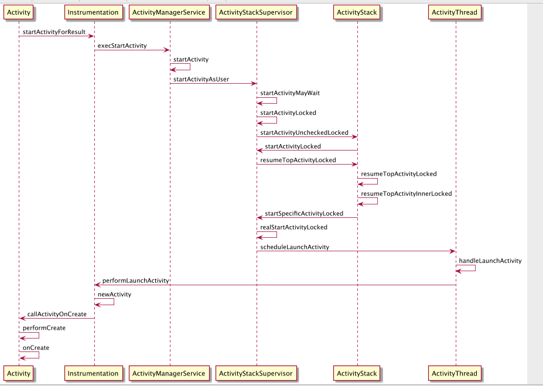
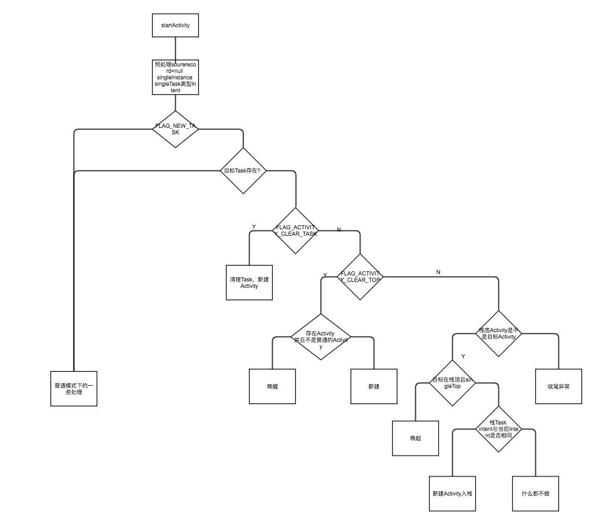
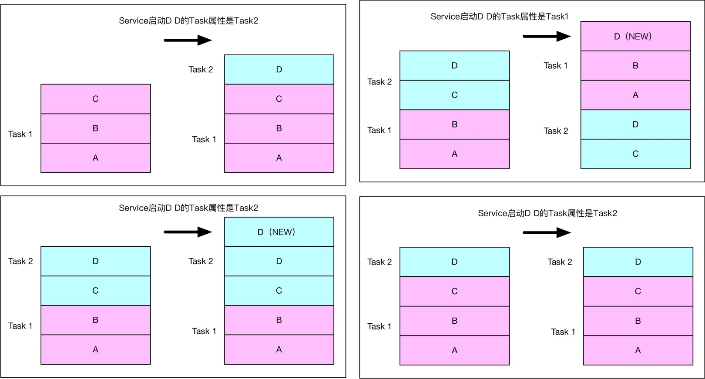
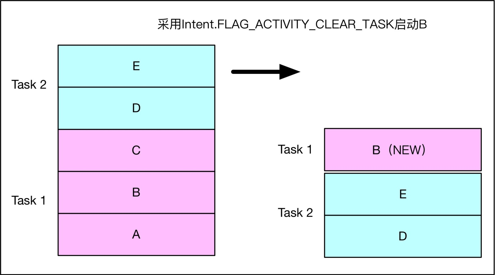
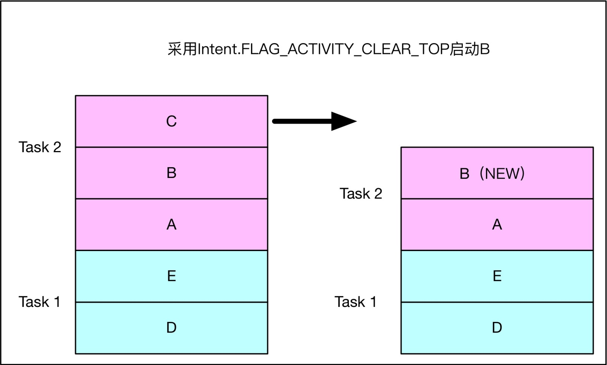
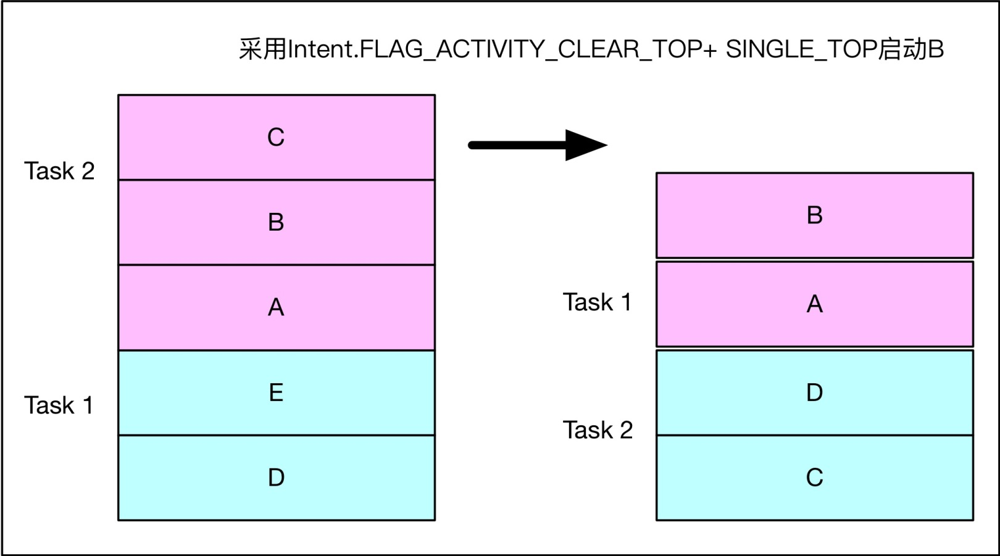
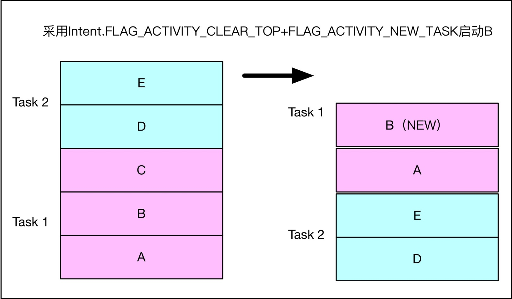
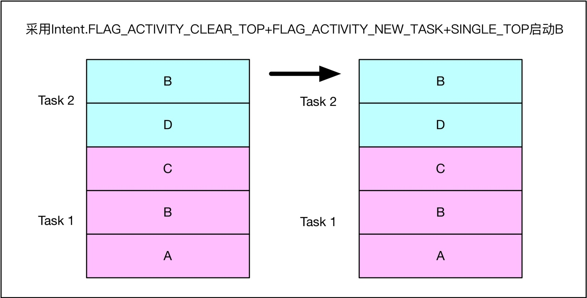

# Activity

## 启动流程

- 当我们在桌面点击一个应用程序的快捷图标时，Launcher 组件的成员函数 startActivitySafely 就会被调用来启动这个应用程序根 Activity。其中要启动的 MainActivity 信息就包含在 Intent 中。Launcher 组件是如何获取这些信息的呢？其实是在系统启动时，PackageManagerService 在安装每一个应用程序的过程中，都会去解析其 Manifest 文件，找到 ACTION_MAIN 和 Category 为 LAUNCHER 的 Activity 组件，最后为这个 Acivity 创建一个快捷图标，当点击这个图标时，就会启动这个应用程序的入口 Activity。

- 回到 Launcher 的 startActivitySafely 函数中，它会调用其父类的 startActivityForResult 方法，实际上是调用 Instrumentation 的 execStartActivity 方法，这是一个插件化的 Hook 点。在这个方法中会传递三个重要的参数，ApplicationThread、mToken、Intent。ApplicationThread 是一个 Binder 本地对象，AMS 接下来就可以通过它来通知 Launcher 组件进入 Pause 状态，mToken 是一个 Binder 代理对象，它指向 AMS 中的一个 ActivityRecord 的 Binder 本地对象，每一个已经启动的 Activity 组件在 AMS 中都有一个对应的 ActivityRecord 对象，用来维护对应的 Activity 组件的运行状态及信息，这样 AMS 就可以获取 Launcher 组件的详细信息了。在 Instrumentation 的 execStartActivity 中，通过 ActivityManagerNative 的 getDefault 获取 AMS 的一个代理对象，实际上就是调用 ServiceManager 的 getService，获取的是一个 IActivityManager 接口，这也是一个 Hook 点。然后就调到了它的实现类 ActivityManagerProxy 中的 startActivity 方法，在这个方法中，就会往 AMS tranact 一个 START_ACTIVITY_TRANSACTION 的请求。

- 在 AMS 收到这个请求时，就会让 ActivityStack 去处理。它首先根据上面传递过来的 ApplicationThread 去通知 Launcher 所在的应用程序进程去暂停 Launcher 组件，也就是回调到 ActivityThread 的内部类 ApplicationThread 的 schedulePauseActivity，往主线程发送一个 PAUSE_ACTIVITY 消息，mH 进行处理执行 handlePauseActivity。这个方法先调用 Activity 的 onPause 函数，最后就是通知 AMS Launcher 组件已经暂停完成了。再回到 AMS 中，就开始真正的去启动 MainActivity 了，首先检查这个 Activity 对应的 ActivityRecord 对象所在的应用程序进程是否已经存在，如果存在就直接执行 realStartActivityLocked，如果不存在就先 startProcessLocked 去创建一个应用程序进程。创建应用程序进程即调用 Porcess start 函数，并指定该进程的入口函数为 ActivityThread，这一步其实是请求 Zygote fork 出一个应用程序进程。在 ActivityThread 的 main 函数中，创建消息循环，并且调用 attachApplication 把当前的 ApplicationThread 对象传递给 AMS，AMS 有了它就可以去通知应用程序去执行 MainActivity 的 onCreate 方法了。同上述执行 Launcher 的 onPause 函数一样，也是发一个消息给主线程，调用 handleLauncherActivity。在 handleLauncherActivity 中，通过 Instrumentation 的 newActivity 去创建这个 Activity，然后创建 Application 对象以及 ContextImpl ，最后调用 Activity 的 attach 函数，这个函数里面会 new 一个 PhoneWindow 并关联 WindowManager，也就是 Activity 显示流程的入口函数了。最最后会调用到 Activity 的 onCreate 函数。至此，Activity 的启动流程讲完了。如果是非根 Activity 的启动呢，只需要去掉创建应用程序进程那一步即可。

## 生命周期

## 启动模式

- 启动四种模式，Activity启动Activity，并且采用的都是默认Intent，没有额外添加任何Flag

    - standard：标准启动模式（默认启动模式），每次都会启动一个新的activity实例。

    - singleTop：单独使用使用这种模式时，如果Activity实例位于当前任务栈顶，就重用栈顶实例，而不新建，并回调该实例onNewIntent()方法，否则走新建流程。

    - singleTask：这种模式启动的Activity只会存在相应的Activity的taskAffinit任务栈中，同一时刻系统中只会存在一个实例，已存在的实例被再次启动时，会重新唤起该实例，并清理当前Task任务栈该实例之上的所有Activity，同时回调onNewIntent()方法。

    - singleInstance：这种模式启动的Activity独自占用一个Task任务栈，只是系统不会将任何其他 Activity 启动到包含实例的任务中。该 Activity 始终是其任务唯一仅有的成员；同一时刻系统中只会存在一个实例，已存在的实例被再次启动时，只会唤起原实例，并回调onNewIntent()方法。

- IntentFlag

    - Intent.FLAG_ACTIVITY_NEW_TASK,系统会去检查这个Activity的taskAffinity,taskAffinity，可以翻译为任务相关性,是否与当前Task的taskAffinity相同。如果相同的话就会把它放入到当前Task当中，如果不同则会先去检查是否已经有一个名字与该Activity的affinity相同的Task,如果有，这个Task将被调到前台，同时这个Activity将显示在这个Task的顶端；如果没有的话，系统将会尝试为这个Activity创建一个新的Task。需要注意的是，如果一个Activity在manifest文件中声明的启动模式是”singleTask”，那么他被启动的时候，行为模式会和前面提到的指定FLAG_ACTIVITY_NEW_TASK一样。

    - Intent.FLAG_ACTIVITY_CLEAR_TASK,这个属性必须同FLAG_ACTIVITY_NEW_TASK配合使用，如果设置了FLAG_ACTIVITY_NEW_TASK|Intent.FLAG_ACTIVITY_CLEAR_TASK，如果目标task已经存在，将清空已存在的目标Task，否则，新建一个Task栈，之后，新建一个Activity作为根Activity。Intent.FLAG_ACTIVITY_CLEAR_TASK的优先级最高，基本可以无视所有的配置，包括启动模式及Intent Flag，哪怕是singleInstance也会被finish，并重建。

    - Intent.FLAG_ACTIVITY_CLEAR_TOP

         - 如果单独使用Intent.FLAG_ACTIVITY_CLEAR_TOP，并且没有设置特殊的launchmode

         - 如果同时设置了FLAG_ACTIVITY_SINGLE_TOP，在当前栈已有的情况下就不会重建，而是直接回调B的onNewIntent()

         - 如果同时使用了FLAG_ACTIVITY_NEW_TASK ，这个时候，目标是Activity自己所属的Task栈，如果在自己的Task中能找到一个Activity实例，则将其上面的及自身清理掉，之后重建。

         - 如果同时在加上FLAG_ACTIVITY_SINGLE_TOP，会更特殊一些，如果topActivity不是目标Activity，就会去目标Task中去找，并唤起

    - Intent.FLAG_ACTIVITY_SINGLE_TOP多用来做辅助作用，跟launchmode中的singleTop作用一样，在Task栈顶有的话，就不新建，栈顶没有的话，就新建，这里的Task可能是目标栈，也可能是当前Task栈，配合FLAG_ACTIVITY_NEW_TASK及FLAG_ACTIVITY_CLEAR_TOP都会有很有意思的效果。

- Task,[按home键，桌面按图标表现](https://www.bilibili.com/video/BV1CA41177Se/?t=237)

- 为什么非Activity启动Activity要强制规定使用参数FLAG_ACTIVITY_NEW_TASK,从源码上说，ContextImpl在前期做了检查，如果没添加Intent.FLAG_ACTIVITY_NEW_TASK就抛出异常,直观很好理解，如果不是在Activity中启动的，那就可以看做不是用户主动的行为，也就说这个界面可能出现在任何APP之上，如果不用Intent.FLAG_ACTIVITY_NEW_TASK将其限制在自己的Task中，那用户可能会认为该Activity是当前可见APP的页面，这是不合理的。举个例子：我们在听音乐，这个时候如果邮件Service突然要打开一个Activity，如果不用Intent.FLAG_ACTIVITY_NEW_TASK做限制，那用户可能认为这个Activity是属于音乐APP的，因为用户点击返回的时候，可能会回到音乐，而不是邮件（如果邮件之前就有界面）。

- taskAffinity,Intent.FLAG_ACTIVITY_NEW_TASK，allowTaskReparenting

    - 启一个新task 的条件是 FLAG_ACTIVITY_NEW_TASK 和 taskAffinity 不同 缺一不可。即使aActivity和bActivity在不同的进程

    - allowTaskReparenting 这个属性指的是一个 Activity 运行时，可以重新选择自己所属的task。基本是在跨app 间调用时，当 A 启动 B 时，这时虽然是在两个进程中的，但其归属的task 是同一个，这时我们回到后台，在桌面点击 B 的应用图标，我们会发现 log 日志如下：其中 MyApplication 代表 app1，MyApplication2代表 app2。若 bActivity taskAffinity指定的task 已经存在，是会复用之前的task，而不会再重新创建一个新的task。

## 隐式启动
* Action
* Category
* Data

