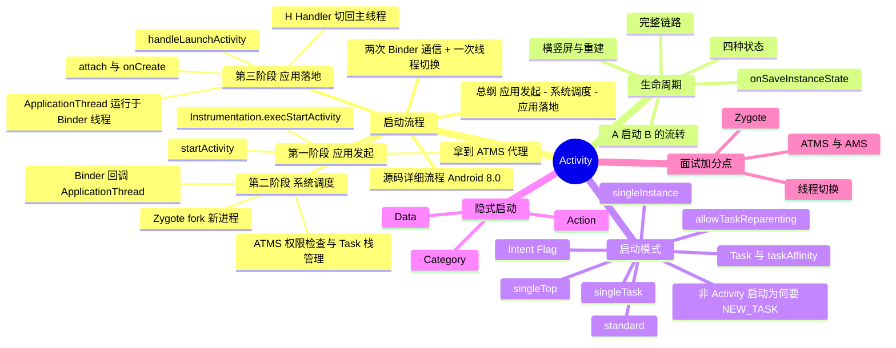
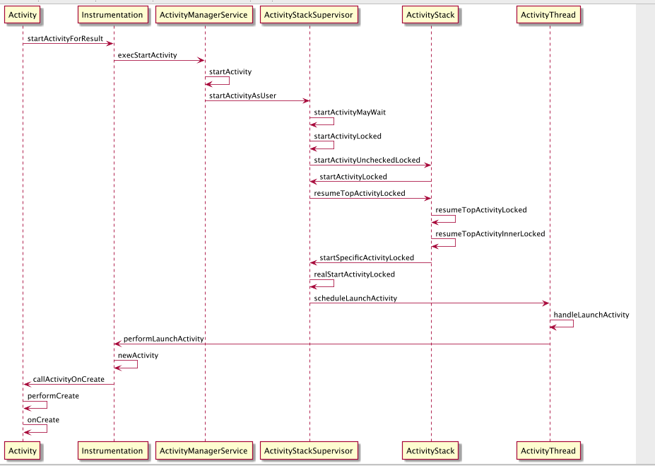
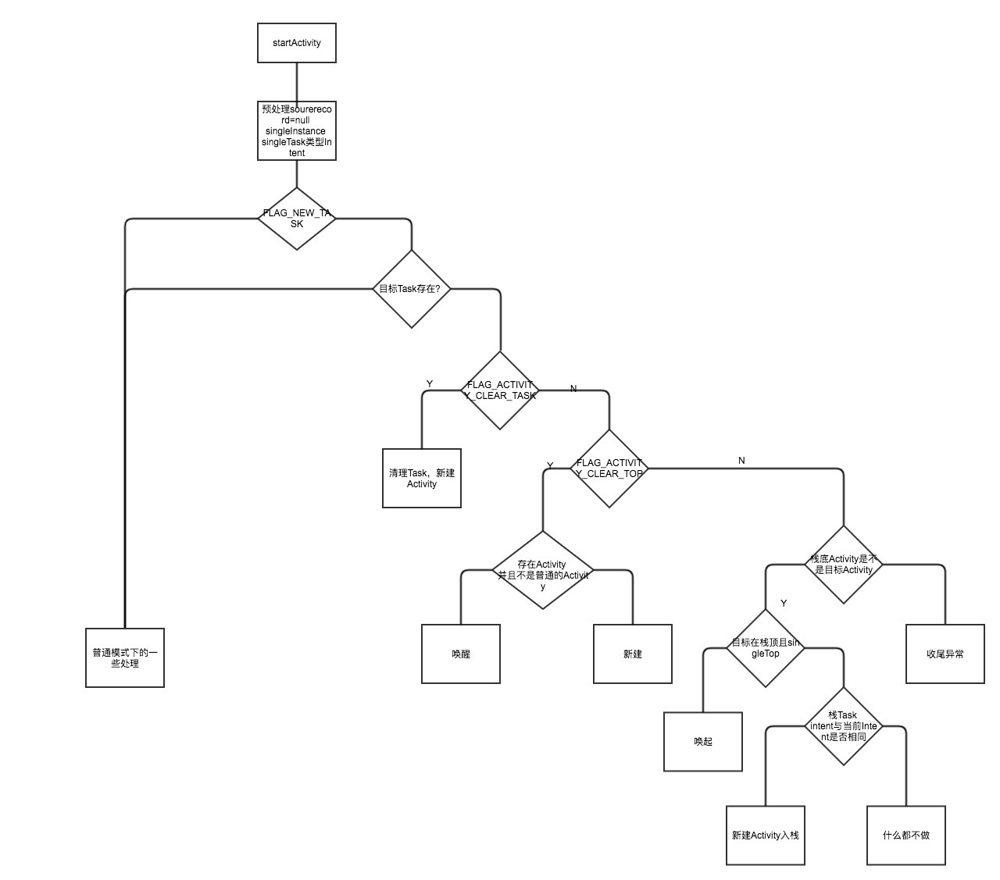
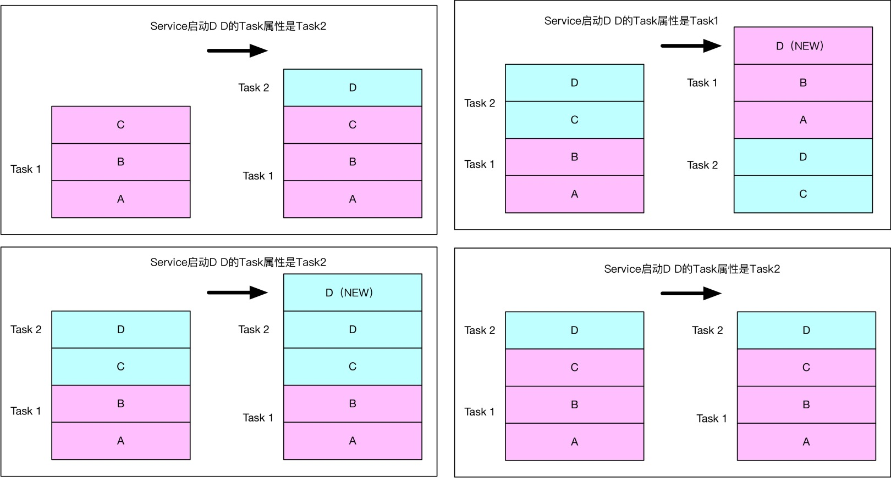
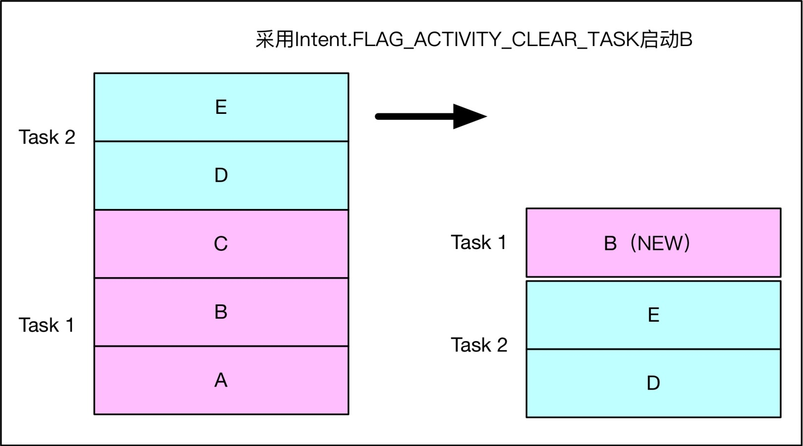
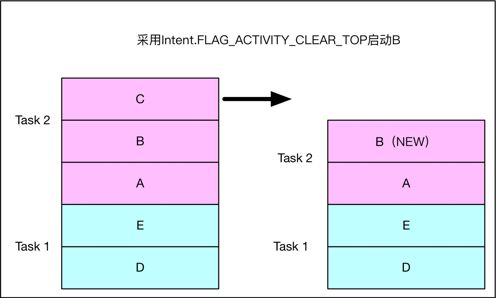
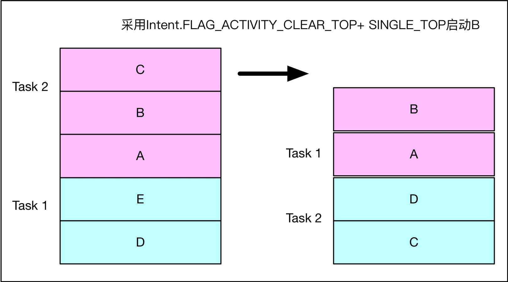
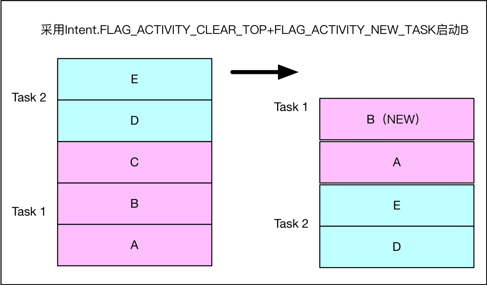
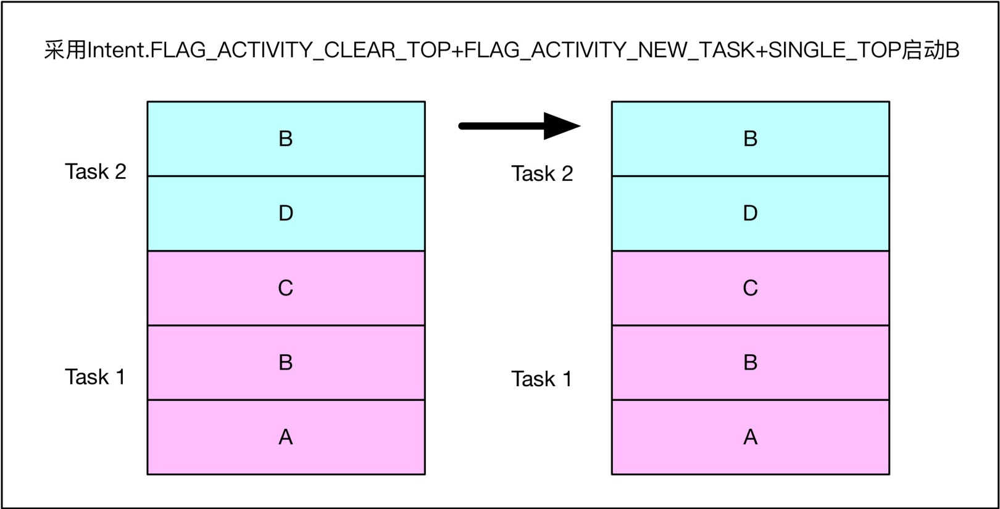

# Activity


```mermaid
mindmap
  root((Activity))
    启动流程
      总纲 应用发起 - 系统调度 - 应用落地
      两次 Binder 通信 + 一次线程切换
      第一阶段 应用发起
        startActivity
        Instrumentation.execStartActivity
        拿到 ATMS 代理
      第二阶段 系统调度
        ATMS 权限检查与 Task 栈管理
        Zygote fork 新进程
        Binder 回调 ApplicationThread
      第三阶段 应用落地
        ApplicationThread 运行于 Binder 线程
        H Handler 切回主线程
        handleLaunchActivity
        attach 与 onCreate
      源码详细流程 Android 8.0
    生命周期
      完整链路
      四种状态
      A 启动 B 的流转
      横竖屏与重建
      onSaveInstanceState
    启动模式
      standard
      singleTop
      singleTask
      singleInstance
      Intent Flag
      Task 与 taskAffinity
      非 Activity 启动为何要 NEW_TASK
      allowTaskReparenting
    隐式启动
      Action
      Category
      Data
    面试加分点
      ATMS 与 AMS
      线程切换
      Zygote
```

---

## 一、启动流程



### 1. 总纲（一句话定调）

**应用进程发请求 → 系统进程管调度 → 应用进程建实例。**

核心是：**两次 Binder 通信 + 一次线程切换**。

### 2. 第一阶段：应用发起（Client 端）

目标：从 App 点按钮，到跨进程发出请求。

1. **入口**：`Context.startActivity()`
2. **跳转**：`Instrumentation.execStartActivity()`
3. **跨进程**：通过 Binder 拿到 `ATMS` 的代理，发起启动请求。
4. **关键点**：这一步是 App 主动去"求"系统。

### 3. 第二阶段：系统调度（System 进程）

目标：系统检查权限、管理栈、准备进程。

1. **ATMS 处理**（ActivityTaskManagerService）：
   - **权限检查**
   - **Task 栈管理**（决定放在哪个任务栈）
2. **进程创建**（如果 App 进程没启动）：
   - ATMS 通知 AMS → 通过 **Zygote** Fork 出新进程。
3. **回调应用**（核心 Binder 路）：
   - 系统进程通过 Binder 回调应用的 `ApplicationThread`。

### 4. 第三阶段：应用接收（App 落地）

目标：从系统回调，到真正执行 `onCreate`。

**这是面试必讲的一段「黄金链路」：**

1. **系统回调**：`ApplicationThread.scheduleTransaction()`
   - 这是系统告诉 App："该启动了"。
   - *注意：运行在 Binder 线程池。*
2. **线程切换**：`ActivityThread.H` 发送 `EXECUTE_TRANSACTION`
   - *核心原理*：Binder 线程不能操作 UI/生命周期，必须切回**主线程**。
3. **应用入口**：`ActivityThread.handleLaunchActivity()`
   - *你指定的终点*。App 端真正的创建入口。
4. **最终构建**：
   - 创建 `ContextImpl`
   - 反射创建 Activity 实例
   - 调用 `attach()` 绑定 Window
   - 触发 `onCreate()`

### 5. 源码详细流程

> 注：下面这段源码流程基于 Android 8.0（由 AMS 负责调度），Android Q 之后调度逻辑移到了 ATMS，但整体链路不变。

- 当我们在桌面点击一个应用程序的快捷图标时，Launcher 组件的成员函数 startActivitySafely 就会被调用来启动这个应用程序根 Activity。其中要启动的 MainActivity 信息就包含在 Intent 中。Launcher 组件是如何获取这些信息的呢？其实是在系统启动时，PackageManagerService 在安装每一个应用程序的过程中，都会去解析其 Manifest 文件，找到 ACTION_MAIN 和 Category 为 LAUNCHER 的 Activity 组件，最后为这个 Activity 创建一个快捷图标，当点击这个图标时，就会启动这个应用程序的入口 Activity。

- 回到 Launcher 的 startActivitySafely 函数中，它会调用其父类的 startActivityForResult 方法，实际上是调用 Instrumentation 的 execStartActivity 方法，这是一个插件化的 Hook 点。在这个方法中会传递三个重要的参数，ApplicationThread、mToken、Intent。ApplicationThread 是一个 Binder 本地对象，AMS 接下来就可以通过它来通知 Launcher 组件进入 Pause 状态，mToken 是一个 Binder 代理对象，它指向 AMS 中的一个 ActivityRecord 的 Binder 本地对象，每一个已经启动的 Activity 组件在 AMS 中都有一个对应的 ActivityRecord 对象，用来维护对应的 Activity 组件的运行状态及信息，这样 AMS 就可以获取 Launcher 组件的详细信息了。在 Instrumentation 的 execStartActivity 中，通过 ActivityManagerNative 的 getDefault 获取 AMS 的一个代理对象，实际上就是调用 ServiceManager 的 getService，获取的是一个 IActivityManager 接口，这也是一个 Hook 点。然后就调到了它的实现类 ActivityManagerProxy 中的 startActivity 方法，在这个方法中，就会往 AMS transact 一个 START_ACTIVITY_TRANSACTION 的请求。

- 在 AMS 收到这个请求时，就会让 ActivityStack 去处理。它首先根据上面传递过来的 ApplicationThread 去通知 Launcher 所在的应用程序进程去暂停 Launcher 组件，也就是回调到 ActivityThread 的内部类 ApplicationThread 的 schedulePauseActivity，往主线程发送一个 PAUSE_ACTIVITY 消息，mH 进行处理执行 handlePauseActivity。这个方法先调用 Activity 的 onPause 函数，最后就是通知 AMS Launcher 组件已经暂停完成了。再回到 AMS 中，就开始真正的去启动 MainActivity 了，首先检查这个 Activity 对应的 ActivityRecord 对象所在的应用程序进程是否已经存在，如果存在就直接执行 realStartActivityLocked，如果不存在就先 startProcessLocked 去创建一个应用程序进程。创建应用程序进程即调用 Process start 函数，并指定该进程的入口函数为 ActivityThread，这一步其实是请求 Zygote fork 出一个应用程序进程。在 ActivityThread 的 main 函数中，创建消息循环，并且调用 attachApplication 把当前的 ApplicationThread 对象传递给 AMS，AMS 有了它就可以去通知应用程序去执行 MainActivity 的 onCreate 方法了。同上述执行 Launcher 的 onPause 函数一样，也是发一个消息给主线程，调用 handleLaunchActivity。在 handleLaunchActivity 中，通过 Instrumentation 的 newActivity 去创建这个 Activity，然后创建 Application 对象以及 ContextImpl ，最后调用 Activity 的 attach 函数，这个函数里面会 new 一个 PhoneWindow 并关联 WindowManager，也就是 Activity 显示流程的入口函数了。最最后会调用到 Activity 的 onCreate 函数。至此，Activity 的启动流程讲完了。如果是非根 Activity 的启动呢，只需要去掉创建应用程序进程那一步即可。

### 6. 面试口述速记

面试官问：讲一下 Activity 启动流程，从 startActivity 到 handleLaunchActivity。

**你直接背这段：**

整个流程分**三步走**。

**第一步，应用发起**：App 调用 startActivity，最终通过 Instrumentation 跨进程调用到 ATMS。

**第二步，系统调度**：ATMS 做权限检查和 Task 栈管理，如果进程不存在，会通过 Zygote fork 出新进程，然后通过 Binder 回调应用的 ApplicationThread。

**第三步，应用落地**：因为 Binder 线程不能执行生命周期，所以通过 ActivityThread 的 H Handler 切换到主线程，最终调用 **handleLaunchActivity**，完成 Activity 实例化、attach 并回调 onCreate。

### 7. 核心加分点

1. **ATMS vs AMS**：一定要说 Android Q 之后调度逻辑移到了 **ATMS**。
2. **线程切换**：必须强调 `ApplicationThread` 在 Binder 线程，必须通过 `H` Handler 切回主线程。
3. **Zygote**：解释清楚进程孵化是通过 Zygote fork，效率高。

---

## 二、生命周期

### 1. 完整回调链路

```
onCreate → onStart → onResume → onPause → onStop → onDestroy
                        ↑                      │
                        └──── onRestart ←──────┘
```

- 正常创建到销毁走**六个回调**；从"停止"状态回到前台时，会先回调 `onRestart`，再走 `onStart → onResume`。
- `onCreate` 与 `onDestroy` 在一次完整的生命周期中只各调用一次。

### 2. 四种状态与回调职责

| 状态 | 触发时机 | 回调职责 |
| --- | --- | --- |
| 运行（Resumed） | Activity 位于前台，可见且可交互 | `onResume` 中常恢复动画、注册监听 |
| 暂停（Paused） | 被部分遮挡（如透明的 Activity、对话框主题页），仍可见但不可交互 | `onPause` 中**不能做耗时操作**，否则会拖慢下一个页面的显示 |
| 停止（Stopped） | 完全不可见 | `onStop` 中可做较重的资源释放；内存紧张时可能被系统回收 |
| 销毁（Destroyed） | 被 finish 或系统回收 | `onDestroy` 做最后的释放收尾 |

### 3. A 启动 B 的生命周期顺序

- **A 启动 B**：`A.onPause → B.onCreate → B.onStart → B.onResume → A.onStop`
  - 如果 B 是透明主题，A 依然可见，就不会走 `onStop`。
- **从 B 返回 A**：`B.onPause → A.onRestart → A.onStart → A.onResume → B.onStop → B.onDestroy`
- 注意 `onPause` 与 `onStop` 的区别：`onPause` 之后 Activity 仍然可见（只是失去焦点），`onStop` 之后才完全不可见。

### 4. 横竖屏切换与状态保存

- 默认情况下屏幕旋转会导致 Activity **销毁重建**：`onPause → onStop → onDestroy → onCreate → onStart → onResume`。
- 在 Manifest 中为该 Activity 声明 `android:configChanges="orientation|screenSize"` 可阻止重建，改为回调 `onConfigurationChanged`。
- `onSaveInstanceState` 在 Activity 可能被回收前回调，用于保存临时 UI 状态（如 EditText 内容、滚动位置）；重建时通过 `onRestoreInstanceState` 或 `onCreate` 的 `savedInstanceState` 恢复。

---

## 三、启动模式

- 启动四种模式，Activity 启动 Activity，并且采用的都是默认 Intent，没有额外添加任何 Flag：

| 模式 | 行为 |
| --- | --- |
| standard | 标准启动模式（默认），每次都会启动一个新的 Activity 实例 |
| singleTop | 栈顶复用：如果 Activity 实例位于当前任务栈顶，就重用栈顶实例而不新建，并回调 `onNewIntent()`；否则走新建流程 |
| singleTask | 栈内复用：Activity 只会存在于相应 taskAffinity 的任务栈中，同一时刻系统中只会存在一个实例；已存在的实例被再次启动时会重新唤起，并清理当前 Task 中该实例之上的所有 Activity，同时回调 `onNewIntent()` |
| singleInstance | 独占任务栈：Activity 独自占用一个 Task，系统不会将任何其他 Activity 启动到该任务中，该 Activity 始终是其任务唯一仅有的成员；已存在的实例被再次启动时只会唤起原实例，并回调 `onNewIntent()` |

### 1. Intent Flag



- **Intent.FLAG_ACTIVITY_NEW_TASK**：系统会去检查这个 Activity 的 taskAffinity（任务相关性）是否与当前 Task 的 taskAffinity 相同。如果相同就会把它放入当前 Task；如果不同，则会先去检查是否已经有一个名字与该 Activity 的 affinity 相同的 Task，如果有，这个 Task 将被调到前台，同时该 Activity 将显示在这个 Task 的顶端；如果没有，系统将会尝试为该 Activity 创建一个新的 Task。需要注意的是，如果一个 Activity 在 Manifest 中声明的启动模式是 "singleTask"，那么它被启动时的行为会和指定 FLAG_ACTIVITY_NEW_TASK 一样。



- **Intent.FLAG_ACTIVITY_CLEAR_TASK**：必须同 FLAG_ACTIVITY_NEW_TASK 配合使用。如果设置了 `FLAG_ACTIVITY_NEW_TASK | FLAG_ACTIVITY_CLEAR_TASK`，且目标 Task 已经存在，将清空已存在的目标 Task；否则新建一个 Task 栈，之后新建一个 Activity 作为根 Activity。FLAG_ACTIVITY_CLEAR_TASK 的优先级最高，基本可以无视所有的配置，包括启动模式及 Intent Flag，哪怕是 singleInstance 也会被 finish 并重建。



- **Intent.FLAG_ACTIVITY_CLEAR_TOP**：
  - 单独使用时（没有设置特殊的 launchMode）：
  - 同时设置了 FLAG_ACTIVITY_SINGLE_TOP，且当前栈已有的情况下不会重建，而是直接回调 B 的 `onNewIntent()`：
  - 同时使用 FLAG_ACTIVITY_NEW_TASK 时，目标是该 Activity 自己所属的 Task 栈，如果在自己的 Task 中能找到该 Activity 实例，则将其上面的 Activity 及自身清理掉，之后重建：
  - 再加上 FLAG_ACTIVITY_SINGLE_TOP 会更特殊：如果 topActivity 不是目标 Activity，就会去目标 Task 中去找，并唤起：
- **Intent.FLAG_ACTIVITY_SINGLE_TOP** 多用来做辅助作用，跟 launchMode 中的 singleTop 作用一样：Task 栈顶有就不新建，栈顶没有就新建。这里的 Task 可能是目标栈，也可能是当前 Task 栈，配合 FLAG_ACTIVITY_NEW_TASK 及 FLAG_ACTIVITY_CLEAR_TOP 都会有很有意思的效果。

### 2. Task

[按 home 键，桌面按图标表现](https://www.bilibili.com/video/BV1CA41177Se/?t=237)

**为什么非 Activity 启动 Activity 要强制规定使用 FLAG_ACTIVITY_NEW_TASK？**

从源码上说，ContextImpl 在前期做了检查，如果没添加 Intent.FLAG_ACTIVITY_NEW_TASK 就抛出异常。直观上也很好理解：如果不是在 Activity 中启动的，那就可以看做不是用户主动的行为，也就是说这个界面可能出现在任何 APP 之上；如果不用 Intent.FLAG_ACTIVITY_NEW_TASK 将其限制在自己的 Task 中，用户可能会认为该 Activity 是当前可见 APP 的页面，这是不合理的。举个例子：我们在听音乐，这个时候如果邮件 Service 突然要打开一个 Activity，如果不用 Intent.FLAG_ACTIVITY_NEW_TASK 做限制，用户可能认为这个 Activity 是属于音乐 APP 的，因为用户点击返回的时候可能会回到音乐，而不是邮件（如果邮件之前就有界面）。

### 3. taskAffinity 与 allowTaskReparenting

- 启一个新 task 的条件是 FLAG_ACTIVITY_NEW_TASK 和 taskAffinity 不同，**缺一不可**。即使 aActivity 和 bActivity 在不同的进程。
- `allowTaskReparenting` 这个属性指的是一个 Activity 运行时，可以重新选择自己所属的 Task。基本是在跨 App 间调用时用到：当 A 启动 B 时，这时虽然是在两个进程中的，但其归属的 Task 是同一个；这时我们回到后台，在桌面点击 B 的应用图标，从 log 中可以看到 B 被拉回了自己所属的 Task（原文示例里 MyApplication 代表 app1、MyApplication2 代表 app2）。若 bActivity 的 taskAffinity 指定的 Task 已经存在，则会复用之前的 Task，而不会重新创建一个新的 Task。

---

## 四、隐式启动

- **显式启动**：Intent 中直接指定目标组件（`setClass`/`setComponent`，或构造时传入 Context + Class），系统直接找到目标 Activity。
- **隐式启动**：Intent 中只声明 Action、Category、Data，由系统根据 Manifest 中的 `intent-filter` 去匹配目标。

匹配规则要点：

| 元素 | 匹配规则 |
| --- | --- |
| Action | 一个 Intent 只能有一个 Action，IntentFilter 可以声明多个，只要匹配其中任意一个即可 |
| Category | Intent 中可以不声明 Category；但一旦声明，IntentFilter 就必须全部包含。`startActivity` 隐式启动会自动加上 `android.intent.category.DEFAULT`，所以过滤器里通常要声明 `DEFAULT` |
| Data | 由 scheme、host、port、path、mimeType 组成，Intent 中声明了 Data 才参与匹配 |

- 匹配不到任何目标时，会抛出 `ActivityNotFoundException`。

---

## 五、30 秒口述版

Activity 启动流程核心是**两次 Binder 通信 + 一次线程切换**：App 侧 `startActivity` 经 `Instrumentation.execStartActivity` 跨进程调用 ATMS（Android Q 之前是 AMS）；系统侧做权限检查、Task 栈管理，进程不存在就通过 Zygote fork，再通过 Binder 回调 App 的 `ApplicationThread`；App 侧因为回调发生在 Binder 线程，必须经 `ActivityThread.H` 切回主线程，最终走到 `handleLaunchActivity`，完成实例化、`attach` 并回调 `onCreate`。生命周期与启动模式（standard / singleTop / singleTask / singleInstance）以及各种 Intent Flag 对 Task 的影响，是紧随其后的高频追问。
