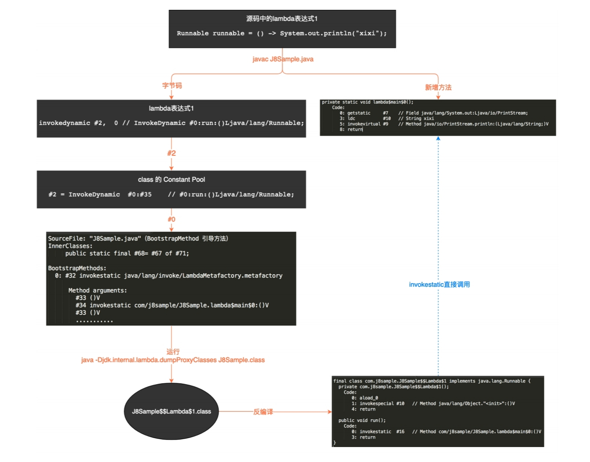

Android 兼容 Java 8 语法特性的原理分析
--

# Java8特性

- Lambda 表达（函数闭包）,Lambda 表达式是 Java 支持函数式编程的基础，也可以称之为闭包。简单来说，就是在 Java 语法层面允许将函数当作方法的参数，函数可以当做对象。任一Lambda 表达式都有且只有一个函数式接口与之对应，从这个角度来看，也可以说是该函数式接口的实例化。

- 函数式接口（@FunctionalInterface）

- Stream API（通过流式调用支持 map、filter 等高阶函数）

- 方法引用（使用 :: 关键字将函数转化为对象）

- 默认方法（抽象接口中允许存在 default 修饰的非抽象方法）

- 类型注解和重复注解

--

# Lamba表达式原理

- invokedynamic指令是Java 7中新增的字节码调用指令，作为Java支持动态类型语言的改进之一，跟invokevirtual、invokestatic、invokeinterface、invokespecial四大指令一起构成了虚拟机层面各种Java方法的分配调用指令集。区别在于：

    - 后四种指令，在编译期间生成的class文件中，通过常量池(Constant Pool)的MethodRef常量已经固定了目标方法的符号信息（方法所属者及其类型，方法名字、参数顺序和类型、返回值）。虚拟机使用符号信息能直接解释出具体的方法，直接调用。

    - 而invokedynamic指令在编译期间生成的class文件中，对应常量池(Constant Pool)的Invokedynamic_Info常量存储的符号信息中并没有方法所属者及其类型 ，替代的是BootstapMethod信息。在运行时，通过引导方法BootstrapMethod机制动态确定方法的所属者和类型。这一特点也非常契合动态类型语言只有在运行期间才能确定类型的特征。

- 1.7上新增的动态指令，生成静态方法，动态生成实现类去调用静态方法

--

# Android支持

- 原理方面：却是参照 Lambda 在 Java 底层的实现，并将这些实现移至RetroLambda 插件或者 Jack、D8 编译器工具中。

- 在 Android 上的其他三种 Desugar 方式，原理都是一样的，区别在于时机不同

    - 1.RetroLambda 将函数式接口对应的实例类型的生产过程，放在 javac 编译之后，dx 编译之前，并动态修改了表达式所属的字节码文件。

    - 2.Jack&Jill 是直接将接口对应的实例类型，直接 jack 过程中生成，并编译进了dex 文件

    - 3.D8 的过程是在 dex 编译过程中，直接在内存生成接口对应的实例类型，并将生成的类型直接写入生成的 dex 文件中。

--

# 使用
java -Djdk.internal.lambda.dumpProxyClasses J8Sample.class运行一下，可以内存中动态生成的类型输出到本地

--

# 执行
$ANDROID_HOME/build-tools/28.0.3/dexdump -d classes.dex >> dexInfo.txt拿到dex信息

