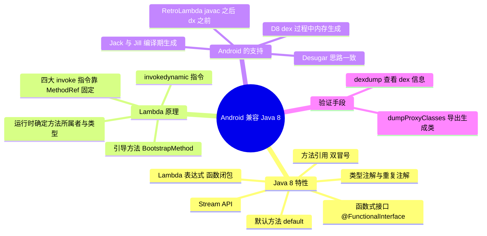
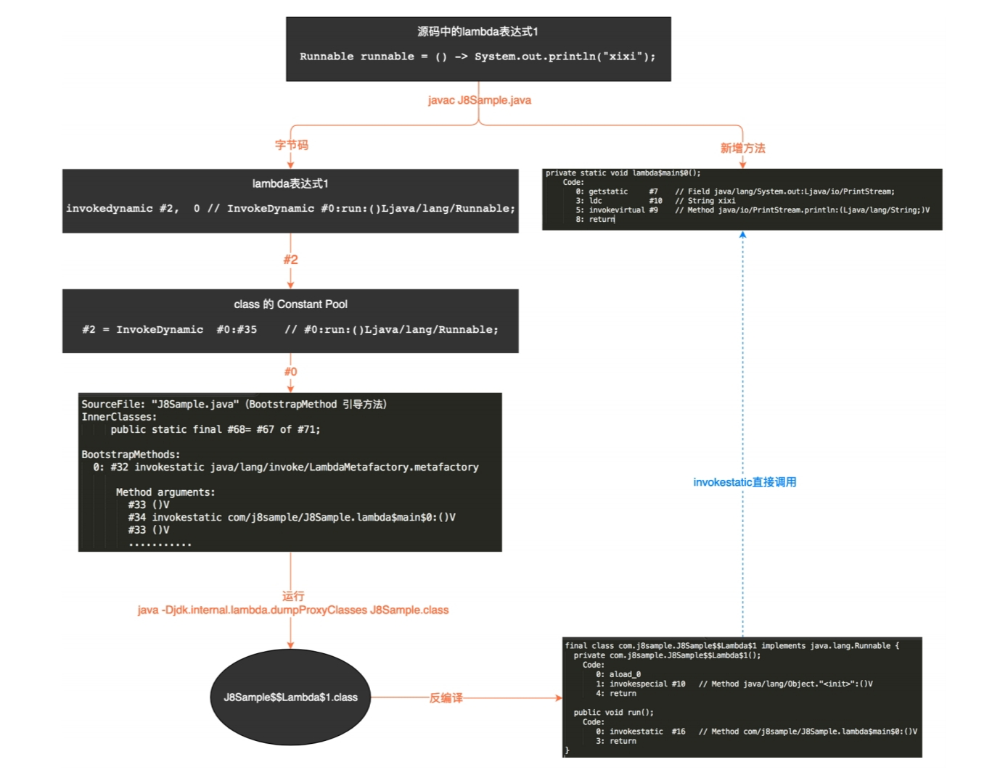

# Android 兼容 Java 8 语法特性的原理分析


```mermaid
mindmap
  root((Android 兼容 Java 8))
    Java 8 特性
      Lambda 表达式 函数闭包
      函数式接口 @FunctionalInterface
      Stream API
      方法引用 双冒号
      默认方法 default
      类型注解与重复注解
    Lambda 原理
      invokedynamic 指令
      四大 invoke 指令靠 MethodRef 固定
      引导方法 BootstrapMethod
      运行时确定方法所属者与类型
    Android 的支持
      Desugar 思路一致
      RetroLambda javac 之后 dx 之前
      Jack 与 Jill 编译期生成
      D8 dex 过程中内存生成
    验证手段
      dumpProxyClasses 导出生成类
      dexdump 查看 dex 信息
```

---

## 一、Java 8 特性

- **Lambda 表达式（函数闭包）**：Lambda 表达式是 Java 支持函数式编程的基础，也可以称之为闭包。简单来说，就是在 Java 语法层面允许将函数当作方法的参数，函数可以当做对象。任一 Lambda 表达式都有且只有一个**函数式接口**与之对应，从这个角度来看，也可以说是该函数式接口的实例化。
- **函数式接口**（@FunctionalInterface）
- **Stream API**（通过流式调用支持 map、filter 等高阶函数）
- **方法引用**（使用 `::` 关键字将函数转化为对象）
- **默认方法**（抽象接口中允许存在 default 修饰的非抽象方法）
- **类型注解和重复注解**

---

## 二、Lambda 表达式原理：invokedynamic

`invokedynamic` 指令是 Java 7 中新增的字节码调用指令，作为 Java 支持动态类型语言的改进之一，跟 `invokevirtual`、`invokestatic`、`invokeinterface`、`invokespecial` 四大指令一起构成了虚拟机层面各种 Java 方法的分配调用指令集。区别在于：

- 后四种指令，在编译期间生成的 class 文件中，通过常量池（Constant Pool）的 **MethodRef 常量**已经固定了目标方法的符号信息（方法所属者及其类型，方法名字、参数顺序和类型、返回值）。虚拟机使用符号信息能直接解释出具体的方法，直接调用。
- 而 `invokedynamic` 指令在编译期间生成的 class 文件中，对应常量池的 **Invokedynamic_Info 常量**存储的符号信息中**并没有方法所属者及其类型**，替代的是 **BootstrapMethod 信息**。在运行时，通过**引导方法（BootstrapMethod）机制动态确定**方法的所属者和类型。这一特点也非常契合动态类型语言只有在运行期间才能确定类型的特征。

- Java 7 上新增的动态指令，**生成静态方法，动态生成实现类去调用静态方法**：



---

## 三、Android 上的支持：三种 Desugar 方式

- **原理方面**：却是参照 Lambda 在 Java 底层的实现，并将这些实现移至 **RetroLambda 插件**或者 **Jack、D8 编译器**工具中。
- 在 Android 上的其他三种 Desugar 方式，**原理都是一样的，区别在于时机不同**：
  1. **RetroLambda**：将函数式接口对应的实例类型的生产过程，放在 **javac 编译之后、dx 编译之前**，并动态修改了表达式所属的字节码文件。
  2. **Jack & Jill**：直接将接口对应的实例类型，在 **jack 过程中生成**，并编译进了 dex 文件。
  3. **D8**：在 **dex 编译过程中**，直接在内存生成接口对应的实例类型，并将生成的类型直接写入生成的 dex 文件中。

> 一句话：三种方案都是"用生成实现类 + 静态方法调用"替换 invokedynamic，只是发生的时间点从 javac 之后一路推迟到 dex 编译期。

---

## 四、验证：看看动态生成的东西

**使用**：运行下面的命令，可以把内存中动态生成的类型输出到本地：

```bash
java -Djdk.internal.lambda.dumpProxyClasses J8Sample.class
```

**执行**：拿到 dex 信息：

```bash
$ANDROID_HOME/build-tools/28.0.3/dexdump -d classes.dex >> dexInfo.txt
```

---

## 五、30 秒口述版

Lambda 在 Java 层面对应唯一的函数式接口，是它的实例化；JVM 层面靠 Java 7 引入的 invokedynamic 实现——与四大 invoke 指令编译期固定 MethodRef 不同，invokedynamic 只存 BootstrapMethod 信息，运行时由引导方法动态确定方法所属者和类型。Android 无法直接支持 invokedynamic，于是用 Desugar 把它改写成"生成实现类 + 调用静态方法"：RetroLambda 在 javac 之后 dx 之前改字节码，Jack & Jill 在 jack 阶段生成类编进 dex，D8 则直接在 dex 编译过程中于内存生成类型写入 dex——三者原理一致，只是时机不同。
