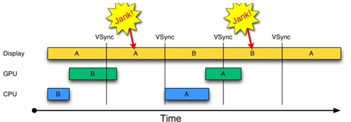
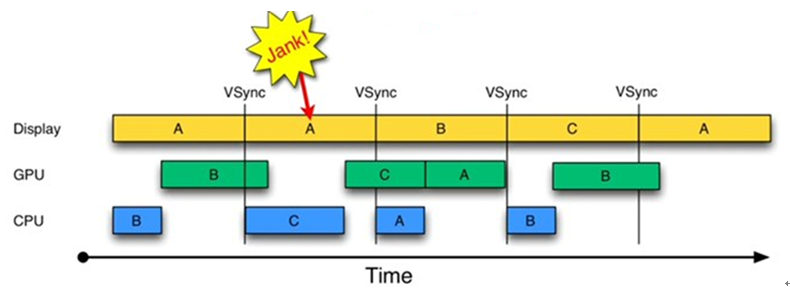
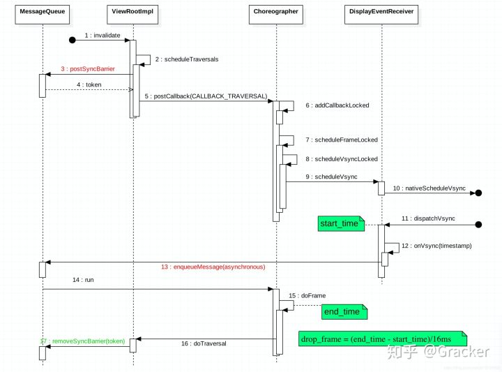

#Android屏幕刷新

# VSYNC
是一种图形技术，它可以同步GPU的帧速率和显示器的刷新频率。

# 单缓冲区
会有屏幕撕裂，当GPU利用一块内存区域写入一帧数据时，从顶部开始新一帧覆盖前一帧，并立刻输出一行内容。当屏幕刷新时，此时它并不知道图像缓冲区的状态，因此从缓冲区抓取的帧并不是完整的一帧画面（绘制和屏幕读取使用同一个缓冲区）。此时屏幕显示的图像会出现上半部分和下半部分明显偏差的现象，这种情况被称之为“tearing”。

# 双缓冲区解决屏幕撕裂
其思想就是让绘制和显示器拥有各自独立的图像缓冲区。GPU始终将完成的一帧图像数据写入到BackBuffer，而显示器使用FrameBuffer，当屏幕刷新时，FrameBuffer并不会发生变化，BackBuffer根据屏幕的刷新将图形数据copy到FrameBuffer。VSYNC信号负责调度从BackBuffer到FrameBuffer的交换操作，这里并不是真正的数据copy，实际是交换各自的内存地址，可以认为该操作是瞬间完成。

# 三缓冲区解决掉帧，
增加Triple Buffer

- 在第二个16ms时间段，Display本应显示B帧，但却因为GPU还在处理B帧，导致A帧被重复显示。同理，在第二个16ms时间段内，CPU无所事事，因为A Buffer被Display在使用。B Buffer被GPU在使用。注意，一旦过了VSYNC时间点，CPU就不能被触发以处理绘制工作了。

- 第二个16ms时间段，CPU使用C Buffer绘图。虽然还是会多显示A帧一次，但后续显示就比较顺畅了。是不是Buffer越多越好呢？回答是否定的。由图4可知，在第二个时间段内，CPU绘制的第C帧数据要到第四个16ms才能显示，这比双Buffer情况多了16ms延迟。所以，Buffer最好还是两个，三个足矣。

# Choreographer
它的出现也是为了配合系统的VSYNC中断信号，用于接收系统的VSYNC信号，统一管理应用的输入、动画和绘制等任务的执行时机，一句话概述就是上层应用触发事件，往Choreographer里发一个消息，最快也要等到下一个vsync信号来的时候才会开始处理消息。业界一般通过它来监控应用的帧率。Choreographer.doFrame 的掉帧检测比较简单，Vsync 信号到来的时候会在DisplayEventReceiver标记一个 start_time ，执行 doFrame 的时候标记一个 end_time ，这两个时间差就是 Vsync 处理时延，也就是掉帧

# 刷新流程
以View.inValidate为例

- 触发：View#invalidate-->ViewRootImpl#scheduleTraversals-->Choreographer#postCallback-->DisplayEventReceiver#scheduleVsync

- 回调：DisplayEventReceiver#onVsync-->Choreographer#doFrame-->Choreographer#doCallbacks-->CallbackRecord#run-->ViewRootImpl#doTraversal

# 优化卡顿

- Systraces 关注Frames

- layout inspector

- show GPU overdraw

- 监听界面是否存在绘制行为，代码如下：getWindow().getDecorView().getViewTreeObserver().addOnDrawListener

