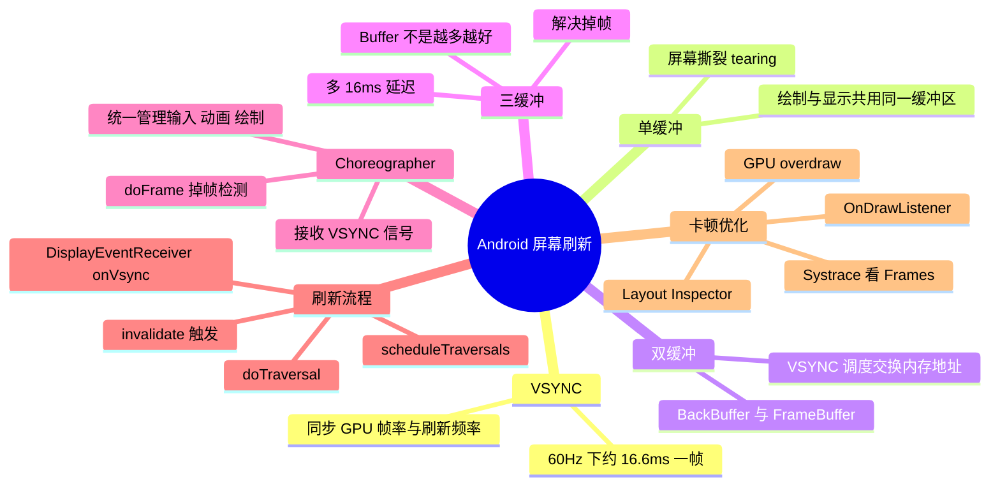
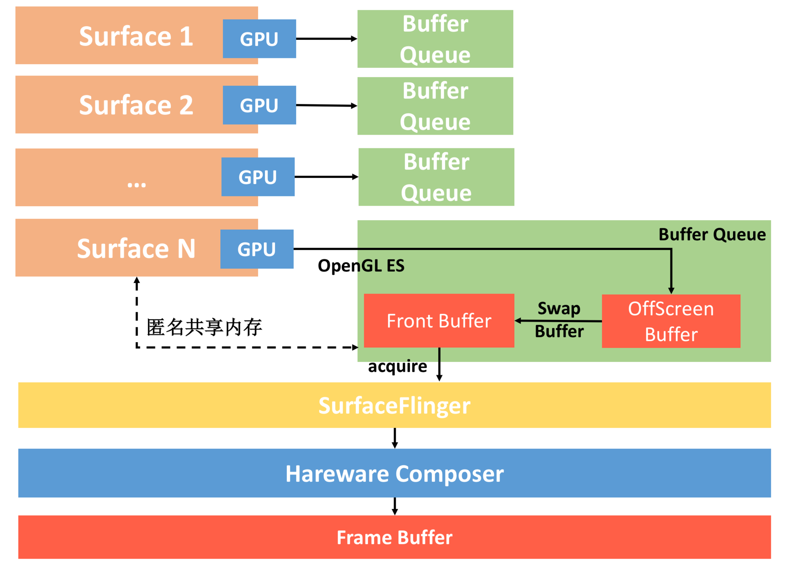
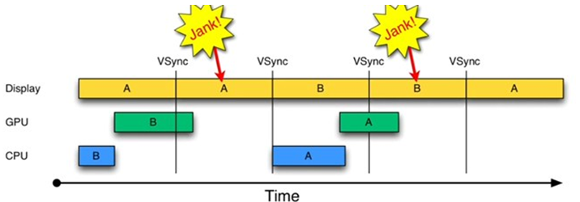
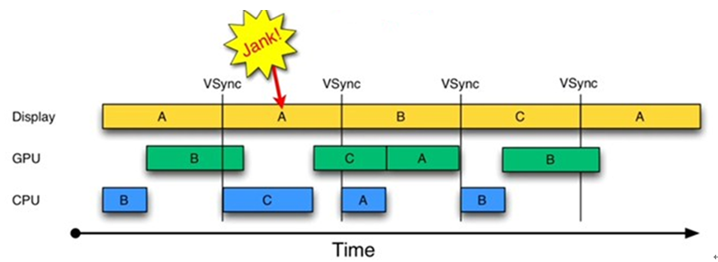
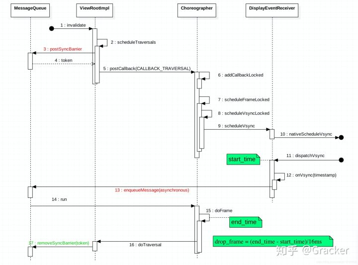

# Android 屏幕刷新

```mermaid
mindmap
  root((Android 屏幕刷新))
    VSYNC
      同步 GPU 帧率与刷新频率
      60Hz 下约 16.6ms 一帧
    单缓冲
      绘制与显示共用同一缓冲区
      屏幕撕裂 tearing
    双缓冲
      BackBuffer 与 FrameBuffer
      VSYNC 调度交换内存地址
    三缓冲
      解决掉帧
      多 16ms 延迟
      Buffer 不是越多越好
    Choreographer
      统一管理输入 动画 绘制
      接收 VSYNC 信号
      doFrame 掉帧检测
    刷新流程
      invalidate 触发
      scheduleTraversals
      DisplayEventReceiver onVsync
      doTraversal
    卡顿优化
      Systrace 看 Frames
      Layout Inspector
      GPU overdraw
      OnDrawListener
```

---

## 一、VSYNC

是一种图形技术，它可以**同步 GPU 的帧速率和显示器的刷新频率**。

---

## 二、单缓冲区：屏幕撕裂

会有屏幕撕裂：当 GPU 利用一块内存区域写入一帧数据时，从顶部开始新一帧覆盖前一帧，并立刻输出一行内容。当屏幕刷新时，此时它并不知道图像缓冲区的状态，因此从缓冲区抓取的帧并不是完整的一帧画面（绘制和屏幕读取使用同一个缓冲区）。此时屏幕显示的图像会出现上半部分和下半部分明显偏差的现象，这种情况被称之为 "tearing"。

---

## 三、双缓冲区：解决屏幕撕裂

其思想就是让绘制和显示器拥有各自独立的图像缓冲区：

- GPU 始终将完成的一帧图像数据写入到 **BackBuffer**，而显示器使用 **FrameBuffer**；
- 当屏幕刷新时，FrameBuffer 并不会发生变化，BackBuffer 根据屏幕的刷新将图形数据 copy 到 FrameBuffer；
- **VSYNC 信号负责调度**从 BackBuffer 到 FrameBuffer 的交换操作，这里并不是真正的数据 copy，实际是**交换各自的内存地址**，可以认为该操作是瞬间完成。

---

## 四、三缓冲区：解决掉帧

增加 Triple Buffer：

- 在第二个 16ms 时间段，Display 本应显示 B 帧，但却因为 GPU 还在处理 B 帧，导致 A 帧被重复显示。同理，在第二个 16ms 时间段内，CPU 无所事事，因为 A Buffer 被 Display 在使用、B Buffer 被 GPU 在使用。注意，**一旦过了 VSYNC 时间点，CPU 就不能被触发以处理绘制工作了**。

- 第二个 16ms 时间段，CPU 使用 C Buffer 绘图。虽然还是会多显示 A 帧一次，但后续显示就比较顺畅了。
- 是不是 Buffer 越多越好呢？回答是否定的。由图可知，在第二个时间段内，CPU 绘制的第 C 帧数据要到第四个 16ms 才能显示，这比双 Buffer 情况**多了 16ms 延迟**。所以，**Buffer 最好还是两个，三个足矣**。

---

## 五、Choreographer

它的出现也是为了配合系统的 VSYNC 中断信号，用于接收系统的 VSYNC 信号，**统一管理应用的输入、动画和绘制等任务的执行时机**。一句话概述就是：上层应用触发事件，往 Choreographer 里发一个消息，最快也要等到下一个 vsync 信号来的时候才会开始处理消息。

业界一般通过它来监控应用的帧率。**Choreographer.doFrame 的掉帧检测**比较简单：Vsync 信号到来的时候会在 DisplayEventReceiver 标记一个 `start_time`，执行 doFrame 的时候标记一个 `end_time`，这两个时间差就是 Vsync 处理时延，也就是掉帧。

---

## 六、刷新流程（以 View.invalidate 为例）

- **触发**：`View#invalidate` → `ViewRootImpl#scheduleTraversals` → `Choreographer#postCallback` → `DisplayEventReceiver#scheduleVsync`
- **回调**：`DisplayEventReceiver#onVsync` → `Choreographer#doFrame` → `Choreographer#doCallbacks` → `CallbackRecord#run` → `ViewRootImpl#doTraversal`

> 与 Handler 机制的联系：Choreographer 的回调本质上是把消息 post 进当前线程的 Looper 队列（Handler 篇第八节的 scheduleTraversals 正是这条链路），DisplayEventReceiver 在 Java 层的实现是 FrameDisplayEventReceiver。

---

## 七、优化卡顿

- **Systrace** 关注 Frames（看每帧的耗时与掉帧）；
- **Layout Inspector** 检查布局层级；
- **show GPU overdraw** 查看过度绘制；
- 监听界面是否存在绘制行为，代码如下：`getWindow().getDecorView().getViewTreeObserver().addOnDrawListener`

---

## 八、30 秒口述版

屏幕刷新靠 VSYNC 同步 GPU 绘制与显示器刷新：单缓冲下绘制和显示抢同一块内存会产生撕裂，双缓冲用 BackBuffer/FrameBuffer 隔离并在 VSYNC 时交换内存地址解决撕裂，三缓冲进一步解决 CPU/GPU 某一方跟不上导致的掉帧，但会多一帧延迟，所以"两个够用、三个足矣"。上层由 Choreographer 统一接收 VSYNC 并调度输入、动画、绘制，invalidate 经 scheduleTraversals → postCallback → scheduleVsync 触发，回调链 onVsync → doFrame → doTraversal 最终完成绘制；掉帧检测就是比较 doFrame 的 start_time 与 end_time。
