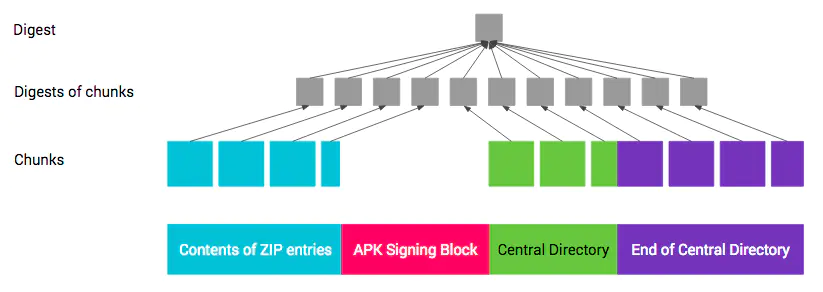
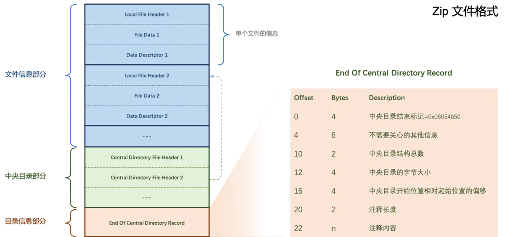
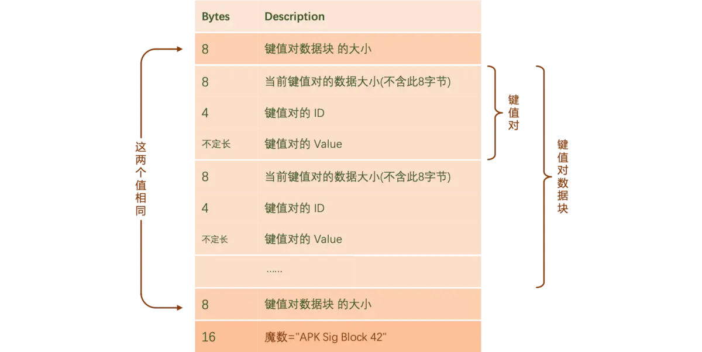

Android签名校验流程
--

# 什么是签名？
在 Apk 中写入一个 “指纹”。指纹写入以后，Apk 中有任何修改，都会导致这个指纹无效，Android 系统在安装 Apk 进行签名校验时就会不通过，从而保证了安全性。

--

# 为什么要签名主要有两点原因

- 1、确保 Apk 来源的真实性。

- 2、确保 Apk 没有被第三方篡改。

--

# 签名和校验的主要过程

- 签名就是 在摘要的基础上再进行一次加密，对摘要加密后的数据就可以当作数字签名。

    - 数字摘要,对一个任意长度的数据，通过一个 Hash 算法计算后，都可以得到一个固定长度的二进制数据，这个数据就称为 “摘要”。

    - Hash（散列算法）的基础原理

         - Hash 算法就是 将数据（如一段文字）运算变为另一固定长度值。它的特点主要有如下 三点：

              - 1、唯一性。

              - 2、固定长度：比较常用的 Hash 算法有 MD5 和 SHA1，MD5 的长度是128位，SHA1 的长度是160位。

              - 3、不可逆性。

         - 而常用的 Hash 算法有如下 三种：

              - 1、SHA-1：在密码学中，SHA-1（安全散列算法1）是一种加密散列函数，它接受输入并产生一个160 位（20 字节）散列值，称为消息摘要。

              - 2、MD5：MD5 消息摘要算法（英语：MD5 Message-Digest Algorithm），一种被广泛使用的密码散列函数，可以产生出一个128位（16字节）的散列值（hash value），用于确保信息传输完整一致。

              - 3、SHA-2：名称来自于安全散列算法2（Secure Hash Algorithm 2）的缩写，一种密码散列函数算法标准，其下又可再分为六个不同的算法标准，包括了：SHA-224、SHA-256、SHA-384、SHA-512、SHA-512/224、SHA-512/256。

- 签名过程

    - 1、计算摘要：通过 Hash 算法提取出原始数据的摘要。

    - 2、计算签名：再通过基于密钥（私钥）的非对称加密算法对提取出的摘要进行加密，加密后的数据就是签名信息。

    - 3、写入签名：将签名信息写入原始数据的签名区块内。

- 校验过程

    - 1、提取摘要：首先用同样的 Hash 算法从接收到的数据中提取出摘要。

    - 2、解密签名：使用发送方的公钥对数字签名进行解密，解密出原始摘要。

    - 3、比较摘要：如果解密后的数据和提取的摘要一致，则校验通过；如果数据被第三方篡改过，解密后的数据和摘要将会不一致，则校验不通过。

--

# 数字证书，数字证书主要解决了公钥的安全发放问题

- 数字证书是 身份认证机构（Certificate Authority）颁发的，主要包含了以下 六类信息：

    - 1、证书颁发机构

    - 2、证书颁发机构签名

    - 3、证书绑定的服务器域名

    - 4、证书版本、有效期

    - 5、签名使用的加密算法（非对称算法，如 RSA）

    - 6、公钥等

- 接收方收到消息后，需要先向 CA 验证证书的合法性，再进行签名校验。

- 需要注意的是，Apk 的证书通常是自签名的，也就是由开发者自己制作，没有向 CA 机构申请。Android 在安装 Apk 时并没有校验证书本身的合法性，只是从证书中提取公钥和加密算法，这也正是对第三方 Apk 重新签名后，还能够继续在没有安装这个 Apk 的系统中继续安装的原因。

--

# Android证书签名过程

- 证书格式和keystore密钥库

    - keystore 是一个密钥库，也就是说它可以存储多对密钥和证书，keystore 的密码是用于保护 keystore 本身的，每一对密钥和证书是通过 alias 来区分的。keystore 文件中包含了 私钥、公钥和数字证书。根据编码不同，keystore 文件分为很多种，Android 使用的是 Java 标准 keystore 格式 JKS(Java Key Storage)，所以通过 Android Studio 导出的 keystore 文件是以 .jks 结尾的。

    - keystore 使用的 证书标准是 X.509，X.509 标准也有多种 编码格式，常用的有两种：pem（Privacy Enhanced Mail）和 der（Distinguished Encoding Rules）。jks 使用的是 der 格式，但是，Android 也支持直接使用 pem 格式的证书进行签名。

         - DER（Distinguished Encoding Rules）：二进制格式，所有类型的证书和私钥都可以存储为 der 格式。

         - PEM（Privacy Enhanced Mail）：base64 编码，内容以-----BEGIN xxx----- 开头，以-----END xxx----- 结尾。

- 签名方式jarsigner 和 apksigner 的区别

    - jarsigner 使用 keystore 文件进行签名；而 apksigner 除了支持使用 keystore 文件进行签名外，还支持直接指定 pem 证书文件和私钥进行签名。

    - jarsigner 是支持使用多个证书对 Apk 进行签名的，apksigner 也同样支持。

- 签名过程

    - META-INF 目录：用于保存 App 的签名和校验信息，以保证程序的完整性。当生成 APK 包时，系统会对包中的所有内容做一次校验，然后将结果保存在这里。而手机在安装这一 App 时还会对内容再做一次校验，并和 META-INF 中的值进行比较，以避免 APK 被恶意篡改。其中包含如下 三个文件，如下所示：

         - MANIFEST.MF：其中每一个资源文件都有一个对应的 SHA-256-Digest（SHA1) 签名，MANIFEST.MF 文件的 SHA256（SHA1） 经过 base64 编码的结果即为 CERT.SF 中的 SHA256（SHA1）-Digest-Manifest 值。

         - CERT.SF：除了开头处定义的 SHA256（SHA1）-Digest-Manifest 值，后面几项的值是对 MANIFEST.MF 文件中的每项再次 SHA256（SHA1） 经过 base64 编码后的值。

         - CERT.RSA：其中包含了公钥、加密算法等信息。首先，对前一步生成的 CERT.SF 使用了 SHA256（SHA1）生成了数字摘要并使用了 RSA 加密，接着，利用了开发者私钥进行签名。然后，在安装时使用公钥解密。最后，将其与未加密的摘要信息（MANIFEST.MF文件）进行对比，如果相符，则表明内容没有被修改。

- 签名校验

    - Android Apk V1 验证签名的原理

         - 1、解析出 CERT.RSA 文件中的证书、公钥，解密 CERT.RSA 中的加密数据。

         - 2、解密结果和 CERT.SF 的指纹进行对比，保证 CERT.SF 没有被篡改。

         - 3、接着，将 CERT.SF 中的内容再和 MANIFEST.MF 中的指纹对比，保证 MANIFEST.MF  文件没有被篡改。

         - 4、MANIFEST.MF 中的内容和 APK 所有文件指纹逐一对比，保证 APK 没有被篡改。

    - V2签名

         - V1的弊端

              - 1）MANIFEST.MF中的数据摘要是基于原始未压缩文件计算的。因此在校验时，需要先解压出原始文件，才能进行校验。而解压操作无疑是耗时的。

              - 2） V1签名仅仅校验APK第一部分中的文件，缺少对APK的完整性校验。因此，在签名后，我们还可以修改APK文件，例如：通过zipalign进行字节对齐后，仍然可以正常安装。

         - Google提出了V2签名，解决了上述两个问题：V2 签名摘要的计算就不是按照文件计算的了，而是按照 1MB 为单位计算
   

              - 对原始apk文件的 文件信息部分、中央目录部分、EoCD部分，按照 1MB 大小分割为多个小块（Chunks）;

              - 分别对每一个小块计算其摘要，类似于 V1 签名中的 MANIFEST.MF 文件；

              - 对(2)中所有摘要计算其摘要，类似于 V1 签名中的 CERT.SF 文件；

         - 存放位置

              - Zip,如果在 「文件信息部分」 和 「中央目录部分」之间插入了其他数据，是不会影响 Zip 文件的解压缩的。

              - V2 签名时，会将 签名信息块 插入到 Zip 文件的「文件信息」和「中央目录」之间

              - 如何判断是否有V2签名？

                   - 根据Zip文件格式的规则，我们可以找到中央目录区的起始位置。

                   - 读取从起始位置开始往回的16个字节，判断这16个字节的值是否为 "Apk Sig Block 42"，如果是，则对应上了魔数，说明有 V2 签名。后续就是解析 V2 签名块的流程了。

                   - 用公钥和签名对蓝色区域验证，验证通过后，用 「APK数据摘要集」对APK每一块做验证。

    - V3 签名方案的签名块格式和V2完全一样，只是 V2 的签名块信息存放在 ID = 0x7109871a 的数据块中，而 V3 的签名信息存放在 ID = 0xf05368c0 的数据块中。

         - 在这个新的数据块中，记录了旧的签名信息和新的签名信息，以密钥转轮的方案，做签名的替换和升级。这意味着我们可以更改 APK 的签名。

         - V3 签名块的大小必须是 4096 的整数倍，否则在安装时会出现如下异常

