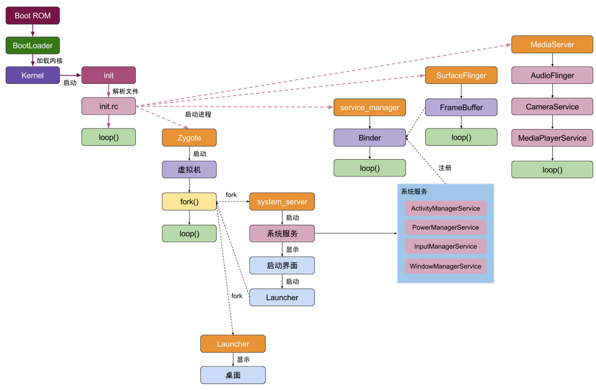
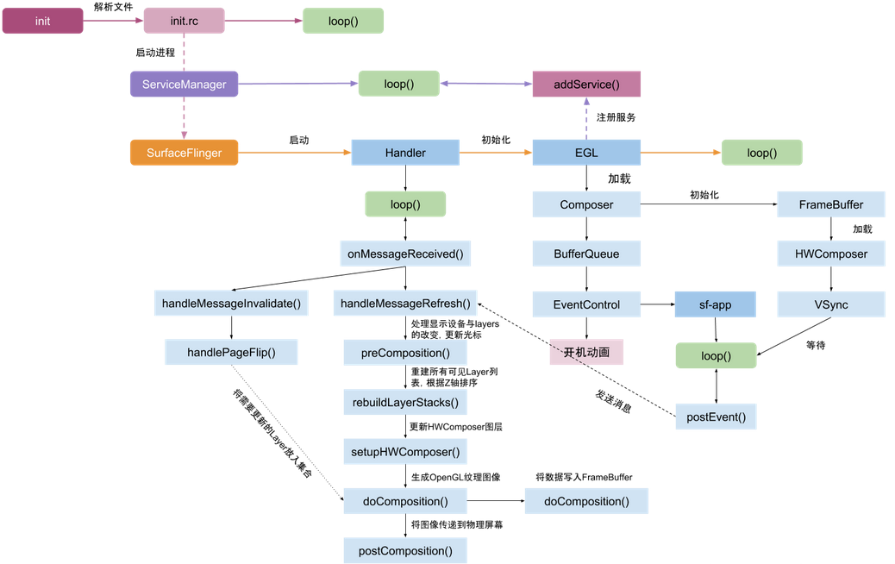

# Android系统启动

Android设备从按下开机键到桌面显示画面

Linux内核并不指的是Linux操作系统，内核只包括最基本的内存模型，进程调度，权限安全等等。操作系统值得是一个更广的概念，不光有内核，还有自己的设备驱动，应用程序框架以及一些应用程序软件等等。所以Android、Ubuntu等都是基于Linux内核的不同的操作系统。所以启动了linux内核，就是启动了内核中内存模型，进程调度，安全机制，加载驱动等等，而linux内核中的功能都需要上册的虚拟机进行调用执行。内核中就启动了系统中的第一个进程：swapper进程(pid=0)，该进程又称为idle进程, 系统初始化过程Kernel由无到有开创的第一个进程, 用于初始化进程管理、内存管理。并且会加载屏幕硬件，相机硬件等，这一步就会涉及到待会说到的HAL层了init进程是Android系统中用户空间的第一个进程，是所有用户进程的鼻祖。启动入口在system/core/init/init.cpp文件中，init进程中主要做了这些事：

- 孵化出用户守护进程。守护进程就是运行在后台的特殊进程，它不存在控制终端，会周期性处理一些任务。比如logd进程，就是用来进行日志的读写操作。

- 孵化了Media Server进程，用来启动和管理整个C++ framework，比如相机服务（camera Service）。

- 孵化了Zygote进程。Zygote进程大家都或多或少了解一些了，我们所有的应用程序都是由它孵化出来的。

- 启动了一些重要服务。比如开机动画。

开机显示桌面、从桌面点击 App 图标到 Activity显示在屏幕上
