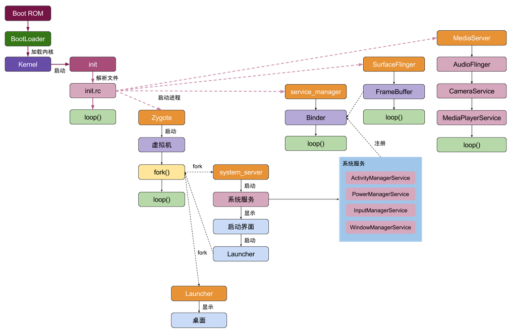
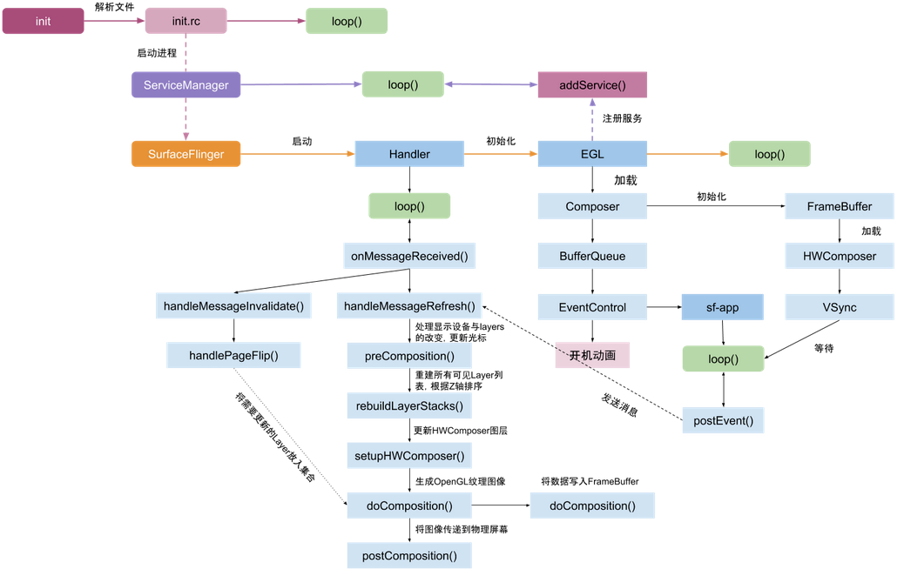

# Android系统启动

Android设备从按下开机键到桌面显示画面

Linux内核并不指的是Linux操作系统，内核只包括最基本的内存模型，进程调度，权限安全等等。操作系统值得是一个更广的概念，不光有内核，还有自己的设备驱动，应用程序框架以及一些应用程序软件等等。所以Android、Ubuntu等都是基于Linux内核的不同的操作系统。所以启动了linux内核，就是启动了内核中内存模型，进程调度，安全机制，加载驱动等等，而linux内核中的功能都需要上册的虚拟机进行调用执行。

内核中就启动了系统中的第一个进程：swapper进程(pid=0)，该进程又称为idle进程, 系统初始化过程Kernel由无到有开创的第一个进程, 用于初始化进程管理、内存管理。并且会加载屏幕硬件，相机硬件等，这一步就会涉及到待会说到的HAL层了init进程是Android系统中用户空间的第一个进程，是所有用户进程的鼻祖。启动入口在system/core/init/init.cpp文件中

问题：
1.由于内存占用，init进程在启动其他服务后可以退出吗？为什么？

答：**不能退出**，原因有三：

- **内核不允许**：init 是用户空间的第一个进程（pid=1），是所有用户进程的鼻祖。在 Linux 中，pid=1 的进程一旦退出，内核会直接 panic（`Attempted to kill init!`），系统只能重启。init 是内核"钦定"的常驻进程，不存在"退出"这个选项。
- **职责不允许**：init 启动完服务后并没有闲着，而是进入一个 epoll 无限循环，持续处理三类事情：
    - 解析 init.rc 并监控 zygote、servicemanager 等关键服务的状态，服务挂掉时负责拉起（它是所有系统服务的守护者）；
    - 提供**属性服务**（property service）：Android 属性系统由 init 实现，其他进程的 setprop/getprop 都是通过 socket 与 init 通信，init 退出整个属性系统就瘫痪了；
    - 回收孤儿进程：当某个进程的父进程先退出时，孤儿进程会被过继给 init，由 init 接收 SIGCHLD 并做善后处理，否则会产生大量僵尸进程。
- **没必要**：init 本身是纯 native 的单线程进程，内存占用极小。为了省这点内存去承担系统崩溃的风险，得不偿失。

2.app的进程启动，为什么是zygote fork,而不是从init进程fork

答：核心是 **预加载 + 写时复制**，让 App 进程"出生即自带 Java 运行时"：

- **init 的 fork 是"白板"**：init 是纯 native 进程，没有加载 ART 虚拟机和任何 Java 类库。如果直接从 init fork，每个 App 进程都要从零开始创建虚拟机、加载框架类（Binder、四大组件基类、Resources 等成千上万个类），耗时数百毫秒甚至秒级，冷启动会慢到不可接受。
- **zygote 提前把"公共课"上完了**：zygote 启动时（ZygoteInit.main）就创建了 ART 虚拟机，并预加载常用类（preloadClasses）、常用资源（preloadResources）、主题、字体等。fork 出的子进程直接继承这份"已经加热好"的运行时，把 App 进程的创建成本从秒级压到几十毫秒。
- **写时复制（COW）省内存**：fork 出的子进程与 zygote 共享预加载的内存页（只读共享），只有真正要写入时内核才复制对应页面。所以 100 个 App 进程可以共用同一份虚拟机代码和框架类内存，而不是每个进程各占一份。
- **职责分层**：init 的本职是"启动并守护系统服务"，孵化应用进程是 zygote 的专职。zygote 提供了专门的 socket 协议供 AMS 请求 fork，并能在 fork 后指定子进程的入口（ActivityThread.main），这套机制 init 不具备。

3.为什么通知zygote启动的时候是采用的socket而不是binder呢

答：主要有三个原因：

- **时序问题（最根本）**：binder 通信依赖 ServiceManager 做服务的注册与查询，但 zygote 在系统启动早期就被 init 拉起，而 zygote 的"客户"——system_server 此时还没被 fork 出来（它本身就是 zygote 的第一个孩子）。如果走 binder，zygote 想注册服务时"服务总线"还不存在；socket 不依赖任何第三方，双方约定好协议（/dev/socket/zygote + ZygoteArguments）就能直接通信，天然适合启动早期。
- **fork 多线程会死锁**：binder 是线程池模型，进程里会有多个 binder 线程。而 fork 只复制发起调用的那一个线程，其余线程（可能正持有锁）直接消失，子进程一旦用到这些锁就会永久死锁。所以 zygote 必须保持**单线程**，用简单的 epoll 循环监听 socket 最安全可控——这也是 zygote 要专门 fork 出 system_server、把"开线程池干重活"的职责交出去的原因。
- **安全与简单**：socket 文件可以设置访问权限（/dev/socket/zygote 只有 system_server 等可信方才能连接），而 binder 服务一旦注册到 ServiceManager 就是全系统可见，控制起来更麻烦。socket 协议简单、性能足够，没有引入 binder 的必要。

4. systemServer进程存在的价值是什么？

答：system_server 是 **Android 系统服务的唯一运行载体**，几乎所有核心系统服务都跑在这个进程里：

- **系统服务的"大本营"**：AMS、ATMS、WMS、PMS、InputManagerService、PowerManagerService、NotificationManagerService……几十上百个系统服务都以 Java 代码运行在 system_server 中，通过 binder 对外提供服务。
- **为什么不能塞进 init 或 zygote**：
    - init 是 native 进程，没有 Java 运行时，而系统服务基本都是 Java 写的；
    - zygote 为了 fork 安全必须保持单线程（见问题 3），而系统服务需要多线程 binder 处理海量并发请求，两者天然冲突。所以 zygote 把自己 fork 出的"第一个孩子" system_server 作为替身，让它去开线程池干重活，自己继续单线程等着 fork App。
- **它做的事**：四大组件调度（Activity 启动、Service 管理、广播分发）、窗口管理与渲染调度、输入事件分发、进程管理（AMS 通过 zygote socket 请求孵化 App 进程）、电量、通知、权限等等。App 侧的 ActivityThread 持有 system_server 各服务的 binder 代理，所有跨进程调用最终都汇聚到这里。
- 一句话总结：**init 管启动，zygote 管孵化，system_server 管调度**，三者分工明确，缺一不可。

开机显示桌面、从桌面点击 App 图标到 Activity显示在屏幕上
