# Binder 机制

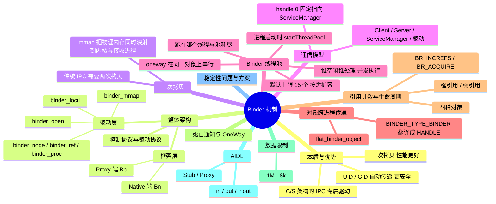
```mermaid
mindmap
  root((Binder 机制))
    本质与优势
      C/S 架构的 IPC 专属驱动
      一次拷贝 性能更好
      UID / GID 自动传递 更安全
    整体架构
      驱动层
        binder_open
        binder_mmap
        binder_ioctl
        binder_node / binder_ref / binder_proc
      框架层
        Proxy 端 Bp
        Native 端 Bn
      控制协议与驱动协议
    一次拷贝
      mmap 把物理内存同时映射到内核与接收进程
      传统 IPC 需要两次拷贝
    通信模型
      Client / Server / ServiceManager / 驱动
      handle 0 固定指向 ServiceManager
    Binder 线程池
      进程启动时 startThreadPool
      默认上限 15 个 按需扩容
      谁空闲谁处理 并发执行
      oneway 在同一对象上串行
      跑在哪个线程与池耗尽
    对象跨进程传递
      flat_binder_object
      BINDER_TYPE_BINDER 翻译成 HANDLE
    引用计数与生命周期
      四种对象
      强引用 / 弱引用
      BR_INCREFS / BR_ACQUIRE
    死亡通知与 OneWay
    数据限制
      1M - 8k
    AIDL
      in / out / inout
      Stub / Proxy
    稳定性问题与方案
```

---

## 一、Binder 是什么

### 1. 定义与优势

Binder 是 Android 基于 Linux 内核实现的**跨进程通信（IPC）专属驱动**，采用经典 **C/S 架构**，是 Android 系统中进程间通信的核心方案，替代了传统 Linux 管道、消息队列、Socket 等 IPC 方式。

相较于传统 IPC，更适合 Android 系统的原因有三点：

1. **C/S 架构**：这一点更符合 Android 系统的架构；
2. **性能上更有优势**：管道、消息队列、Socket 的通讯都需要两次数据拷贝，而 Binder 只需要一次。对于系统底层的 IPC 形式，少一次数据拷贝，对整体性能的影响非常之大；
3. **安全性更好**：传统 IPC 形式无法得到对方的身份标识（UID/GID），而使用 Binder IPC 时，这些身份标识是跟随调用过程而自动传递的。Server 端很容易就可以知道 Client 端的身份，非常便于做安全检查。

### 2. 底层运行机制

- 运行于**内核态**，作为客户端（Client）与服务端（Server）的通信中介，负责进程间数据转发、身份校验、权限管控；
- 内核层维护 Binder 节点、进程引用、Binder 线程池，管理跨进程事务的调度与执行；
- 相较于传统 IPC，具备**性能更高、安全性更强、内存开销更小**的优势，是 Android 系统原生推荐的 IPC 方案。

### 3. 整体架构：驱动层

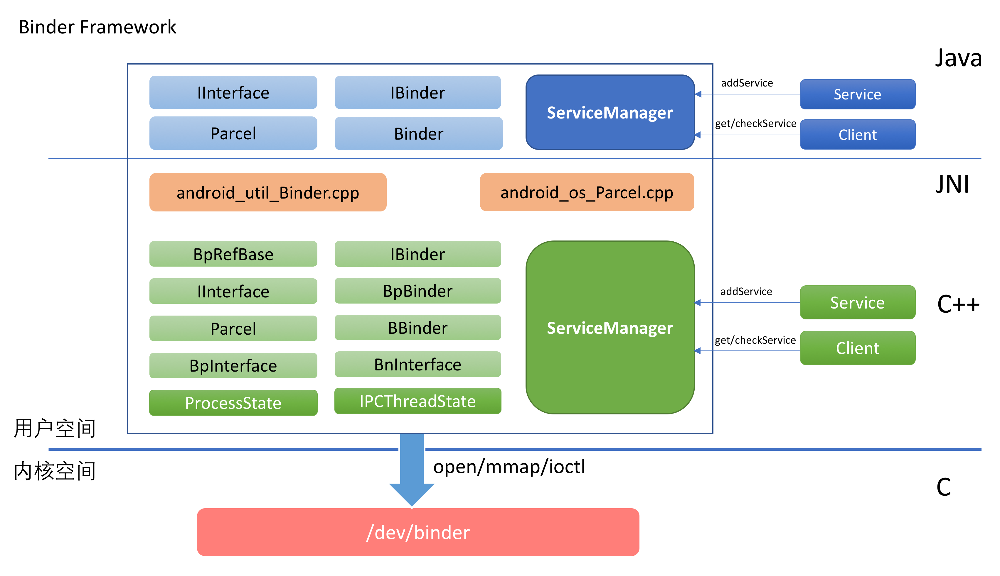

- **Binder 驱动**：Binder 是一个 miscellaneous 类型的驱动，本身不对应任何硬件，所有的操作都在软件层。
- **用法三部曲**：Binder 的进程几乎总是先通过 `binder_open` 打开 Binder 设备，然后通过 `binder_mmap` 进行内存映射，在这之后通过 `binder_ioctl` 来进行实际的操作。Client 对于 Server 端的请求，以及 Server 对于 Client 请求结果的返回，都是通过 ioctl 完成的。

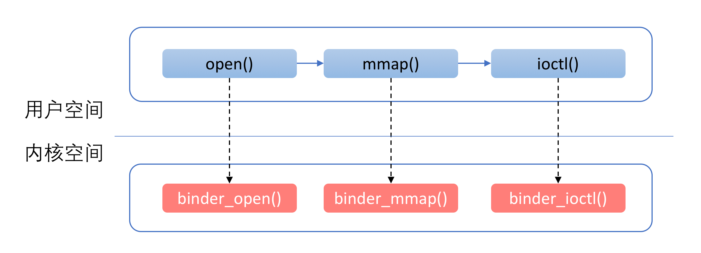

1. **打开 Binder 设备**：

   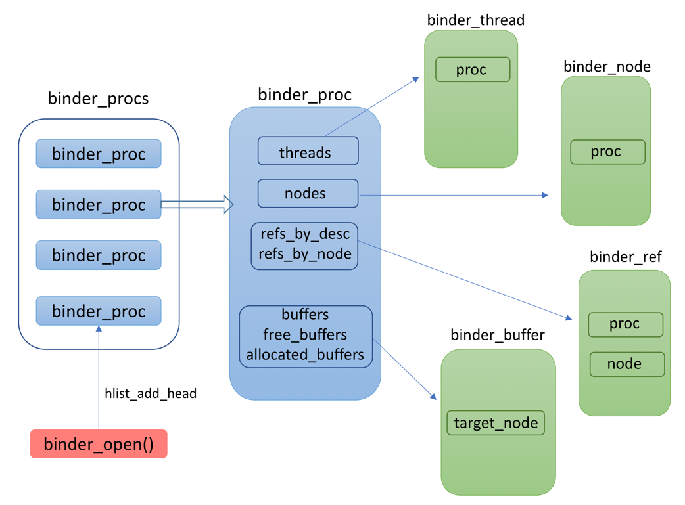

2. **binder_mmap**：这个函数中会申请一块物理内存，然后在用户空间和内核空间同时对应到这块内存上。在这之后，当有 Client 要发送数据给 Server 的时候，只需一次，将 Client 发送过来的数据拷贝到 Server 端的内核空间指定的内存地址即可；由于这个内存地址在服务端已经同时映射到用户空间，因此无需再做一次复制，Server 即可直接访问。

   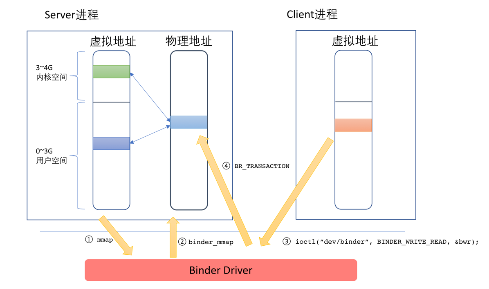

3. **ioctl 系统调用来发出请求**：`ioctl(mProcess->mDriverFD, BINDER_WRITE_READ, &bwr)`

   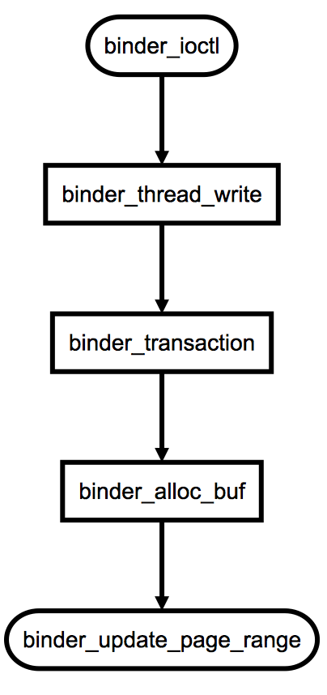

- **binder.h** 中的数据结构：
  - `binder_write_read`：存储一次读写操作的数据；
  - `binder_transaction_data`：存储一次事务的数据。
- **binder.c** 中的关键结构体：
  - `binder_node`：描述 Binder 实体节点，即对应了一个 Server；
  - `binder_ref`：描述对于 Binder 实体的引用；
  - `binder_buffer`：描述 Binder 通信过程中存储数据的 Buffer；
  - `binder_proc`：描述使用 Binder 的进程；
  - `binder_thread`：描述使用 Binder 的线程。

### 4. 整体架构：框架层 C++

框架层 C++ 现分为 Proxy 和 Native 两端。**Proxy 对应上文提到的 Client 端**，是服务对外提供的接口；**Native 是服务实现的一端**，对应上文提到的 Server 端。类名中带有小写字母 p 的（例如 `BpInterface`）就是指 Proxy 端，类名带有小写字母 n 的（例如 `BnInterface`）就是指 Native 端。Proxy 代表了调用方，通常与服务的实现不在同一个进程，因此下文中也称 Proxy 端为"远程"端；Native 端是服务实现的自身，因此也称 Native 端为"本地"端。

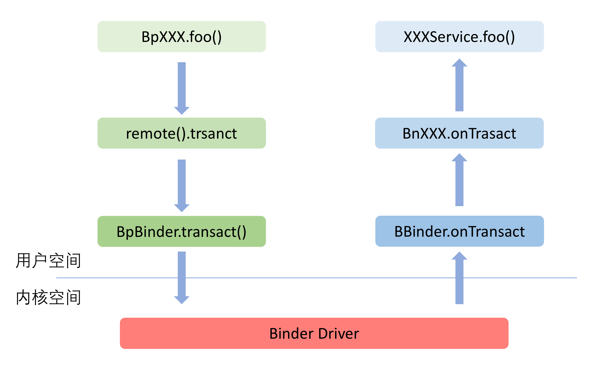

- `BpInterface`：远程接口的基类，远程接口是供客户端调用的接口集；`BpBinder` 是远程 Binder，这个类提供 `transact` 方法来发送请求，`BpXXX` 实现中会用到。
- `BnInterface`：本地接口的基类，本地接口是需要服务中真正实现的接口集；`BBinder` 是本地 Binder，服务实现方的基类，提供了 `onTransact` 接口来接收请求。

### 5. Binder 协议：一次完整的 IPC 通信流程

Client 端与 Service 端的完整交互过程（对应下图）：

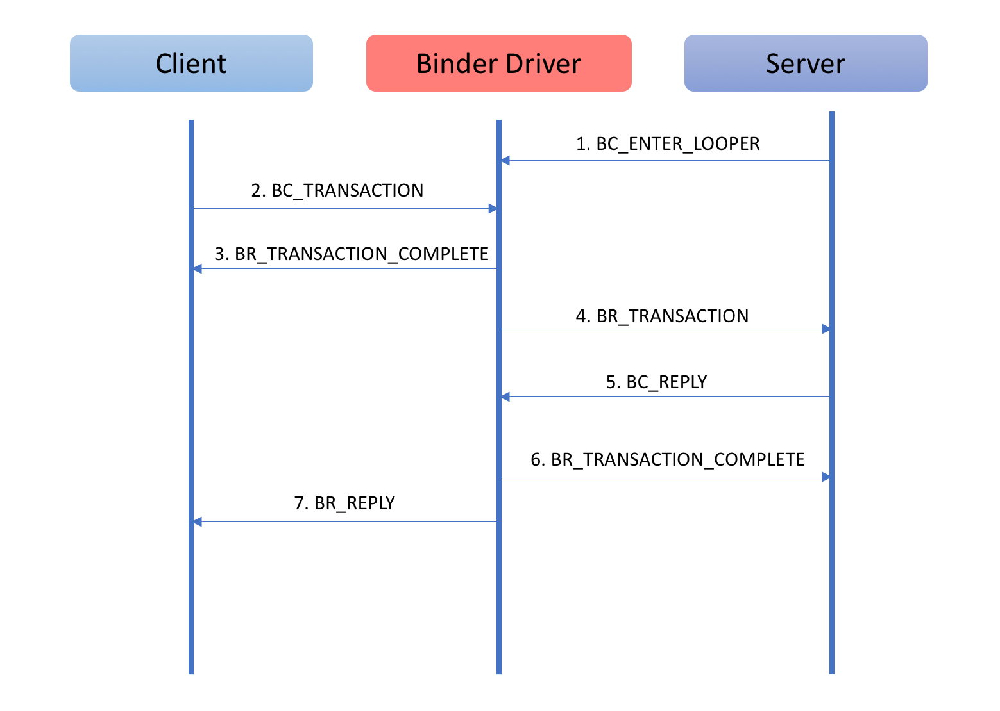

**Client 端：**

1. 从应用层的 **Proxy 的 transact 函数**开始，传递到 Java 层的 `BinderProxy`，最后到 Native 层的 `BpBinder` 的 `transact`；
2. `BpBinder.transact` 实际上是调用 `IPCThreadState` 的 `transact` 函数，它的第一个参数是 **handle 值**。Binder 驱动就会根据这个 handle 找到 Binder 引用对象，继而找到 Binder 实体对象；
3. 在这个函数中做了两件事：一是调用 `writeTransactionData` 向 Binder 驱动发出一个 **BC_TRANSACTION** 的命令协议，把所需参数写到 `mOut` 中；二是 `waitForResponse` 等待回复，在它里面才会真正和 Binder 驱动进行交互，也就是调用 `talkWithDriver`，然后对接收到的响应执行相应的处理；
4. 这时候 Client 接收到的是 **BR_TRANSACTION_COMPLETE**，表示 Binder 驱动已经接收到了 Client 的请求；还有一个 cmd 为 **BR_REPLY** 的返回协议，表示 Binder 驱动已经把响应返回给 Client 端了；
5. `talkWithDriver` 中通过系统调用 `ioctl` 和 Binder 驱动进行交互，传递一个 `BINDER_WRITE_READ` 的命令并且携带一个 `binder_write_read` 数据结构体；Binder 驱动层就会根据 `write_size`/`read_size` 处理该命令。

**Service 端：**

6. Service 端首先会开启一个 **Binder 线程**来处理进程间通信请求，也就是通过 `new Thread` 然后把该线程 `joinThreadPool` 注册到 Binder 驱动；注册是通过 **BC_ENTER_LOOPER** 命令协议来做的（这组线程的来龙去脉见第四节）；
7. 接下来就是在 do-while 死循环中调用 `getAndExecuteCommand`：它里面做的就是不断从驱动读取请求（`talkWithDriver`），然后再处理请求（`executeCommand`）；
8. `executeCommand` 中会根据 **BR_TRANSACTION** 来调用 `BBinder` Binder 实体对象的 `onTransact` 函数来进行处理，然后再发送一个 **BC_REPLY** 把响应结构返回给 Binder 驱动；
9. Binder 驱动在接收到 BC_REPLY 之后，会向 Service 发送一个 BR_TRANSACTION_COMPLETE 协议表示已经收到，同时也会向 Client 端发送一个 BR_REPLY 把响应回写给 Client 端。

需要注意的是，上面的 `onTransact` 函数就是 Service 端 **AIDL 生成的 Stub 类的 onTransact 函数**，这时一次完整的 IPC 通信流程就完成了。

**两类协议小结：**

- **控制协议**：进程通过 ioctl 与 Binder 设备（`/dev/binder`）进行通讯的协议，如 `BINDER_WRITE_READ`；
- **驱动协议**：描述对于 Binder 驱动的具体使用过程，如 `BR_TRANSACTION`、`BR_REPLY`。

---

## 二、一次拷贝原理（核心考点）

### 1. 传统 IPC 的内存拷贝缺陷

管道、消息队列、Socket 等传统 IPC，跨进程数据传输需经历**两次内存拷贝**：

1. 发送端用户态缓存 → 内核态缓存区；
2. 内核态缓存区 → 接收端用户态缓存区。

多次拷贝导致 CPU 资源消耗大、传输效率低。

### 2. Binder 一次拷贝实现原理

1. 基于 Linux **mmap 内存映射**机制，将一块物理内存区域，同时映射到**内核空间**和**接收进程的用户空间**；
2. 发送端将数据从自身用户态缓存，直接拷贝到内核映射缓冲区（仅**一次内存拷贝**）；
3. 接收进程可直接从共享的用户映射区读取数据，无需二次拷贝；
4. 全程减少一次内存拷贝，大幅提升跨进程数据传输效率，降低系统开销。

> 与 NIO 的零拷贝呼应：Binder 的"一次拷贝"本质就是 mmap 的运用——让数据尽量不经过接收方的用户态拷贝，只保留发送方到内核映射区这一次（详见《NIO 与 IO》零拷贝一节）。

---

## 三、Binder 通信模型

### 1. 四方参与

由四方参与，分别是 **Binder 驱动层、Client 端、Service 端和 ServiceManager**。

Client 端表示应用程序进程，Service 端表示系统服务——它可能运行在 SystemService 进程（比如 AMS、PMS 等），也可能运行在一个单独的进程中（比如 SurfaceFlinger）。ServiceManager 是 Binder 进程间通信方式的**上下文管理者**，它提供 Service 端的服务注册和 Client 端的服务获取功能。

它们之间不能直接通信，需要借助 Binder 驱动层进行交互。这就需要它们首先通过 `binder_open` 打开 binder 驱动，然后根据返回的 fd 进行内存映射、分配缓冲区，最后启动 binder 线程——启动 binder 线程一方面是把这些线程注册到 binder 驱动，另一方面是这个线程要进入 `binder_loop` 循环，不断地去跟 binder 驱动交互（线程池的启动时机、数量与调度见第四节）。

### 2. ServiceManager

- Client 要对 Server 发出请求，就必须知道服务端的 id。Client 需要先根据 Server 的 id 通过 ServiceManager 拿到 Server 的标识（通过 `getService`），然后通过这个标识与 Server 进行通信。

  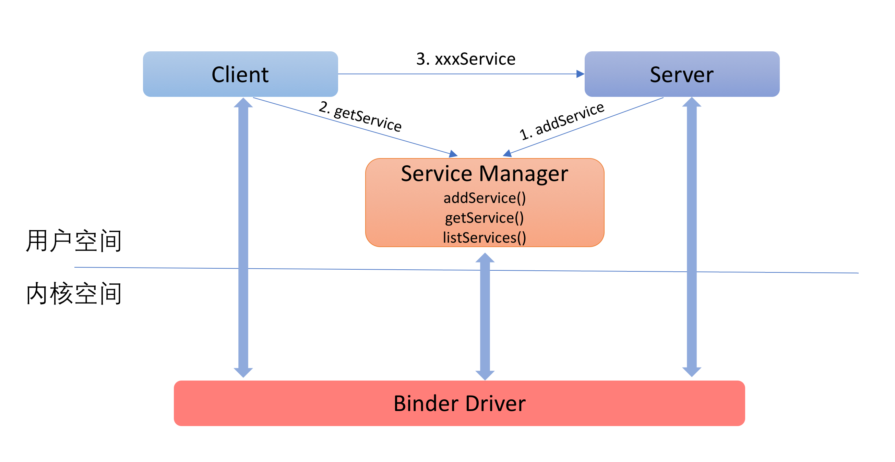

- ServiceManager 本身也实现为一个 Server 对象。Binder 机制为 ServiceManager 预留了一个特殊的位置，这个位置是预先定好的，任何想要使用 ServiceManager 的进程只要通过这个特定的位置就可以访问到 ServiceManager 了（而不用再通过 ServiceManager 的接口）：`static struct binder_node *binder_context_mgr_node;`
- 在 Binder 驱动中，通过 **handle = 0** 这个位置来访问 ServiceManager。例如 `binder_transaction` 中，判断如果 `target.handle` 为 0，则认为这个请求是发送给 ServiceManager 的。

**ServiceManager 的启动流程**：ServiceManager 的 main 函数首先调用 `binder_open` 打开 binder 驱动，然后调用 `binder_become_context_manager` 注册为 binder 的大管家（告诉 Binder 驱动：Service 的注册和获取都是通过我来做的），最后进入 `binder_loop` 循环。`binder_loop` 首先通过 **BC_ENTER_LOOPER** 命令协议把当前线程（ServiceManager 的主线程）注册为 binder 线程，然后在一个 for 死循环中不断去读 binder 驱动发送来的请求去处理，也就是调用 `ioctl`。

### 3. Service 的注册与获取

有了 ServiceManager 之后，Service 系统服务就可以向 ServiceManager 进行注册了。以 SurfaceFlinger 为例，在它的入口函数 main 函数中，首先也需要启动 binder 机制（即上所说的那三步），然后初始化 SurfaceFlinger，最后注册服务：

1. 注册服务首先需要拿到 ServiceManager 的 Binder 代理对象，也就是通过 `defaultServiceManager` 方法，真正获取 ServiceManager 代理对象是通过 `getStrongProxyForHandle(0)`——查的是**句柄值为 0 的 binder 引用**，也就是 ServiceManager。如果没查到，说明可能 ServiceManager 还没来得及注册，这个时候 `sleep(1)` 等等就行了；
2. 然后调用 `addService` 进行注册：把 name 和 binder 对象都写到 Parcel 中，再调用 `transact` 发送一个 **ADD_SERVICE_TRANSACTION** 的请求。实际上是调用 `IPCThreadState` 的 `transact` 函数，第一个参数是 `mHandle` 值——也就是说**底层在和 binder 驱动进行交互的时候不区分 BpBinder 还是 BBinder，它只认一个 handle 值**；
3. Binder 驱动就会把这个请求交给 Binder 实体对象去处理，也就是在 ServiceManager 的 `onTransact` 函数中处理 ADD_SERVICE_TRANSACTION 请求，根据 handle 值封装一个 `BinderProxy` 对象，至此 Service 的注册就完成了。

至于 **Client 获取服务**，其实和注册差不多，也就是拿到服务的 `BinderProxy` 对象即可。

---

## 四、Binder 线程池

### 1. 为什么需要线程池

- Binder 调用是"**有线程在 `joinThreadPool` 循环里等着，请求才会被处理**"的模型：客户端发起同步调用后阻塞等待回复，服务端必须有一个已经注册到驱动、正在循环里的线程去接收并执行这个请求，否则请求会一直挂在驱动的队列里；
- 一个进程往往同时是多个服务的 Server、又被多个 Client 调用，因此需要**一组**这样的线程——这就是 Binder 线程池；
- 关键前提：**线程池不会从 Zygote 继承**。fork 只复制内存映像，不复制线程；每个应用进程都要在启动时自己把 Binder 线程注册进驱动。

### 2. 启动时机

```
Zygote fork 出应用进程
  → RuntimeInit.zygoteInit
      → nativeZygoteInit
          → AppRuntime::onZygoteInit()（app_main.cpp）
              → ProcessState::self()->startThreadPool()      ← 线程池在这里启动
  → ActivityThread.main()（Java 层入口，建立主线程 Looper）
```

- **Binder 线程池在 `ActivityThread.main` 之前就已经启动**，所以应用进程一诞生就具备被系统 Binder 回调的能力；
- `ProcessState` 是进程内的单例，构造时完成三件事：`binder_open` 打开 `/dev/binder`、`binder_mmap` 做内存映射、通过 **`BINDER_SET_MAX_THREADS`** 把线程数上限告诉驱动；
- `startThreadPool()` 用 `mThreadPoolStarted` 保证只启动一次，随后 `spawnPooledThread(true)` 创建**第一个** Binder 线程；
- 线程真正的工作内容是 `IPCThreadState::joinThreadPool()`：先用 **BC_ENTER_LOOPER** 把自己注册进驱动，然后进入 `talkWithDriver → executeCommand` 循环（协议细节见第一节）。

### 3. 按需扩容与数量上限

| 项 | 值 |
| --- | --- |
| 初始线程数 | 1（`startThreadPool` 只创建第一个） |
| 扩容触发 | 待处理请求多于空闲线程时，驱动发 **BR_SPAWN_LOOPER**，收到命令的线程调用 `spawnPooledThread(false)` 再造一个 |
| 默认上限 | `DEFAULT_MAX_BINDER_THREADS = 15`（不少资料按"主线程 + 15"说成 16） |
| 上限下发 | `ioctl(BINDER_SET_MAX_THREADS)` |
| 调整方式 | 隐藏 API `ProcessState.setThreadPoolMaxThreadCount()` |

- **线程是懒创建的**：不是一上来就 15 个，而是随并发请求量增长；
- 线程越多，内存与调度开销越大，而且容易掩盖"跨进程调用链设计不当"的问题——所以不要盲目调大。

### 4. 我的代码到底跑在哪个线程

这是实际开发中最容易踩的部分：

| 场景 | 执行线程 |
| --- | --- |
| AIDL 的 `Stub.onTransact` | 服务端的 **Binder 线程** |
| ContentProvider 的 query/insert/update/delete（跨进程调用） | 服务端的 **Binder 线程**（同进程调用时是调用者线程，见 [ContentProvider](../ContentProvider/ContentProvider.md)） |
| 系统回调 `ApplicationThread.scheduleLaunchActivity`、`handleReceiver` 等 | App 进程的 **Binder 线程**，随后经 `ActivityThread.H` **post 到主线程** |
| 我们熟悉的 `onCreate`/`onReceive`/`onServiceConnected` | **主线程**（因为上一步做了线程切换） |
| 客户端发起同步 transact 的那个线程 | 就是调用者自己的线程——它在 `waitForResponse` 里**阻塞等待**，直到回复到达 |

由此得到两个高频结论：

1. **同一个 Binder 对象的请求是并发执行的**：驱动把请求分给任意一个空闲的 Binder 线程，所以 `onTransact` 里的共享状态必须自己做线程安全——这正是 ContentProvider "不是线程安全"的根源；
2. **`Binder.getCallingUid()/getCallingPid()` 只在 Binder 线程中有意义**：它们读的是"当前线程正在处理的那次事务"的调用方身份。如果在主线程或普通子线程里调用，拿到的是**自己进程**的 uid/pid。所以权限校验要么留在 Binder 线程里做，要么先把 uid 取出来再切线程。

### 5. 为什么 oneway 是串行的

- **同步（twoway）调用**：客户端阻塞等回复，服务端谁空闲谁处理，同一对象的并发请求会**并行**在不同 Binder 线程上；
- **oneway 调用**：客户端不等回复，驱动把它放进目标进程的异步 `todo` 队列，并保证**同一个 Binder 对象上的异步事务串行执行**——所以 oneway 的处理函数不用自己加锁，但代价是吞吐受限于单线程：一个耗时操作会拖住该对象后面所有的异步请求（见第七节 OneWay）。

### 6. 线程池耗尽：最隐蔽的 ANR 来源

- 一个进程的 Binder 线程最多 15 个，如果这些线程**全部**卡在"等待其他进程回复"上，新请求就没人处理，整个进程表现为"假死"；
- 典型链路：A 的多个 Binder 线程同步调用 B，而 B 的 Binder 线程又在同步调用 A（或 B 的所有线程都在等同一把锁）→ 两边互相等待，**Binder 死锁 / 线程池耗尽**；
- 更常见的形态：**主线程去做同步 Binder 调用**（如主线程直接调耗时的 AIDL 接口），而服务端又需要主线程做别的事才能返回 → ANR；
- 防御手段：不在 Binder 线程里做递归的同步跨进程调用、耗时接口改 oneway + 回调、给同步调用加超时、用 `linkToDeath` 处理对端死亡，把重活从 Binder 线程挪到独立线程。

---

## 五、Binder 对象跨进程传递的原理

- 在 Binder 驱动中，并不是真的将对象在进程间来回序列化，而是通过**特定的标识**来进行对象的传递。Binder 驱动中，通过 `flat_binder_object` 来描述需要跨越进程传递的对象。
- 例如当 Server 把 Binder 实体传递给 Client 时，在发送数据流中，`flat_binder_object` 中的 type 是 **BINDER_TYPE_BINDER**，同时 binder 字段指向 Server 进程用户空间地址。但这个地址对于 Client 进程是没有意义的（Linux 中，每个进程的地址空间是互相隔离的），驱动必须对数据流中的 `flat_binder_object` 做相应的翻译：
  - 将 type 改成 **BINDER_TYPE_HANDLE**；
  - 为这个 Binder 在接收进程中创建位于内核中的引用，并将引用号填入 handle 中。
- 对于发送数据流中引用类型的 Binder 也要做同样转换。经过处理后接收进程从数据流中取得的 Binder 引用才是有效的，才可以将其填入数据包 `binder_transaction_data` 的 `target.handle` 域，向 Binder 实体发送请求。
- 由于每个请求和请求的返回都会经历内核的翻译，因此这个过程从进程的角度来看是**完全透明的**——进程完全不用感知这个过程，就好像对象真的在进程间来回传递一样。

---

## 六、Binder 对象引用计数与生命周期

在 Client 进程和 Server 进程的一次通信过程中，涉及了四种类型的对象：位于 Binder 驱动程序中的 **Binder 实体对象（binder_node）** 和 **Binder 引用对象（binder_ref）**，以及位于 Binder 库中的 **Binder 本地对象（BBinder）** 和 **Binder 代理对象（BpBinder）**，它们的交互过程如下图所示：

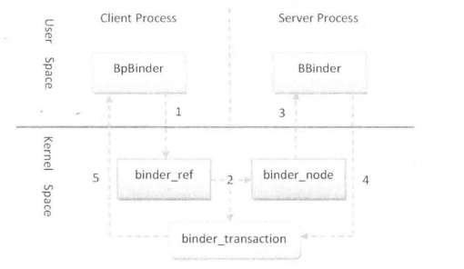

### 1. 四种对象与五个步骤

它们的交互过程可以划分为五个步骤：

1. 运行在 Client 进程中的 Binder 代理对象通过 Binder 驱动程序向运行在 Server 进程中的 Binder 本地对象发出一个进程间通信请求，Binder 驱动程序接着就根据 Client 进程传递过来的 Binder 代理对象的句柄值来找到对应的 Binder 引用对象；
2. Binder 驱动程序根据前面找到的 Binder 引用对象找到对应的 Binder 实体对象，并且创建一个事务（`binder_transaction`）来描述该次进程间通信过程；
3. Binder 驱动程序根据前面找到的 Binder 实体对象来找到运行在 Server 进程中的 Binder 本地对象，并且将 Client 进程传递过来的通信数据发送给它处理；
4. Binder 本地对象处理完成 Client 进程的通信请求之后，就将通信结果返回给 Binder 驱动程序，Binder 驱动程序接着就找到前面所创建的一个事务；
5. Binder 驱动程序根据前面找到的事务的相关属性来找到发出通信请求的 Client 进程，并且通知 Client 进程将通信结果返回给对应的 Binder 代理对象处理。

从这个过程就可以看出，**Binder 代理对象依赖于 Binder 引用对象，而 Binder 引用对象又依赖于 Binder 实体对象，最后，Binder 实体对象又依赖于 Binder 本地对象**。这样，Binder 进程间通信机制就必须采用一种技术措施来保证：不能销毁一个还被其他对象依赖着的对象。为了维护这些 Binder 对象的依赖关系，Binder 进程间通信机制采用了**引用计数**来维护每一个 Binder 对象的生命周期。

### 2. Binder 本地对象的生命周期

Binder 本地对象是一个类型为 `BBinder` 的对象，它是在用户空间中创建的，并且运行在 Server 进程中。它一方面会被运行在 Server 进程中的其他对象引用，另一方面也会被 Binder 驱动程序中的 Binder 实体对象引用。由于 BBinder 类继承了 `RefBase` 类，因此 Server 进程中的其他对象可以简单地通过智能指针来引用这些 Binder 本地对象，以便控制它们的生命周期。由于 Binder 驱动程序中的 Binder 实体对象是运行在内核空间的，它不能够通过智能指针来引用运行在用户空间的 Binder 本地对象，因此 Binder 驱动程序就需要和 Server 进程约定一套规则来维护它们的引用计数，避免它们在还被 Binder 实体对象引用的情况下销毁。

Server 进程将一个 Binder 本地对象注册到 ServiceManager 时，Binder 驱动程序就会为它创建一个 Binder 实体对象。接下来，当 Client 进程通过 ServiceManager 来查询一个 Binder 本地对象的代理对象接口时，Binder 驱动程序就会为它所对应的 Binder 实体对象创建一个 Binder 引用对象，接着使用 **BR_INCREFS 和 BR_ACQUIRE** 协议来通知对应的 Server 进程增加对应的 Binder 本地对象的**弱引用计数和强引用计数**。这样就能保证 Client 进程中的 Binder 代理对象在引用一个 Binder 本地对象期间，该 Binder 本地对象不会被销毁。当没有任何 Binder 代理对象引用一个 Binder 本地对象时，Binder 驱动程序就会使用 **BR_DECREFS 和 BR_RELEASE** 协议来通知对应的 Server 进程减少对应的 Binder 本地对象的弱引用计数和强引用计数。

总结来说，Binder 驱动程序就是通过 **BR_INCREFS、BR_ACQUIRE、BR_DECREFS 和 BR_RELEASE** 协议来引用运行在 Server 进程中的 Binder 本地对象的，相关的代码实现在函数 `binder_thread_read` 中。

### 3. Binder 实体对象的生命周期

Binder 实体对象是一个类型为 `binder_node` 的对象，它是在 Binder 驱动程序中创建的，并且被 Binder 驱动程序中的 Binder 引用对象所引用。

当 Client 进程第一次引用一个 Binder 实体对象时，Binder 驱动程序就会在内部为它创建一个 Binder 引用对象。例如，当 Client 进程通过 ServiceManager 来获得一个 Service 组件的代理对象接口时，Binder 驱动程序就会找到与该 Service 组件对应的 Binder 实体对象，接着再创建一个 Binder 引用对象来引用它，这时候就需要增加被引用的 Binder 实体对象的引用计数。相应地，当 Client 进程不再引用一个 Service 组件时，它也会请求 Binder 驱动程序释放之前为它所创建的一个 Binder 引用对象，这时候就需要减少该 Binder 引用对象所引用的 Binder 实体对象的引用计数。

### 4. Binder 引用对象的生命周期

Binder 引用对象是一个类型为 `binder_ref` 的对象，它是在 Binder 驱动程序中创建的，并且被用户空间中的 Binder 代理对象所引用。

当 Client 进程引用了 Server 进程中的一个 Binder 本地对象时，Binder 驱动程序就会在内部为它创建一个 Binder 引用对象。由于 Binder 引用对象是运行在内核空间的，而引用了它的 Binder 代理对象是运行在用户空间的，因此 Client 进程和 Binder 驱动程序就需要约定一套规则来维护 Binder 引用对象的引用计数，避免它们在还被 Binder 代理对象引用的情况下被销毁。

这套规则可以划分为 **BC_ACQUIRE、BC_INCREFS、BC_RELEASE 和 BC_DECREFS** 四个协议，分别用来增加和减少一个 Binder 引用对象的强引用计数和弱引用计数。相关的代码实现在 Binder 驱动程序的函数 `binder_thread_write` 中。

### 5. Binder 代理对象的生命周期

Binder 代理对象是一个类型为 `BpBinder` 的对象，它是在用户空间中创建的，并且运行在 Client 进程中。与 Binder 本地对象类似，Binder 代理对象一方面会被运行在 Client 进程中的其他对象引用，另一方面它也会引用 Binder 驱动程序中的 Binder 引用对象。由于 BpBinder 类继承了 `RefBase` 类，因此 Client 进程中的其他对象可以简单地通过智能指针来引用这些 Binder 代理对象，以便控制它们的生命周期。由于 Binder 驱动程序中的 Binder 引用对象是运行在内核空间的，Binder 代理对象就不能通过智能指针来引用它们，因此 Client 进程就需要通过 **BC_ACQUIRE、BC_INCREFS、BC_RELEASE 和 BC_DECREFS** 四个协议来引用 Binder 驱动程序中的 Binder 引用对象。

前面提到，每一个 Binder 代理对象都是通过一个**句柄值**来和一个 Binder 引用对象关联的，而 Client 进程就是通过这个句柄值来维护运行在它里面的 Binder 代理对象的。具体来说，就是 Client 进程会在内部创建一个 `handle_entry` 类型的 Binder 代理对象列表，它以句柄值作为关键字来维护它内部所有的 Binder 代理对象。

---

## 七、死亡通知与 OneWay 机制

### 1. 死亡通知

死亡通知是为了让 Bp 端（客户端进程）能知晓 Bn 端（服务端进程）的生死情况，当 Bn 端进程死亡后能通知到 Bp 端。

当 Binder 服务所在进程死亡后，会释放进程相关的资源，Binder 也是一种资源。`binder_open` 打开 binder 驱动 `/dev/binder`，这是字符设备，获取文件描述符。在进程结束的时候会有一个关闭文件系统的过程，会调用驱动 close 方法，该方法相对应的是 `release()` 方法。当 binder 的 fd 被释放后，此处调用相应的方法是 `binder_release()`。但并不是每个 close 系统调用都会触发调用 `release()` 方法，只有真正释放设备数据结构才调用 `release()`——内核维持一个文件结构被使用多少次的计数，即便是应用程序没有明显地关闭它打开的文件也适用：内核在进程 `exit()` 时会释放所有内存和关闭相应的文件资源，通过使用 close 系统调用最终也会 release binder。

### 2. OneWay 机制

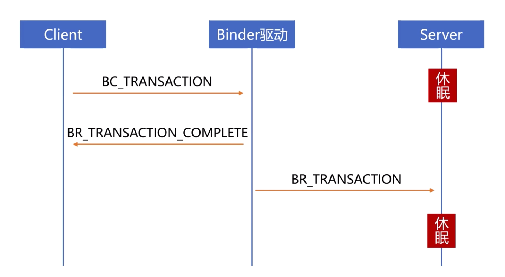

- OneWay 就是**异步 binder 调用**：带 ONEWAY 的 `waitForResponse` 参数为 null，也就是不需要等待返回结果；而不带 ONEWAY 的，就是普通的 AIDL 接口，它是需要等待对方回复的。
- 对于系统服务来说，一般都是 oneway 的，比如在启动 Activity 时，它是异步的，不会阻塞系统服务；但是在 Service 端，它是**串行化**的，都是放在进程的 todo 队列里面一个一个地进行分发处理。

---

## 八、Binder 数据限制

```c
#define BINDER_VM_SIZE ((1*1024*1024) - (4096 *2)) // 1M - 8k
```

Binder 事务缓冲区大小约为 **1M - 8k**，超出限制的大数据传输会失败（这也是 Intent 不能传递大数据的原因，见第十一节）。

---

## 九、AIDL

### 1. AIDL 与定向 tag

AIDL 全称是 Android Interface Definition Language，它是 Android SDK 提供的一种机制。借助这个机制，应用可以提供跨进程的服务供其他应用使用。

所有非基本类型的参数必须包含一个描述数据流向的标签，可能的取值是：**in、out 或者 inout**。基本参数的定向 tag 默认是并且只能是 in。AIDL 中的定向 tag 表示了在跨进程通信中数据的流向，数据流向是针对在客户端中的那个传入方法的对象而言的：

| tag | 服务端收到 | 服务端的修改是否同步回客户端 |
| --- | --- | --- |
| in | 那个对象的完整数据 | 否，客户端的对象不会因为服务端对传参的修改而发生变动 |
| out | 那个对象的参数为空的对象 | 是，服务端对接收到的空对象有任何修改之后客户端将会同步变动 |
| inout | 客户端传来对象的完整信息 | 是，客户端将会同步服务端对该对象的任何变动 |

### 2. aidl 文件生成的 java 文件结构

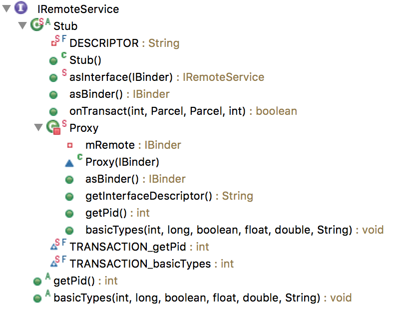

- 一个名称为 `IRemoteService` 的 **interface**，该 interface 继承自 `android.os.IInterface` 并且包含了我们在 aidl 文件中声明的接口方法；
- `IRemoteService` 中包含了一个名称为 **Stub** 的静态内部类，这个类是一个抽象类，它继承自 `android.os.Binder` 并且实现了 `IRemoteService` 接口，这个类中包含了一个 `onTransact` 方法；
- Stub 内部又包含了一个名称为 **Proxy** 的静态内部类，Proxy 类同样实现了 `IRemoteService` 接口。Stub 是提供给开发者实现业务的父类，而 Proxy 实现了对外提供的接口；
- **Stub 类**是用来提供给开发者实现业务逻辑的父类，开发者继承自 Stub 然后完成自己的业务逻辑实现；
- **Proxy 类**通过 Parcel 对象以及 `transact` 调用对应远程服务的接口。

### 3. AIDL 生成的 java 类是怎么通信的？

核心是**三个类 + 一条链路**。AIDL 生成的 java 文件中只有三个角色（结构详见上文）：

- **interface**：继承自 `IInterface`，声明了 AIDL 文件中定义的所有接口方法；
- **Stub**：静态内部抽象类，继承自 `Binder` 并实现该 interface，是**服务端**的 Binder 本地对象，业务实现类（如 `MyService`）继承它；
- **Proxy**：静态内部类，同样实现该 interface，持有服务端 Binder 的代理对象 `mRemote`，是**客户端**的调用入口。

**通信流程（同步调用，一次完整的往返）：**

1. 客户端拿到服务端的 `IBinder` 后，通过 `Stub.asInterface()` 包装：`queryLocalInterface()` 会先判断是不是同进程，同进程直接返回 Stub 本身（不经过 binder 驱动），跨进程才包装成 Proxy；
2. 调用 Proxy 的方法时，Proxy 把参数序列化写入 `_data` Parcel（开头还会写入接口描述符 `writeInterfaceToken(DESCRIPTOR)`），并附带一个**方法编号** `Stub.TRANSACTION_xxx`（即 `FIRST_CALL_TRANSACTION + 方法声明序号`）；
3. 调用 `mRemote.transact(code, _data, _reply, 0)`，数据经 Binder 驱动一次拷贝转发到服务端（底层走 `ioctl(BINDER_WRITE_READ)`，见上文 Binder 协议一节）；
4. 服务端的 **Binder 线程池**（注意不是主线程）收到请求后回调 `Stub.onTransact()`：先校验接口描述符，再根据方法编号 switch-case 分发，从 `_data` 反序列化出参数，调用真正的业务实现方法；
5. 业务方法执行完，把返回值写入 `_reply` Parcel，通过 Binder 驱动回写客户端；
6. 客户端 Proxy 从 `_reply` 中先 `readException()`（把服务端抛出的异常原样带回客户端），再取出返回值，整个同步调用结束。

**三个必须记住的细节：**

- **同步阻塞**：客户端的 transact 会一直阻塞等待 `_reply` 返回（除非接口声明为 oneway，才走 FLAG_ONEWAY 异步通道），所以不要在主线程调用耗时的 AIDL 接口，否则会 ANR；
- **方法编号要严格对齐**：两端靠方法编号分发，而不是靠方法名。方法编号由声明顺序决定，所以 AIDL 新增方法只能加在接口**末尾**，且客户端与服务端必须使用同一份 AIDL 声明（包名、方法顺序一致），否则编号错位，会出现调 A 方法却执行 B 方法的诡异问题；
- **Parcel 序列化受 1M 限制**：参数和返回值都要经过 Parcel 序列化，受 Binder 事务大小限制（约 1M），大对象传输会失败，这也是"为什么 Intent 不能传递大数据"的根本原因（见第八节数据限制）。

---

## 十、多进程通信稳定性问题及解决方案

### 1. 常见稳定性问题

- **Binder 死亡**：服务端进程异常被杀、崩溃，导致客户端通信中断；
- **传输数据超限**：Binder 事务默认限制 1M 左右，大数据传输直接失败；
- **并发安全问题**：Binder 调用运行在 Binder 线程池，多线程并发引发数据异常；
- **序列化异常**：Parcel 序列化/反序列化字段不匹配、空指针导致通信崩溃；
- **同步调用超时**：客户端同步等待服务端响应，引发 ANR；
- **版本不兼容**：AIDL 接口升级后，新旧进程通信参数不匹配。

### 2. 对应解决方案

1. **Binder 死亡监听与重连**：为 Binder 代理设置 `linkToDeath` 死亡回调，监听服务端进程死亡，触发自动重连、重启服务或降级处理。
2. **大数据传输优化**：禁止通过 Binder 直接传输大数据，改用**匿名共享内存（Ashmem）、文件缓存、Socket 分片传输**等方案。
3. **并发线程安全管控**：服务端对共享资源加锁（synchronized、Lock），处理跨进程并发请求，避免数据错乱。
4. **序列化与兼容性保障**：Parcel 序列化严格判空，保持 AIDL 接口字段顺序不变，新增字段做兼容处理，避免版本不兼容崩溃。
5. **异步调用 + 超时熔断**：避免同步跨进程调用，采用异步回调；设置请求超时机制，超时后熔断、返回兜底数据，防止客户端 ANR。
6. **统一连接管理**：封装 ServiceConnection 连接池，统一管理多进程连接，实现自动重连、重试退避、连接复用，提升通信稳定性。

---

## 十一、面试自测

1. **Binder 是什么？有什么优势？是如何跨进程的？**
   - Binder 是基于 Linux 内核的 IPC 专属驱动，C/S 架构；优势是一次拷贝（性能）、UID/GID 自动传递（安全）、内存开销小；跨进程靠 Binder 驱动做对象翻译（flat_binder_object）与数据转发（见第一、二、三、五节）。
2. **Binder 是如何做到一次拷贝的？**
   - 通过 mmap 把一块物理内存同时映射到内核空间和接收进程的用户空间，发送方数据只拷贝一次到内核映射缓冲区，接收方直接从共享映射区读取（见第二节）。
3. **四大组件底层的通信机制？**
   - 四大组件的管理与启动都依赖系统服务（AMS、PMS、WMS 等），这些系统服务作为 Binder 的 Server 端，与 App 进程（Client 端）之间全部通过 Binder 通信；例如启动 Activity，就是 App 进程通过 Binder 调用 AMS，AMS 再通过 Binder 回调应用进程。
4. **为什么 Intent 不能传递大数据？**
   - Intent 的数据放在 Bundle 中，最终经 Parcel 序列化走 Binder 事务，而事务缓冲区限制为 1M - 8k，超出会抛 TransactionTooLargeException（见第八节）。
5. **Binder 线程池是什么？什么时候启动？有几个线程？**
   - 每个进程在 `AppRuntime::onZygoteInit` 里调用 `ProcessState::startThreadPool()`（**早于 `ActivityThread.main`**），由 `spawnPooledThread` 创建第一个 Binder 线程并 `joinThreadPool` 注册进驱动；之后请求变多时驱动发 `BR_SPAWN_LOOPER` 触发扩容，默认上限 `DEFAULT_MAX_BINDER_THREADS = 15`（见第四节）。
6. **什么样的代码会跑在 Binder 线程上？**
   - AIDL 的 `Stub.onTransact`、跨进程调用的 ContentProvider CRUD 都在服务端的 Binder 线程；系统回调（`scheduleLaunchActivity`、`handleReceiver`）先到 App 进程的 Binder 线程，再经 `ActivityThread.H` 切到主线程。所以 `Binder.getCallingUid()` 必须在 Binder 线程里取，否则拿到的是自己进程的 uid。
7. **Binder 线程池耗尽会怎样？怎么避免？**
   - 15 个线程全部卡在"等别人回复"上时，新请求无人处理，进程假死、进而 ANR。避免方式：不在 Binder 线程里做递归同步跨进程调用、耗时接口改 oneway + 回调、加超时、把重活挪出 Binder 线程（见第四节第 6 小节）。

---

## 十二、扩展：Messenger 与 ContentProvider

> 这两节原文为空标题，先补一句定位，后续可继续展开。

- **Messenger**：基于 Binder 的轻量级跨进程通信方案，底层其实是对 AIDL 的封装，服务端用 Handler 串行处理消息，适合不需要处理并发、通信量小的场景。
- **ContentProvider**：底层同样是 Binder。onCreate 由系统回调运行在主线程中，其余增删改查方法运行在 Binder 线程池中，因此不是线程安全的；同一进程内访问时是直接的对象调用，不经过 Binder 驱动。
