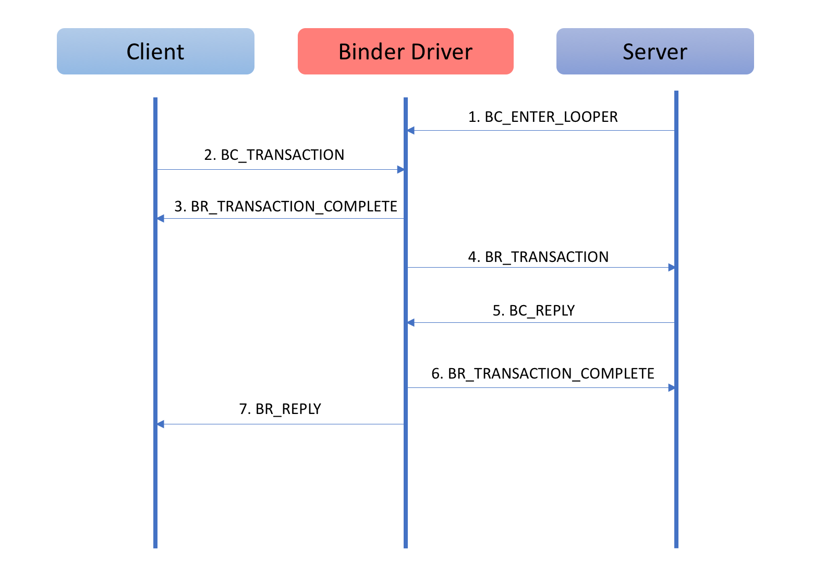

# Binder
相较于传统IPC来说更适合于Android系统，具体原因的包括如下三点：

- Binder本身是C/S架构的，这一点更符合Android系统的架构

- 性能上更有优势：管道，消息队列，Socket的通讯都需要两次数据拷贝，而Binder只需要一次。要知道，对于系统底层的IPC形式，少一次数据拷贝，对整体性能的影响是非常之大的

- 安全性更好：传统IPC形式，无法得到对方的身份标识（UID/GID)，而在使用Binder IPC时，这些身份标示是跟随调用过程而自动传递的。Server端很容易就可以知道Client端的身份，非常便于做安全检查

# 整体架构

- 驱动层

    - Binder驱动。 Binder是一个miscellaneous类型的驱动，本身不对应任何硬件，所有的操作都在软件层。

    - Binder的进程，几乎总是先通过binder_open打开Binder设备，然后通过binder_mmap进行内存映射。在这之后，通过binder_ioctl来进行实际的操作。Client对于Server端的请求，以及Server对于Client请求结果的返回，都是通过ioctl完成的。

         - 打开binder设备

         - binder_mmap这个函数中，会申请一块物理内存，然后在用户空间和内核空间同时对应到这块内存上。在这之后，当有Client要发送数据给Server的时候，只需一次，将Client发送过来的数据拷贝到Server端的内核空间指定的内存地址即可，由于这个内存地址在服务端已经同时映射到用户空间，因此无需再做一次复制，Server即可直接访问

         - ioctl系统调用来发出请求：ioctl(mProcess->mDriverFD, BINDER_WRITE_READ, &bwr)

    - binder.h

         - binder_write_read	存储一次读写操作的数据

         - binder_transaction_data	存储一次事务的数据

    - binder.c

         - binder_node	描述Binder实体节点，即：对应了一个Server

         - binder_ref	描述对于Binder实体的引用

         - binder_buffer	描述Binder通信过程中存储数据的Buffer

         - binder_proc	描述使用Binder的进程

         - binder_thread	描述使用Binder的线程

    - Binder协议，首先是从应用层的 Proxy 的 transact 函数开始，传递到 Java 层的 BinderProxy，最后到 Native 层的 BpBinder 的 transact。在 BpBinder 的 transact 实际上是调用 IPCThreadState 的 transact 函数，在它的第一个参数是 handle 值，Binder 驱动就会根据这个 handle 找到 Binder 引用对象，继而找到 Binder 实体对象。在这个函数中，做了两件事件，一件是调用 writeTransactionData 向 Binder 驱动发出一个 BC_TRANSACTION 的命令协议，把所需参数写到 mOut 中，第二件是 waitForResponse 等待回复，在它里面才会真正的和 Binder 驱动进行交互，也就是调用 talkWithDriver，然后接收到的响应执行相应的处理。这时候 Client 接收到的是 BR_TRANSACTION_COMPLETE，表示 Binder 驱动已经接收到了 Client 的请求了。在这里面还有一个 cmd 为 BR_REPLY 的返回协议，表示 Binder 驱动已经把响应返回给 Client 端了。在 talkWithDriver 中，是通过系统调用 ioctl 来和 Binder 驱动进行交互的，传递一个 BINDER_WRITE_READ 的命令并且携带一个 binder_write_read 数据结构体。在 Binder 驱动层就会根据 write_size/read_size 处理该 BINDER_WRITE_READ 命令。到这里，已经讲完了 Client 端如何和 Binder 驱动进行交互的了，下面就讲 Service 端是如何和 Binder 驱动进行交互的。Service 端首先会开启一个 Binder 线程来处理进程间通信请求，也就是通过 new Thread 然后把该线程 joinThreadPool 注册到 Binder 驱动。注册呢也就是通过 BC_ENTER_LOOPER 命令协议来做的，接下来就是在 do while 死循环中调用 getAndExecuteCommand。它里面做的就是不断从驱动读取请求，也就是 talkWithDriver，然后再处理请求 executeCommand。在 executeCommand 中，就会根据 BR_TRANSACTION 来调用 BBinder Binder 实体对象的 onTransact 函数来进行处理，然后在发送一个 BC_REPLY 把响应结构返回给 Binder 驱动。Binder 驱动在接收到 BC_REPLY 之后就会向 Service 发送一个 BR_TRANSACTION_COMPLETE 协议表示 Binder 驱动已经收到了，在此同时呢，也会向 Client 端发送一个 BR_REPLY把响应回写给 Client 端。需要注意的是，上面的 onTransact 函数就是 Service 端 AIDL 生成的 Stub 类的 onTransact 函数，这时一次完整的 IPC 通信流程就完成了。

         - 控制协议是进程通过ioctl“/dev/binder”“/dev/binder” 与Binder设备进行通讯的协议，BINDER_WRITE_READ

         - 驱动协议描述了对于Binder驱动的具体使用过程，BR_TRANSACTION，BR_REPLY

- 框架层C++，现分为Proxy和Native两端。Proxy对应了上文提到的Client端，是服务对外提供的接口。而Native是服务实现的一端，对应了上文提到的Server端。类名中带有小写字母p的（例如BpInterface），就是指Proxy端。类名带有小写字母n的（例如BnInterface），就是指Native端。Proxy代表了调用方，通常与服务的实现不在同一个进程，因此下文中，我们也称Proxy端为“远程”端。Native端是服务实现的自身，因此下文中，我们也称Native端为”本地“端。

    - BpInterface远程接口的基类，远程接口是供客户端调用的接口集；BpBinder，远程Binder，这个类提供transact方法来发送请求，BpXXX实现中会用到

    - BnInterface本地接口的基类，本地接口是需要服务中真正实现的接口集，BBinder本地Binder，服务实现方的基类，提供了onTransact接口来接收请求

# Binder 通信模型
由四方参与，分别是 Binder 驱动层、Client 端、Service 端和 ServiceManager。

- Client 端表示应用程序进程，Service 端表示系统服务，它可能运行在 SystemService 进程，比如 AMS、PMS等，也可能是运行在一个单独的进程中，比如 SurfaceFlinger。ServiceManager 是 Binder 进程间通信方式的上下文管理者，它提供 Service 端的服务注册和 Client 端的服务获取功能。它们之间是不能直接通信的，需要借助于 Binder 驱动层进行交互。这就需要它们首先通过 binder_open 打开 binder 驱动，然后根据返回的 fd 进行内存映射，分配缓冲区，最后启动 binder 线程，启动 binder 线程一方面是把这个这些线程注册到 binder 驱动，另一方面是这个线程要进入 binder_loop 循环，不断的去跟 binder 驱动进程交互。

- 接下来就可以开始 binder 通信了，我们从 ServiceManager 说起。ServiceManger 的 main 函数首先调用 binder_open 打开 binder 驱动，然后调用 binder_become_context_manager 注册为 binder 的大管家，也就是告诉 Binder 驱动 Service 的注册和获取都是通过我来做的，最后进入 binder_loop 循环。binder_loop 首先通过 BC_ENTER_LOOPER 命令协议把当前线程注册为 binder 线程，也就是 ServiceManager 的主线程，然后在一个 for 死循环中不断去读 binder 驱动发送来的请求去处理，也就调用 ioctl。

- 有了 ServiceManager 之后，Service 系统服务就可以向 ServiceManager 进行注册了。也 SurfaceFlinger 为例，在它的入口函数 main 函数中，首先也需要启动 binder 机制，也就是上所说的那三步，然后就是初始化 ServiceFlinger，最后就是注册服务。注册服务首先需要拿到 ServiceManager 的 Binder 代理对象，也就是通过 defaultServiceManager 方法，真正获取 ServiceManager 代理对象的是通过 getStrongProxyForHandle(0)，也就是查的是句柄值为 0 的 binder 引用，也就是 ServiceManager。如果没查到就说明可能 ServiceManager 还没来得及注册，这个时候 sleep(1) 等等就行了。然后就是调用 addService 来进行注册了。addService 就会把 name 和 binder 对象都写到 Parcel 中，然后就是调用 transact 发送一个 ADD_SERVICE_TRANSACTION 的请求。实际上是调用 IPCThreadState 的 transact 函数，第一个参数是 mHandle 值，也就是说底层在和 binder 驱动进行交互的时候是不区分 BpBinder 还是 BBinder，它只认一个 handle 值。

- Binder 驱动就会把这个请求交给 Binder 实体对象去处理，也就是是在 ServiceManager 的 onTransact 函数中处理 ADD_SERVICE_TRANSACTION 请求，也就是根据 handle 值封装一个 BinderProxy 对象，至此，Service 的注册就完成了。

- 至于 Client 获取服务，其实和这个差不多，也就是拿到服务的 BinderProxy 对象即可。

# Binder对象跨进程传递的原理

- 在Binder驱动中，并不是真的将对象在进程间来回序列化，而是通过特定的标识来进行对象的传递。Binder驱动中，通过flat_binder_object来描述需要跨越进程传递的对象。

- 例如当Server把Binder实体传递给Client时，在发送数据流中，flat_binder_object中的type是BINDER_TYPE_BINDER，同时binder字段指向Server进程用户空间地址。但这个地址对于Client进程是没有意义的（Linux中，每个进程的地址空间是互相隔离的），驱动必须对数据流中的flat_binder_object做相应的翻译：将type该成BINDER_TYPE_HANDLE；为这个Binder在接收进程中创建位于内核中的引用并将引用号填入handle中。对于发生数据流中引用类型的Binder也要做同样转换。经过处理后接收进程从数据流中取得的Binder引用才是有效的，才可以将其填入数据包binder_transaction_data的target.handle域，向Binder实体发送请求。由于每个请求和请求的返回都会经历内核的翻译，因此这个过程从进程的角度来看是完全透明的。进程完全不用感知这个过程，就好像对象真的在进程间来回传递一样。

# Binder的数据限制，
	#define BINDER_VM_SIZE ((1*1024*1024) - (4096 *2)) // 1M - 8k

# Binder对象引用计数计数
在 Client 进程和 Server 进程的一次通信过程中，涉及了四种类型的对象，它们分别是位于 Binder 驱动程序中的 Binder 实体对象（binder_node）和 Binder 引用对象（binder_ref），以及位于 Binder 库中的 Binder 本地对象（BBinder）和 Binder 代理对象（BpBinder），它们的交互过程如下图所示：

它们的交互过程可以划分为五个步骤：

* 运行在 Client 进程中的 Binder 代理对象通过 Binder 驱动程序向运行在 Server 进程中的 Binder 本地对象发出一个进程间通信请求，Binder 驱动程序接着就根据 Client 进程传递过来的 Binder 代理对象的句柄值来找到对应的 Binder 引用对象。
* Binder 驱动程序根据前面找到的 Binder 引用对象找到对应的 Binder 实体对象，并且创建一个事务（binder_transaction）来描述该次进程间通信过程。
* Binder 驱动程序根据前面找到的 Binder 实体对象来找到运行在 Server 进程中的 Binder 本地对象，并且将 Client 进程传递过来的通信数据发送给它处理。
* Binder 本地对象处理完成 Client 进程的通信请求之后，就将通信结果返回给 Binder 驱动程序，Binder 驱动程序接着就找到前面所创建的一个事务。
* Binder 驱动程序根据前面找到的事务的相关属性来找到发出通信请求的 Client 进程，并且通知 Client 进程将通信结果返回给对应的 Binder 代理对象处理。

从这个过程就可以看出，Binder 代理对象依赖于 Binder 引用对象，而 Binder 引用对象又依赖于 Binder 实体对象，最后，Binder 实体对象又依赖于 Binder 本地对象。这样，Binder 进程间通信机制就必须采用一种技术措施来保证，不能销毁一个还被其他对象依赖着的对象。为了维护这些 Binder 对象的依赖关系，Binder 进程间通信机制采用了引用计数计数来维护每一个 Binder 对象的生命周期。

接下来，我们就分析 Binder 驱动程序和 Binder 库是如何维护 Binder 本地对象、Binder 实体对象、Binder 引用对象和 Binder 代理对象的生命周期。

## Binder 本地对象的生命周期
Binder 本地对象是一个类型为 BBinder 的对象，它是在用户空间中创建的，并且运行在 Server 进程中。Binder 本地对象一方面会被运行在 Server 进程中的其他对象引用，另一方面也会被 Binder 驱动程序中的 Binder 实体对象引用。由于 BBinder 类继承了 RefBase 类，因此，Server 进程中的其他对象可以简单的通过智能指针来引用这些 Binder 本地对象，以便可以控制它们的生命周期。由于 Binder 驱动程序中的 Binder 实体对象是运行在内核空间的，它不能够通过智能指针来引用运行在用户空间的 Binder 本地对象，因此，Binder 驱动程序就需要和 Server 进程约定一套规则来维护它们的引用计数，避免它们在还被 Binder 实体对象引用的情况下销毁。

Server 进程将一个 Binder 本地对象注册到 ServerManager 时，Binder 驱动程序就会为它创建一个 Binder 实体对象。接下来，当 Client 进程通过 ServerManager 来查询一个 Binder 本地对象的代理对象接口时，Binder 驱动程序就会为它所对应的 Binder 实体对象创建一个 Binder 引用对象，接着在使用 BR_INCREFS 和 BR_ACQUIRE 协议来通知对应的 Server 进程增加对应的 Binder 本地对象的弱引用技术和强引用技术。这样就能保证 Client 进程中的 Binder 代理对象在引用一个 Binder 本地对象期间，该 Binder 本地对象不会被销毁。当没有任何 Binder 代理对象引用一个 Binder 本地对象时，Binder 驱动程序就会使用 BR_DECREFS 和 BR_RELEASE 协议来通知对应的 Server 进程减少对应的 Binder 本地对象的弱引用技术和强引用技术。

总结来说，Binder 驱动程序就是通过 BR_INCREFS、BR_ACQUIRE、BR_DECREFS 和 BR_RELEASE 协议来引用运行在 Server 进程中的 Binder 本地对象的，相关的代码实现在函数 binder_thread_read 中，这里就不在贴代码了。

至此，我们就分析完成 Binder 本地对象的生命周期了。

## Binder 实体对象的生命周期
Binder 实体对象是一个类型为 binder_node 的对象，它是在 Binder 驱动程序中创建的，并且被 Binder 驱动程序中的 Binder 引用对象所引用。

当 Client 进程第一次引用一个 Binder 实体对象时，Binder 驱动程序就会在内部为它创建一个 Binder 引用对象。例如，当 Client 进程通过 ServerManager 来获得一个 Service 组件的代理对象接口时，Binder 驱动程序就会找到与该 Service 组件对应的 Binder 实体对象，接着再创建一个 Binder 引用对象来引用它。这时候就需要增加被引用的 Binder 实体对象的引用计数。相应地，当 Client 进程不再引用一个 Service 组件时，它也会请求 Binder 驱动程序释放之前为它所创建的一个 Binder 引用对象。这时候就需要减少该 Binder 引用对象所引用的 Binder 实体对象的引用计数。

## Binder 引用对象的生命周期
Binder 引用对象是一个类型为 binder_ref 的对象，它是在 Binder 驱动程序中创建的，并且被用户空间中的 Binder 代理对象所引用。

当 Client 进程引用了 Server 进程中的一个 Binder 本地对象时，Binder 驱动程序就会在内部为它创建一个 Binder 引用对象。由于 Binder 引用对象是运行在内核空间的，而引用了它的 Binder 代理对象是运行在用户空间的，因此，Client 进程和 Binder 驱动程序就需要约定一套规则来维护 Binder 引用对象的引用计数，避免它们在还被 Binder 代理对象引用的情况下被销毁。

这套规则可以划分为 BC_ACQUIRE、BC_INCREFS、BC_RELEASE 和 BC_DECREFS 四个协议，分别用来增加和减少一个 Binder 引用对象的强引用技术和弱引用技术。相关的代码实现在 Binder 驱动程序的函数 binder_thread_write 中。

## Binder 代理对象的生命周期
Binder 代理对象是一个类型为 BpBinder 的对象，它是在用户空间中创建的，并且运行在 Client 进程中。与 Binder 本地对象类似，Binder 代理对象一方面会被运行在 Client 进程中的其他对象引用，另一方面它也会引用 Binder 驱动程序中的 Binder 引用对象。由于 BpBinder 类继承了 RefBase 类，因此，Client 进程中的其他对象可以简单地通过智能指针来引用这些 Binder 代理对象，以便可以控制它们的生命周期。由于 Binder 驱动程序中的 Binder 引用对象是运行在内核空间的，Binder 代理对象就不能通过智能指针来引用它们，因此，Client 进程就需要通过 BC_ACQUIRE、BC_INCREFS、BC_RELEASE 和 BC_DECREFS 四个协议来引用 Binder 驱动程序中的 Binder 引用对象。

前面提到，每一个 Binder 代理对象都是通过一个句柄值来和一个 Binder 引用对象关联的，而 Client 进程就是通过这个句柄值来维护运行在它里面的 Binder 代理对象的。具体来说，就是 Client 进程会在内部创建一个 handle_entry 类型的 Binder 代理对象列表，它以句柄值作为关键字来维护它内部所有的 Binder 代理对象。
# 死亡通知

- 死亡通知是为了让Bp端(客户端进程)进能知晓Bn端(服务端进程)的生死情况，当Bn端进程死亡后能通知到Bp端。

- 当Binder服务所在进程死亡后，会释放进程相关的资源，Binder也是一种资源。 binder_open打开binder驱动/dev/binder，这是字符设备，获取文件描述符。在进程结束的时候会有一个关闭文件系统的过程中会调用驱动close方法，该方法相对应的是release()方法。当binder的fd被释放后，此处调用相应的方法是binder_release().但并不是每个close系统调用都会触发调用release()方法. 只有真正释放设备数据结构才调用release(),内核维持一个文件结构被使用多少次的计数，即便是应用程序没有明显地关闭它打开的文件也适用: 内核在进程exit()时会释放所有内存和关闭相应的文件资源, 通过使用close系统调用最终也会release binder.

# Binder OneWay 机制

- OneWay 就是异步 binder 调用，带 ONEWAY 的 waitForResponse 参数为 null，也就是不需要等待返回结果，而不带 ONEWAY 的，就是普通的 AIDL 接口，它是需要等待对方回复的。

- 对于系统服务来说，一般都是 oneway 的，比如在启动 Activity 时，它是异步的，不会阻塞系统服务，但是在 Service 端，它是串行化的，都是放在进程的 todo 队列里面一个一个的进行分发处理。

# ServiceManager

- Client要对Server发出请求，就必须知道服务端的id。Client需要先根据Server的id通过ServerManager拿到Server的标示（通过getService），然后通过这个标示与Server进行通信。

- ServiceManager本身也实现为一个Server对象。Binder机制为ServiceManager预留了一个特殊的位置。这个位置是预先定好的，任何想要使用ServiceManager的进程只要通过这个特定的位置就可以访问到ServiceManager了（而不用再通过ServiceManager的接口）。static struct binder_node *binder_context_mgr_node;

- 在Binder驱动中，通过handle = 0这个位置来访问ServiceManager。例如，binder_transaction中，判断如果target.handler为0，则认为这个请求是发送给ServiceManager的

# AIDL全称是Android Interface Definition Language，它是Android SDK提供的一种机制。借助这个机制，应用可以提供跨进程的服务供其他应用使用。

- 所有非基本类型的参数必须包含一个描述是数据流向的标签，可能的取值是：in，out或者inout。基本参数的定向tag默认是并且只能是 in 。AIDL中的定向 tag 表示了在跨进程通信中数据的流向，其中 in 表示数据只能由客户端流向服务端， out 表示数据只能由服务端流向客户端，而 inout 则表示数据可在服务端与客户端之间双向流通。其中，数据流向是针对在客户端中的那个传入方法的对象而言的。in 为定向 tag 的话表现为服务端将会接收到一个那个对象的完整数据，但是客户端的那个对象不会因为服务端对传参的修改而发生变动；out 的话表现为服务端将会接收到那个对象的参数为空的对象，但是在服务端对接收到的空对象有任何修改之后客户端将会同步变动；inout 为定向 tag 的情况下，服务端将会接收到客户端传来对象的完整信息，并且客户端将会同步服务端对该对象的任何变动。

- aidl文件生成的java文件

    - 一个名称为IRemoteService的interface，该interface继承自android.os.IInterface并且包含了我们在aidl文件中声明的接口方法

    - IRemoteService中包含了一个名称为Stub的静态内部类，这个类是一个抽象类，它继承自android.os.Binder并且实现了IRemoteService接口。这个类中包含了一个onTransact方法

    - Stub内部又包含了一个名称为Proxy的静态内部类，Proxy类同样实现了IRemoteService接口，Stub是提供给开发者实现业务的父类，而Proxy的实现了对外提供的接口。

    - Stub类是用来提供给开发者实现业务逻辑的父类，开发者者继承自Stub然后完成自己的业务逻辑实现

    - Proxy类通过Parcel对象以及transact调用对应远程服务的接口

# Messenger

# ContentProvider

