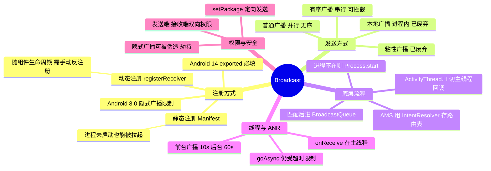

# Broadcast（广播）



> 广播的本质是 **AMS 中转的跨进程 Intent 分发**：注册是把 IntentFilter 交给 AMS 的路由表，发送是把 Intent 交给 AMS 匹配后逐个回调，必要时还会顺带把接收方进程拉起来——这也是静态广播既"方便"又"耗电"的原因。

---

## 一、两种注册方式

### 1. 静态注册（Manifest）

```xml
<receiver android:name=".MyReceiver"
          android:exported="true">
    <intent-filter>
        <action android:name="com.demo.ACTION_REFRESH" />
    </intent-filter>
</receiver>
```

- 安装时由 PMS 解析、注册进 AMS 的 `IntentResolver`，**应用进程没启动也能收到广播**，系统会通过 `Process.start` 把进程拉起来再回调 `onReceive`；
- 生命周期与整个应用一致，不需要手动反注册。

### 2. 动态注册（代码）

```java
IntentFilter filter = new IntentFilter(Intent.ACTION_TIME_TICK);
registerReceiver(receiver, filter);   // 返回粘性广播的 Intent，普通广播返回 null
// ...
unregisterReceiver(receiver);         // 必须反注册
```

- **跟随注册者的生命周期**，通常放在 `onResume`/`onCreate` 注册、`onPause`/`onDestroy` 反注册；
- 忘记反注册会导致 Activity 泄漏（LeakCanary 会直接提示 "Activity has leaked IntentReceiver ... are you missing a call to unregisterReceiver()?"），因为 AMS 的 `ReceiverList` 持有它；
- 动态注册**不受隐式广播限制**影响，8.0 之后监听系统广播基本都要改成动态注册。

### 3. 静态 vs 动态对比

| 维度 | 静态注册 | 动态注册 |
| --- | --- | --- |
| 注册时机 | 安装/启动时由 PMS 解析 | 运行时调用 `registerReceiver` |
| 生命周期 | 随应用，常驻 | 随注册组件，需手动反注册 |
| 能否拉起进程 | **能** | 不能（进程不在就没有注册记录） |
| 8.0 隐式广播限制 | 受限（大多数隐式广播不允许） | 不受限 |
| 有序广播优先级 | 低于同优先级的动态注册 | 同优先级时优先于静态 |

### 4. Android 8.0 的隐式广播限制

- targetSdk ≥ 26 的应用**不能在 Manifest 中注册大多数隐式广播**（只能注册显式广播和官方例外）；
- 目的：避免应用被各种系统广播频繁唤醒，造成耗电（大量应用靠监听 `CONNECTIVITY_CHANGE` 之类的广播做自启动）；
- 常见例外（仍可静态注册）：`ACTION_BOOT_COMPLETED`、`ACTION_LOCKED_BOOT_COMPLETED`、`ACTION_LOCALE_CHANGED`、`ACTION_TIMEZONE_CHANGED`、`ACTION_MY_PACKAGE_REPLACED`、部分 USB / 蓝牙相关广播等；
- 解决办法：改用**动态注册**，或用 `JobScheduler`/`WorkManager` 等替代"监听系统事件"的需求。

### 5. Android 13 / 14 的 exported 要求

- targetSdk ≥ 34（Android 14）时，**动态注册必须显式指定** `Context.RECEIVER_EXPORTED` 或 `Context.RECEIVER_NOT_EXPORTED`，否则直接抛异常：

```java
registerReceiver(receiver, filter, Context.RECEIVER_NOT_EXPORTED);
```

- 静态注册的 `<receiver>` 若带有 `intent-filter`，必须显式声明 `android:exported`，只监听自己应用内部的广播用 `false`（既安全又避免被第三方应用触发）。

---

## 二、发送方式

### 1. 普通广播（无序）

```java
sendBroadcast(new Intent(ACTION_REFRESH));
```

- AMS 把广播放进**并行队列** `mParallelBroadcasts`，一次性分发给所有匹配的接收者；
- 接收顺序不确定（同一优先级内并行），无法拦截，效率最高；
- 高优先级或需要结果传递时用有序广播。

### 2. 有序广播

```java
sendOrderedBroadcast(intent, receiverPermission, resultReceiver,
        scheduler, initialCode, initialData, initialExtras);
```

- 进**串行队列** `mOrderedBroadcasts`，按 `android:priority`（取值 **-1000 ~ 1000**，越大越先）依次分发；
- 每个接收者可以：
  - `abortBroadcast()`：终止广播，后续接收者收不到；
  - `setResultCode()` / `setResultData()` / `setResultExtras()`：把结果沿链条向下传递；
  - `resultReceiver`：链条最后一定会收到的接收者（无论前面怎么改结果）；
- **同优先级时，动态注册优先于静态注册**——这是面试常考的小细节。

### 3. 本地广播（LocalBroadcastManager）

- 广播只在应用进程内传播，内部就是一个 `Handler` + 集合，**不经过 AMS/Binder**；
- 优点：效率高、不会被其他应用接收或伪造（安全）、不涉及进程拉起，没有跨进程开销；
- 缺点：不能跨进程；**且已被官方标记为废弃**（推荐用 `LiveData` / `Flow` / 事件总线替代）；
- 注意它的 `onReceive` 也是通过主线程 Handler 回调，同样不能做耗时操作。

### 4. 粘性广播

`sendStickyBroadcast` 会把 Intent 暂存在 AMS，之后注册的接收者能立刻收到最后一次的粘性广播。因存在数据泄漏与安全风险，API 21 起已废弃，不建议使用。

---

## 三、底层流程（AMS 视角）

### 1. 注册

```
ContextImpl.registerReceiver
  → AMS.registerReceiver
    → 为该 Receiver 建立 ReceiverList，把 IntentFilter 包装成 BroadcastFilter
    → 注册进 mReceiverResolver（IntentResolver，本质是 action → filter 的索引表）
```

### 2. 发送与分发

```
ContextImpl.sendBroadcast
  → AMS.broadcastIntentLocked
    → mReceiverResolver.queryIntent()  匹配出所有目标 Receiver
    → 放入 BroadcastQueue（并行 mParallelBroadcasts / 有序 mOrderedBroadcasts）
    → processNextBroadcast() 逐个处理：
        进程存活 → scheduleReceiver() 经 Binder 通知该进程
        进程不存在（静态注册）→ Process.start() 拉起进程，广播挂起等待
```

### 3. 接收

```
ApplicationThread.scheduleReceiver
  → ActivityThread.handleReceiver
    → 通过 H（主线程 Handler）切换回主线程
    → 反射实例化 BroadcastReceiver（静态注册按 Manifest 中记录的类名）
    → 回调 onReceive(context, intent)
    → finishReceiver() 通知 AMS，处理下一条广播
```

要点：

- **静态注册的 Receiver 实例是每次回调时新建的**，`onReceive` 返回后这个实例就没有意义了，不要在里面用异步回调保存状态；
- 广播的整个转发过程有**两次跨进程**（App → AMS → App），因此广播的效率天然低于进程内的事件总线；
- 有序广播要等前一个接收者的 `finishReceiver` 才会继续下一个，任何一个接收者卡住都会拖慢整条链。

---

## 四、线程模型与 ANR

- **`onReceive` 运行在主线程**（`ActivityThread.H`），`BroadcastReceiver` 自身没有任何线程能力；
- 超时直接 ANR：
  - 前台广播：**10 秒**（`BROADCAST_FG_TIMEOUT`）；
  - 后台广播：**60 秒**（`BROADCAST_BG_TIMEOUT`）；
  - 广播是前台还是后台取决于发送方进程的优先级（前台进程发的就是前台广播），也可以加 `Intent.FLAG_RECEIVER_FOREGROUND` 提升优先级和速度；
- 耗时操作的正确做法：

| 做法 | 说明 |
| --- | --- |
| `goAsync()` | 返回 `PendingResult`，把工作丢到子线程，处理完调 `pendingResult.finish()` |
| 启动 Service / 前台服务 | 适合几分钟级的任务（注意 8.0 后台服务限制） |
| WorkManager / JobScheduler | 适合可延迟、需要保证执行的任务 |
| 进程内线程 + 通知 | 短任务可以直接起线程，但进程可能随时被回收 |

> `goAsync()` 的常见误解：它只是让系统认为"这次广播还没处理完"，从而**稍微**延长生命周期，但**超时判定依然存在**，绝对不是"可以随便耗时"的许可。

---

## 五、权限与安全

### 1. 双向权限

| 方向 | 做法 | 含义 |
| --- | --- | --- |
| 限制谁能发给我 | 注册时传 `broadcastPermission`（或 Manifest 里 `<receiver android:permission>`） | 发送方必须持有该权限 |
| 限制我能发给谁 | `sendBroadcast(intent, receiverPermission)` | 接收方必须持有该权限 |

### 2. 常见风险与对策

- **隐式广播被监听/伪造**：任何应用都能注册同样的 action 收到你的数据，甚至伪造广播触发你的逻辑；
  - 对策：用**显式 Intent**（`setComponent`/`setClass`）或 `setPackage("com.xxx")` 限定目标包；用带权限的广播；进程内通信用 LocalBroadcast/事件总线。
- **导出的 Receiver 被外部触发**：`android:exported="true"` 且无权限校验时，第三方应用可以直接发广播触发你的逻辑（比如拉活、触发敏感操作）；
  - 对策：内部广播一律 `exported="false"`；必须导出的加 `permission` 校验，并在 `onReceive` 中校验 `getSendingUid()`/包名。
- **广播数据被读取**：Intent 中的 extras 对接收方完全透明，敏感数据不要放 broadcast。

---

## 六、面试高频问答

### 1. 说说广播的注册、发送、接收流程

注册是把 `IntentFilter` 交给 AMS 存进 `IntentResolver` 路由表；发送时 `sendBroadcast` 经 Binder 进入 AMS，`broadcastIntentLocked` 匹配出所有 Receiver 并放入 `BroadcastQueue`（无序进并行队列、有序进串行队列）；`processNextBroadcast` 逐个分发，进程不在就 `Process.start` 拉起，随后通过 Binder 回调 `ApplicationThread.scheduleReceiver`，在 `ActivityThread.handleReceiver` 中切回主线程并回调 `onReceive`。

### 2. 静态注册和动态注册的区别？

见第一节表格。最关键的差异是：**静态注册的广播能拉起未启动的进程**（所以早期被拿来当保活手段），动态注册随组件生命周期且必须反注册；Android 8.0 起隐式广播基本只能动态注册。

### 3. 有序广播和普通广播的区别？

普通广播并行分发、无序、效率高、不能拦截；有序广播串行分发、按 `priority`（-1000~1000）从高到低，可用 `abortBroadcast()` 拦截、可传递结果、可指定最终 `resultReceiver`。同优先级时动态注册优先于静态注册。

### 4. onReceive 在哪个线程？能耗时吗？

主线程，不能耗时。前台广播超时 10 秒、后台广播 60 秒即 ANR。耗时任务应交给子线程 + `goAsync()`、Service 或 WorkManager。

### 5. goAsync 的原理？它能让广播不超时吗？

`goAsync()` 返回 `PendingResult`，广播的"完成"由 `finish()` 决定，因此可以在 `onReceive` 返回后继续处理；但它不会取消超时机制，仍必须在超时时间内 finish。它提升的是进程优先级和短暂的生命周期窗口，不是无限期通行证。

### 6. Android 8.0 为什么限制隐式广播？

大量应用在 Manifest 中注册系统广播（网络变化、屏幕解锁等）来实现自启动，系统每次发广播都要唤醒一堆进程，耗电严重。因此 targetSdk ≥ 26 的应用禁止静态注册大多数隐式广播，只保留少量例外，迫使应用改用动态注册或 JobScheduler/WorkManager。

### 7. 广播能传递多大的数据？

广播的 Intent 通过 Binder 传递，受 Binder 事务缓冲区大小限制（量级约 1MB，且是所有并发事务共享），超了会抛 `TransactionTooLargeException`。传输大对象应该：只传 ID/路径，实际数据走 [ContentProvider](../ContentProvider/ContentProvider.md)、文件或进程内共享（单进程场景）。

### 8. LocalBroadcastManager 为什么效率高？为什么被废弃？

它的实现就是 `Handler` + 一张 `action → ArrayList<ReceiverRecord>` 的表，完全不经过 AMS 与 Binder，也没有跨进程序列化，所以又快又安全（外部应用无法收发）。废弃的原因是它属于"进程内事件通知"这件事的临时方案，官方推荐用 `LiveData`/`Flow`/`SharedFlow` 等具备生命周期感知的方案替代。

### 9. 广播和 EventBus 的区别？怎么选？

| 维度 | 广播 | EventBus |
| --- | --- | --- |
| 通信范围 | 跨进程/跨应用（系统级） | 仅进程内 |
| 线程模型 | 回调主线程（`onReceive`） | 可指定线程（POSTING/MAIN/BACKGROUND/ASYNC） |
| 传递方式 | Intent + extras（受 Binder 大小限制） | 任意对象引用，无拷贝 |
| 安全 | 需要权限、exported 控制 | 不涉及系统，天然安全 |
| 适用 | 系统事件、跨应用通知 | 应用内组件解耦 |

一句话：**跨进程用广播，进程内优先用事件总线/LiveData/Flow。**

### 10. 广播为什么能拉起进程？能用来保活吗？

静态注册的接收者在 AMS 中留有记录，发送广播匹配到它时，如果目标进程未启动，AMS 会调用 `Process.start` 拉起进程再回调。但 8.0 之后隐式广播被限制、后台进程被严格管控、"后台启动"也被限制，靠广播保活基本不可行，且属于系统明确打击的行为。
