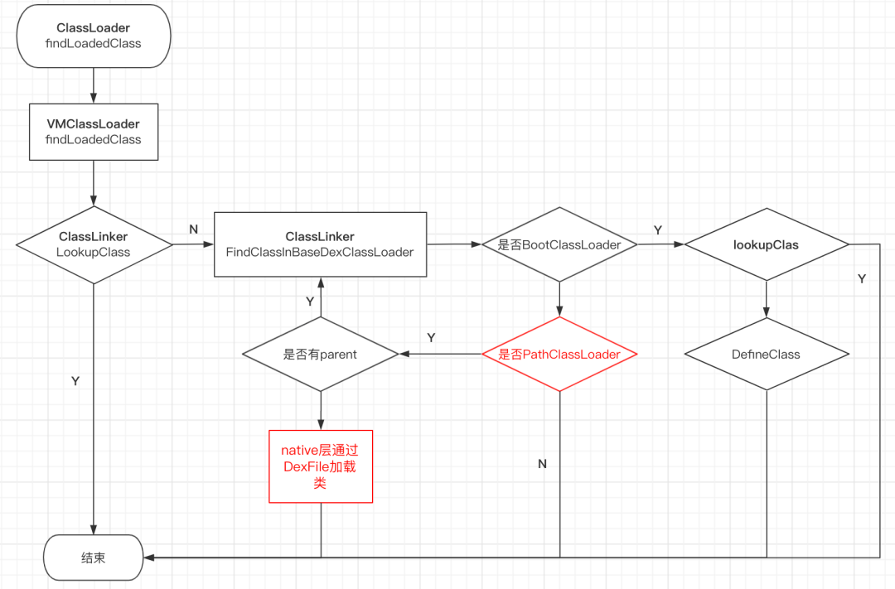

# 双亲委派机制
## Java的ClassLoader

* 首先从已加载类中查找，如果能够找到则直接返回，找不到则调用 parent classloader 的 loadClass 进行查找；
* 如果 parent clasloader 能找到相关类则直接返回，否则调用 findClass 去进行类加载；

```
protected Class<?> loadClass(String name, boolean resolve)
    throws ClassNotFoundException
{
        Class<?> c = findLoadedClass(name);
        if (c == null) {
            try {
                if (parent != null) {
                    c = parent.loadClass(name, false);
                } else {
                    c = findBootstrapClassOrNull(name);
                }
            } catch (ClassNotFoundException e) {
            }

            if (c == null) {
                c = findClass(name);
            }
        }
        return c;
}
```
## Android 中的 ClassLoader

双亲委派机制中很重要的一个点就是 ClassLoader 的父子关系，我们再来看一下 Android 中 ClassLoader 情况。一般情况下 Android 中有两个 ClassLoader，分别是 BootClassLoader 和 PathClassLoader，BootClassLoaderart 负责加载 android sdk 的类，像我们的 Activity、TextView 等都由 BootClassLoader 加载。PathClassLoader 则负责加载 App 中的类，比如我们的自定义的 Activity、support 包中的 FragmentActivity 这些会被打进 app 中的类则由 PathClassLoader 进行加载。BootClassLoader 是 PathClassLoader 的 parent。

### ART 虚拟机对类加载的优化

ART 虚拟机在类加载方面仍然遵循双亲委派的原则，不过在实现上做了一定的优化。一般情况下它的大致流程如下：

* 首先调用 PathClassLoader 的 findLoadedClass 方法去查找已加载的类中查找，这个方法将会通过 jni 调用到 ClassLinker 的 LookupClass 方法，如果能够找到则直接返回；
* 在已加载类中找不到的情况下，不会立刻返回到 java 层，其会在 native 层去调用 ClassLinker 的 FindClassInBaseDexClasLoader 进行类查找；
* 在 FindClassInBaseDexClasLoader 中，首先会去判断当前 ClassLoader 是否为 BootClassLoader，如果为 BootClasLoader 则尝试从当前 ClassLoader 的已加载类中查找，如果能够找到则直接返回，如果找不到则尝试使用当前 ClassLodaer 进行加载，无论能否加载到都返回；
* 如果当前 ClassLoader 不是 BootClassLoader，则会判断是否为 PathClasLoader，如果不是 PathClassLoader 则直接返回；
* 如果当前 ClassLoader 为 PathClassLoader，则会去判断当前 PathClassLoader 是否存在 parent，如果存在 parent 则将 parent 传入递归调用 FindClassInBaseDexClasLoader 方法，如果能够找到则直接返回；如果找不到或者当前 PathClassLoader 没有 parent 则直接在 native 层通过 DexFile 直接进行类加载。



可以看到当 PathClassLoader 到 BootClassLoader 的 ClassLoadeer 链路上只有 PathClassLoader 时，java 层的 findLoadedClass 方法调用后，并不止如其字面含义的去已加载的类中查找，其还会在 native 层直接通过 DexFile 去加载类，这种方式相对于回到 java 层调用 findClass 再调回 native 层通过 DexFile 加载可以减少一次不必要的 jni 调用，在运行效率上是更高的，这是 art 虚拟机对类加载效率的一个优化。