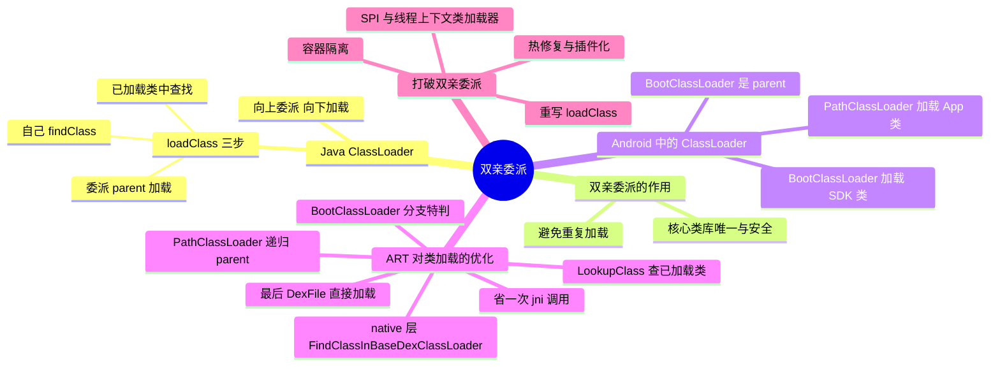
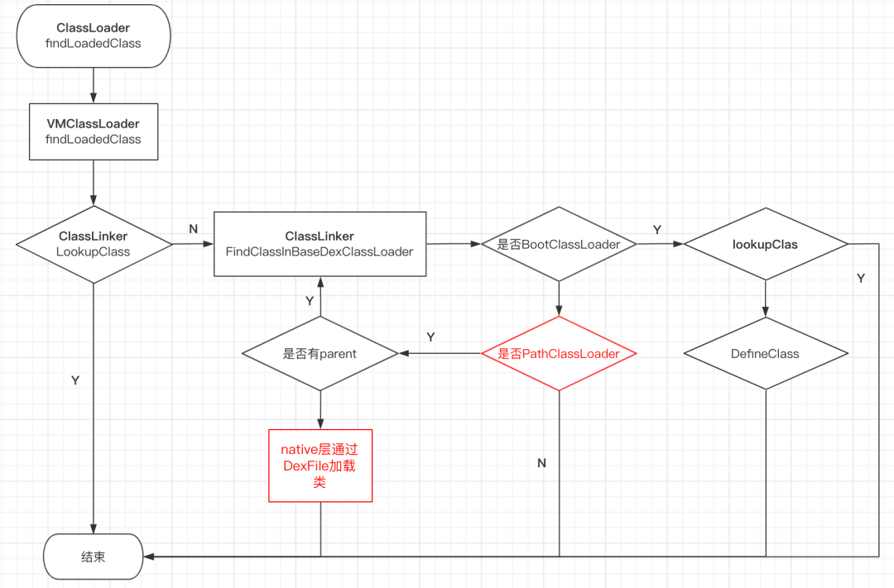

# 双亲委派机制


```mermaid
mindmap
  root((双亲委派))
    Java ClassLoader
      loadClass 三步
        已加载类中查找
        委派 parent 加载
        自己 findClass
      向上委派 向下加载
    双亲委派的作用
      核心类库唯一与安全
      避免重复加载
    Android 中的 ClassLoader
      BootClassLoader 加载 SDK 类
      PathClassLoader 加载 App 类
      BootClassLoader 是 parent
    ART 对类加载的优化
      LookupClass 查已加载类
      native 层 FindClassInBaseDexClassLoader
      BootClassLoader 分支特判
      PathClassLoader 递归 parent
      最后 DexFile 直接加载
      省一次 jni 调用
    打破双亲委派
      SPI 与线程上下文类加载器
      热修复与插件化
      容器隔离
      重写 loadClass
```

---

## 一、Java 的 ClassLoader

- 首先从已加载类中查找，如果能够找到则直接返回，找不到则调用 parent classloader 的 loadClass 进行查找；
- 如果 parent classloader 能找到相关类则直接返回，否则调用 findClass 去进行类加载；

```java
protected Class<?> loadClass(String name, boolean resolve)
    throws ClassNotFoundException
{
    Class<?> c = findLoadedClass(name);
    if (c == null) {
        try {
            if (parent != null) {
                c = parent.loadClass(name, false);
            } else {
                c = findBootstrapClassOrNull(name);
            }
        } catch (ClassNotFoundException e) {
        }

        if (c == null) {
            c = findClass(name);
        }
    }
    return c;
}
```

流程可以概括为**向上委派、向下加载**：收到加载请求先看自己加载过没有，没有就交给 parent，一路传到最顶层的 Bootstrap ClassLoader；父加载器都加载不了，才回头调用自己的 `findClass`。

---

## 二、双亲委派的作用

1. **保证核心类库的唯一与安全**：`java.lang.*` 等核心类由最顶层的 Bootstrap ClassLoader 加载，即使用户自己写了一个 `java.lang.String` 放在应用类路径上，请求也会被一路委派到 Bootstrap，加载的是 JDK 自带的那个，自定义的同名类永远轮不到被加载，从而防止核心 API 被篡改。
2. **避免类的重复加载**：同一个类在同一个加载器体系内只会被加载一次——父加载器加载过，子加载器就直接复用。

---

## 三、Android 中的 ClassLoader

双亲委派机制中很重要的一个点就是 ClassLoader 的父子关系，我们再来看一下 Android 中 ClassLoader 的情况。一般情况下 Android 中有两个 ClassLoader，分别是 **BootClassLoader** 和 **PathClassLoader**：

- **BootClassLoader** 负责加载 Android SDK 的类，像我们的 Activity、TextView 等都由 BootClassLoader 加载。
- **PathClassLoader** 则负责加载 App 中的类，比如我们自定义的 Activity、support 包中的 FragmentActivity 这些会被打进 App 中的类，由 PathClassLoader 进行加载。
- BootClassLoader 是 PathClassLoader 的 parent。

---

## 四、ART 虚拟机对类加载的优化

ART 虚拟机在类加载方面仍然遵循双亲委派的原则，不过在实现上做了一定的优化。一般情况下它的大致流程如下：

- 首先调用 PathClassLoader 的 `findLoadedClass` 方法去查找已加载的类，这个方法将会通过 jni 调用到 ClassLinker 的 `LookupClass` 方法，如果能够找到则直接返回；
- 在已加载类中找不到的情况下，**不会立刻返回到 Java 层**，其会在 native 层去调用 ClassLinker 的 `FindClassInBaseDexClassLoader` 进行类查找；
- 在 `FindClassInBaseDexClassLoader` 中，首先会去判断当前 ClassLoader 是否为 BootClassLoader，如果为 BootClassLoader 则尝试从当前 ClassLoader 的已加载类中查找，如果能够找到则直接返回，如果找不到则尝试使用当前 ClassLoader 进行加载，无论能否加载到都返回；
- 如果当前 ClassLoader 不是 BootClassLoader，则会判断是否为 PathClassLoader，如果不是 PathClassLoader 则直接返回；
- 如果当前 ClassLoader 为 PathClassLoader，则会去判断当前 PathClassLoader 是否存在 parent，如果存在 parent 则将 parent 传入递归调用 `FindClassInBaseDexClassLoader` 方法，如果能够找到则直接返回；如果找不到或者当前 PathClassLoader 没有 parent，则直接在 native 层通过 `DexFile` 直接进行类加载。



可以看到，当 PathClassLoader 到 BootClassLoader 的 ClassLoader 链路上只有 PathClassLoader 时，Java 层的 `findLoadedClass` 方法调用后，并不止如其字面含义地去已加载的类中查找，它还会在 native 层直接通过 DexFile 去加载类。这种方式相对于回到 Java 层调用 `findClass` 再调回 native 层通过 DexFile 加载，可以减少一次不必要的 jni 调用，在运行效率上是更高的，这是 ART 虚拟机对类加载效率的一个优化。

---

## 五、双亲委派也不是铁板一块

`loadClass` 方法是 protected 且可以重写，只要改变"先委派父加载器"这个顺序，就等于打破了双亲委派。常见的场景：

### 1. SPI 与线程上下文类加载器

以 JDBC 为例：`DriverManager` 位于核心类库，由 Bootstrap ClassLoader 加载；但它要加载的数据库驱动实现类（如 MySQL 的 Driver）在应用类路径上，Bootstrap ClassLoader 看不到、也没法委派给子加载器去加载。解决办法就是**线程上下文类加载器**：通过 `Thread.currentThread().getContextClassLoader()` 拿到当前线程的上下文类加载器（默认为 AppClassLoader），由它去完成加载，等于父加载器"反向借用"了子加载器。

### 2. 热修复与插件化

- **热修复**：Android 中 PathClassLoader 创建后无法再往里添加 dex。热修复框架通过反射把补丁 dex 插到 `DexPathList.dexElements` 数组的**最前面**，类加载时按数组顺序查找，补丁 dex 先命中，就实现了"用修复后的类覆盖有 Bug 的类"。
- **插件化**：通过自定义 ClassLoader 或 `DexClassLoader` 加载插件 apk 中的类，由宿主决定加载路径与顺序。

### 3. 容器隔离

Tomcat 这类容器为每个 webapp 单独创建一个类加载器，加载顺序是"先加载应用自己目录（`WEB-INF/classes`、`WEB-INF/lib`）下的类，加载不到再委派父加载器"，保证应用之间的类互相隔离。

---

## 六、30 秒口述版

双亲委派的流程是"向上委派、向下加载"：先查已加载，再交给 parent，父加载器都加载不了才回调自己的 `findClass`。它保证了核心类库不被篡改、类不被重复加载。Android 中的两个 ClassLoader 是 BootClassLoader（加载 SDK 类）和 PathClassLoader（加载 App 类），前者是后者的 parent；ART 在此基础上做了优化，在 native 层直接走 `FindClassInBaseDexClassLoader` 并用 DexFile 加载，省掉一次 jni 往返。打破双亲委派的典型场景：SPI 用线程上下文类加载器反向加载、热修复把补丁 dex 插到 dexElements 最前面、Tomcat 为每个 webapp 单独实现加载器。
