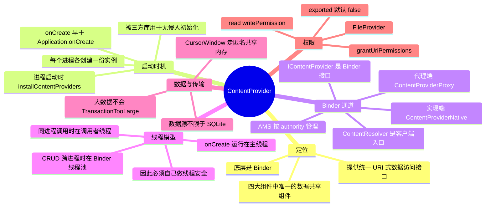

# ContentProvider



> ContentProvider 是四大组件里唯一为"**数据共享**"而生的组件：它把任意数据源（SQLite、文件、内存、网络）包装成一组 `content://` URI，通过 [Binder](../Binder/Binder.md) 暴露给其他进程/应用。它最容易被忽视的两个特性是——**`onCreate()` 比 `Application.onCreate()` 还早**，以及 **CRUD 的线程归属会随调用方是否同进程而改变**。

---

## 一、URI 约定与核心类

### 1. URI 结构

```
content://com.demo.provider/user/1
   scheme      authority       path  id
```

| 组成 | 说明 |
| --- | --- |
| scheme | 固定为 `content://` |
| authority | 在 Manifest 的 `android:authorities` 中声明，需全局唯一（一般用包名 + 后缀） |
| path | 业务分类，如 `user`、`order` |
| id | 可选，指向单条记录，如 `/user/1` |

- 服务端通常用 `UriMatcher` 把 URI 映射到不同的表/操作；
- `getType(uri)` 返回 MIME 类型，用于让系统知道"这是一组数据还是单条数据"：
  - 集合：`vnd.android.cursor.dir/vnd.<authority>.<path>`
  - 单条：`vnd.android.cursor.item/vnd.<authority>.<path>`

### 2. 核心类

| 类 | 角色 |
| --- | --- |
| `ContentProvider` | 服务端，实现 `onCreate/query/insert/update/delete/getType` |
| `ContentResolver` | 客户端入口，`getContentResolver()` 获得 |
| `IContentProvider` | Binder 接口：实现端是 `ContentProviderNative`（内部类 `Transport`），代理端是 `ContentProviderProxy` |
| `Cursor` / `CursorWindow` | 查询结果的载体，跨进程通过共享内存传递 |
| `ContentObserver` | 监听数据变化（配合 `notifyChange`） |

### 3. 数据源不限于 SQLite

ContentProvider 只是"URI → 数据"的**协议适配层**，内部用什么存储完全自由：SQLite、文件、SharedPreferences、内存 Map、甚至网络请求转发（比如封装成 provider 给其他应用调用）。SQLite 只是因为配合 `Cursor` 最顺手而最常用。

---

## 二、启动时机：比 Application 还早

### 1. 进程启动时的安装流程

```
AMS 启动应用进程 → bindApplication(携带 ProviderInfo 列表)
  → ActivityThread.handleBindApplication
      → installContentProviders(app, providers)
          → 反射创建 Provider → attachInfo → onCreate()
      → mInstrumentation.callApplicationOnCreate(app)
```

所以完整的启动顺序是：

```
Application.attachBaseContext()
  → 各个 ContentProvider.onCreate()
    → Application.onCreate()
```

> 这是 ContentProvider 最容易被考的一个点：**`ContentProvider.onCreate()` 早于 `Application.onCreate()`**。

### 2. 三方库如何利用这一点

既然 provider 会被系统自动创建，那么"在 `onCreate` 里做初始化"就等于**零接入成本**——使用方不需要在 Application 里写任何一行代码。典型代表：

- `androidx.startup` 的 `InitializationProvider`：所有通过 `Initializer` 声明的组件都由它在启动时依次初始化，还支持依赖排序与懒加载（`AppInitializer`）;
- LeakCanary 2 通过 provider 自动安装；
- Facebook SDK、Firebase 早期版本等也用同样的套路。

**副作用**：接入的 SDK 越多，进程启动时就越早、越多地执行初始化，直接影响冷启动耗时。所以现在更推荐用 `androidx.startup` 统一管理，并对非必要项做**延迟初始化**（见 [启动优化](../启动优化.md)）。

### 3. 每个进程一份

provider 实例是**按进程**创建的：多进程应用里，`ContentProvider.onCreate()` 会在每个进程各回调一次（同一个应用不同进程不会共享 provider 对象），所以也可以拿它当"多进程初始化入口"。而真正对外提供数据的那一份，由持有该 authority 的进程负责。

---

## 三、通信原理：ContentResolver 与 Binder

### 1. 获取代理

```
ContentResolver.query(uri, ...)
  → acquireProvider(uri)
    → ActivityThread.acquireProvider
      → IActivityManager.getContentProvider(uri)  Binder→ AMS
          AMS 按 authority(+userId) 查 mProviderMap
            已有 → 直接返回 IContentProvider
            没有 → Process.start 拉起目标进程 → installProvider → 返回 Transport
  → 拿到 IContentProvider 代理，发起真正的 query 调用
```

- 跨进程时，客户端拿到的是 `ContentProviderProxy`，每一次 `query/insert/update/delete` 都是一次 Binder 事务；
- 这也是 ContentProvider 能成为"跨进程数据访问标准方案"的原因：**URI 路由 + Binder 通信 + 权限模型**全部由系统提供。

### 2. 同进程的直接调用

如果调用方和 provider 在同一个进程，`acquireProvider` 会直接返回本进程 provider 的 `Transport`（Binder 对象）；更关键的是 **Binder 驱动对同进程调用有优化——不会经过内核，直接做本地对象调用**。因此：

> **同进程调用时，CRUD 方法运行在"调用者线程"上；跨进程调用时才运行在 Binder 线程池的线程上。**

---

## 四、线程模型（高频）

| 方法 | 运行线程 |
| --- | --- |
| `onCreate()` | 由系统在进程启动时回调，**运行在主线程** |
| `query` / `insert` / `update` / `delete` / `getType` | **跨进程**：Binder 线程池中的线程（每次调用可能是不同线程）；**同进程**：调用者所在线程 |

由此得出两个结论：

1. **ContentProvider 不是线程安全的**，多个 Binder 线程可能并发进入 CRUD。共享的 `SQLiteDatabase` 要么用同一个 `SQLiteOpenHelper` 实例（其内部有锁），要么自己加锁；绝不要在 provider 中把状态放到成员变量里临时存放。
2. **onCreate 在主线程**，所以 provider 的初始化必须是轻量的——这正好与"三方库拿它做初始化入口"形成冲突，也是启动优化的常见排查点。

---

## 五、数据传输：CursorWindow 与大数据

- 查询结果**不是**通过 Binder 事务拷贝的，而是写入一块匿名共享内存 `CursorWindow`（ashmem），Binder 事务里只传一个文件描述符和元信息；
- 因此 ContentProvider 可以返回几十 MB 的数据也不会触发 `TransactionTooLargeException`（对比广播/`Intent` 传大对象就会）；
- 代价是 `CursorWindow` 的内存由共享内存分配，**必须及时 `close()`**，否则会造成 ashmem 泄漏（体积往往是 MB 级）。Android P 之后系统有兜底回收与 StrictMode 检测，但正确做法仍然是 `try-finally` 关闭；
- 超大结果集应当分页（`LIMIT/OFFSET`、`queryParameters`），一次拉全表既慢又占内存。

---

## 六、权限与安全

### 1. 导出与权限

| 配置 | 作用 |
| --- | --- |
| `android:exported` | 是否允许其他应用访问。**targetSdk ≥ 17 时默认为 false**，要跨应用访问必须显式写 `true` |
| `android:readPermission` / `android:writePermission` | 分别限制读、写所需的权限 |
| `android:permission` | 同时限制读写 |
| `android:grantUriPermissions` | 允许对单个 URI 做临时授权 |

- Android 4.2（API 17）之前 provider 默认导出，导致大量应用把数据库裸奔在公网上被扫描读写；**API 17 起默认不再导出**，这是一次著名的安全修复；
- 只给本应用使用的 provider 应保持 `exported="false"`；
- 对外提供数据时，除了权限，还应在关键操作里校验 `Binder.getCallingUid()` / 包名，防止被同权限应用或系统漏洞绕过。

### 2. grantUriPermissions 与 FileProvider

- `FLAG_GRANT_READ_URI_PERMISSION` 可以给其他应用**临时**授予某个 URI 的读权限（用完即失效），典型场景是相册分享：你把图片的 `content://` URI 传给微信，微信获得临时读权限；
- `FileProvider` 就是官方提供的通用实现：

```xml
<provider
    android:name="androidx.core.content.FileProvider"
    android:authorities="com.demo.fileprovider"
    android:exported="false"
    android:grantUriPermissions="true">
    <meta-data android:name="android.support.FILE_PROVIDER_PATHS"
               android:resource="@xml/file_paths" />
</provider>
```

```java
Uri uri = FileProvider.getUriForFile(context, "com.demo.fileprovider", file);
intent.putExtra(Intent.EXTRA_STREAM, uri);
intent.addFlags(Intent.FLAG_GRANT_READ_URI_PERMISSION);
```

- 它解决的是 **Android 7.0 的 `FileUriExposedException`**：7.0 起禁止把 `file://` URI 暴露给其他应用（因为接收方拿不到权限，也无法做细粒度授权），必须改用 `content://` + 临时授权；
- 顺带的好处是**不暴露真实文件路径**，接收方只知道一个 URI。

---

## 七、其他高频考点

### 1. 通知机制：ContentObserver

```
ContentResolver.notifyChange(uri, observer)
  → ContentService(AMS 中的 IContentService) 找到注册该 URI 的观察者
  → Binder 通知各客户端进程
  → ContentObserver.onChange() 回调（默认在主线程）
```

- `ContentObserver` 天生是**跨进程**的：进程 A 修改数据 `notifyChange` 后，进程 B 注册的观察者能收到通知，这是"多进程数据同步"的经典方案；
- `registerContentObserver(uri, notifyForDescendants, observer)` 的第二个参数表示子路径变化是否也通知；
- 反注册同样不能忘，否则泄漏。

### 2. 批量操作

- 循环调用 `insert` 每次都走一次 Binder，且 provider 侧如果没开事务就是"一行一个事务"，写 1000 行会慢到不可接受；
- 正确做法：
  - `bulkInsert(uri, ContentValues[])`：一次 Binder 传多条；
  - `applyBatch(ArrayList<ContentProviderOperation>)`：一次事务里执行一批不同类型的操作；
  - provider 内部用 `db.beginTransaction()` / `setTransactionSuccessful()` / `endTransaction()` 包住整批操作，把 N 次磁盘同步压成 1 次。

### 3. 与直接使用 SQLite 的对比

| 维度 | 直接使用 SQLite | 通过 ContentProvider |
| --- | --- | --- |
| 访问范围 | 本进程（多进程需各自打开，易冲突） | 跨进程/跨应用 |
| 接口 | SQL 与 DAO | URI + Cursor |
| 权限 | 无 | 系统级权限模型 |
| 通知 | 自己实现 | 自带 ContentObserver |
| 成本 | 低 | 高（Binder 开销、Cursor 封装、URI 维护） |

一句话：**应用内部用 Room/SQLite，需要跨进程或对外提供数据才上 ContentProvider。**

---

## 八、面试高频问答

### 1. ContentProvider 的原理是什么？

它把任意数据源包装成 `content://` URI，客户端通过 `ContentResolver` 调用，经 AMS 按 authority 找到 provider 并返回 `IContentProvider` Binder 代理，实际读写是一次跨进程 Binder 调用；服务端的 `onCreate` 由系统在进程启动时回调，其余五个方法由 Binder 线程池执行。

### 2. ContentProvider 的 onCreate 和 Application 的 onCreate 谁先执行？

**ContentProvider 先。** `ActivityThread.handleBindApplication` 中先 `installContentProviders`（回调各 provider 的 `onCreate`），再 `callApplicationOnCreate`。顺序是 `Application.attachBaseContext()` → `ContentProvider.onCreate()` → `Application.onCreate()`。很多三方库正是利用这一点做无侵入初始化。

### 3. CRUD 运行在哪个线程？为什么？

- 跨进程调用：运行在 provider 所在进程的 **Binder 线程池线程**中（每次调用可能不同线程）；
- 同进程调用：运行在**调用者线程**中，因为 Binder 对同进程调用做了优化，直接是对象方法调用，不经过内核；
- `onCreate` 例外，由系统回调在**主线程**。

### 4. 所以它线程安全吗？

不安全。多个 Binder 线程可能并发进入 `query/insert`，共享的数据库连接与成员变量都需要自己加锁或依赖 `SQLiteOpenHelper` 的内部锁；这也是 provider 里常写 `synchronized` 的原因。

### 5. ContentProvider 只能用 SQLite 吗？

不是。它只是数据访问协议的适配层，内部可以用文件、SP、内存 Map，甚至远程接口。SQLite 只是因为配合 `Cursor` 最自然而最常见。

### 6. 为什么说 ContentProvider 传大数据不怕 TransactionTooLargeException？

查询结果写入 `CursorWindow`（匿名共享内存），Binder 事务只传文件描述符，不做数据拷贝；但要注意 `CursorWindow` 的共享内存必须靠 `Cursor.close()` 释放，否则泄漏。

### 7. ContentObserver 的原理？

`notifyChange` 会通过 `IContentService`（ContentService 运行在 system_server）找到注册了该 URI 的观察者，再用 Binder 反向通知到各客户端进程，最终回调 `onChange`。因此它天然支持跨进程的数据变更通知。

### 8. FileProvider 解决什么问题？

Android 7.0 起禁止应用间传递 `file://` URI（`FileUriExposedException`），必须用 `content://`。FileProvider 把 `file://` 映射成带临时授权的 `content://` URI，既满足系统要求，又避免暴露真实文件路径。核心是 `grantUriPermissions` + `FLAG_GRANT_READ_URI_PERMISSION`。

### 9. exported 的默认值是多少？怎么保证安全？

- targetSdk（或 minSdk）≥ 17 时默认为 **false**，即默认不导出；API 16 及以前默认为 true（历史遗留的著名安全问题）；
- 安全实践：内部 provider 一律 `exported="false"`；对外 provider 声明 `readPermission`/`writePermission`；在 `insert/update/delete` 中校验 `Binder.getCallingUid()`；只暴露必要的 URI 路径。

### 10. 多进程下 provider 会被创建几次？

**每个进程各创建一份实例**，每个进程都会回调一次 `onCreate`。真正对外服务的那一份在持有该 authority 的进程里（通常就是主进程），其他进程访问它要经过 Binder。

### 11. 为什么应用内通信很少用 ContentProvider？

- 每次访问都有 Binder 事务与 Cursor 封装的成本，且接口以 URI/Cursor 为中心，写起来远比 Room/直接 SQLite 繁琐；
- 单体应用内没有跨进程需求，用 provider 属于过度设计；
- 但"进程启动时被系统自动创建"这个特性仍然被广泛用作初始化入口。

### 12. 一句话总结

ContentProvider = **URI 路由 + Binder 通信 + 系统权限模型**的数据共享组件：`onCreate` 最早执行（早于 Application），CRUD 的线程随是否同进程而变（Binder 线程池 / 调用者线程），数据经 `CursorWindow` 共享内存传输，因此既能承载大数据，也必须自己做线程安全与资源释放。
