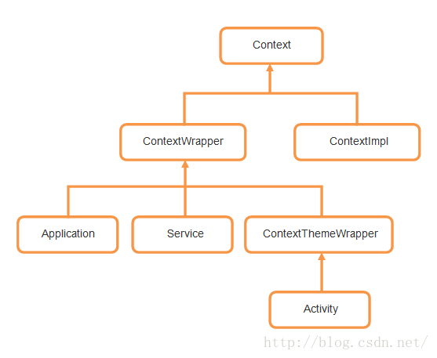

# Context

## 作用：

- 四大组件的交互，包括启动 Activity、Broadcast、Service，获取 ContentResolver 等

- 获取系统 / 应用资源，包括 AssetManager、PackageManager、Resources、SystemService 以及 color、string、drawable 等

- 文件、SharedPreference、数据库相关

- 其他辅助功能，比如设置 ComponentCallbacks，即监听配置信息改变、内存不足等事件的发生

## ContextWrapper 

* 是 Context 的包装类，ContextImpl 才是 Context 的真正实现类，ContextWrapper 的核心工作都是交给其成员变量 mBase 来完成，mBase 是通过 attachBaseContext() 方法来设置的，本质上是 ContextImpl 对象。

* ContextThemeWrapper 包含与主题相关的资源，所以 Activity 会继承它，而 Application、Service 不需要主题则没有继承它。

## LayoutInflater
当使用 LayoutInflater 从 xml 文件中 inflate 布局时，调用的是 View(Context,AttributeSet) 构造函数，使用的 Context 实例跟 LayoutInflater 创建时使用的 Context 一样，并且 LayoutInflater 会缓存在 Context 实例中，即相同的 Context 实例多次调用会获取一样的 LayoutInflater 实例。

## getApplication、getApplicationContext 
区别在绝大多数场景下，getApplication 和 getApplicationContext 这两个方法完全一致，返回值也相同。区别在于 getApplication 只存在于 Activity 和 Service 对象，对于 BroadcastReceiver 和 ContentProvider 只能使用 getApplicationContext。但是对于 ContextProvider 使用 getApplicationContext 可能会出现空指针问题。当同一个进程有多个 apk 的情况下，对于第二个 apk 是由 provide 方式拉起的，provide 创建过程并不会初始化所在 application，此时返回的结果是 null。

