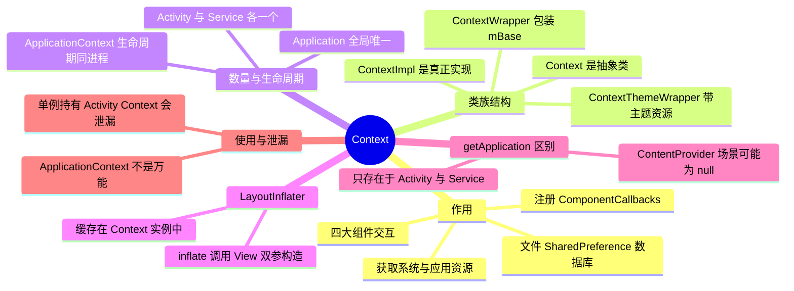
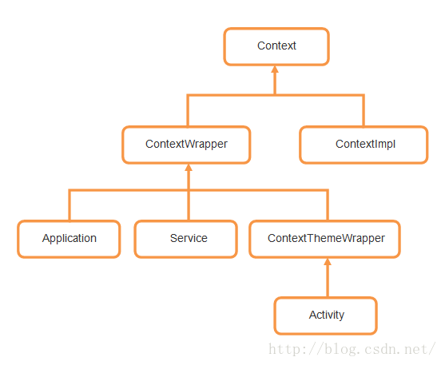

# Context

```mermaid
mindmap
  root((Context))
    作用
      四大组件交互
      获取系统与应用资源
      文件 SharedPreference 数据库
      注册 ComponentCallbacks
    类族结构
      Context 是抽象类
      ContextImpl 是真正实现
      ContextWrapper 包装 mBase
      ContextThemeWrapper 带主题资源
    数量与生命周期
      Application 全局唯一
      Activity 与 Service 各一个
      ApplicationContext 生命周期同进程
    LayoutInflater
      缓存在 Context 实例中
      inflate 调用 View 双参构造
    getApplication 区别
      只存在于 Activity 与 Service
      ContentProvider 场景可能为 null
    使用与泄漏
      单例持有 Activity Context 会泄漏
      ApplicationContext 不是万能
```

---

## 一、Context 的作用

- 四大组件的交互，包括启动 Activity、Broadcast、Service，获取 ContentResolver 等
- 获取系统 / 应用资源，包括 AssetManager、PackageManager、Resources、SystemService 以及 color、string、drawable 等
- 文件、SharedPreference、数据库相关
- 其他辅助功能，比如设置 ComponentCallbacks，即监听配置信息改变、内存不足等事件的发生

---

## 二、ContextWrapper 与类族结构

- Context 是一个**抽象类**，ContextWrapper 是 Context 的**包装类**，**ContextImpl 才是 Context 的真正实现类**。
- ContextWrapper 的核心工作都是交给其成员变量 **mBase** 来完成，mBase 是通过 `attachBaseContext()` 方法来设置的，本质上是 ContextImpl 对象。

- **ContextThemeWrapper** 包含与主题相关的资源，所以 **Activity 会继承它**，而 Application、Service 不需要主题则没有继承它。

继承关系梳理：

| 类 | 说明 |
| --- | --- |
| `Context` | 抽象类，定义全部能力接口 |
| `ContextImpl` | 真正的实现类，所有方法最终都落到它身上 |
| `ContextWrapper` | 包装类，把调用转发给 mBase（ContextImpl） |
| `ContextThemeWrapper` | 在 Wrapper 基础上增加主题资源，Activity 继承它 |
| `Application` / `Service` | 直接继承 ContextWrapper（不需要主题） |
| `Activity` | 继承 ContextThemeWrapper（需要主题） |

---

## 三、一个应用有多少个 Context？

- **Application 全局只有一个**：`getApplicationContext()` 返回的就是它，生命周期与进程一致。
- **每个 Activity、每个 Service 各有一个 Context**：在组件创建时由系统通过 `attachBaseContext()` 注入 ContextImpl。
- 所以常说的答案是：**Context 数量 = Activity 数 + Service 数 + 1（Application）**；BroadcastReceiver、ContentProvider 在回调时也会拿到 Context，但生命周期很短，一般不纳入统计。
- 生命周期差异是选用的关键：Activity 的 Context 随 Activity 销毁而失效，Application 的 Context 与进程同寿命。

---

## 四、LayoutInflater

当使用 LayoutInflater 从 xml 文件中 inflate 布局时，调用的是 `View(Context, AttributeSet)` 双参构造函数，使用的 Context 实例跟 LayoutInflater 创建时使用的 Context 一样。并且 LayoutInflater 会**缓存在 Context 实例中**，即相同的 Context 实例多次调用会获取一样的 LayoutInflater 实例。

> 实践含义：传入 Activity 的 Context，inflate 出的布局才能带上 Activity 的主题；同时这也意味着 inflate 的 View 会持有该 Context 引用，缓存不当会延长 Activity 生命周期。

---

## 五、getApplication、getApplicationContext

区别：在绝大多数场景下，`getApplication` 和 `getApplicationContext` 这两个方法完全一致，返回值也相同。区别在于：

- `getApplication` **只存在于 Activity 和 Service 对象**；对于 BroadcastReceiver 和 ContentProvider 只能使用 `getApplicationContext`。
- 但是对于 ContentProvider 使用 `getApplicationContext` 可能会出现**空指针问题**：当同一个进程有多个 apk 的情况下，对于第二个 apk 是由 provider 方式拉起的，provider 创建过程并不会初始化所在 application，此时返回的结果是 null。

---

## 六、Context 选用与内存泄漏

- **必须用 Activity Context 的场景**：弹出 Dialog、inflate 需要主题的布局、`startActivityForResult` 等依赖窗口 token 或主题的操作。（启动 Activity 用 ApplicationContext 其实也能跑，但要加 `FLAG_ACTIVITY_NEW_TASK`，从栈管理的角度一般不推荐。）
- **推荐用 ApplicationContext 的场景**：单例、静态变量、工具类、长时间存活的对象的初始化（数据库、SharedPreferences、系统服务获取），避免持有 Activity 引用造成泄漏。
- **典型泄漏**：单例 / 静态集合持有了 Activity 的 Context，Activity 销毁后对象仍被引用，无法回收；同理，非静态 Handler、耗时任务持有 Activity 也会泄漏。
- 一句话原则：**活得久的对象用 ApplicationContext，跟界面/主题/token 相关的操作用 Activity Context**。

---

## 七、30 秒口述版

Context 是应用与系统的通信入口，抽象类 Context 的真正实现是 ContextImpl，ContextWrapper 只是转发给 mBase 的包装，Activity 额外继承 ContextThemeWrapper 以获得主题资源。一个应用里 Application 只有 1 个 Context，Activity 和 Service 各有一个，因此"Context 数量 = Activity 数 + Service 数 + 1"。getApplication 只有 Activity/Service 能用，getApplicationContext 在 ContentProvider 被拉起时可能返回 null。选用原则是：活得久的用 ApplicationContext，涉及主题和窗口 token 的必须用 Activity Context，否则就会泄漏 Activity。
