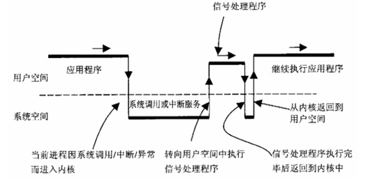

# Crash治理

## 三点原则：

- 由点到面。一个Crash发生了，我们不能只针对这个Crash的去解决，而要去考虑这一类Crash怎么去解决和预防。只有这样才能使得这一类Crash真正被解决。

- 异常不能随便吃掉。随意的使用try-catch，只会增加业务的分支和隐蔽真正的问题，要了解Crash的本质原因，根据本质原因去解决。catch的分支，更要根据业务场景去兜底，保证后续的流程正常。

- 预防胜于治理。当Crash发生的时候，损失已经造成了，我们再怎么治理也只是减少损失。尽可能的提前预防Crash的发生，可以将Crash消灭在萌芽阶段。

## Crash分类

- 常见的Crash类型包括：空节点、角标越界、类型转换异常、实体对象没有序列化、数字转换异常、Activity或Service找不到等。

    - NullPointerException

         - 对象本身没有进行初始化就进行操作。

              - 对可能为空的对象做判空处理。

              - 养成使用@NonNull和@Nullable注解的习惯。

              - 尽量不使用静态变量，万不得已使用SharedPreferences来存储。

              - Java8 的Option使用，或考虑使用Kotlin语言。

         - 对象已经初始化过，但是被回收或者手动置为null，然后对其进行操作。

              - Message、Runnable回调时，判断Activity/Fragment是否销毁或被移除；加try-catch保护；Activity/Fragment销

              - 毁时移除所有已发送的Runnable。

              - 封装LifecycleMessage/Runnable基础组件，并自定义Lint检查，提示使用封装好的基础组件。

              - 在BaseActivity、BaseFragment的onDestory()里把当前Activity所发的所有请求取消掉

    - IndexOutOfBoundsException

         - 针对ListView中造成的IndexOutOfBoundsException，经常是因为外部也持有了Adapter里数据的引用(如在Adapter的构造函数里直接赋值)，这时如果外部引用对数据更改了，但没有及时调用notifyDataSetChanged()，则有可能造成Crash，对此我们封装了一个BaseAdapter，数据统一由Adapter自己维护通知， 同时也极大的避免了 The content of the adapter has changed butListView did not receive a notification ，这两类Crash目前得到了统一的解决。

- 系统级别Crash

    - 尝试找到造成Crash的可疑代码，看是否有特异的API或者调用方式不当导致的，尝试修改代码逻辑来进行规避。

    - 通过Hook来解决，Hook分为Java Hook和Native Hook。Java Hook主要靠反射或者动态代理来更改相应API的行为，需要尝试找到可以Hook的点，一般Hook的点多为静态变量，同时需要注意Android不同版本的API，类名、方法名和成员变量名都可能不一样，所以要做好兼容工作；Native Hook原理上是用更改后方法把旧方法在内存地址上进行替换，需要考虑到Dalvik和ART的差异；相对来说Native Hook的兼容性更差一点，所以用Native Hook的时候需要配合降级策略。

    - 如果通过前两种方式都无法解决的话，我们只能尝试反编译ROM，寻找解决的办法。

- NDK crash

    - JNI中java与c方法对应

    - so库分stripped和non-stripped两种

    - NDK crash的时候会将堆栈信息dump至/data/tombstones/目录，将日志拉取出来之后，即可参考ndk-stack

- OOM

    - 常见内存泄露

         - 匿名内部类实现Handler处理消息，可能导致隐式持有的Activity对象无法回收。

         - Activity和Context对象被混淆和滥用，在许多只需要Application Context而不需要使用Activity对象的地方使用了

              - Activity对象，比如注册各类Receiver、计算屏幕密度等等。

              - View对象处理不当，使用Activity的LayoutInflater创建的View自身持有的Context对象其实就是Activity，这点经常被忽略，在自己实现View重用等场景下也会导致Activity泄漏。

         - 大对象Bitmap

              - 尽量使用成熟的图片库，比如Glide ，图片库会提供很多通用方面的保障，减少不必要的人为失误。

              - 根据实际需要，也就是View尺寸来加载图片，可以在分辨率较低的机型上尽可能少地占用内存。除了常用的BitmapFactory.Options#inSampleSize和Glide提供的BitmapRequestBuilder#override之外，我们的图片CDN服务器也支持图片的实时缩放，可以在服务端进行图片缩放处理，从而减轻客户端的内存压力。

# Crash捕获

- Java捕获，Java异常分为Checked Exception和UnChecked Exception。所有RuntimeException类及其子类的实例被称为Runtime异常，即UnChecked Exception，Java提供了一个接口给我们，可以完成这些，这就是UncaughtExceptionHandler，该接口含有一个纯虚函数：public abstract void uncaughtException (Thread thread, Throwableex)。Uncaught异常发生时会终止线程，此时，系统便会通知UncaughtExceptionHandler，告诉它被终止的线程以及对应的异常，然后便会调用uncaughtException函数。如果该handler没有被显式设置，则会调用对应线程组的默认handler。如果我们要捕获该异常，必须实现我们自己的handler

- Native崩溃分析与捕获

    - Android底层是Linux系统，所以so库崩溃时也会产生信号异常。那么如果我们能够捕获信号异常，就相当于捕获了Android Native崩溃。

    - 信号其实是一种软件层面的中断机制，当程序出现错误，比如除零、非法内存访问时，便会产生信号事件。那么进程如何获知并响应该事件呢？Linux的进程是由内核管理的，内核会接收信号，并将其放入到相应的进程信号队列里面。当进程由于系统调用、中断或异常而进入内核态以后，从内核态回到用户态之前会检测信号队列，并查找到相应的信号处理函数。内核会为进程分配默认的信号处理函数，如果你想要对某个信号进行特殊处理，则需要注册相应的信号处理函数

    - 信号异常的响应可以归结为以下几类：

         - 忽略信号：对信号不做任何处理，除了SIGKILL及SIGSTOP以外（超级用户杀掉进程时产生），其他都可以忽略；

         - 捕获信号：注册信号处理函数，当信号发生时，执行相应的处理函数；

         - 默认处理：执行内核分配的默认信号处理函数，大多数我们遇到的信号异常，默认处理是终止程序并生成core文件。

    - int sigaction(int signum,const struct sigaction *act,struct sigaction *oldact));

         - signum：代表信号编码，可以是除SIGKILL及SIGSTOP外的任何一个特定有效的信号，如果为这两个信号定义自己的处理函数，将导致信号安装错误。

         - act：指向结构体sigaction的一个实例的指针，该实例指定了对特定信号的处理，如果设置为空，进程会执行默认处理。

         - oldact：和参数act类似，只不过保存的是原来对相应信号的处理，也可设置为NULL。

    - 获取Native崩溃堆栈

         - 利用LogCat日志 Process process = Runtime.getRuntime().exec(new String[]{"logcat","-d","-v","threadtime"});String logTxt = getSysLogInfo(process.getInputStream());

         - Google Breakpad，Linux提供了Core Dump机制，即操作系统会把程序崩溃时的内存内容dump出来，写入一个叫做core的文件里面。Google Breakpad作为跨平台的崩溃转储和分析模块（支持Windows、OS X、Linux、iOS和Android等），便是通过类似的MiniDump机制来获取崩溃堆栈的。

## 治理

- AOP增强，例如抛异常的方法非常明确，调用方式比较固定。异常处理方式比较统一。和业务逻辑无关，即自动处理异常后不会影响正常的业务逻辑。典型的例子有读取Intent Extras参数、读取SharedPreferences、解析颜色字符串值和显示隐藏Window等等。

- 工程架构，对于一个边界模糊，层级混乱的架构，程序员是更加容易写出引起Crash的代码

    - 页面跳转路由统一处理页面跳转，可通过路由拦截处理所有的ActivityNotFound

    - 网络层统一处理API脏数据

    - 大图监控

         - 缩放参数的正值表达式

         - 超出view边界

- Lint检查
