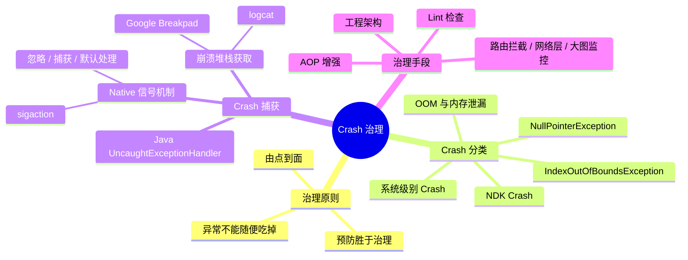
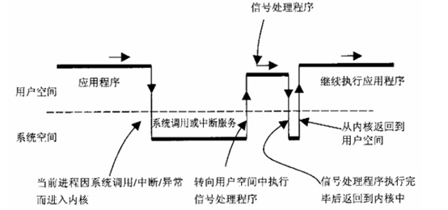

# Crash 治理


```mermaid
mindmap
  root((Crash 治理))
    治理原则
      由点到面
      异常不能随便吃掉
      预防胜于治理
    Crash 分类
      NullPointerException
      IndexOutOfBoundsException
      系统级别 Crash
      NDK Crash
      OOM 与内存泄漏
    Crash 捕获
      Java UncaughtExceptionHandler
      Native 信号机制
        sigaction
        忽略 / 捕获 / 默认处理
      崩溃堆栈获取
        logcat
        Google Breakpad
    治理手段
      AOP 增强
      工程架构
      路由拦截 / 网络层 / 大图监控
      Lint 检查
```

---

## 一、治理原则

1. **由点到面**：一个 Crash 发生了，不能只针对这一个去解决，而要考虑这一类 Crash 怎么去解决和预防。只有这样才能使这一类 Crash 真正被解决。
2. **异常不能随便吃掉**：随意使用 try-catch，只会增加业务的分支和隐蔽真正的问题，要了解 Crash 的本质原因，根据本质原因去解决。catch 的分支，更要根据业务场景去兜底，保证后续的流程正常。
3. **预防胜于治理**：Crash 发生的时候，损失已经造成了，再怎么治理也只是减少损失。尽可能提前预防 Crash 的发生，可以将 Crash 消灭在萌芽阶段。

---

## 二、Crash 分类

常见 Crash 类型包括：空指针、角标越界、类型转换异常、实体对象没有序列化、数字转换异常、Activity 或 Service 找不到等。

### 1. NullPointerException

**（1）对象本身没有初始化就进行操作**

- 对可能为空的对象做判空处理；
- 养成使用 `@NonNull` 和 `@Nullable` 注解的习惯；
- 尽量不使用静态变量，万不得已使用 SharedPreferences 来存储；
- 使用 Java 8 的 Optional，或考虑使用 Kotlin 语言。

**（2）对象已经初始化过，但被回收或手动置为 null，然后对其进行操作**

- Message、Runnable 回调时，判断 Activity/Fragment 是否销毁或被移除；加 try-catch 保护；
- Activity/Fragment 销毁时移除所有已发送的 Runnable；
- 封装 LifecycleMessage / Runnable 基础组件，并自定义 Lint 检查，提示使用封装好的基础组件；
- 在 BaseActivity、BaseFragment 的 `onDestroy()` 里把当前 Activity 所发的所有请求取消掉。

### 2. IndexOutOfBoundsException

针对 ListView 中造成的 IndexOutOfBoundsException，经常是因为外部也持有了 Adapter 里数据的引用（如在 Adapter 的构造函数里直接赋值），这时如果外部引用对数据更改了，但没有及时调用 `notifyDataSetChanged()`，则有可能造成 Crash。

对此可以封装一个 BaseAdapter，数据统一由 Adapter 自己维护通知，同时也极大地避免了 "The content of the adapter has changed but ListView did not receive a notification" 这类 Crash。

### 3. 系统级别 Crash

1. 尝试找到造成 Crash 的可疑代码，看是否有特异的 API 或者调用方式不当导致的，尝试修改代码逻辑来进行规避；
2. 通过 Hook 来解决。Hook 分为 Java Hook 和 Native Hook：
   - **Java Hook** 主要靠反射或者动态代理来更改相应 API 的行为，需要尝试找到可以 Hook 的点，一般 Hook 的点多为静态变量；同时需要注意 Android 不同版本的 API、类名、方法名和成员变量名可能不一样，要做好兼容工作；
   - **Native Hook** 原理上是用更改后的方法把旧方法在内存地址上进行替换，需要考虑 Dalvik 和 ART 的差异；相对来说 Native Hook 的兼容性更差一点，使用时要配合降级策略；
3. 如果通过前两种方式都无法解决，只能尝试反编译 ROM，寻找解决的办法。

### 4. NDK Crash

- JNI 中 Java 与 C 方法对应；
- so 库分 stripped 和 non-stripped 两种；
- NDK Crash 的时候会将堆栈信息 dump 至 `/data/tombstones/` 目录，将日志拉取出来之后，即可参考 `ndk-stack` 进行分析。

### 5. OOM 常见内存泄漏

- **匿名内部类实现 Handler 处理消息**，可能导致隐式持有的 Activity 对象无法回收；
- **Activity 和 Context 对象被混淆和滥用**：在许多只需要 Application Context 而不需要使用 Activity 对象的地方使用了 Activity 对象，比如注册各类 Receiver、计算屏幕密度等；
- **View 对象处理不当**：使用 Activity 的 LayoutInflater 创建的 View 自身持有的 Context 对象其实就是 Activity，这点经常被忽略，在自己实现 View 重用等场景下也会导致 Activity 泄漏；
- **大对象 Bitmap**：
  - 尽量使用成熟的图片库，比如 Glide，图片库会提供很多通用方面的保障，减少不必要的人为失误；
  - 根据实际需要（也就是 View 尺寸）来加载图片，可以在分辨率较低的机型上尽可能少地占用内存。除了常用的 `BitmapFactory.Options#inSampleSize` 和 Glide 提供的 `BitmapRequestBuilder#override` 之外，图片 CDN 服务器也支持图片的实时缩放，可以在服务端进行图片缩放处理，从而减轻客户端的内存压力。

---

## 三、Crash 捕获

### 1. Java 异常捕获

Java 异常分为 Checked Exception 和 UnChecked Exception。所有 RuntimeException 类及其子类的实例被称为 Runtime 异常，即 UnChecked Exception。

Java 提供了一个接口可以完成捕获，这就是 **UncaughtExceptionHandler**，该接口含有一个纯虚函数：

```java
public abstract void uncaughtException(Thread thread, Throwable ex);
```

Uncaught 异常发生时会终止线程，此时系统便会通知 UncaughtExceptionHandler，告诉它被终止的线程以及对应的异常，然后调用 uncaughtException 函数。如果该 handler 没有被显式设置，则会调用对应线程组的默认 handler。如果要捕获该异常，必须实现自己的 handler。

### 2. Native 崩溃分析与捕获

- Android 底层是 Linux 系统，所以 so 库崩溃时也会产生信号异常。如果我们能够捕获信号异常，就相当于捕获了 Android Native 崩溃。
- 信号其实是一种软件层面的中断机制，当程序出现错误，比如除零、非法内存访问时，便会产生信号事件。Linux 的进程是由内核管理的，内核会接收信号，并将其放入到相应的进程信号队列里面。当进程由于系统调用、中断或异常而进入内核态以后，从内核态回到用户态之前会检测信号队列，并查找到相应的信号处理函数。内核会为进程分配默认的信号处理函数；如果要对某个信号进行特殊处理，则需要注册相应的信号处理函数。



信号异常的响应可以归结为以下几类：

1. **忽略信号**：对信号不做任何处理，除了 SIGKILL 及 SIGSTOP 以外（超级用户杀掉进程时产生），其他都可以忽略；
2. **捕获信号**：注册信号处理函数，当信号发生时，执行相应的处理函数；
3. **默认处理**：执行内核分配的默认信号处理函数，大多数我们遇到的信号异常，默认处理是终止程序并生成 core 文件。

`int sigaction(int signum, const struct sigaction *act, struct sigaction *oldact);` 的参数：

- `signum`：代表信号编码，可以是除 SIGKILL 及 SIGSTOP 外的任何一个特定有效的信号，如果为这两个信号定义自己的处理函数，将导致信号安装错误；
- `act`：指向结构体 sigaction 的一个实例的指针，该实例指定了对特定信号的处理，如果设置为空，进程会执行默认处理；
- `oldact`：和参数 act 类似，只不过保存的是原来对相应信号的处理，也可设置为 NULL。

### 3. 获取 Native 崩溃堆栈

**（1）利用 LogCat 日志**

```java
Process process = Runtime.getRuntime().exec(new String[]{"logcat", "-d", "-v", "threadtime"});
String logTxt = getSysLogInfo(process.getInputStream());
```

**（2）Google Breakpad**：Linux 提供了 Core Dump 机制，即操作系统会把程序崩溃时的内存内容 dump 出来，写入一个叫做 core 的文件里面。Google Breakpad 作为跨平台的崩溃转储和分析模块（支持 Windows、OS X、Linux、iOS 和 Android 等），便是通过类似的 MiniDump 机制来获取崩溃堆栈的。

---

## 四、治理

### 1. AOP 增强

适用条件：抛异常的方法非常明确、调用方式比较固定、异常处理方式比较统一、和业务逻辑无关（即自动处理异常后不会影响正常的业务逻辑）。典型的例子有读取 Intent Extras 参数、读取 SharedPreferences、解析颜色字符串值和显示隐藏 Window 等等。

### 2. 工程架构

对于一个边界模糊、层级混乱的架构，程序员是更加容易写出引起 Crash 的代码：

- **页面跳转路由统一处理**：可通过路由拦截处理所有的 ActivityNotFound；
- **网络层统一处理** API 脏数据；
- **大图监控**：缩放参数的正值表达式、超出 View 边界。

### 3. Lint 检查

把上述规范沉淀成 Lint 规则，在编码/编译期就拦住问题，详见《自定义 Lint》一篇。

---

## 五、30 秒口述版

Crash 治理遵循三条原则：由点到面（解决一类而不只是一个）、异常不能随便吃掉（找到本质原因再兜底）、预防胜于治理。分类上重点盯空指针、越界、系统级 Crash、NDK Crash 和 OOM 内存泄漏。捕获手段分两条线：Java 侧实现 UncaughtExceptionHandler，Native 侧基于 Linux 信号机制注册 sigaction 处理函数、崩溃后从 `/data/tombstones/` 拿堆栈（Breakpad 走 MiniDump）。治理上靠 AOP 统一兜底、架构层面用路由和网络层收口、再用自定义 Lint 把规范强制化。
