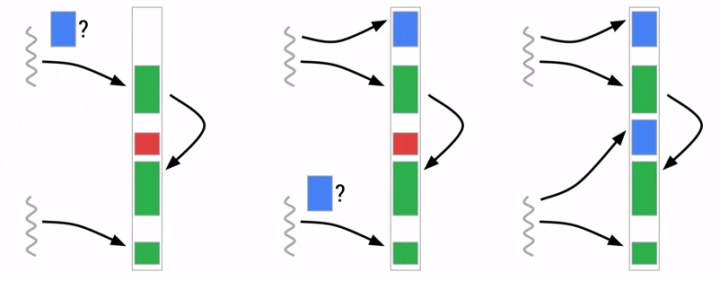
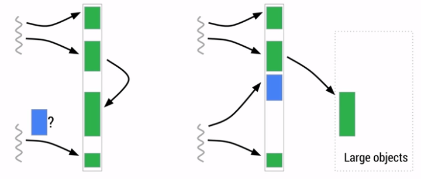

title: Dalvik,ART,HotSpot
--

# HotSpot 虚拟机,

- 从硬件视角来看呢，Java 字节码是无法直接运行的，因此 JVM 需要将字节码翻译成机器码。在 HotSpot 里面，翻译过程有两种，一种是解释执行，即逐条将字节码翻译成机器码并执行，第二种是即时编译执行，即以方法为单位整体编译为机器码后再执行。前者的优势在于无需等待编译，而后者的优势在于实际运行速度更快。HotSpot 默认采用混合模式，综合了解释执行和编译执行两者的优点。它会先解释执行字节码，而后将其中反复执行的热点代码，以方法为单位进行编译执行。

- HotSpot 内置了多个 JIT 即时编译器，C1 和 C2，之所以引入多个即时编译器，是为了在编译时间和生成代码的执行效率之间进行取舍。Java 7 引入了分层编译，分层编译将 JVM 的执行状态分为 5 个层次。第 0 层是解释执行，默认开启性能监控；第 1 层到第 3 层都是称为 C1 编译，将字节码编译成本地代码，进行简单、可靠的优化；第 4 层是 C2 编译，也是将字节码编译成本地代码，但是会启用一些编译耗时较长的优化，甚至会根据性能监控信息进行一些不可靠的激进优化。

--

# Dalvik,ART

- Dalvik 是基于寄存器结构。在官方文档上，已经没有 Dalvik 相关的信息了，Android 5 后，ART 全面取代了 Dalvik。Dalvik 使用 JIT 而 ART 使用 AOT。AOT 和 JIT 的不同之处在于，JIT 是在运行时进行编译，是动态编译，并且每次运行程序的时候都需要对 odex 重新进行编译；而 AOT 是静态编译，应用在安装的时候会启动 dex2oat 过程把 dex 预编译成 oat 文件，每次运行程序的时候不用重新编译。AOT 解决了应用启动和运行速度问题的同时也带来了另外两个问题，一个是应用安装和系统升级之后的应用安装时间比较长，二是优化后的文件会占用额外的存储空间。在 Android 7 之后，JIT 回归，形成了 AOT/JIT 混合编译模式，这种混合编译模式的特点是：应用在安装的时候 dex 不会被编译，应用在运行时 dex 文件先通过解释器执行，热点代码会被识别并被 JIT 编译后存储在 Code cache 中生成 profile 文件，再手机进入 IDLE（空闲）或者 Charging（充电）状态的时候，系统会扫描 App 目录下的 profile 文件并执行 AOT 过程进行编译。这样一说，其实是和 HotSpot 有点内味。

- Davik采取的都是标注与清理（Mark and Sweep）回收算法，也有实现了拷贝GC的，这一点和HotSpot是不一样的，具体使用什么算法是在编译期决定的，无法在运行的时候动态更换。由于Mark and Sweep算法的缺点，容易导致内存碎片，所以在这个算法下，当我们有大量不连续小内存的时候，再分配一个较大对象时，还是会非常容易导致GC

- ART运行时内部使用的Java堆的主要组成包括Image Space、Zygote Space、Allocation Space和Large Object Space四个Space，Image Space用来存在一些预加载的类， Zygote Space和Allocation Space与Dalvik虚拟机垃圾收集机制中的Zygote堆和Active堆的作用是一样的，Large Object Space就是一些离散地址的集合，用来分配一些大对象从而提高了GC的管理效率和整体性能

- GC，Art的并发GC和Dalvik的并发GC有什么区别呢，初看好像2者差不多，虽然没有一直挂起线程，但是也会有暂停线程去执行标记对象的流程。通过阅读相关文档可以了解到Art并发GC对于Dalvik来说主要有三个优势点：

    - 1、标记自身Art在对象分配时会将新分配的对象压入到Heap类的成员变量allocationstack描述的Allocation Stack中去，从而可以一定程度缩减对象遍历范围。

    - 2、预读取对于标记Allocation Stack的内存时，会预读取接下来要遍历的对象，同时再取出来该对象后又会将该对象引用的其他对象压入栈中，直至遍历完毕。

    - 3、减少Pause时间在Mark阶段是不会Block其他线程的，这个阶段会有脏数据，比如Mark发现不会使用的但是这个时候又被其他线程使用的数据，在Mark阶段也会处理一些脏数据而不是留在最后Block的时候再去处理，这样也会减少后面Block阶段对于脏数据的处理的时间。

    - 3.6 前后台GC前台Foreground指的就是应用程序在前台运行时，而后台Background就是应用程序在后台运行时。因此，Foreground GC就是应用程序在前台运行时执行的GC，而Background就是应用程序在后台运行时执行的GC。应用程序在前台运行时，响应性是最重要的，因此也要求执行的GC是高效的。相反，应用程序在后台运行时，响应性不是最重要的，这时候就适合用来解决堆的内存碎片问题。因此，Mark-Sweep GC适合作为Foreground GC，而Mark-Compact GC适合作为Background GC。由于有Compact的能力存在，碎片化在Art上可以很好的被避免，这个也是Art一个很好的能力。

    - 3.7 Art大法好总的来看，art在gc上做的比dalvik好太多了，不光是gc的效率，减少pause时间，而且还在内存分配上对大内存的有单独的分配区域，同时还能有算法在后台做内存整理，减少内存碎片。对于开发者来说art下我们基本可以避免很多类似gc导致的卡顿问题了。另外根据谷歌自己的数据来看，Art相对Dalvik内存分配的效率提高了10倍，GC的效率提高了2-3倍。

