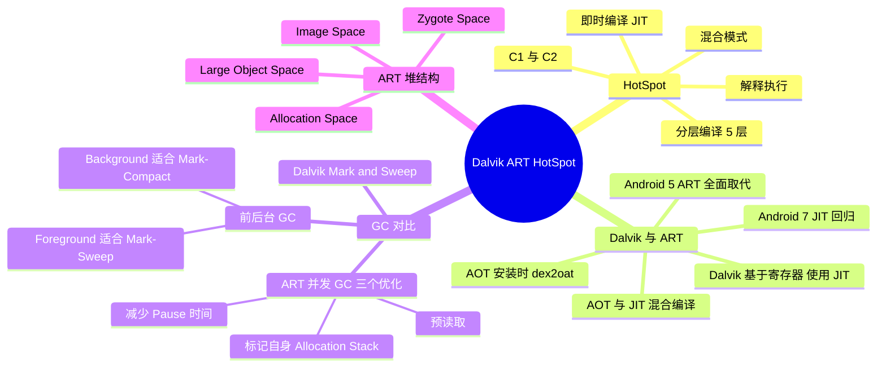
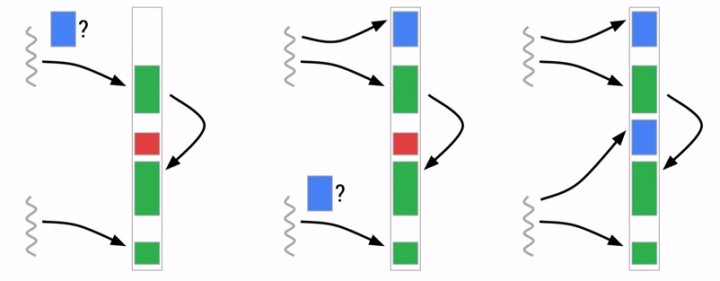
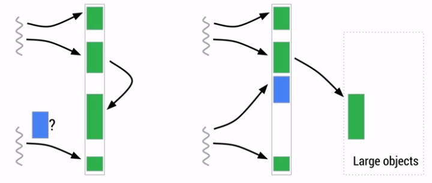

# Dalvik、ART 与 HotSpot

```mermaid
mindmap
  root((Dalvik ART HotSpot))
    HotSpot
      解释执行
      即时编译 JIT
      混合模式
      C1 与 C2
      分层编译 5 层
    Dalvik 与 ART
      Dalvik 基于寄存器 使用 JIT
      Android 5 ART 全面取代
      AOT 安装时 dex2oat
      Android 7 JIT 回归
      AOT 与 JIT 混合编译
    GC 对比
      Dalvik Mark and Sweep
      ART 并发 GC 三个优化
        标记自身 Allocation Stack
        预读取
        减少 Pause 时间
      前后台 GC
        Foreground 适合 Mark-Sweep
        Background 适合 Mark-Compact
    ART 堆结构
      Image Space
      Zygote Space
      Allocation Space
      Large Object Space
```

---

## 一、HotSpot 虚拟机

### 1. 解释执行与即时编译

从硬件视角来看，Java 字节码是无法直接运行的，因此 JVM 需要将字节码翻译成机器码。在 HotSpot 里面，翻译过程有两种：

- **解释执行**：逐条将字节码翻译成机器码并执行。优势在于**无需等待编译**。
- **即时编译执行**：以**方法**为单位整体编译为机器码后再执行。优势在于**实际运行速度更快**。

HotSpot 默认采用**混合模式**，综合了解释执行和编译执行两者的优点：它会先解释执行字节码，而后将其中**反复执行的热点代码**，以方法为单位进行编译执行。

### 2. C1、C2 与分层编译

HotSpot 内置了多个 JIT 即时编译器 **C1 和 C2**，引入多个即时编译器是为了在**编译时间**和**生成代码的执行效率**之间进行取舍。

Java 7 引入了**分层编译**，将 JVM 的执行状态分为 5 个层次：

| 层次 | 内容 |
| --- | --- |
| 第 0 层 | 解释执行，默认开启性能监控 |
| 第 1~3 层 | C1 编译，将字节码编译成本地代码，进行简单、可靠的优化 |
| 第 4 层 | C2 编译，同样编译成本地代码，但会启用编译耗时较长的优化，甚至会根据性能监控信息进行一些不可靠的激进优化 |

---

## 二、Dalvik 与 ART 的演进

- **Dalvik 是基于寄存器结构的**。在官方文档上已经没有 Dalvik 相关的信息了：**Android 5 后，ART 全面取代了 Dalvik**。
- **Dalvik 使用 JIT，而 ART 使用 AOT**。两者的不同之处在于：
  - JIT 是在**运行时**进行编译，是动态编译，并且每次运行程序的时候都需要对 odex 重新进行编译；
  - AOT 是**静态编译**，应用在**安装的时候**会启动 `dex2oat` 过程把 dex 预编译成 **oat 文件**，每次运行程序的时候不用重新编译。
- AOT 解决了应用启动和运行速度问题，同时也带来了另外两个问题：一是**应用安装和系统升级后的安装时间比较长**；二是**优化后的文件会占用额外的存储空间**。
- 在 **Android 7 之后，JIT 回归**，形成了 **AOT/JIT 混合编译模式**：
  1. 应用在安装的时候 dex 不会被编译；
  2. 应用运行时 dex 文件先通过**解释器**执行；
  3. **热点代码**会被识别并被 JIT 编译后存储在 **Code cache** 中，同时生成 **profile 文件**；
  4. 当手机进入 **IDLE（空闲）或 Charging（充电）**状态时，系统扫描 App 目录下的 profile 文件，并执行 AOT 过程进行编译。

  这样一说，其实和 HotSpot 有点内味。

---

## 三、Dalvik 与 ART 的 GC 对比

- Dalvik 采取的都是**标记与清理（Mark and Sweep）**回收算法，也有实现了**拷贝 GC** 的，这一点和 HotSpot 是不一样的。具体使用什么算法是在**编译期决定**的，无法在运行的时候动态更换。
- 由于 Mark and Sweep 算法的缺点，容易导致**内存碎片**：在这个算法下，当有大量不连续小内存的时候，再分配一个较大对象时，还是会非常容易触发 GC。

---

## 四、ART 的堆结构与并发 GC 优化

ART 运行时内部使用的 Java 堆主要由四个 Space 组成：

| Space | 作用 |
| --- | --- |
| **Image Space** | 存放一些预加载的类 |
| **Zygote Space** | 与 Dalvik 垃圾收集机制中的 Zygote 堆作用一样 |
| **Allocation Space** | 与 Dalvik 中的 Active 堆作用一样 |
| **Large Object Space** | 一些离散地址的集合，用来分配大对象，从而提高 GC 的管理效率和整体性能 |

**ART 的并发 GC 和 Dalvik 的并发 GC 有什么区别？** 初看好像两者差不多——虽然没有一直挂起线程，但也会有暂停线程去执行标记对象的流程。通过阅读相关文档可以了解到，ART 并发 GC 相对 Dalvik 主要有三个优势：

1. **标记自身**：ART 在对象分配时会将新分配的对象压入 `Heap` 类的成员变量 `allocationstack` 描述的 **Allocation Stack** 中，从而可以一定程度**缩减对象遍历范围**。
2. **预读取**：在标记 Allocation Stack 的内存时，会**预读取**接下来要遍历的对象；同时取出该对象后，又会将该对象引用的其他对象压入栈中，直至遍历完毕。
3. **减少 Pause 时间**：在 **Mark 阶段不会 Block 其他线程**。这个阶段会有脏数据——比如 Mark 认为不会使用、但这个时候又被其他线程使用的数据；ART 在 Mark 阶段也会处理一些脏数据，而不是留在最后 Block 的时候再去处理，这样也就减少了后面 Block 阶段处理脏数据的时间。

---

## 五、前后台 GC 与碎片整理

- **前台（Foreground）**指应用程序在前台运行时，**后台（Background）**指应用程序在后台运行时。因此 Foreground GC 就是应用在前台运行时执行的 GC，Background GC 就是应用在后台运行时执行的 GC。
- 应用在前台运行时**响应性最重要**，因此要求执行的 GC 是高效的；应用在后台运行时响应性不是最重要的，这时候就适合用来解决**堆的内存碎片**问题。
- 因此，**Mark-Sweep GC 适合作为 Foreground GC，而 Mark-Compact GC 适合作为 Background GC**。由于有 Compact 的能力存在，碎片化在 ART 上可以很好地被避免，这也是 ART 一个很好的能力。

总的来看，ART 在 GC 上做得比 Dalvik 好很多：不光是 GC 的效率、减少 Pause 时间，而且还在内存分配上对大内存有单独的分配区域，同时还能有算法在后台做内存整理，减少内存碎片。对于开发者来说，ART 下基本可以避免很多类似 GC 导致的卡顿问题。另外，根据谷歌自己的数据，**ART 相对 Dalvik 内存分配的效率提高了 10 倍，GC 的效率提高了 2~3 倍**。

---

## 六、30 秒口述版

HotSpot 默认"解释执行 + 即时编译"混合模式，先解释执行，再把热点方法交给 C1/C2 编译，Java 7 起用 5 层分层编译在编译时间和执行效率间折中。Android 侧，Dalvik 基于寄存器、用 JIT；Android 5 起 ART 全面取代 Dalvik，改用 AOT，安装时 `dex2oat` 把 dex 编译成 oat，代价是安装慢、占空间；Android 7 起 JIT 回归，变成"安装不编译、运行解释执行 + 热点 JIT 生成 profile、空闲或充电时再做 AOT"的混合模式，和 HotSpot 的思路很像。GC 上，Dalvik 用 Mark and Sweep、容易产生碎片；ART 增加了 Image/Zygote/Allocation/Large Object 四个 Space，并通过 Allocation Stack、预读取、Mark 阶段不阻塞等优化减少 Pause，前台用 Mark-Sweep、后台用 Mark-Compact 整理碎片，整体分配效率提升约 10 倍。
