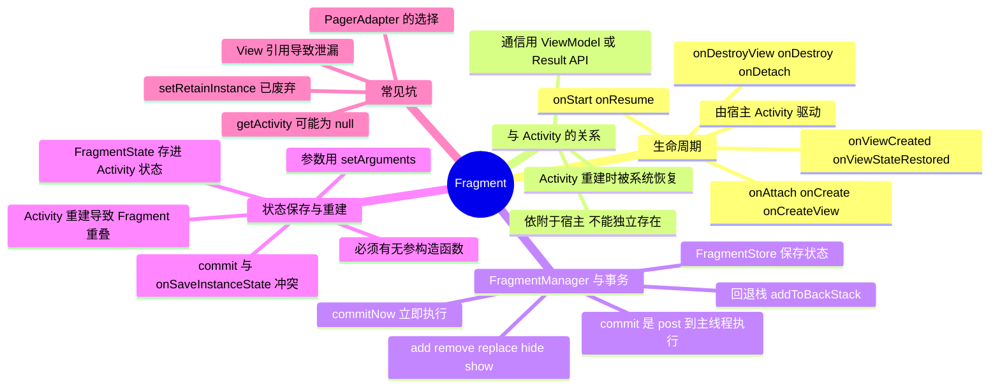

# Fragment



> Fragment 是"**寄生在 Activity 上的、带生命周期的 UI 片段**"：它自己不能独立存在，生命周期由宿主 Activity 驱动，实例的保存与恢复由 FragmentManager 统一托管——理解这一点，重叠、`getActivity()` 为 null、`IllegalStateException` 这几类经典问题就都能顺藤摸瓜。

---

## 一、生命周期

### 1. 完整回调链

```
onAttach → onCreate → onCreateView → onViewCreated → onViewStateRestored
   → onStart → onResume → onPause → onStop
      → onDestroyView → onDestroy → onDetach
```

| 回调 | 说明 |
| --- | --- |
| `onAttach(Context)` | 与宿主 Activity 建立关联，此时才能拿到 Context（`getActivity()` 从这里开始可用） |
| `onCreate(Bundle)` | 读取 `getArguments()`，做与 View 无关的初始化 |
| `onCreateView` | 创建并返回视图；**到这里才有 `getView()`** |
| `onViewCreated` | 视图已创建，做 findViewById / 绑定数据 / 观察 LiveData |
| `onViewStateRestored` | 视图状态（如 EditText 内容）已恢复完毕 |
| `onDestroyView` | 视图被销毁，`getView()` 之后不可用；**这里要把 ViewBinding 置空** |
| `onDestroy` | Fragment 实例即将销毁（不代表视图一定销毁过） |
| `onDetach` | 与 Activity 解除关联，之后 `getActivity()` 恒为 null |

> 一个容易踩的点：**Fragment 比它的 View 活得久**。加入了回退栈的 Fragment，在执行 `replace`/回退时会走 `onDestroyView`，但**不会**走 `onDestroy`——实例还在 FragmentManager 里。所以 View 相关的资源必须在 `onDestroyView` 里释放。

### 2. 与 Activity 生命周期的对照

Fragment 的生命周期完全由宿主驱动，Activity 走到哪一步，Fragment 才走到对应一步：

| Activity | Fragment |
| --- | --- |
| `onCreate` | `onAttach` → `onCreate` → `onCreateView` → `onViewCreated` → `onViewStateRestored` |
| `onStart` | `onStart` |
| `onResume` | `onResume` |
| `onPause` | `onPause` |
| `onStop` | `onStop` |
| `onDestroy` 阶段 | `onDestroyView` → `onDestroy` → `onDetach` |

- 顺序上：Fragment 的 `onResume` 在 Activity `onResume` **之后**回调，`onPause` 在 Activity `onPause` **之前**回调；
- 动态添加 Fragment 时（`commit` 是 post 执行，见第二节），Fragment 的第一个回调通常落在 Activity `onStart` 之前。

### 3. viewLifecycleOwner：为什么不能直接传 this

```kotlin
// ❌ 用 Fragment 自身作为 LifecycleOwner
viewModel.data.observe(this) { render(it) }

// ✅ 用视图的生命周期
viewModel.data.observe(viewLifecycleOwner) { render(it) }
```

Fragment 的生命周期长于视图：入回退栈后 Fragment 已 `onDestroyView`，但实例仍活着。若用 `this` 观察 LiveData，就会在**视图已经销毁后**继续回调 `render(it)`，轻则 NPE/不正确刷新，重则泄漏。`viewLifecycleOwner` 的作用域恰好是 `onCreateView → onDestroyView`，是 View 相关逻辑唯一正确的 LifecycleOwner。

---

## 二、FragmentManager 与事务原理

### 1. 角色与结构

| 概念 | 说明 |
| --- | --- |
| `FragmentActivity` | 宿主基类，内部通过 `FragmentController` 持有 `FragmentManager` |
| `FragmentManager` | 事务的管理者，维护 `FragmentStore`（所有 Fragment 与状态）、回退栈、待执行事务队列 |
| `FragmentTransaction` | 一次事务的操作集合（add/replace/hide…） |
| `BackStackRecord` | 一条回退栈记录，保存事务的正向与反向操作 |
| `getChildFragmentManager()` | Fragment 内部再嵌 Fragment 时使用，形成独立的嵌套 FragmentManager |

### 2. commit 为什么不是立即生效

```
commit()  → enqueueAction() → 通过宿主 Handler post 到主线程消息队列
                             → 下一个消息循环才执行 moveToState() 逐级回调生命周期
commitNow() → 立即同步执行（不允许 addToBackStack）
```

- 所以 `commit()` 之后立刻 `findFragmentByTag()` 是**找不到**新 Fragment 的——事务还没执行；
- `commit()` 可以在子线程调用（只是入队），但事务本身始终在主线程执行；`commitNow()` 必须在主线程调用；
- 执行时 `FragmentManager.moveToState()` 把每个 Fragment 从当前状态推进到目标状态，逐级触发回调——**这就是 Fragment 所有生命周期回调的来源**。

### 3. 四种事务操作

| 操作 | 效果 | 视图是否销毁 |
| --- | --- | --- |
| `add` | 把 Fragment 加到容器，原 Fragment 仍在（可叠加） | 否 |
| `remove` | 移除 Fragment（可再加回退栈） | 是 |
| `replace` | **等价于先 remove 容器内所有 Fragment，再 add 新的** | 是 |
| `hide` / `show` | 只改变可见性，不改变添加状态 | **否**，状态完整保留 |

- Tab 切换、`show`/`hide` 场景用 hide/show 可以避免频繁重建视图；但要注意隐藏的 Fragment 依然在生命周期中（默认仍会走到 `onResume`），需要配合 `setMaxLifecycle(Lifecycle.State.STARTED)` 把不可见的 Fragment 限制在 STARTED 状态（ViewPager2 内部就是这么做的，避免不可见页面空跑）。
- `replace` 是"销毁重建"，如果目的是切换内容且希望复用，应改用 hide/show + `setMaxLifecycle`。

### 4. 回退栈

```kotlin
supportFragmentManager.beginTransaction()
    .replace(R.id.container, DetailFragment())
    .addToBackStack("detail")     // 必须在 commit 之前
    .commit()
```

- `addToBackStack` 会把本次事务记录成 `BackStackRecord` 入栈；按返回键时执行**反向操作**（add 变 remove、replace 变回原来的 Fragment）；
- 返回键的分发由 Activity 的 `OnBackPressedDispatcher` 完成，`super.onBackPressed()` 会先把事件交给 FragmentManager 处理回退栈，栈空了才真正退出 Activity；
- Fragment 内部也可以自己注册返回逻辑：

```kotlin
requireActivity().onBackPressedDispatcher.addCallback(viewLifecycleOwner) {
    // 处理返回
}
```

- `popBackStack()` 同样是**入队异步执行**，需要立刻生效用 `popBackStackImmediate()`。

---

## 三、状态保存与重建

### 1. 保存与恢复机制

- FragmentManager 会把所有 Fragment 的状态（哪些 Fragment、参数 Bundle、视图状态、回退栈记录）序列化进 Activity 的 `onSaveInstanceState`（`FragmentManagerState` → 每个 Fragment 的 `FragmentState`）；
- Activity 重建（旋转屏幕、进程被杀后恢复）时，`super.onCreate(savedInstanceState)` 内部会 `restoreSaveState()`，**自动把上次的 Fragment 实例恢复回来**；
- 所以 Fragment 的 `onCreate/onCreateView` 里 `savedInstanceState != null` 就代表"我是被系统恢复出来的"。

### 2. 必须有无参构造函数

系统恢复 Fragment 是通过**反射调用无参构造函数**再灌入 Bundle 参数：

```kotlin
// ❌ 带参构造：恢复时抛 InstantiationException: could not find Fragment constructor
class DetailFragment(val id: String) : Fragment()

// ✅ 无参构造 + arguments
class DetailFragment : Fragment() {
    companion object {
        fun newInstance(id: String) = DetailFragment().apply {
            arguments = bundleOf(ARG_ID to id)
        }
    }
}
```

原因：**Fragment 的重建过程完全由系统接管，它只会 `new` 一个无参实例**，构造参数不会被保存。所以任何需要传入的数据都必须走 `setArguments()`，它会被写入 `FragmentState` 一并保存与恢复。

### 3. 重叠（Fragment 叠加）问题

现象：旋转屏幕或应用被系统回收后重建，界面出现两个 Fragment 叠在一起。

根因：**系统的自动恢复 + 代码的手动添加，各来了一份。**

```
Activity 重建 → super.onCreate() 恢复上次的 Fragment A
             → 代码在 onCreate 中又 replace/add 了 Fragment A'
             → 两者叠加
```

解决：

```kotlin
override fun onCreate(savedInstanceState: Bundle?) {
    super.onCreate(savedInstanceState)
    if (savedInstanceState == null) {          // 只处理首次创建
        supportFragmentManager.beginTransaction()
            .replace(R.id.container, HomeFragment())
            .commit()
    }
}
```

其他手段：用 tag 查找（`findFragmentByTag`）判断是否已存在、用 `FragmentContainerView` + Navigation 组件统一管理。

### 4. commit 与 onSaveInstanceState 的冲突

```java
IllegalStateException: Can not perform this action after onSaveInstanceState
```

- 触发场景：Activity 已经走过 `onSaveInstanceState`（如已进入后台），此时在异步回调（网络请求、Handler、订阅）里执行 `commit()`；
- 原因：状态已经保存，此时再改 Fragment 状态，会与保存的内容不一致，恢复时就对不上；
- 处理：
  - 正确做法是**用生命周期守卫**（`viewLifecycleOwner`/`repeatOnLifecycle`）让回调只在活跃时执行；
  - `commitAllowingStateLoss()` 只是"不抛异常"，**状态会被丢弃**（重建后这次提交的 Fragment 不再被恢复），只在明确无所谓时使用（如上报、纯展示）；
  - `commitNowAllowingStateLoss()` 同理，立即执行且允许丢状态。

---

## 四、Fragment 之间的通信

| 方式 | 说明 | 适用 |
| --- | --- | --- |
| 接口回调 | Fragment 定义接口，宿主 Activity 实现 | 传统做法，Fragment 与 Activity 强耦合 |
| **ViewModel** | `activityViewModels()` 让多个 Fragment 共享宿主作用域的 ViewModel | **官方推荐**，数据驱动、无耦合 |
| **Fragment Result API** | `setFragmentResult` / `setFragmentResultListener`，基于 FragmentManager 传递结果 | 一次性结果回传（如选择器返回） |
| `findFragmentById/ByTag` | 直接拿到实例调用方法 | 简单场景，容易耦合 |
| `getParentFragment` / `setTargetFragment` | 子父 Fragment 通信 | `setTargetFragment` 已废弃，改用 Result API |

```kotlin
// 发送方
setFragmentResult("request_key", bundleOf("text" to "hello"))

// 接收方：必须在 Fragment 达到 STARTED 之前注册（通常放 onCreate/onStart）
setFragmentResultListener("request_key") { key, bundle ->
    val text = bundle.getString("text")
}

// 跨 Fragment 共享数据
private val sharedViewModel: SharedViewModel by activityViewModels()
```

---

## 五、常见坑

### 1. getActivity() 返回 null

- Fragment 尚未 `onAttach` 或已经 `onDetach` 时，`getActivity()` 返回 null；
- 典型翻车场景：网络回调、Handler、RxJava 订阅在 Fragment 销毁后才回来，此时 `getActivity()` 为 null 直接崩溃；
- `requireActivity()` / `requireContext()` / `requireView()` 会在空时直接抛异常，**问题暴露得更早**，是更推荐的选择；同时异步回调一定要用 `viewLifecycleOwner` 做守卫。

### 2. 内存泄漏

| 场景 | 原因 | 处理 |
| --- | --- | --- |
| ViewBinding / View 引用 | Fragment 入回退栈后视图已销毁，实例仍持有 View | `onDestroyView()` 中把 binding 置空 |
| 匿名内部类 / Handler / 静态变量持有 Fragment | 生命周期长的对象持有短命 Fragment | 用静态类 + 弱引用，或改用生命周期感知组件 |
| 未反注册的监听器 | 广播、ContentObserver、EventBus 等 | 在对应生命周期成对反注册 |
| 用 `this` 观察 LiveData | 观察者比视图活得久 | 改用 `viewLifecycleOwner` |

### 3. setRetainInstance 已废弃

旧方案 `setRetainInstance(true)` 让 Fragment 实例在配置变更时被保留（跳过 `onDestroy`/`onCreate`，只重走 `onCreateView`），用来缓存耗时数据。它已被 AndroidX 标记废弃，官方替代方案是 **ViewModel**——同样能在配置变更中存活，而且与视图生命周期解耦，语义更清晰。两者不要混用。

### 4. PagerAdapter 的选择

| 类 | 行为 | 适用 |
| --- | --- | --- |
| `FragmentPagerAdapter` | 创建过的 Fragment **一直留在 FragmentManager** 中（detach 而非销毁） | 少量固定页面 |
| `FragmentStatePagerAdapter` | 划走的 Fragment 会被**销毁**，只保留状态 | 大量页面、内存敏感 |
| `FragmentStateAdapter`（ViewPager2） | 基于 RecyclerView，按需创建销毁 | 现在的新代码 |

### 5. 用 FragmentContainerView 替代 fragment 标签

`<fragment>` 标签在 `onCreateView` 中使用时存在动画不支持、状态恢复异常等问题；官方现在推荐用 `FragmentContainerView` 作为容器，它同时支持 `android:name` 直接声明 Fragment，并且正确处理恢复流程（Navigation 组件也依赖它）。

---

## 六、面试高频问答

### 1. Fragment 的生命周期？和 Activity 的关系？

`onAttach → onCreate → onCreateView → onViewCreated → onViewStateRestored → onStart → onResume → onPause → onStop → onDestroyView → onDestroy → onDetach`。Fragment 由宿主 Activity 驱动：Fragment 的 `onResume` 在 Activity 之后、`onPause` 在 Activity 之前，销毁阶段 Fragment 的 `onDestroyView/onDestroy/onDetach` 都在 Activity 的 `onDestroy` 阶段完成。

### 2. add、replace、hide/show 有什么区别？

`add` 叠加添加；`replace` 等价于"remove 容器内已有 Fragment + add 新的"，会销毁视图与实例；`hide/show` 只改可见性、视图与状态全程保留。切换内容又想复用，用 `hide/show` + `setMaxLifecycle(STARTED)`；否则用 `replace`。

### 3. commit 与 commitNow、commitAllowingStateLoss 的区别？

- `commit()`：入队，由主线程 Handler 在下一个消息循环执行，可在子线程调用；
- `commitNow()`：立即同步执行，不能与 `addToBackStack` 一起用；
- `commitAllowingStateLoss()`：在 `onSaveInstanceState` 之后也能执行，但**会丢失状态**（重建后不恢复）；
- 因为 `commit` 是异步执行的，`commit` 之后立刻查找新 Fragment 会失败，这是"commit 不生效"类问题的根因。

### 4. Fragment 之间怎么通信？

推荐 **ViewModel（activityViewModels 共享宿主作用域）** 与 **Fragment Result API**；传统的接口回调和 `findFragmentByTag` 也能用但耦合重；`setTargetFragment` 已废弃。

### 5. 为什么会出现 Fragment 重叠？怎么解决？

Activity 重建时 FragmentManager 会自动恢复上一次的 Fragment，而代码又在 `onCreate` 中无条件 add/replace 了一次，两份叠加。解决：`if (savedInstanceState == null)` 判断后再提交事务，或用 tag 查找去重，或用 `FragmentContainerView` + Navigation。

### 6. Fragment 为什么必须有无参构造函数？

系统重建 Fragment 时是通过反射调用**无参构造**创建实例的，构造参数不会被保存；所有需要传入的数据必须放在 `setArguments(Bundle)` 里，才能随 `FragmentState` 一起被保存和恢复。带参构造会在恢复时抛 `InstantiationException`。

### 7. 什么时候会抛 "Can not perform this action after onSaveInstanceState"？

Activity 已经保存过状态（通常已进入后台）之后又执行了 `commit()`。根因是此时再改动 Fragment 状态会与已保存的状态不一致。建议用生命周期守卫让回调只在活跃状态执行；`commitAllowingStateLoss()` 只是压制异常，状态仍会丢失。

### 8. getActivity() 为什么可能为 null？

Fragment 未 attach 或已 detach；异步回调（网络、Handler、Rx）返回时 Fragment 很可能已经销毁。应该用 `requireActivity()` 提前暴露问题，并用 `viewLifecycleOwner` 把回调限制在视图存活期内。

### 9. viewLifecycleOwner 和 this 有什么区别？为什么观察 LiveData 必须用它？

Fragment 的生命周期比视图长（入回退栈时 `onDestroyView` 已回调但实例还在），用 `this` 观察会让回调在视图销毁后继续执行，导致 NPE 或泄漏；`viewLifecycleOwner` 的作用域正好是 `onCreateView → onDestroyView`，这才是 View 相关逻辑的正确生命周期。

### 10. setRetainInstance 为什么废弃？

它让 Fragment 实例跨配置变更保留，但绕过生命周期、语义隐晦（跳过 `onDestroy`/`onCreate`），容易与视图生命周期混淆。官方替代是 ViewModel——同样在配置变更中存活，且与视图解耦、可测试。

### 11. FragmentPagerAdapter 和 FragmentStatePagerAdapter 的区别？

前者把创建过的 Fragment 一直留在 FragmentManager（只 detach 不销毁），适合少量页面；后者会销毁滑走的 Fragment，只保留其状态，适合大量页面。ViewPager2 统一用 `FragmentStateAdapter`。

### 12. 一句话总结

Fragment = **由 FragmentManager 托管、寄生在 Activity 生命周期上的可复用 UI 单元**：生命周期随宿主逐级推进、状态由系统的自动保存恢复机制接管、事务通过 Handler 异步执行——把它当成"有生命周期的 View"而不是"自定义 View"，很多坑就都有了答案。
