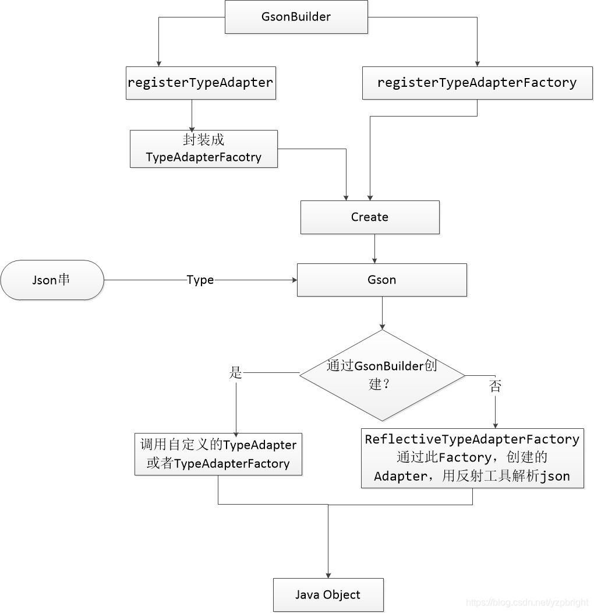
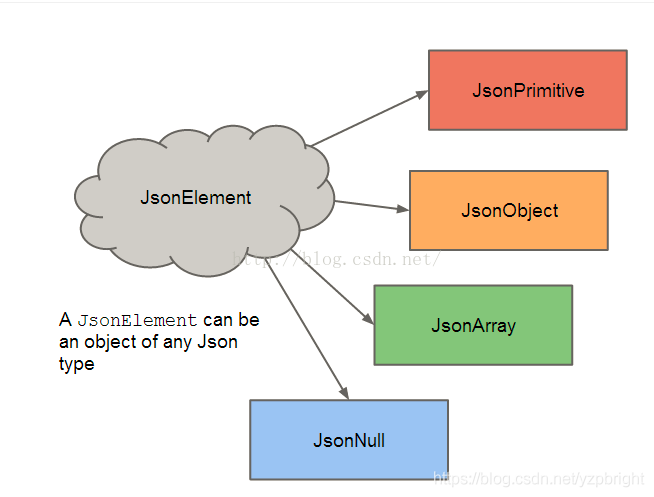
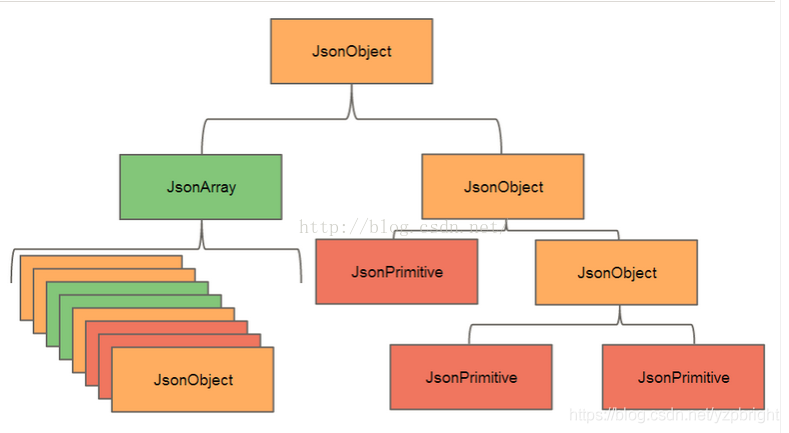

# Gson
Gson对json的解析的简单原理雏形

	public class GsonReflect {
	
	    public static class Person {
	        public String name;
	        public String sex;
	
	        public Person() {
	        }
	
	        public Person(String name, String sex) {
	            this.name = name;
	            this.sex = sex;
	        }
	
	        @Override
	        public String toString() {
	            return "Person{" +
	                    "name='" + name + '\'' +
	                    ", sex='" + sex + '\'' +
	                    '}';
	        }
	    }
	
	
	    public static void main(String[] args) throws NoSuchMethodException, IllegalAccessException, InvocationTargetException, InstantiationException {
	
	        //1.反射获取构造器，根据构造器创建Person对象
	        Constructor<?> c = Person.class.getDeclaredConstructor();
	        Person person = (Person) c.newInstance();
	        System.out.println("person=" + person);
	
	        //2.获取Person中的所有属性，为属性赋值
	        Field[] fields = Person.class.getDeclaredFields();
	        for (Field field : fields) {
	            field.setAccessible(true);
	            //获取属性名称
	            String fieldName = field.getName();
	            if(fieldName.equals("name")) {
	                field.set(person, "孙悟空");
	            } else if(fieldName.equals("sex")) {
	                field.set(person, "男");
	            }
	        }
	        System.out.println("person=" + person);
	    }
	
	}

具体代码ConstructorConstructor.java,ReflectiveTypeAdapterFactory.java

	public <T> ObjectConstructor<T> get(TypeToken<T> typeToken) {
	        final Type type = typeToken.getType();
	        final Class<? super T> rawType = typeToken.getRawType();
	
			//先通过type去获取InstanceCreator，如果获取到InstanceCreator，则通过它来创建构造器对象
	        // first try an instance creator
	
	        @SuppressWarnings("unchecked") // types must agree
	        final InstanceCreator<T> typeCreator = (InstanceCreator<T>) instanceCreators.get(type);
	        if (typeCreator != null) {
	            return new ObjectConstructor<T>() {
	                @Override public T construct() {
	                    return typeCreator.createInstance(type);
	                }
	            };
	        }
				
			//再通过rawType去获取InstanceCreator，如果获取到InstanceCreator，则通过它来创建构造器对象
	        // Next try raw type match for instance creators
	        @SuppressWarnings("unchecked") // types must agree
	        final InstanceCreator<T> rawTypeCreator =
	                (InstanceCreator<T>) instanceCreators.get(rawType);
	        if (rawTypeCreator != null) {
	            return new ObjectConstructor<T>() {
	                @Override public T construct() {
	                    return rawTypeCreator.createInstance(type);
	                }
	            };
	        }
			
			//如果是普通类,将使用newDefaultConstructor方法创建一个默认的构造器对象
	        ObjectConstructor<T> defaultConstructor = newDefaultConstructor(rawType);
	        if (defaultConstructor != null) {
	            return defaultConstructor;
	        }
	
			//如果是接口类，将通过newDefaultImplementationConstructor方法创建一个默认的构造器对象
	        ObjectConstructor<T> defaultImplementation = newDefaultImplementationConstructor(type, rawType);
	        if (defaultImplementation != null) {
	            return defaultImplementation;
	        }
	
			//如果自定义的java类中没有默认构造器，那么最终会调用newUnsafeAllocator方法来为你创建对应的Java对象
	        // finally try unsafe
	        return newUnsafeAllocator(type, rawType);
	    }
	
	
	  private <T> ObjectConstructor<T> newDefaultConstructor(Class<? super T> rawType) {
	    try {
	     //此方法返回具有指定参数列表的构造函数对象,在这里没有传参数，即获取默认的构造器
	      final Constructor<? super T> constructor = rawType.getDeclaredConstructor();
	      if (!constructor.isAccessible()) {
	        accessor.makeAccessible(constructor);
	      }
	      return new ObjectConstructor<T>() {
	        @SuppressWarnings("unchecked") // T is the same raw type as is requested
	        @Override public T construct() {
	          try {
	            Object[] args = null;
	            return (T) constructor.newInstance(args);  //创建Java对象，并返回
	          } catch (InstantiationException e) {
	            // TODO: JsonParseException ?
	            throw new RuntimeException("Failed to invoke " + constructor + " with no args", e);
	          } catch (InvocationTargetException e) {
	            // TODO: don't wrap if cause is unchecked!
	            // TODO: JsonParseException ?
	            throw new RuntimeException("Failed to invoke " + constructor + " with no args",
	                e.getTargetException());
	          } catch (IllegalAccessException e) {
	            throw new AssertionError(e);
	          }
	        }
	      };
	    } catch (NoSuchMethodException e) {
	      return null;
	    }
	}

ReflectiveTypeAdapterFactory.java

        public static final class Adapter<T> extends TypeAdapter<T> {
            private final ObjectConstructor<T> constructor;
            private final Map<String, BoundField> boundFields;

            Adapter(ObjectConstructor<T> constructor, Map<String, BoundField> boundFields) {
                this.constructor = constructor;
                this.boundFields = boundFields;
            }

            @Override
            public T read(JsonReader in) throws IOException {
                if (in.peek() == JsonToken.NULL) {
                    in.nextNull();
                    return null;
                }

                T instance = constructor.construct();  //创建一个java对象

                try {
                    in.beginObject(); //开始读取一个JsonObject
                    while (in.hasNext()) {
                        String name = in.nextName();//获取name
                        //根据name获取对应的BoundField
                        BoundField field = boundFields.get(name);
                        if (field == null || !field.deserialized) {
                            in.skipValue();
                        } else {
                        	//调用BoundField的read方法读取value
                            field.read(in, instance);
                        }
                    }
                } catch (IllegalStateException e) {
                    throw new JsonSyntaxException(e);
                } catch (IllegalAccessException e) {
                    throw new AssertionError(e);
                }
                in.endObject();
                return instance;
            }

            @Override
            public void write(JsonWriter out, T value) throws IOException {
                if (value == null) {
                    out.nullValue();
                    return;
                }

                out.beginObject();
                try {
                    for (BoundField boundField : boundFields.values()) {
                        if (boundField.writeField(value)) {
                            out.name(boundField.name);
                            boundField.write(out, value);
                        }
                    }
                } catch (IllegalAccessException e) {
                    throw new AssertionError(e);
                }
                out.endObject();
            }
        }

## 整体流程

对json字段，对象的封装，jsonElement,jsObject等就是预期的对象和数组，基本类型等

### TypeToken

Java的泛型在运行时会有类型擦除，Gson解析将得不到预期的类型，TypeToken就是解决这个问题的。解决方案就是：匿名类+反射。

	
	  /**
	   * Constructs a new type literal. Derives represented class from type
	   * parameter.
	   *
	   * 
Clients create an empty anonymous subclass. Doing so embeds the type
	   * parameter in the anonymous class's type hierarchy so we can reconstitute it
	   * at runtime despite erasure.
	   */
	  @SuppressWarnings("unchecked")
	  protected TypeToken() {
	    this.type = getSuperclassTypeParameter(getClass());
	    this.rawType = (Class<? super T>) $Gson$Types.getRawType(type);
	    this.hashCode = type.hashCode();
	  }
	
	  /**
	   * Returns the type from super class's type parameter in {@link $Gson$Types#canonicalize
	   * canonical form}.
	   */
	  static Type getSuperclassTypeParameter(Class<?> subclass) {
	    Type superclass = subclass.getGenericSuperclass();
	    if (superclass instanceof Class) {
	      throw new RuntimeException("Missing type parameter.");
	    }
	    ParameterizedType parameterized = (ParameterizedType) superclass;
	    return $Gson$Types.canonicalize(parameterized.getActualTypeArguments()[0]);
	  }

其原理就是用一个继承TypeToken的匿名类，从而获取该匿名类的泛型超类，然后将该泛型超类强制转换为ParameterizedType。ParameterizedType包含了获取其实际类型参数的方法getActualTypeArguments()及获取其原始类型的方法getRawType()。

	public class TypeTokenTest {
	
	    //待解析的json字符串： {"data":"data from server"}
	    public class Response<T>{
	        public T data;//简化数据, 省略了其他字段
	
	        @Override
	        public String toString() {
	            return "Response{" +
	                    "data=" + data +
	                    '}';
	        }
	    }
	
	    private Response<String> data;
	
	    public static void main(String[] args) {
	        String json = "{\"data\":\"data from server\"}";
	
	        //fromJson(String json, Class<T> classOfT)的第二个参数classOfT期望获取Response<String>这种类型
	        //Class responseClass = Response<String>.class; /但是这么写不能通过编译，因为Response<String>不是一个Class类型
	        Class responseClass = Response.class; //只能这样获取类型, 但无法知道Response里面数据的类型
	
	        Response<String> result = (Response<String>) new Gson().fromJson(json, responseClass);
	        System.out.println("result=" + result);
	
	        //Gson的解决方案
	        Type type = new TypeToken<Response<String>>(){}.getType();
	        System.out.println("type=" + type);//TypeTokenTest$Response<java.lang.String>
	        result = new Gson().fromJson(json, type);
	        System.out.println("result=" + result);
	
	    }
	}

new TypeToken<Response<String>>(){} 实例化过程可以分解如下:

	
	class TypeToken$0 extends TypeToken<Response<String>>{
	}

	TypeToken typeToken = new TypeToken$0();

TypeToken$0是TypeToken<Response<String>>的匿名子类。所以typeToken是TypeToken$0类型的，父类型是TypeToken<Response<String>>，而不是TypeToken<T>

所以上述getSuperclassTypeParameter()方法中

	Type superclass = subclass.getGenericSuperclass();

得到的superclass 是TypeToken<Response<String>>，而不是TypeToken<T>。继续调用parameterized.getActualTypeArguments()[0] 得到的是Response<String>，这正是我们预期的类型。