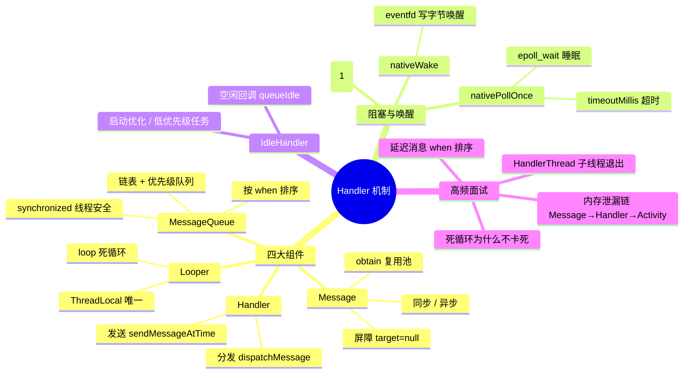

# Handler 机制

思维导图（Typora / GitHub 可直接渲染）：

---

## 一、整体概览

Android 应用是消息驱动运行的，触摸事件、视图的绘制/显示/刷新等都是消息。Handler 是消息机制的上层接口，平时开发只接触 Handler 和 Message，内部还有 MessageQueue 和 Looper 两大助手共同实现消息循环。

整个机制由四部分组成：**Handler、Message、MessageQueue、Looper**，核心一句话：

**Looper 无限循环从 MessageQueue 取消息，Handler 发送/处理消息，Message 承载任务，MessageQueue 是优先级队列。**

---

## 二、Handler —— 上层接口

### 1. 发送消息

- `sendMessage`、`sendMessageDelayed`、`post`、`postDelayed` 最终都调用 `sendMessageAtTime`
- 时间基准是 `SystemClock.uptimeMillis()`（系统开机到现在的时间，不含深度睡眠）
- `post` 会把 Runnable 包装成 Message（存入 `Message.callback`）
- 延迟消息：`when = uptimeMillis() + delayMillis`，入队后按 when 排序，到点才被取出执行

### 2. 处理消息 dispatchMessage

分发优先级从高到低：

1. `msg.callback != null` → 直接执行 Runnable（post 进来的）
2. 构造 Handler 时传入的 `mCallback.handleMessage(msg)` 返回 true → 结束
3. 否则走 `handleMessage(msg)`

---

## 三、Message —— 消息载体

### 1. 创建与复用

- 用 `Message.obtain()` 取：从复用池（sPool 链表，上限 50 个）取出，避免频繁 GC
- 用完后 `recycleUnchecked()` 从链表头把 Message 插回复用池

### 2. 同步消息 / 异步消息 / 屏障

- **同步消息**：默认发送的都是同步消息，按 when 顺序排队执行
- **异步消息**：通过构造函数 `Handler(boolean async)` 或调用 `Message.setAsynchronous(true)` 标记；异步消息不受屏障拦截
- **屏障 Barrier**：一种特殊的 Message，`target` 为 null（只有屏障的 target 可以为 null，手动设置会抛异常），`arg1` 用作屏障标识符区分不同屏障。作用是拦截队列中的同步消息、放行异步消息——像交警，道路拥挤时决定哪些车先通过，这些车就是异步消息

---

## 四、MessageQueue —— 存储与调度

### 1. 存储结构

1. 本质是**单向链表 + 优先级队列**（不是数组、不是容器队列）
2. 内部用 `Message mMessages` 作为链表头
3. 插入时按 **when（执行时间）从小到大排序**
4. 读取时只取表头，保证**最先到时间的消息优先执行**

**P7 加分点**：链表插入删除效率高；按执行时间排序而不是先进先出，所以叫"消息队列"但不是普通 FIFO。

### 2. enqueueMessage 插入逻辑

头节点为空、当前 Message 需要立即执行、或相对执行时间比头节点早 → 插入头节点；否则按 when 向后找到合适位置插入。

### 3. next() 取消息

- `msg.target == null` 说明遇到同步屏障，一直等待到屏障被移除；有屏障时通过 do..while 循环优先查找队列中的异步消息，找到后返回
- 没有可执行消息时回调 IdleHandler，然后计算 `nextPollTimeoutMillis` 进入 nativePollOnce 阻塞

### 4. postSyncBarrier / removeSyncBarrier

`postSyncBarrier()` 就是创建一个 target 为 null 的 Message 插入队列。最经典的使用是 ViewRootImpl 的 `scheduleTraversals`（视图更新）：添加屏障 → 发送异步消息（Choreographer 的 vsync 回调），执行完 `doTraversal` 后才移除屏障，保证界面刷新优先于普通同步消息执行。

### 5. 线程安全

所有关键方法（enqueueMessage / next / removeMessages）都加了 `synchronized`。

---

## 五、Looper —— 循环驱动器

- `Looper.myLooper()` 通过 ThreadLocal 保存当前线程的 Looper 对象，保证**一个线程只有一个 Looper**
- `loop()` 死循环：从 MessageQueue 取消息 → 交给 `msg.target`（Handler）分发
- 子线程默认没有 Looper，需要先 `Looper.prepare()`（或用 HandlerThread，见第八节第 8 问）

---

## 六、nativePollOnce 阻塞与唤醒原理（核心难点）

### 1. 调用链

Looper.loop() → MessageQueue.next() → **nativePollOnce(mPtr, timeoutMillis)**，这是一个 native 层阻塞方法。

### 2. 阻塞逻辑

- `nativePollOnce` 底层是 Linux 的 **epoll** 机制
- 参数 `timeoutMillis`：
  - 有消息待执行 → 传入**时差**，到点超时唤醒
  - 无消息 → 传入 `-1`，**无限阻塞**
- 阻塞时主线程**释放 CPU 时间片**，不耗电——这就是"死循环不卡死"的原因

### 3. Native 层结构

- `nativeInit` 关联 Native 层的 MessageQueue，并在其中创建 Native 层 Looper
- `mWakeEventFd = eventfd(0, EFD_NONBLOCK | EFD_CLOEXEC)` 创建唤醒事件 fd
- `epoll_ctl(mEpollFd, EPOLL_CTL_ADD, mWakeEventFd, &eventItem)` 把唤醒 fd 注册进 epoll
- `epoll_wait` 睡眠等待，等待时间由最后一个参数 `timeoutMillis` 指定

### 4. 唤醒时机

1. `enqueueMessage` 插入消息时调用 `nativeWake`
2. `write(mWakeEventFd, &inc, sizeof(uint64_t))` 向唤醒 fd 写入一个字节
3. epoll 检测到 IO 事件，在 C++ 层 Looper 的 `pollInner` 中被唤醒
4. 沿调用路径一路返回到 Java 层 `Looper.loop()`，继续取消息处理

### 一句话总结

**nativePollOnce 依靠 Linux epoll 实现阻塞，nativeWake 靠 eventfd 写事件唤醒。**

---

## 七、IdleHandler 原理与使用场景

### 1. 原理

- 接口：`MessageQueue.IdleHandler`
- 回调时机：**MessageQueue 无消息可执行、即将进入阻塞前**
- 方法 `queueIdle()`：
  - 返回 `true`：每次空闲都调用
  - 返回 `false`：只执行一次就移除

### 2. 使用场景

1. **启动优化**：延迟初始化 SDK、三方库
2. **轻量垃圾回收**
3. **页面绘制完成后执行任务**
4. **低优先级任务**：埋点上报、缓存预加载
5. 检测 ANR 前的空闲监控

### 3. 注意点

- 不能做耗时操作，否则会阻塞下一条消息
- 不能频繁返回 true，否则队列无法休眠，耗电

---

## 八、面试高频追问

### 1. 为什么主线程 Looper.loop() 死循环不会卡死？

没有消息时会在 `nativePollOnce` 阻塞，**不占 CPU**。所谓 ANR 不是 loop 卡死，是**消息处理超时**。

### 2. MessageQueue 如何保证线程安全？

所有关键方法都加了 `synchronized` 锁。

### 3. 一个线程可以有几个 Looper？

只能有一个，用 ThreadLocal 保证唯一（prepare 时发现已存在会抛异常）。

### 4. IdleHandler 会影响消息执行吗？

不会，它只在**空闲时**执行，不抢占正常消息。

### 5. Handler 内存泄漏，最终谁持有的 Activity？

泄漏链：**Activity → Handler（非静态内部类隐式持有外部类）← Message.target ← MessageQueue**。

最终是 **MessageQueue 中的延时 Message 持有 Activity**：延时消息没执行完，target 指向 Handler，Handler 隐式持有 Activity，导致 Activity 无法回收。

修复：静态内部类 + WeakReference 持有 Activity，`onDestroy` 中调用 `removeCallbacksAndMessages(null)` 清空消息。

### 6. Handler 如何处理发送延迟消息？

`sendMessageDelayed` → `sendMessageAtTime`：`when = uptimeMillis() + delayMillis` → 按 when 排序入队 → `next()` 计算 `timeoutMillis = when - now` → `nativePollOnce(timeoutMillis)` 定时阻塞 → 超时唤醒执行。

### 7. Message 应该如何创建？

用 `Message.obtain()` 从消息池复用（sPool 链表，上限 50 个），避免直接 `new Message()` 造成频繁 GC。

### 8. 子线程中维护的 Looper，消息队列无消息时的处理方案是什么？

用 **HandlerThread**：内部封装了 `Looper.prepare()` + `loop()`。无消息时 `next()` 会 `nativePollOnce(-1)` 阻塞等待，不占 CPU。但注意：任务处理完后必须调用 `quit()` / `quitSafely()` 退出循环，否则线程永远阻塞、无法回收。

---

## 九、扩展：I/O 多路复用与管道

### 1. I/O 多路复用的三种形式

- **select**：知道有 I/O 事件发生，但不知道是哪个流（可能一个、多个甚至全部），只能无差别轮询所有流，O(n) 复杂度；流越多轮询越慢
- **poll**：本质上和 select 没有区别，把用户传入的数组拷贝到内核空间查询每个 fd 的设备状态；但没有最大连接数限制（基于链表存储）
- **epoll**（Linux 内核特有）：可以理解为 event poll，事件驱动——epoll 会直接通知哪个流发生了什么 I/O 事件（每个事件关联 fd），操作都是有意义的，复杂度降到 **O(1)**。epoll 最大的优点在于只管"活跃"的连接，与连接总数无关，实际网络环境中效率远高于 select 和 poll

### 2. 管道

Linux IPC 之一。nativeWake 的唤醒就是通过 eventfd（类似管道的文件描述符）写入数据实现的。

---

## 十、最终 30 秒口述高分版

Handler 机制基于 Looper 循环、MessageQueue 链表结构的优先级队列。没有消息时，通过 nativePollOnce 底层 epoll 阻塞主线程以节省资源，插入消息时通过 nativeWake 唤醒。IdleHandler 则是在队列空闲即将阻塞时回调，适合做启动优化、延迟初始化等低优先级任务。
