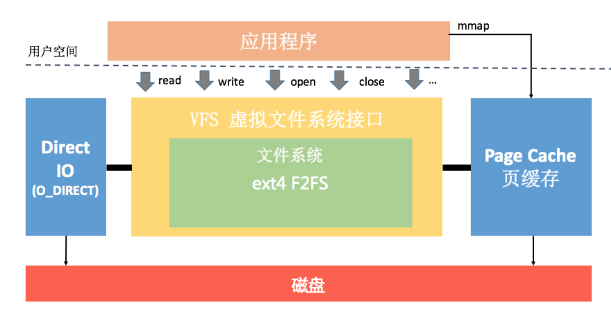
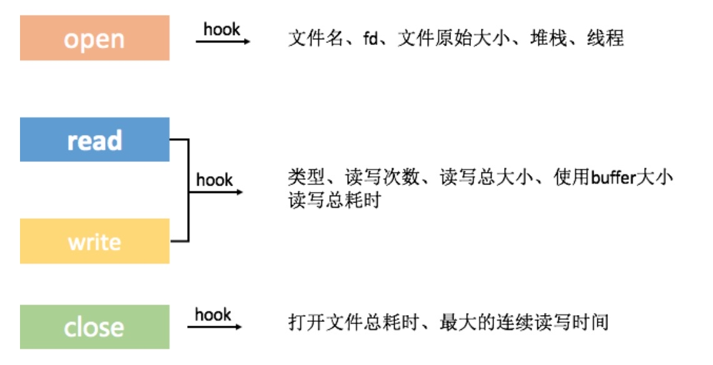

# IO优化

具体来说, Page Cache就像是我们经常使用的数据缓存,是文件系统对数据的缓存,目的是提升内存命中率。 
Buffer cache就像我们经常使用的 BufferInputstrean,是磁盘对数据的缓存,目的是合并部分文件系统的Ⅳ/O请求、降低磁盘O的次数。需要注意的是,它们既会用在读请求中,也会用到写请求中。
通过/pro/ memento文件可以查看缓存的内存占用情况,当手机內存不足的时候,系统会回收它们的内存,这样整体/O的性能就会有所降低。
## 文件为什么会损坏
我们可以从应用程序、文件系统和磁盘三个角度来审视这个问题。
* 应用程序。大部分的Ⅳ/O方法都不是原子操作,文件的跨进程或者多线程写入、使用一个已经关闭的文件描述符fd来操作文件,它们都有可能导致数据被覆盖或者删除。事实上,大部分的文件损坏都是因为应用程序代码设计考虑不当导致的,并不是文件系统或者磁盘的问题。
* 文件系统。虽说内核崩溃或者系统突然断电都有可能导致文件系统损坏,不过文件系统也做了
很多的保护措施。例如 system分区保证只读不可写,增加异常检查和恢复机制,ext4的fsck、f2fs的 fsck.f2fs和 checkpoint机制等。
* 磁盘。手机上使用的闪存是电子式的存储设备,所以在资料传输过程可能会发生电子遗失等现
象导致数据错误。不过闪存也会使用εCC、多级编码等多种方式增加数据的可靠性,一般来说
出现这种情况的可能性也比较小
## IO有时会特别慢
* 内存不足。当手机内存不足的时候,系统会回收 Page Cache和 Buffer cache的内存,大部分的写操作会直接落盘,导致性能低下。
* 写入放大。上面我说到闪存重复写入需要先进行擦除操作,但这个擦除操作的基本单元是bock块,一个page页的写入操作将会引起整个块数据的迁移,这就是典型的写入放大现象。低端机或者使用比较久的设备,由于磁盘碎片多、剩余空间少,非常容易出现写入放大的现象。具体来说,闪存读操作最快,在2oυs左右。写操作慢于读操作,在200us左右。而擦除操作非常耗时,在1ms左右的数量级。当岀现写入放大时,因为涉及移动数据,这个时间会更长。
## IO测量
吞吐量:"连续读取不超过 550MB/s，连续写入不超过 520MB/s"
IOPS:它指的是每秒可以读写的次数
## io的三种方式
标准io,直接io,mmap
## PageCache和MMAP
## 小文件系统
Google 的 GFS、淘宝开源的TFS、Facebook的 Haystack 都是专门为海量小文件的存储和检索设计的的文件系统
## 监控资源泄漏
StrictMode
## NIO
对于必不可少的IO操作,我们需要思考是否有其他方式做进一步的优化。
* 对大文件使用mmap或者NiO方式。 MappedByte Buffer就是 Java nio中的mmap封装,正如上一期所说,对于大文件的频繁读写会有比较大的优化。
* 安装包不压缩。对启动过程需要的文件,我们可以指定在安装包中不压缩,这样也会加快启动速度,但带来的影响是安装包体积增大。事实上 Google Play非常希望我们不要去压缩library、 resource、 resource.arsc这些文件,这样对启动的内存和速度都会有很大帮助。而且不压缩文件带来只是安装包体积的增大,对于用户来说, Download size并没有增大。
* Buffer复用。我们可以利用okio开源库,它内部的 ByteString和 Buffer通过重用等技巧,很
大程度上减少CPU和内存的消耗。
* 存储结构和算法的优化。是否可以通过算法或者数据结构的优化,让我们可以尽量的少IO甚至完全没有IO。比如一些配置文件从启动完全解析,改成读取时才解析对应的项;替换掉ⅪML、JSoN这些格式比较冗余、性能比较较差的数据结构,当然在接下来我还会对数据存储这一块做更多的展开。

## native hook

* 主线程IO
* buffer太小，
读取buffer大小，那应该选用多大的 Buffer 呢？我们可以跟据文件保存所挂载的目录的 block size 来确认 Buffer 大小
* 重复读取
* 资源泄漏CloseGuard.java

