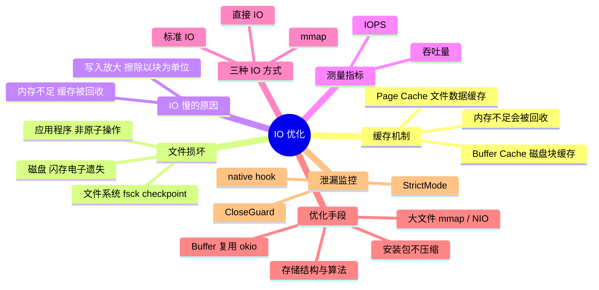
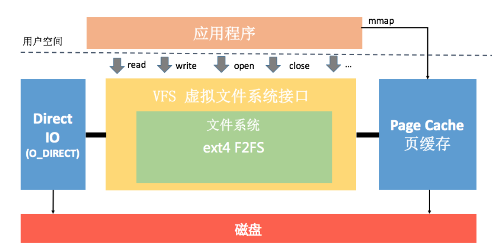
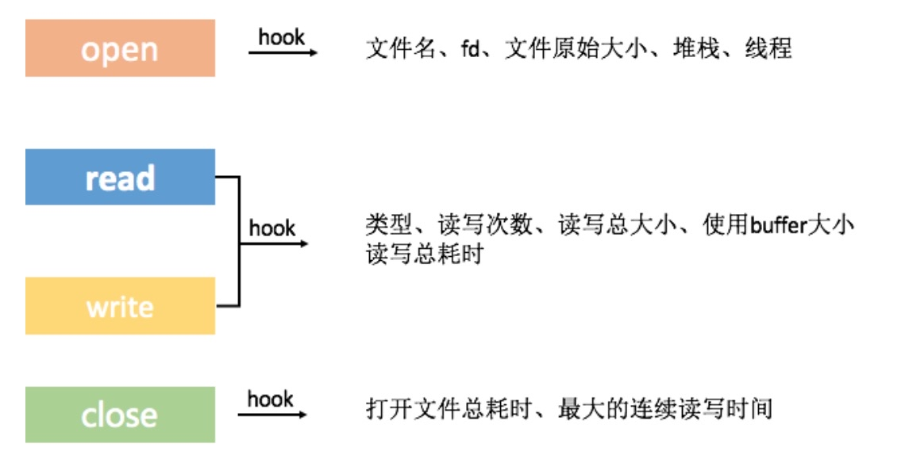

# IO 优化

```mermaid
mindmap
  root((IO 优化))
    缓存机制
      Page Cache 文件数据缓存
      Buffer Cache 磁盘块缓存
      内存不足会被回收
    文件损坏
      应用程序 非原子操作
      文件系统 fsck checkpoint
      磁盘 闪存电子遗失
    IO 慢的原因
      内存不足 缓存被回收
      写入放大 擦除以块为单位
    测量指标
      吞吐量
      IOPS
    三种 IO 方式
      标准 IO
      直接 IO
      mmap
    优化手段
      大文件 mmap / NIO
      安装包不压缩
      Buffer 复用 okio
      存储结构与算法
    泄漏监控
      StrictMode
      CloseGuard
      native hook
```

---

## 一、Page Cache 与 Buffer Cache

- **Page Cache**：文件系统对数据的缓存，就像我们经常使用的数据缓存，目的是提升内存命中率。
- **Buffer Cache**：磁盘对数据的缓存，就像我们经常使用的 BufferedInputStream，目的是合并部分文件系统的 I/O 请求、降低磁盘 I/O 的次数。
- 需要注意的是，它们既会用在读请求中，也会用到写请求中。
- 通过 `/proc/meminfo` 文件可以查看缓存的内存占用情况；当手机内存不足的时候，系统会回收它们的内存，这样整体 I/O 的性能就会有所降低。

---

## 二、文件为什么会损坏

可以从应用程序、文件系统和磁盘三个角度来审视这个问题：

1. **应用程序**：大部分的 I/O 方法都不是原子操作，文件的跨进程或者多线程写入、使用一个已经关闭的文件描述符 fd 来操作文件，它们都有可能导致数据被覆盖或者删除。事实上，大部分的文件损坏都是因为应用程序代码设计考虑不当导致的，并不是文件系统或者磁盘的问题。
2. **文件系统**：虽说内核崩溃或者系统突然断电都有可能导致文件系统损坏，不过文件系统也做了很多的保护措施。例如 system 分区保证只读不可写，增加异常检查和恢复机制，ext4 的 fsck、f2fs 的 fsck.f2fs 和 checkpoint 机制等。
3. **磁盘**：手机上使用的闪存是电子式的存储设备，所以在资料传输过程中可能会发生电子遗失等现象导致数据错误。不过闪存也会使用 ECC、多级编码等多种方式增加数据的可靠性，一般来说出现这种情况的可能性也比较小。

---

## 三、IO 有时会特别慢

1. **内存不足**：当手机内存不足的时候，系统会回收 Page Cache 和 Buffer Cache 的内存，大部分的写操作会直接落盘，导致性能低下。
2. **写入放大**：闪存重复写入需要先进行擦除操作，但这个擦除操作的基本单元是 block 块，一个 page 页的写入操作将会引起整个块数据的迁移，这就是典型的写入放大现象。低端机或者使用比较久的设备，由于磁盘碎片多、剩余空间少，非常容易出现写入放大的现象。

闪存三种操作的耗时量级：**读操作最快**，在 20us 左右；**写操作慢于读操作**，在 200us 左右；而**擦除操作非常耗时**，在 1ms 左右的数量级。当出现写入放大时，因为涉及移动数据，这个时间会更长。

---

## 四、IO 测量

- **吞吐量**：连续读取不超过 550MB/s，连续写入不超过 520MB/s。
- **IOPS**：每秒可以读写的次数。

---

## 五、IO 的三种方式

| 方式 | 说明 |
| --- | --- |
| 标准 IO | 数据先进入 Page Cache，再拷贝到用户空间，多一次拷贝 |
| 直接 IO | 绕过 Page Cache 直接读写设备，适合大块、缓存收益低的场景 |
| mmap | 把文件映射到用户地址空间，读写像访问内存一样，省去内核到用户空间的拷贝 |

**Page Cache 和 mmap**：mmap 映射的正是 Page Cache 中的页面，所以映射后读写文件不需要 `read/write` 的显式拷贝（零拷贝的思路，详见 [NIO 与 IO](../../Java/NIO与IO.md) 一文）。

---

## 六、小文件系统

Google 的 GFS、淘宝开源的 TFS、Facebook 的 Haystack，都是专门为海量小文件的存储和检索设计的文件系统。

---

## 七、进一步的优化手段

对于必不可少的 IO 操作，我们需要思考是否有其他方式做进一步的优化：

1. **对大文件使用 mmap 或者 NIO 方式**：`MappedByteBuffer` 就是 Java NIO 中的 mmap 封装，对于大文件的频繁读写会有比较大的优化。
2. **安装包不压缩**：对启动过程需要的文件，可以指定在安装包中不压缩，这样会加快启动速度，代价是安装包体积增大。事实上 Google Play 非常希望我们不要去压缩 library、resource、resources.arsc 这些文件，这样对启动的内存和速度都会有很大帮助；而且不压缩文件带来的只是安装包体积的增大，对于用户来说 Download size 并没有增大。
3. **Buffer 复用**：可以利用 okio 开源库，它内部的 ByteString 和 Buffer 通过重用等技巧，很大程度上减少 CPU 和内存的消耗。
4. **存储结构和算法的优化**：是否可以通过算法或者数据结构的优化，让我们尽量少 IO 甚至完全没有 IO。比如一些配置文件从启动时完全解析，改成读取时才解析对应的项；替换掉 XML、JSON 这些格式比较冗余、性能比较差的数据结构。

---

## 八、Native Hook 与资源泄漏监控

Native hook 常用来暴露以下几类问题：

- **主线程 IO**；
- **Buffer 太小**：读取 Buffer 应该选多大？可以根据文件所挂载目录的 block size 来确认 Buffer 大小；
- **重复读取**；
- **资源泄漏**：对应 CloseGuard.java 这类检测机制。

此外，可以用 **StrictMode** 监控主线程上的磁盘读写、网络访问等违规操作，配合上面的手段一起做资源泄漏排查。

---

## 九、30 秒口述版

IO 优化先理解缓存：**Page Cache** 缓存文件数据、**Buffer Cache** 缓存磁盘块，内存不足时系统会回收它们，导致写操作直接落盘、性能下降。IO 慢的另一大原因是闪存的**写入放大**——擦除以块为单位，一个 page 的写入会引发整块数据迁移。优化手段上：大文件用 mmap / NIO（`MappedByteBuffer`），启动必需的文件在安装包中不压缩，用 okio 复用 Buffer，并从存储结构上减少甚至消除 IO；同时用 StrictMode、CloseGuard、native hook 监控主线程 IO、buffer 过小、重复读取与资源泄漏。
