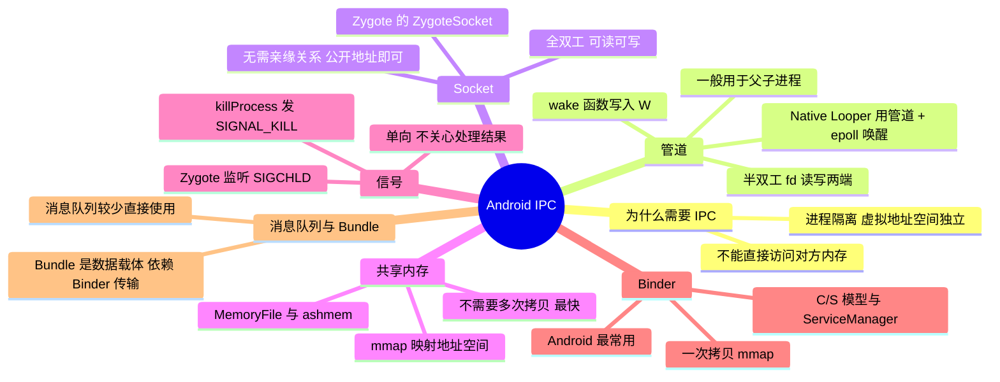

# IPC（进程间通信）

---

## 一、为什么需要 IPC

每个进程都有独立的虚拟地址空间，进程之间不能直接读写对方的内存，所以需要操作系统提供一套进程间通信机制。Linux 提供的传统方式有管道、Socket、共享内存、信号、消息队列等，Android 在此基础上又提供了 Binder，并把 Binder 作为应用层的首选方案。

---

## 二、管道

- 管道是**半双工**的，管道的描述符只能读或写，想要既可以读也可以写就需要两个描述符，而且管道一般用在父子进程之间。
- Linux 提供了 `pipe` 函数创建一个管道，传入一个 `fd[2]` 数组，`fd[0]` 表示读端，`fd[1]` 表示写端。假如父进程创建了一对文件描述符，fork 出的子进程继承了这对文件描述符，这时候父进程想要往子进程写东西，就可以拿 `fd[1]` 写，然后子进程在 `fd[0]` 就可以读到了。
- 在 Android 中，Native 层的 Looper 使用到了管道：它里面使用 epoll 监听读事件（`epoll_wait`），如果其他进程往里面写东西它就能收到通知。管道在哪写的呢？其实是在 `wake` 函数中，当别的线程向 Looper 线程发消息并且需要唤醒 Looper 线程的时候，就会调用 `wake` 函数，`wake` 函数里面就是向管道写一个 "W" 字符。
- 管道使用起来还是很方便的，主要是能配合 epoll 机制监听读写事件。这是 Android 19 才会使用到管道，更高版本使用的是 EventFd。

---

## 三、Socket

- Socket 是**全双工**的，也就是说既可以读也可以写，而且进程之间**不需要亲缘关系**，只需要公开一个地址即可。
- Framework 中使用到 Socket 最经典的莫过于 Zygote 等待 AMS 请求 fork 应用程序进程了。在 Zygote 的 main 方法中注册一个 ZygoteSocket，然后进入 `runSelectLoop` 循环去监听有没有新的连接，如果有数据发过来就会去调用 `runOnce` 函数，根据参数 fork 出新的应用程序进程，其实就是去执行 `ActivityThread` 的 main 函数，然后也会通过这个 Socket 把新创建的应用进程 pid 返回给 Zygote。

---

## 四、共享内存

- 共享内存**不需要多次拷贝**，而且特别快：拿到文件描述符分别映射到进程的地址空间即可。
- 在 Android 中提供了 `MemoryFile` 类，里面封装了 ashmem 机制，也就是 Android 的匿名共享内存。首先通过 `ashmem_create_region` 创建一块匿名共享内存，返回一个 fd，然后调用 `mmap` 函数把这个 fd 映射到当前进程地址空间中。

---

## 五、信号

- 信号是**单向**的，而且发出去之后不关心处理结果，知道进程的 pid 就能发信号了。
- 在杀应用进程的时候会调用 Process 的 `killProcess` 函数发送一个 SIGNAL_KILL 信号。
- 还有 Zygote 在 fork 完成一个新的子进程之后还会监听 SIGCHLD 信号，如果子进程退出之后就会回收相应的资源，避免子进程成为一个僵尸进程。

---

## 六、Binder

Android 应用层最常用的 IPC 方式，底层同样是 C/S 结构 + Binder 驱动：

- **一次拷贝**：通过 mmap 把内核缓冲区映射到接收进程的用户空间，数据只需从发送进程用户空间拷贝一次到内核缓冲区，接收方直接读取映射，省去了传统 IPC 的二次拷贝（详见 [Binder 笔记](./Binder/Binder.md)）。
- **C/S 模型**：Client 通过 ServiceManager 拿到 Server 的代理，调用时经 Binder 驱动转发到 Server 的 Binder 线程池执行。
- 支持在进程间传递 **Parcelable 对象**、文件描述符，并支持**死亡通知**（DeathRecipient）。
- AIDL、Messenger、ContentProvider 的底层都是 Binder。

---

## 七、消息队列与 Bundle

- **消息队列**：Linux 的 IPC 方式之一（System V / POSIX 消息队列），Android 中较少直接使用。注意不要和 Handler 的 MessageQueue 混淆——后者是**进程内**的线程通信，不是 IPC。
- **Bundle**：本身不是一种 IPC 机制，而是**数据传输的载体**。它内部是 key-value 结构，数据需要可序列化（Parcelable/基本类型），通过 Intent 在组件间传递；跨进程时依赖 Binder 完成传输。

---

## 八、各方式对比

| 方式 | 方向 | 拷贝次数 | 特点与典型场景 |
| --- | --- | --- | --- |
| Binder | 双向 | 1 次 | Android 首选；支持对象传递与死亡通知；AIDL/ContentProvider 底层 |
| 管道 | 半双工 | 多次 | 一般用于父子进程；Native Looper 用它 + epoll 实现唤醒 |
| Socket | 全双工 | 多次 | 无需亲缘关系；Zygote 与 AMS 之间传递 fork 请求 |
| 共享内存 | 双向 | 映射后免拷贝 | 速度最快；MemoryFile/ashmem，需自行处理同步 |
| 信号 | 单向 | 无数据 | 只做事件通知，如 SIGCHLD 回收子进程 |
| ContentProvider | 双向 | 底层 Binder | 四大组件之一，跨进程共享数据 |

---

## 九、30 秒口述版

Linux 传统 IPC 有管道（半双工、父子进程、Native Looper 用它 + epoll 唤醒）、Socket（全双工、无亲缘关系、Zygote 用它接收 AMS 的 fork 请求）、共享内存（MemoryFile 封装 ashmem，映射后免拷贝、最快）、信号（单向通知，SIGNAL_KILL 杀进程、SIGCHLD 回收子进程）。Android 应用层则以 **Binder** 为主：一次拷贝、C/S 模型、支持对象传递和死亡通知，AIDL 与 ContentProvider 的底层都是它。
