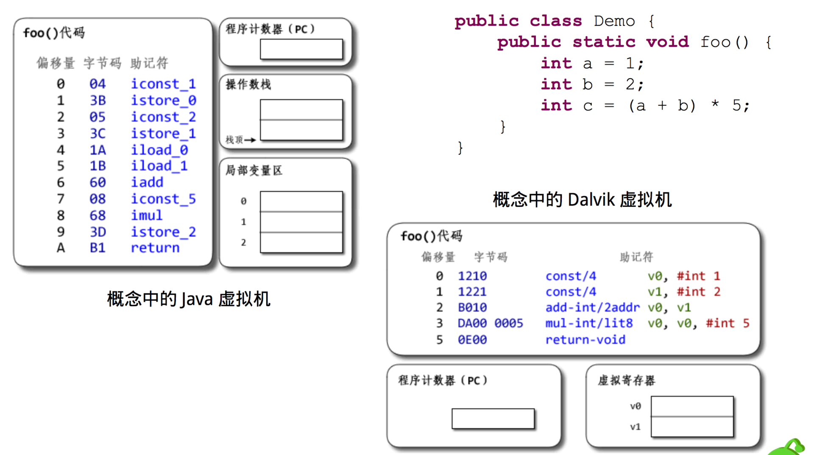
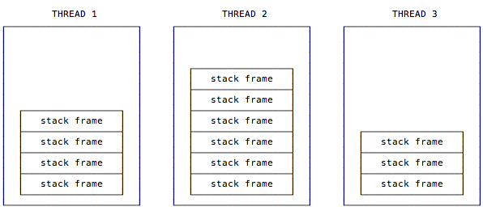
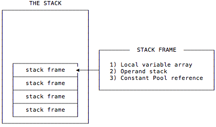

# Java 虚拟机和Dalvik区别

* 体系结构。Java 虚拟机是基于栈实现，而 Android 虚拟机是基于寄存器实现。在 ARM 平台，寄存器实现性能会高于栈实现。

 

* 格式结构。对于 Class 文件，每个文件都会有自己单独的常量池以及其他一些公共字段。对于 Dex 文件，整个 Dex 中的所有 Class 共用同一个常量池和公共字段，所以整体结构更加紧凑，因此也大大减少了体积。
* 指令优化。Dalvik 字节码对大量的指令专门做了精简和优化，如下图所示，相同的代码 Java 字节码需要 100 多条，而 Dalvik 字节码只需要几条。
引用《Java 虚拟机规范》里对 Java 虚拟机栈的描述：
每一条 Java 虚拟机线程都有自己私有的 Java 虚拟机栈，这个栈与线程同时创建，用于存储栈帧（Stack Frame）。
正如这句话所描述的，每个线程都有的自己栈，所以在多线程应用程序中多个线程就会有多个栈，每个栈都有自己的栈帧。

 如下图所示，我们可以简单认为栈帧包含 3 个重要的内容：本地变量表（Local Variable Array）、操作数栈（Operand Stack）和常量池引用Constant Pool Reference）。

 
* 本地变量表。在使用过程中，可以认为本地变量表是存放临时数据的，并且本地变量表有个很重要的功能就是用来传递方法调用时的参数，当调用方法的时候，参数会依次传递到本地变量表中从 0 开始的位置上，并且如果调用的方法是实例方法，那么我们可以通过第 0 个本地变量中获取当前实例的引用，也就是 this 所指向的对象。
* 操作数栈。可以认为操作数栈是一个用于存放指令执行所需要的数据的位置，指令从操作数栈中取走数据并将操作结构重新入栈。
