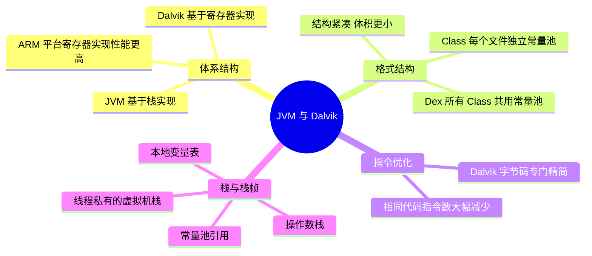
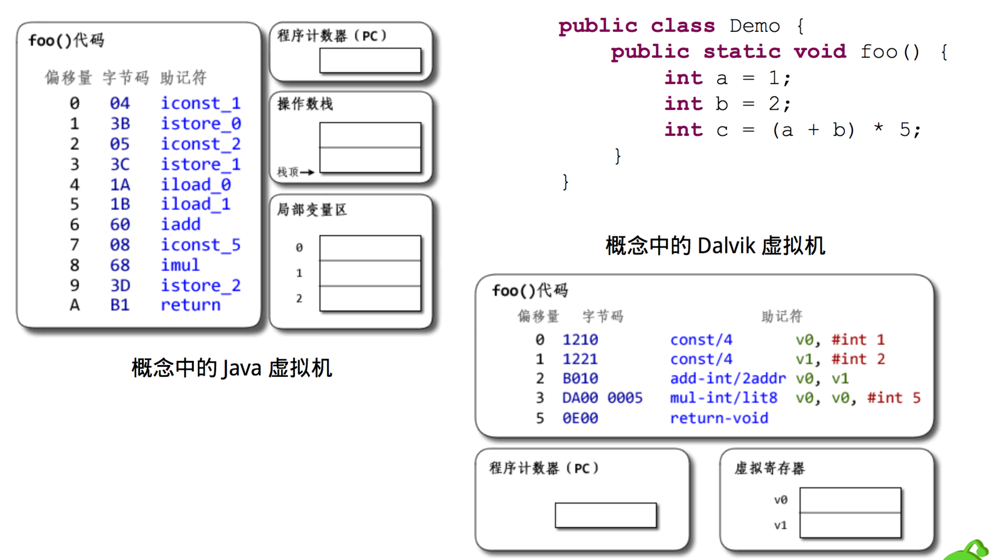
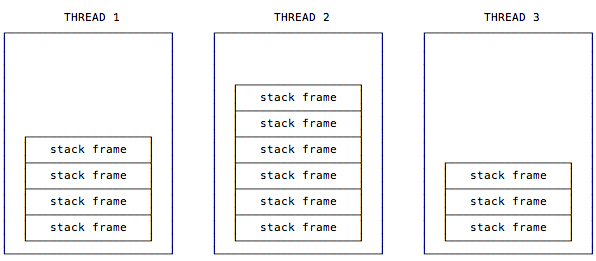
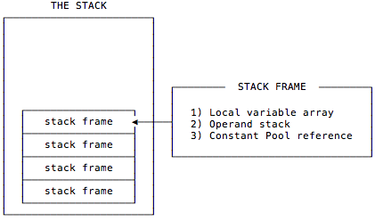

# Java 虚拟机与 Dalvik 的区别

---

## 一、体系结构：基于栈 vs 基于寄存器

- **Java 虚拟机是基于栈实现的**，而 **Android 虚拟机是基于寄存器实现的**。
- 在 ARM 平台，**寄存器实现的性能会高于栈实现**。

---

## 二、格式结构：Class 与 Dex

- **Class 文件**：每个文件都会有自己**单独的常量池**以及其他一些公共字段。
- **Dex 文件**：整个 Dex 中的所有 Class **共用同一个常量池和公共字段**，所以整体结构更加紧凑，因此也大大减少了体积。

---

## 三、指令优化

Dalvik 字节码对大量的指令专门做了精简和优化。如下图所示，**相同的代码 Java 字节码需要 100 多条，而 Dalvik 字节码只需要几条**。

---

## 四、补充：Java 虚拟机栈与栈帧

引用《Java 虚拟机规范》里对 Java 虚拟机栈的描述：

> 每一条 Java 虚拟机线程都有自己私有的 Java 虚拟机栈，这个栈与线程同时创建，用于存储栈帧（Stack Frame）。

正如这句话所描述的，每个线程都有自己私有的栈，所以在多线程应用程序中多个线程就会有多个栈，每个栈都有自己的栈帧。

可以简单认为栈帧包含 3 个重要的内容：**本地变量表（Local Variable Array）、操作数栈（Operand Stack）和常量池引用（Constant Pool Reference）**。

### 1. 本地变量表

在使用过程中，可以认为本地变量表是**存放临时数据**的，并且它有个很重要的功能：**传递方法调用时的参数**。当调用方法的时候，参数会依次传递到本地变量表中**从 0 开始**的位置上；如果调用的方法是实例方法，那么可以通过**第 0 个本地变量**获取当前实例的引用，也就是 `this` 所指向的对象。

### 2. 操作数栈

可以认为操作数栈是一个**用于存放指令执行所需要的数据**的位置：指令从操作数栈中取走数据，并将操作结果重新入栈。

---

## 五、30 秒口述版

JVM 与 Dalvik 的区别主要在三处：**体系结构**上，JVM 基于栈、Dalvik 基于寄存器，ARM 平台上寄存器实现的性能更高；**格式结构**上，Class 文件各自有独立常量池，而 Dex 把整个包里所有 Class 的常量池合并共用，结构更紧凑、体积更小；**指令**上，Dalvik 字节码做过专门精简，同样一段代码 Java 字节码 100 多条、Dalvik 只要几条。另外 Java 虚拟机栈是线程私有的，栈帧里包含本地变量表、操作数栈和常量池引用，实例方法的第 0 个本地变量就是 `this`。
