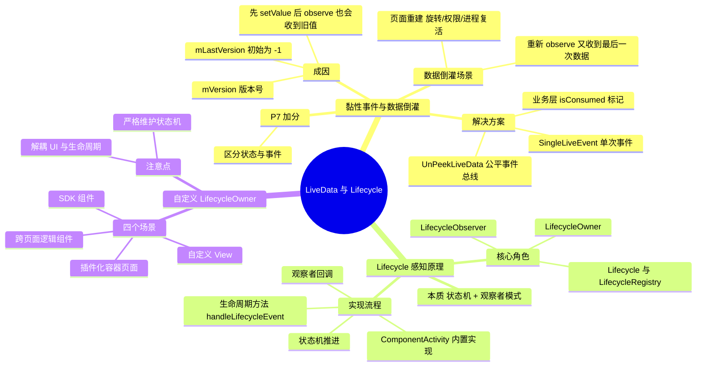

# LiveData 与 Lifecycle 剖析



---

## 一、LiveData 黏性事件与数据倒灌

### 1. 成因（面试官最爱听的底层点）

**（1）LiveData 本质设计**

- LiveData 内部维护一个 `mVersion` 版本号，每 `setValue/postValue` 一次，版本号 +1。
- 观察者（Observer）内部也维护一个 `mLastVersion`，初始为 `-1`。

**（2）黏性事件来源**

- 当调用 `observe(LifecycleOwner, Observer)` 时，LiveData 会**立刻执行一次主动分发**。
- 只要观察者的 `mLastVersion < mVersion`，就会把**当前最新值**分发给新注册的观察者。
- 这就导致：**先 setValue，后 observe，观察者依然会收到之前的数据** → 这就是**黏性事件**。

**（3）数据倒灌场景**

- 页面重建（旋转屏幕、权限变更、进程复活）时，Activity/Fragment 重建，Lifecycle 重走生命周期。
- 重新执行 `liveData.observe()`，观察者重新绑定。
- LiveData 再次把**最后一次数据**分发给新观察者 → UI 重复执行逻辑（弹窗、跳转、Toast 重复弹出）→ 数据倒灌。

### 2. 方案一：SingleLiveEvent（单次事件包装，业界最常用）

- 核心思路：用一个标志位控制数据只消费一次；只有**主动调用 setValue** 时才分发，**注册观察者时不分发**。
- 极简实现（面试可手写）：

```kotlin
class SingleLiveEvent<T> : MutableLiveData<T>() {
    private val mPending = AtomicBoolean(false)

    override fun observe(owner: LifecycleOwner, observer: Observer<in T>) {
        // 禁止黏性分发
        super.observe(owner) { t ->
            if (mPending.compareAndSet(true, false)) {
                observer.onChanged(t)
            }
        }
    }

    override fun setValue(value: T) {
        mPending.set(true)
        super.setValue(value)
    }

    override fun postValue(value: T) {
        mPending.set(true)
        super.postValue(value)
    }
}
```

- **优点**：轻量、解决倒灌、无侵入。
- **缺点**：只支持**一个观察者**，多观察者会只有一个收到。

### 3. 方案二：UnPeekLiveData / 公平事件总线（支持多观察者）

- 内部维护每个观察者的消费版本号。
- 保证每个观察者只消费**注册之后发送的新数据**。
- 适合多页面、多组件监听同一个事件。

### 4. 方案三：业务层标记消费状态（更彻底）

- 数据结构增加 `isConsumed` 字段。
- 观察者收到后先判断是否已消费，避免重复执行。
- 适合**必须保证业务幂等**的场景（如支付结果、跳转）。

### 5. P7 加分回答

- 不要无脑用 SingleLiveEvent，要区分**状态（State）**和**事件（Event）**：
  - UI 状态（展示文字、列表数据）→ 正常 LiveData，允许恢复；
  - 一次性事件（跳转、弹窗、Toast）→ 用单次事件包装。
- 数据倒灌本质是**状态与事件混用**，架构设计上要分离。

---

## 二、Lifecycle 如何实现生命周期感知

### 1. 核心角色

- **LifecycleOwner**：拥有生命周期的组件（Activity/Fragment）。
- **Lifecycle**：抽象类，负责分发生命周期事件、维护当前状态。
- **LifecycleRegistry**：Lifecycle 唯一实现类，真正做事件分发与状态推进。
- **LifecycleObserver**：生命周期观察者。

### 2. 实现流程（面试必背）

1. **Activity 内置支持**：官方的 `ComponentActivity`、`Fragment` 已经默认实现 `LifecycleOwner` 接口，内部持有 `LifecycleRegistry` 对象。
2. **事件注入时机**：Activity 的 `onCreate/onStart/onResume/onPause/onStop/onDestroy` 里，会调用 `mLifecycleRegistry.handleLifecycleEvent()`，将生命周期事件分发给 LifecycleRegistry。
3. **状态机推进**：Lifecycle 内部有严格状态：`INITIALIZED` → `CREATED` → `STARTED` → `RESUMED` → 反向回落。事件与状态严格对应，保证**状态一致性**。
4. **观察者回调**：LifecycleRegistry 遍历所有观察者，根据当前事件/状态，回调 `@OnLifecycleEvent` 或函数式观察者，同步感知生命周期，避免内存泄漏。

### 3. 一句话总结

Lifecycle 本质是一个**状态机 + 观察者模式**，由 LifecycleOwner 在生命周期节点主动分发事件，LifecycleRegistry 统一调度，观察者同步感知。

---

## 三、自定义 LifecycleOwner 场景（P7 重点：体现架构落地能力）

### 1. 场景一：自定义 View 内部感知生命周期

- 自定义 View 不想依赖外部 Activity/Fragment，自己做生命周期解绑（如动画停止、资源释放）。
- 让 View 实现 `LifecycleOwner`，对外提供 Lifecycle。
- 内部根据 attach/detachToWindow 模拟生命周期。

### 2. 场景二：独立组件/SDK 内部生命周期管理

- 播放器、地图 SDK、音视频引擎、长连接管理器。
- 不需要外部手动调用 `onResume/onPause`，内部通过 Lifecycle 自动管理。

### 3. 场景三：跨页面逻辑组件（UseCase / Manager）

- 业务逻辑与 UI 生命周期绑定，但不想写在 Activity/Fragment。
- 自定义 LifecycleOwner，跟随页面生命周期，做到逻辑内聚。

### 4. 场景四：插件化/动态加载页面

- 非标准 Activity / 自研容器页面，没有系统 Lifecycle。
- 手动实现 LifecycleOwner，模拟生命周期分发，兼容 Jetpack 组件。

### 5. 极简自定义 LifecycleOwner 代码（面试可写）

```kotlin
class MyLifecycleOwner : LifecycleOwner {
    private val lifecycleRegistry = LifecycleRegistry(this)

    init {
        // 初始化状态
        lifecycleRegistry.currentState = Lifecycle.State.INITIALIZED
    }

    fun onCreate() {
        lifecycleRegistry.handleLifecycleEvent(Lifecycle.Event.ON_CREATE)
    }

    fun onStart() {
        lifecycleRegistry.handleLifecycleEvent(Lifecycle.Event.ON_START)
    }

    fun onResume() {
        lifecycleRegistry.handleLifecycleEvent(Lifecycle.Event.ON_RESUME)
    }

    fun onPause() {
        lifecycleRegistry.handleLifecycleEvent(Lifecycle.Event.ON_PAUSE)
    }

    fun onStop() {
        lifecycleRegistry.handleLifecycleEvent(Lifecycle.Event.ON_STOP)
    }

    fun onDestroy() {
        lifecycleRegistry.handleLifecycleEvent(Lifecycle.Event.ON_DESTROY)
    }

    override fun getLifecycle(): Lifecycle {
        return lifecycleRegistry
    }
}
```

### 6. P7 加分点

- 自定义 LifecycleOwner 必须**严格维护状态机**，不能乱跳状态，否则会导致 LiveData、ViewModel 行为异常。
- 可以用于**解耦 UI 与生命周期逻辑**，提升架构可测试性。
- 在组件化、插件化、跨平台容器中是标准方案。

---

## 四、30 秒口述版

LiveData 的黏性事件源于 `mVersion` 与观察者 `mLastVersion` 的比较——新注册的观察者只要版本落后，就会立刻收到最后一次的值，页面重建重新 observe 时表现为数据倒灌；解法是 SingleLiveEvent、UnPeekLiveData 或业务层消费标记，架构上要把"状态"和"事件"分开。Lifecycle 则是状态机 + 观察者模式：ComponentActivity/Fragment 内置 LifecycleOwner，在生命周期方法里 `handleLifecycleEvent` 推进状态，LifecycleRegistry 遍历分发；自定义 LifecycleOwner 时同样要严格维护状态机，否则 LiveData/ViewModel 行为会异常。

> （注：文档部分内容可能由 AI 生成）
