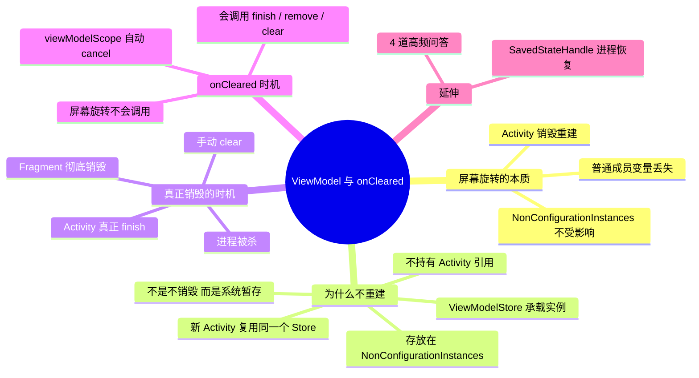

# ViewModel 屏幕旋转不重建与 onCleared 调用时机

---

## 一、屏幕旋转发生了什么

屏幕旋转 → **Activity 销毁重建**：

- `onDestroy()` → 新 Activity 实例创建 `onCreate()`；
- 普通成员变量全部丢失，Activity 对象直接回收。

> 注意：**只是 Activity 销毁，所属的 Activity 非配置变更范围的对象不会被销毁。**

---

## 二、ViewModel 为什么屏幕旋转不重建

### 1. 核心链路

ViewModel 的实例不是保存在 Activity 内部，而是保存在 **`ViewModelStore`**；`ViewModelStore` 对象存放在 **`Activity#onRetainNonConfigurationInstance()` 返回的 NonConfigurationInstances** 中。

1. 配置变更（屏幕旋转、语言切换）触发 Activity 销毁；
2. 系统不会销毁 `NonConfigurationInstances`，把这个对象临时保留在系统 Activity 管理器中；
3. 新 Activity 重建，系统取出旧的 `NonConfigurationInstances`，拿到里面的 `ViewModelStore`；
4. 新 Activity 通过 ViewModelProvider 从复用的 ViewModelStore 取出旧 ViewModel 实例直接使用；
5. **ViewModel 引用继续存活，不会重新 new。**

### 2. 关键点

> ✅ ViewModel 不持有 Activity 引用；持有 `SavedStateHandle` 可以保存少量配置变更数据。
>
> ❌ 不是 ViewModel 不会销毁，是**配置变更场景下 ViewModelStore 被系统暂存，不回收**。

**流程图一句话**：配置变更 → Activity 销毁 → **ViewModelStore 保留在 NonConfigurationInstances** → 新 Activity 复用上一份 ViewModelStore → ViewModel 复用。

### 3. Fragment 场景

Fragment 的 ViewModelStore 存在 FragmentManager 中，Fragment 重建同样复用 ViewModel。

---

## 三、ViewModel 什么时候真正销毁

只有 **Activity 真正 finish（彻底退出）**，不是配置变更：

- 用户 back 退出 Activity；
- 调用 `finish()`；
- 系统内存不足杀死 App 进程。

此时 `ViewModelStore` 被清空，遍历所有 ViewModel 调用 `onCleared()`。

---

## 四、onCleared() 调用时机【高频考点】

> `onCleared()`：ViewModel 销毁前回调，适合关闭协程、取消 Flow 订阅、释放资源。

### 1. ✅ 会调用 onCleared 的场景

1. Activity **正常 finish 结束**，ViewModelStore 被清空 → `onCleared()` 执行；
2. Fragment 被彻底 remove、detach 不再复用时，Fragment 的 ViewModelStore 销毁 → `onCleared()` 执行；
3. 手动调用 `viewModelStore.clear()`，会立刻触发所有 ViewModel 的 `onCleared()`。

### 2. ❌ 不会调用 onCleared 的场景

**屏幕旋转（配置变更）不会调用 onCleared！！**（最容易踩坑）——旋转只是 Activity 销毁重建，ViewModel 继续复用，`onCleared` 不会跑。

**常见误区**：很多人误以为旋转会调用 onCleared，这是错误的。旋转只是销毁旧 Activity，ViewModel 还活着，不会执行 onCleared。

### 3. viewModelScope 与 onCleared

`viewModelScope` 是 ViewModel 自带协程作用域，**onCleared 内部自动 cancel 这个协程**：

- 配置变更：viewModelScope 不会取消，协程继续跑；
- Activity finish：onCleared 触发 → `viewModelScope.cancel()`，所有子协程全部停止。

> 坑：如果网络请求在旋转期间，**旋转不会终止请求，请求继续执行**；只有页面真正退出才会 cancel。

---

## 五、SavedStateHandle 补充（拓展面试）

ViewModel 本身内存保存，进程被杀重建后数据丢失；`SavedStateHandle` 借助 `onSaveInstanceState`，可以保存少量键值，进程重启恢复数据。

---

## 六、高频面试问答

### 1. 为什么屏幕旋转 ViewModel 不会重建？

配置变更时 Activity 销毁，ViewModel 存放在 ViewModelStore，ViewModelStore 保存在 Activity 的 NonConfigurationInstances 对象，系统不会回收该对象；新 Activity 重建后复用同一个 ViewModelStore，拿到旧 ViewModel 实例。

### 2. onCleared 什么时候调用？旋转会调用吗？

Activity 真正 finish、Fragment 彻底销毁、手动 clear viewModelStore 时才会调用。**屏幕旋转配置变更不会调用 onCleared**。viewModelScope 会在 onCleared 里自动取消协程。

### 3. viewModelScope 协程，屏幕旋转请求会断吗？

不会。旋转 ViewModel 实例存活，viewModelScope 不会 cancel，网络请求继续执行；只有页面真正 finish 退出才会终止。

### 4. ViewModel 能不能持有 Context？

禁止持有 Activity 上下文；可以使用 `getApplication()` 获取 Application Context，Application 全局不会销毁。

---

## 七、口述极简背诵版

ViewModel 实例存储在 ViewModelStore，配置变更时 ViewModelStore 保存在 NonConfigurationInstances，系统保留不销毁，新 Activity 复用，所以屏幕旋转不会重建。onCleared 在 Activity 真正 finish、Fragment 彻底销毁、手动 clear 才回调；**屏幕旋转不会触发 onCleared**，viewModelScope 在 onCleared 内部自动取消协程。

> 内容由 AI 生成
