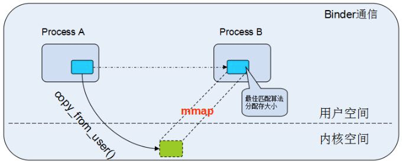

# MMAP在Android中使用
MMAP(memory map )的原理就是PageCache.
mmap 比较适合于对同一块区域频繁读写的情况，推荐也使用线程来操作。用户日志、数据上报都满足这种场景，另外需要跨进程同步的时候，，mmap 也是一个不错的选择。Android 跨进程通信有自己独有的 Binder 机制，它内部也是使用 mmap 实现。

mmap函数原型如下：
 
	void *mmap(void *start,size_t length,int prot,int flags,int fd,off_t offsize);

复制代码
几个重要参数
* 参数start：指向欲映射的内存起始地址，通常设为 NULL，代表让系统自动选定地址，映射成功后返回该地址。
* 参数length：代表将文件中多大的部分映射到内存。
* 参数prot：映射区域的保护方式。可以为以下几种方式的组合：

返回值是void *类型，分配成功后，被映射成虚拟内存地址。
mmap属于系统调用，用户控件间接通过swi指令触发软中断，进入内核态（各种环境的切换），进入内核态之后，便可以调用内核函数进行处理。 mmap->mmap64->__mmap2->sys_mmap2-> sys_mmap_pgoff ->do_mmap_pgoff.

Binder机制中mmap的最大特点是一次拷贝即可完成进程间通信。Android应用在进程启动之初会创建一个单例的ProcessState对象，其构造函数执行时会同时完成binder mmap，为进程分配一块内存，专门用于Binder通信，如下。

	ProcessState::ProcessState(const char *driver)

	    : mDriverName(String8(driver))

	    , mDriverFD(open_driver(driver))

	    ...

	 {

	    if (mDriverFD >= 0) {

	        // mmap the binder, providing a chunk of virtual address space to receive transactions.

	        mVMStart = mmap(0, BINDER_VM_SIZE, PROT_READ, MAP_PRIVATE | MAP_NORESERVE, mDriverFD, 0);

	        ...

	    }

	}

第一个参数是分配地址，为0意味着让系统自动分配，流程跟之前分子类似，先在用户空间找到一块合适的虚拟内存，之后，在内核空间也找到一块合适的虚拟内存，修改两个控件的页表，使得两者映射到同一块物力内存。
Linux的内存分用户空间跟内核空间，同时页表有也分两类，用户空间页表跟内核空间页表，每个进程有一个用户空间页表，但是系统只有一个内核空间页表。而Binder mmap的关键是：也更新用户空间对应的页表的同时也同步映射内核页表，让两个页表都指向同一块地址，这样一来，数据只需要从A进程的用户空间，直接拷贝拷贝到B所对应的内核空间，而B多对应的内核空间在B进程的用户空间也有相应的映射，这样就无需从内核拷贝到用户空间了。

