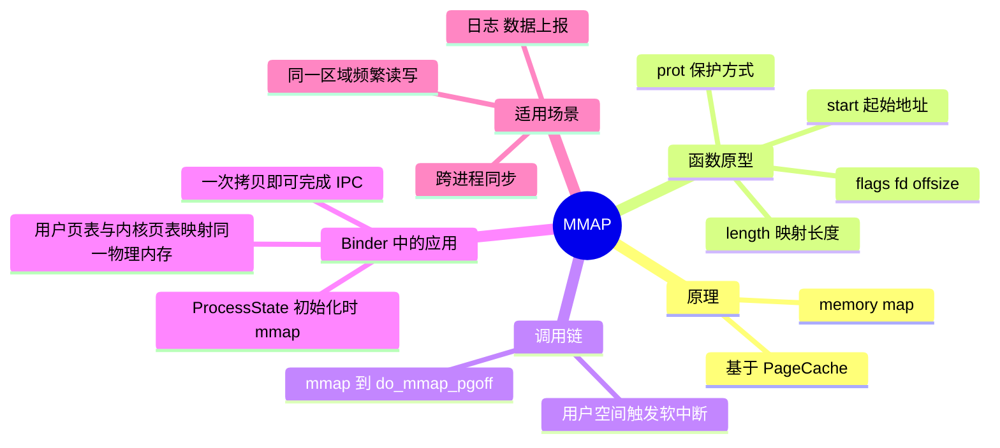
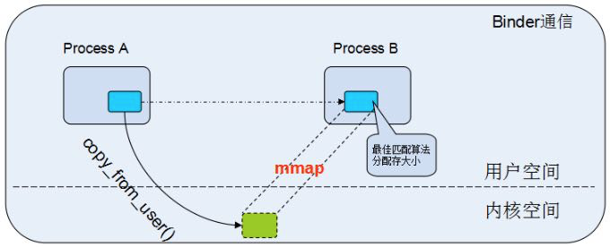

# MMAP 在 Android 中的使用


```mermaid
mindmap
  root((MMAP))
    原理
      memory map
      基于 PageCache
    函数原型
      start 起始地址
      length 映射长度
      prot 保护方式
      flags fd offsize
    调用链
      用户空间触发软中断
      mmap 到 do_mmap_pgoff
    Binder 中的应用
      一次拷贝即可完成 IPC
      ProcessState 初始化时 mmap
      用户页表与内核页表映射同一物理内存
    适用场景
      日志 数据上报
      同一区域频繁读写
      跨进程同步
```

---

## 一、原理：PageCache

**MMAP（memory map）的原理就是 PageCache。**

mmap 比较适合于**对同一块区域频繁读写**的情况，推荐配合线程来操作。用户日志、数据上报都满足这种场景；另外需要**跨进程同步**的时候，mmap 也是一个不错的选择。Android 跨进程通信有自己独有的 Binder 机制，它内部也是使用 mmap 实现。



---

## 二、函数原型与关键参数

```c
void *mmap(void *start, size_t length, int prot, int flags, int fd, off_t offsize);
```

几个重要参数：

- **参数 start**：指向欲映射的内存起始地址，通常设为 NULL，代表让系统自动选定地址，映射成功后返回该地址。
- **参数 length**：代表将文件中多大的部分映射到内存。
- **参数 prot**：映射区域的保护方式，可以为以下几种方式的组合：`PROT_READ`（可读）、`PROT_WRITE`（可写）、`PROT_EXEC`（可执行）、`PROT_NONE`（不可访问）。
- **返回值**是 `void *` 类型，分配成功后返回被映射成的虚拟内存地址。

---

## 三、调用链：从用户态到内核态

mmap 属于**系统调用**：用户空间间接通过 `swi` 指令触发软中断，进入内核态（伴随各种环境的切换），进入内核态之后便可以调用内核函数进行处理。调用链如下：

```text
mmap -> mmap64 -> __mmap2 -> sys_mmap2 -> sys_mmap_pgoff -> do_mmap_pgoff
```

---

## 四、Binder 中的 mmap：为什么一次拷贝

**Binder 机制中 mmap 的最大特点是一次拷贝即可完成进程间通信。**

Android 应用在进程启动之初会创建一个单例的 `ProcessState` 对象，其构造函数执行时会同时完成 binder mmap，为进程分配一块内存，专门用于 Binder 通信：

```cpp
ProcessState::ProcessState(const char *driver)
    : mDriverName(String8(driver))
    , mDriverFD(open_driver(driver))
    ...
{
    if (mDriverFD >= 0) {
        // mmap the binder, providing a chunk of virtual address space to receive transactions.
        mVMStart = mmap(0, BINDER_VM_SIZE, PROT_READ, MAP_PRIVATE | MAP_NORESERVE, mDriverFD, 0);
        ...
    }
}
```

第一个参数是分配地址，为 0 意味着让系统自动分配。流程与前面的分析类似：先在用户空间找到一块合适的虚拟内存，之后在内核空间也找到一块合适的虚拟内存，修改两张页表，使得两者映射到**同一块物理内存**。

Linux 的内存分用户空间与内核空间，页表也分两类——用户空间页表和内核空间页表。每个进程有一个用户空间页表，但**系统只有一个内核空间页表**。而 Binder mmap 的关键是：**在更新用户空间对应页表的同时，也同步映射内核页表**，让两张页表都指向同一块地址。这样一来，数据只需要从 A 进程的用户空间直接拷贝到 B 所对应的内核空间，而 B 所对应的内核空间在 B 进程的用户空间也有相应的映射，**这样就无需再从内核拷贝到用户空间了**——这就是"一次拷贝"的由来（与 [Binder 笔记](../Binder/Binder.md) 和 [NIO 与 IO 的零拷贝](../../Java/NIO与IO.md) 是同一套 mmap 思想）。

---

## 五、适用场景小结

1. **频繁读写同一块区域**：如用户日志、数据上报，省去反复的 read/write 系统调用和用户态/内核态拷贝；
2. **跨进程同步与共享**：多个进程映射同一文件/匿名区域即可共享内存；
3. **大文件读取**：按需缺页加载，不必一次性读入。

---

## 六、30 秒口述版

mmap 的本质是把文件或匿名内存映射到进程的虚拟地址空间，底层依赖 **PageCache**，适合频繁读写同一区域、日志上报、跨进程同步等场景。它的调用链是 `mmap → do_mmap_pgoff` 这样的系统调用路径。Binder 正是用 mmap 实现"一次拷贝"：进程启动时 `ProcessState` 通过 mmap 同时映射用户页表和内核页表，让两者指向同一块物理内存，发送方数据只需拷贝一次到目标进程的内核空间，接收方就能在自己的用户空间直接读到，省掉了内核到用户空间的那次拷贝。
