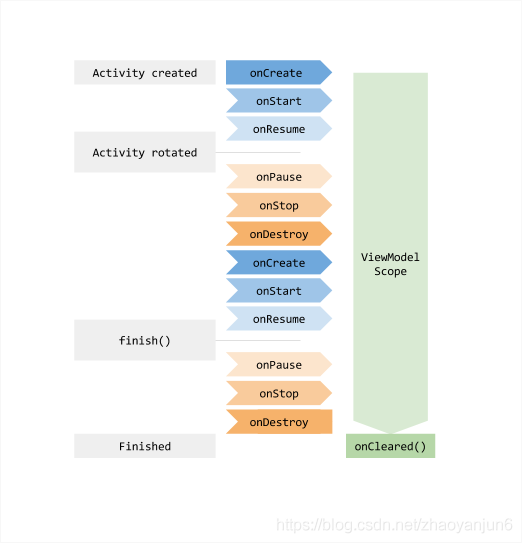
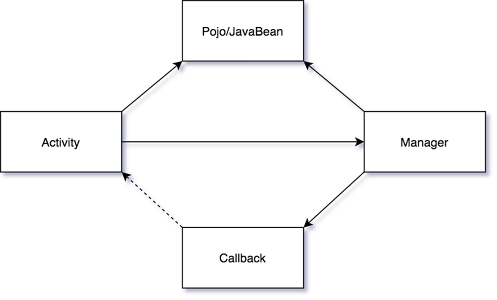
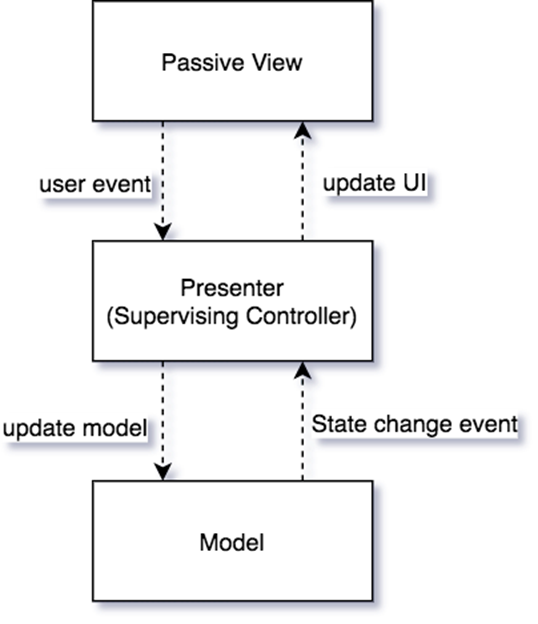
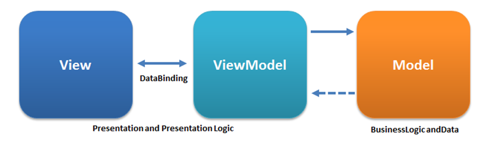
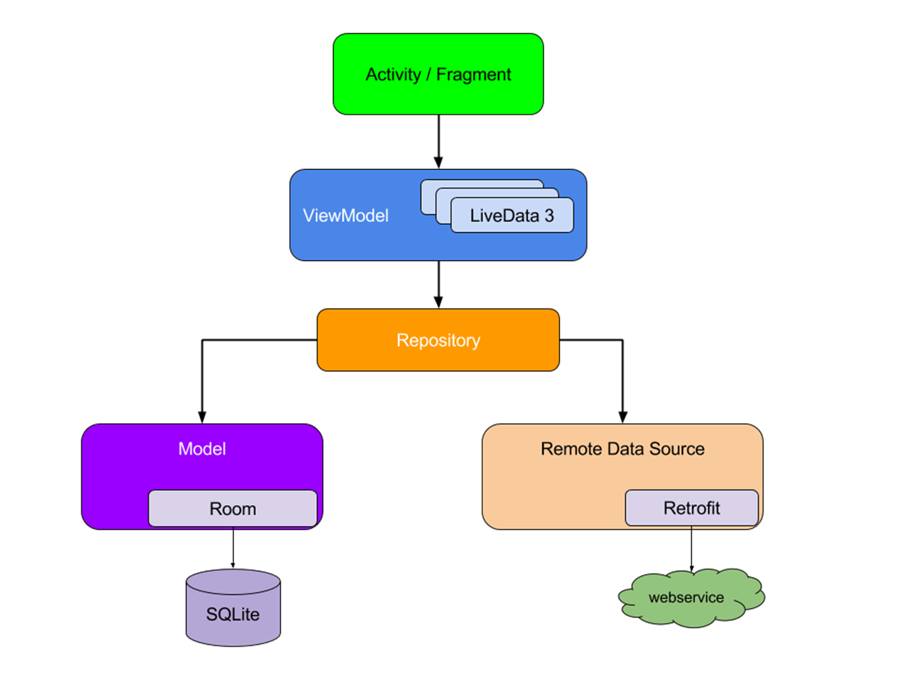
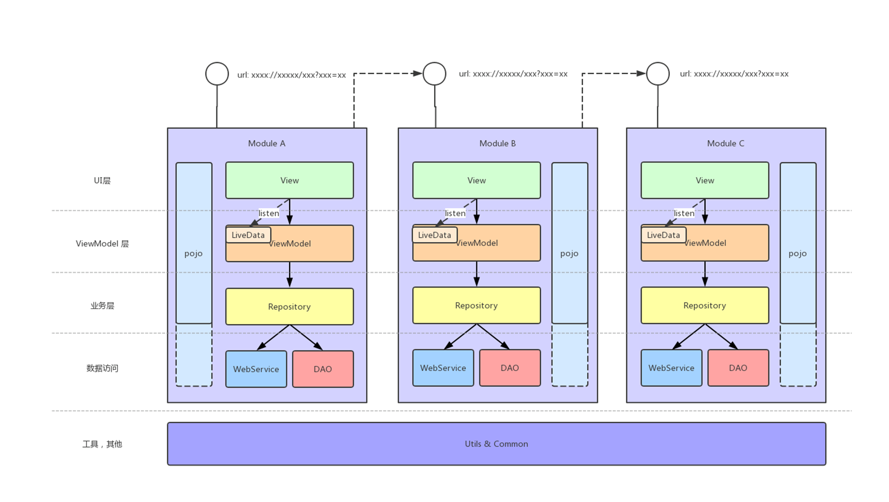

# MVVM

# 数据驱动视图
类似一个 状态存储器 ， 它存储着UI中各种各样的状态

# 背景

- 说到MVVM就不得不提Google在2015年IO大会上提出的DataBinding库，它的发布直接促进了MVVM在Android领域的发展，开发者可以直接通过将数据状态通过 伪Java代码 的形式绑定在xml布局文件中，从而将MVVM模式的开发流程形成一个 闭环

- 数据绑定 的库至少还有官方的DataBinding可供参考，ViewModel的规范化则是非常困难——基于ViewModel层进行状态的管理这个基本的约束，不同的项目、不同的依赖库加上不同的开发者，最终代码中对于 状态管理 的实现方式都有很大的不同。

--

# 改进

- 更规范化接口

    - 新的ViewModel组件直接对ViewModel层进行了标准化的规范，即使用ViewModel(或者其子类AndroidViewModel)。

    - 同时，Google官方建议ViewModel尽量保证 纯的业务代码，不要持有任何View层(Activity或者Fragment)或Lifecycle的引用，这样保证了ViewModel内部代码的可测试性，避免因为Context等相关的引用导致测试代码的难以编写（比如，MVP中Presenter层代码的测试就需要额外成本，比如依赖注入或者Mock，以保证单元测试的进行）。

- 更便于保存数据

    - 由系统响应用户交互或者重建组件，用户无法操控。当组件被销毁并重建后，原来组件相关的数据也会丢失——最简单的例子就是屏幕的旋转

- 更方便UI组件之间的通信

    - fragment和activity

--

# 源码

- setRetainInstance(boolean) 是Fragment中的一个方法。将这个方法设置为true就可以使当前Fragment在Activity重建时存活下来

--

# MVC

- 没有一个标准架构, 不同的人能设计出不同的MVC架构.Actvity到底属于View还是Controller?

--

# MVP
被广泛用于便捷自动化单元测试和在呈现逻辑中改良分离关注点（separationof concerns）。

- 内存泄露，p层有view的引用，如果有耗时操作，但又关闭了activity就会发生内存泄露

--

# MVVM
MVVM的视图模型(ViewModel)是一个值转换器，[1] 这意味着视图模型(ViewModel)负责从模型中暴露（转换）数据对象，以便轻松管理和呈现对象。视图模型(ViewModel)比视图做得更多，并且处理大部分视图的显示逻辑。

- 工程设计

- 框架设计

- 消息

    - 使用响应式编程（RxJava）作为层与层之间数据的传递

    - 使用LiveData作为ViewModel通知UI的桥梁

--

# LiveData

- 如何避免内存泄漏的，本质就是利用了Jetpack 架构组件中的另外一个成员—— Lifecycle。observe->LifecycleBoundObserver。

# Lifecycle
它持有关于组件（如 Activity 或 Fragment）生命周期状态的信息，并且允许其他对象观察此状态。

