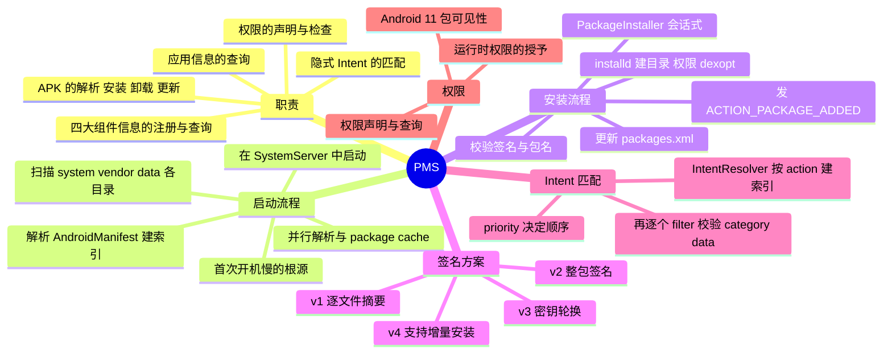

# PMS（PackageManagerService）



> PMS 是"**安装与查询一切应用信息**"的中枢：系统启动时它把所有 APK 解析成内存中的数据结构，运行时所有"这个包存不存在、这个 Intent 谁能接、这个权限你有没有"的问题都由它回答。它也是最容易被误解的服务——应用侧 `PackageManager` 的每一次查询，其实都是一次跨进程 Binder 调用。

---

## 一、职责与位置

| 职责 | 说明 |
| --- | --- |
| 包管理 | APK 的解析、安装、卸载、更新、清理 |
| 组件注册 | 维护系统中所有 Activity/Service/Receiver/Provider 的信息（`ActivityInfo`、`ServiceInfo`…） |
| Intent 解析 | 隐式 Intent 究竟能匹配到哪些组件（`resolveActivity`、`queryIntentActivities`） |
| 权限 | 权限的声明（`<permission>`）、使用（`<uses-permission>`）、检查（`checkPermission`） |
| 应用信息 | `PackageInfo`、`ApplicationInfo`、`ResolveInfo` 等数据全部来自 PMS |

关键类与数据：

- 运行在 **system_server**，应用侧接口是 `PackageManager`（实现 `ApplicationPackageManager`），跨进程接口是 `IPackageManager`；
- `Settings`：把包与权限的持久状态写到 **`/data/system/packages.xml`**（另有 `packages.list` 等），这是"应用装过什么"的权威记录；
- `Installer`：PMS 与 **installd** 之间的通道。installd 是 init 启动的 native 进程，负责那些需要 root 权限的脏活（建目录、chown/chmod、调 dex2oat）——PMS 通过 **LocalSocket** 与它通信；
- **IntentResolver**：PMS 对每一类组件各维护一个解析器（`mActivities`/`mServices`/`mReceivers`/`mProviders`），内部按 action 建索引；
- 版本演进：Android 11 起 PMS 内部大幅拆分（解析、权限、扫描分属不同类），Android 13 把 `PackageParser` 重构为 `ParsingPackageUtils`，并用 `AndroidPackage` 接口取代原来的 `PackageParser.Package`。

---

## 二、启动：扫描与解析

### 1. 启动时机

`SystemServer` 启动引导服务时调用 `PackageManagerService.main()`——**PMS 是最早启动的系统服务之一**，因为 AMS、WMS 等都要依赖它（比如 AMS 启动时就要知道有哪些应用）。

### 2. 扫描哪些目录

| 目录 | 内容 |
| --- | --- |
| `/system/framework` | 系统框架资源包（`framework-res.apk` 等） |
| `/system/app`、`/system/priv-app` | 系统应用（priv-app 拥有特权权限） |
| `/vendor/app`、`/product/app`、`/system_ext/app` | 厂商/产品定制应用 |
| `/data/app` | **用户安装的应用**（安装时 APK 会被拷到这里） |

对每个 APK 做三件事：

1. **解析 AndroidManifest.xml**（编译后是二进制 AXML）：包名、版本、四大组件、权限、签名、`sharedUserId` 等，生成 `AndroidPackage`；
2. **校验签名**（`collectCertificates`）；
3. **建立内存索引**：塞进 `mPackages`（包名 → 包对象）与各类 `IntentResolver`。

### 3. 为什么第一次开机那么慢

- 全量扫描 + 逐个解析 APK（系统应用数量在旗舰机上早就过百）+ 签名校验；
- 用户数据分区首次挂载时还要对应用做 **dexopt**（`dex2oat` 把 dex 编译成 oat，是重 IO/CPU 操作）；
- 优化手段：**并行解析**（Android 10 起 `ParallelPackageParser` 多线程解析）、**package cache**（把解析结果缓存起来，下次启动直接复用，只对变化的包重新解析）。

> 这也解释了"应用装得越多，开机越慢"的体感：扫描、索引、内存占用都随包数量线性上升。

---

## 三、APK 的安装流程

### 1. 会话式安装

Android 的安装不是"一条命令"，而是**会话（Session）模型**，由 `PackageInstaller` 驱动：

```
创建会话 PackageInstaller.createSession()
  → 写入 APK（拷到 /data/app/vmdl<sessionId>.tmp）
  → commit() 提交：PMS 真正处理这次安装
```

好处是支持分阶段写入、断点续传（应用商店边下边装）与增量安装。

### 2. PMS 侧做了什么

```
PackageInstallerSession.commit()
  → 校验：包名合法性、签名、版本（是否降级）、与已安装版本的签名是否一致
  → 通过 installd：创建应用数据目录 /data/data/<pkg>、设置 uid/gid 与权限
  → 把 APK 移到 /data/app/<pkg>-<随机串>/base.apk
  → dexopt：由 installd 调用 dex2oat 生成 oat（安装时或首次运行时的策略取决于系统配置）
  → 更新 Settings（/data/system/packages.xml）与内存索引（mPackages、IntentResolver）
  → 通知 AMS 等服务的相关状态，发送 ACTION_PACKAGE_ADDED 广播
```

常见失败原因：

| 错误码 | 含义 |
| --- | --- |
| `INSTALL_FAILED_UPDATE_INCOMPATIBLE` | 已安装版本的签名与新包不一致（最常见的"卸载重装才行"） |
| `INSTALL_FAILED_VERSION_DOWNGRADE` | 版本降级（需要 `-d` 或系统允许） |
| `INSTALL_FAILED_ALREADY_EXISTS` | 包已存在 |
| `INSTALL_PARSE_FAILED_*` | 包解析失败（manifest 损坏、格式非法） |

### 3. 签名校验：v1 → v4

| 方案 | 起始版本 | 原理 | 特点 |
| --- | --- | --- | --- |
| v1（JAR 签名） | 早期 | 对 APK 内每个文件分别计算摘要 | 逐文件校验，慢；存在 Janus 等绕过风险 |
| v2 | Android 7.0 | 对**整个 APK** 的二进制内容签名 | 校验快、防篡改（改一个字节签名就失效） |
| v3 | Android 9.0 | 在 v2 基础上支持**密钥轮换** | 换签名密钥时旧版本仍可升级 |
| v4 | Android 11 | 签名信息放在独立的 `.apk.idsig` 文件 | 配合增量安装（Incremental FS），无需完整下载即可安装 |

- 校验的核心是"**同一包名的升级必须由相同的签名密钥签名**"——这就是覆盖安装失败的头号原因，也是"包名 + 签名"共同构成应用身份的原因；
- 系统应用的签名校验更严格（`/system/priv-app` 的特权应用签名必须与系统一致）。

---

## 四、Intent 的解析（隐式启动）

`startActivity` 传一个隐式 Intent 时，ATMS 会向 PMS 询问"谁能接"：

```
ATMS → PMS.resolveIntent() → ActivityIntentResolver.queryIntent()
   → 按 action 从索引里取出候选 filter 集合
   → 逐个校验 category 是否全部命中、data（scheme/host/port/path/mimeType）是否匹配
   → 按 priority 排序，返回 ResolveInfo 列表
```

- **`IntentResolver` 的索引结构是关键**：它内部是 `ArrayMap<String action, ArrayList<Filter>>`，所以匹配不是"遍历所有组件"，而是"按 action 取候选集再逐个校验"——这也是为什么声明了越通用的 action（如 `android.intent.action.VIEW`），匹配代价越大；
- 匹配规则与 Manifest 中 `intent-filter` 的三要素一致（Action/Category/Data），详见 [Activity 的隐式启动](../Activity/Activity.md)；
- 匹配不到任何目标时，`startActivity` 抛 `ActivityNotFoundException`；
- 应用侧常用的 `PackageManager.queryIntentActivities`、`resolveActivity` 走的就是同一条路。

---

## 五、权限与包可见性

- **声明与查询**：`<permission>`、`<uses-permission>` 的解析与 `checkPermission(uid, 权限)` 都由 PMS 负责；PMS 里维护着"哪个 uid 拥有哪些权限"的映射，AMS 做权限检查时会问它；
- **运行时权限**：Android 6.0 起危险权限需要动态申请，实际的授予/撤销由 **PermissionManagerService** 管理（它和 PMS 同属包与权限体系），授权结果同样落在 `packages.xml` 中；
- **包可见性（Android 11）**：应用默认只能"看到"自己和部分系统应用，要查询其他应用的组件必须在 Manifest 中声明 `<queries>`（或使用特定交互触发可见性），这是防止应用枚举用户已装应用的隐私保护措施，也是不少第三方库在 Android 11 上升级后"查不到包"的根因。

---

## 六、面试高频问答

### 1. 说说 APK 的安装流程？

`PackageInstaller` 创建会话并写入 APK → `commit()` 后交给 PMS → PMS 校验包名/签名/版本 → 通过 installd 创建应用数据目录、搬移 APK 到 `/data/app`、执行 dexopt → 更新 `packages.xml` 与内存索引 → 通知 AMS 并发送 `ACTION_PACKAGE_ADDED` 广播。整个过程是**跨进程（App → system_server）+ 跨进程（PMS → installd）**的协作。

### 2. PMS 启动时做了什么？为什么第一次开机慢？

扫描 `/system`、`/vendor`、`/product`、`/data/app` 等目录下的全部 APK，逐个解析 AndroidManifest（二进制 AXML）、校验签名、建立包与组件的内存索引，并对需要的应用执行 dexopt。慢的原因是**全量扫描 + 解析 + dexopt 都是重 IO/CPU 操作**；优化手段是并行解析（Android 10+）和 package cache 复用上次结果。

### 3. 隐式 Intent 是怎么匹配到组件的？

ATMS 把 Intent 交给 PMS，PMS 的 `IntentResolver` 先按 action 从索引中取出候选 IntentFilter 集合（不是遍历全部组件），再逐个校验 Category 是否全包含、Data（scheme/host/port/path/mimeType）是否匹配，最后按 priority 排序返回 `ResolveInfo` 列表。匹配不到就抛 `ActivityNotFoundException`。

### 4. 签名校验有哪几种方案？

v1 是 JAR 签名，逐文件计算摘要，慢且存在绕过风险；v2（7.0）对整包二进制签名，校验快、防篡改；v3（9.0）支持密钥轮换；v4（11）把签名信息放到独立的 `.idsig` 文件，用于支持增量安装。核心约束是：**同一包名的升级必须使用相同的签名**，否则报 `INSTALL_FAILED_UPDATE_INCOMPATIBLE`。

### 5. 应用的身份由什么决定？

**包名 + 签名**。包名决定"是谁"，签名决定"是不是同一个作者"，二者共同决定能否覆盖安装、共享数据（同 `sharedUserId`）、以及系统的信任级别（系统应用/特权应用）。

### 6. PMS 和 AMS 的关系？

PMS 负责"有哪些组件、谁能接这个 Intent、这个 uid 有什么权限"，AMS 负责"组件的生命周期与进程调度"。`startActivity` 的流程里 AMS 会调 PMS 解析 Intent；应用安装完成后 PMS 会通知 AMS 更新 uid/包相关状态；权限检查也由 AMS 委托 PMS 完成。

### 7. 为什么插件化要 hook PMS？

传统插件化（DroidPlugin、VirtualAPK 等）想让"没安装的 APK 里的 Activity 也能启动"，就必须骗过两个服务：用动态代理替换 `IActivityManager`，把 Intent 的目标改写成宿主中预埋的 StubActivity；同时向 PMS 的包/组件集合中反射注入插件信息，让系统"以为"插件已安装。这套方案依赖大量隐藏 API 和系统内部实现，Android 9 的隐藏 API 限制之后基本退出历史舞台，现在更多用预注册 Stub + 代理分发，或官方 App Bundle 等方案。

### 8. Android 11 的包可见性是什么？

应用默认只能看到自己和部分系统应用，查询其他应用（`getPackageInfo`、`queryIntentActivities`）需要先在 Manifest 用 `<queries>` 声明，或通过特定交互（启动、绑定等）获得可见性。目的是限制应用枚举用户安装了哪些应用（隐私），代价是很多"检测某 App 是否安装"的老代码要改造。

### 9. 为什么应用装得越多、开机越慢？

开机时 PMS 要对所有已安装应用做扫描与索引，数量越多，解析耗时与内存占用越大；部分应用还需要 dexopt（编译成机器码）。这也是厂商推出"应用预编译/云编译"和系统做 package cache 的原因。

### 10. dexopt 是什么？什么时候发生？

`dexopt` 是把 APK 中的 dex 字节码通过 `dex2oat` 编译成 oat（含机器码）的过程，目的是省掉运行时的 JIT 预热、加快启动。触发时机由系统的编译策略决定：安装时（install-time）、空闲时（background dexopt）、首次运行时（speed-profile）等。Android 10 之后 Google Play 还会在云端做部分编译（cloud profiles），把结果随安装一起下发。
