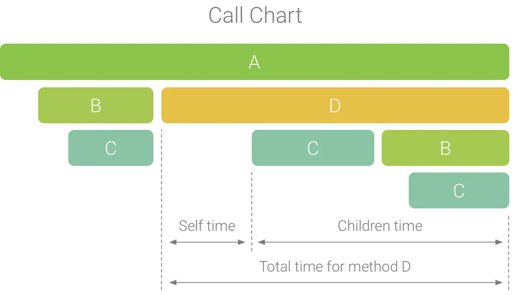
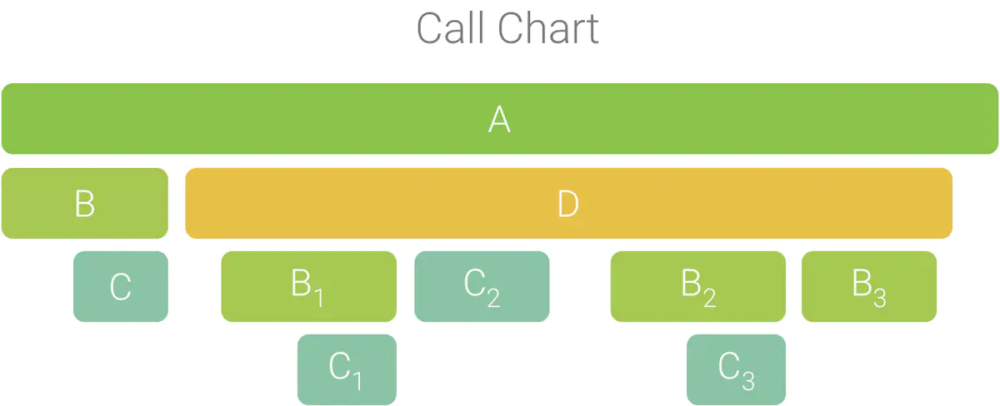
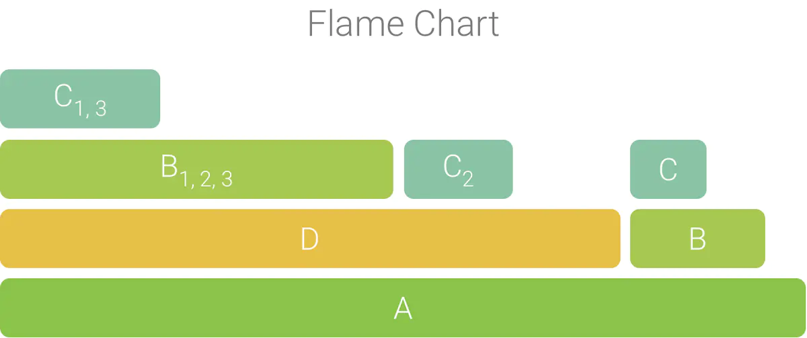
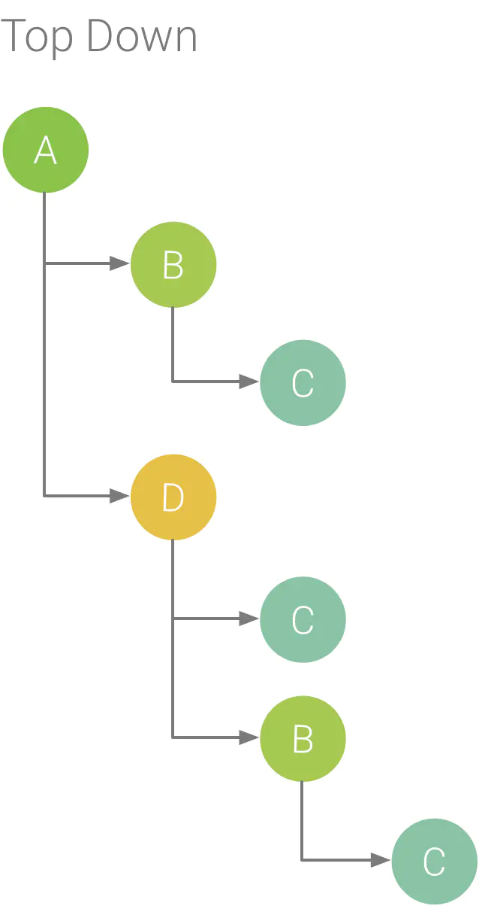
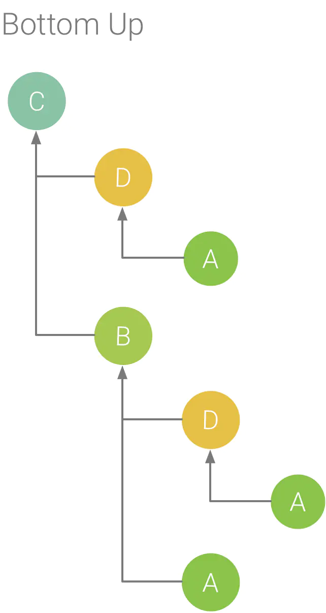

# Profiler

## CPU

- Call Chart是方法调用的图形化表示，水平方向代表方法调用，垂直方向是它的子函数。黄色代表系统APIs函数，绿色代表app自己的函数

- Flame Chart提供了调用栈的反向调用图，Flame Chart中的水平条表示出现在相同的调用序列中同一方法的执行时间，从图中我们很容易发现哪个方法消耗的时间最多。

    - 为了理解Flame Chart，考虑下面的Call Chart，在方法D中多次调用方法B(B1,B2,B3), 方法B又多次调用方法C(C1,C2)。

    - 使用聚合后的方法创建Flame Chart，在Flame Chart中，消耗CPU时间最多的被调用函数首先出现

- Top Down表显示一系列可以查看子函数的方法列表，如下图所示，箭头从调用者指向被调用者。

    - Self: 执行方法自身代码消耗的时间，不包括子函数

    - Children: 执行子函数代码消耗的时间，不包括自身代码

    - Total: Self + Children

- Bottom Up树显示一系列可以查看父函数的方法列表，如下图所示,展开方法C能看到它的父函数B和D

    - Self表示执行自身代码所消耗的时间，不包括子函数。与Top Down树相比，它代表了整个记录期间所有该方法执行的总时间

    - Children代表所有子函数的执行时间，与Top Down树相比，它代表了整个记录期间所有该方法的子方法执行的总时间

## Memory Profiler

- Instance View

    - Depth：从任意 GC 根到选定实例的最短跳数。

    - Native Size：原生内存中此实例的大小。 只有在使用 Android 7.0 及更高版本时，才会看到此列。

    - Shallow Size：Java 内存中此实例的大小。

    - Retained Size：此实例所支配内存的大小

- 在您的堆转储中，请注意由下列任意情况引起的内存泄露：

    - 长时间引用 Activity、Context、View、Drawable 和其他对象，可能会保持对 Activity 或 Context 容器的引用。

    - 可以保持 Activity 实例的非静态内部类，如 Runnable。

    - 对象保持时间比所需时间长的缓存。

- MAT,将 HPROF 文件从 Android 格式转换为 Java SE HPROF 格式

- 分析内存的技巧

    - 在不同的 Activity 状态下，先将设备从纵向旋转为横向，再将其旋转回来，这样反复旋转多次。旋转设备经常会使应用泄露 Activity、Context 或 View 对象，因为系统会重新创建 Activity，而如果您的应用在其他地方保持对这些对象其中一个的引用，系统将无法对其进行垃圾回收。

    - 在不同的 Activity 状态下，在您的应用与其他应用之间切换（导航到主屏幕，然后返回到您的应用）。

