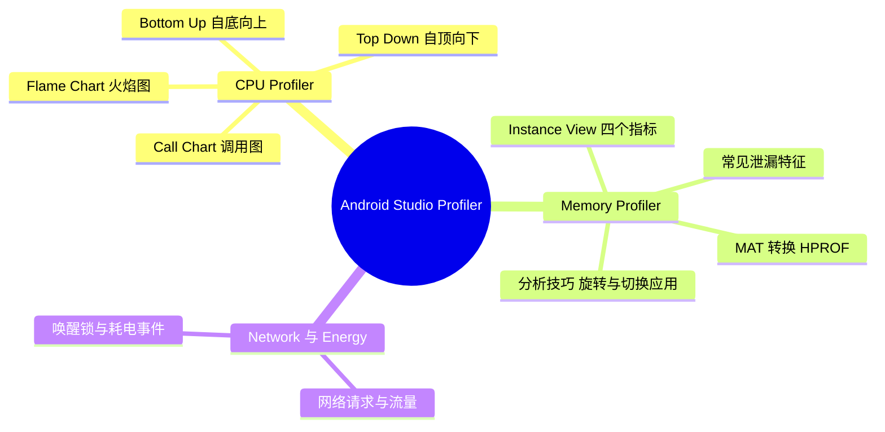
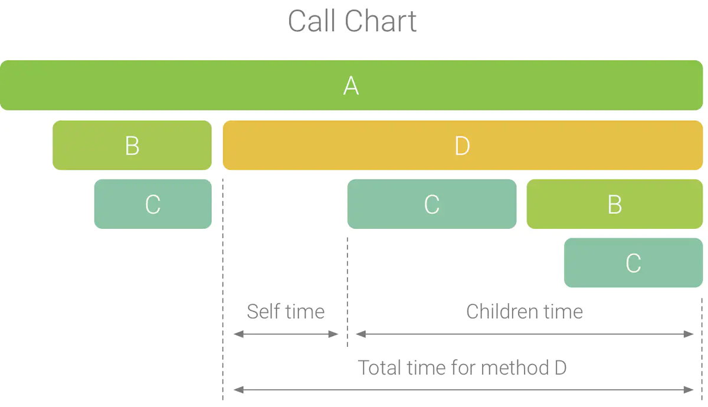
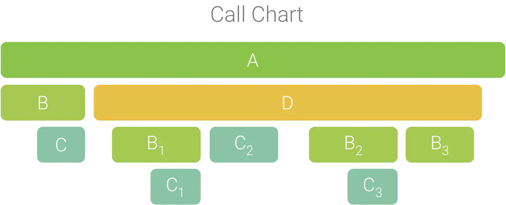
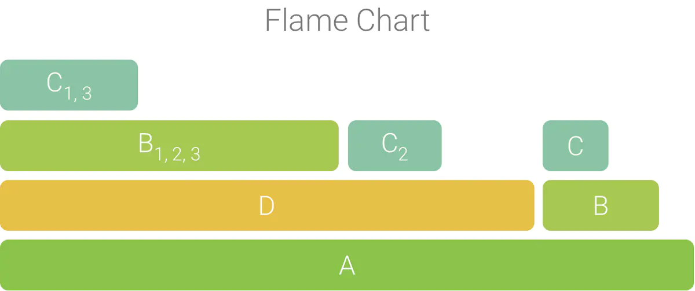
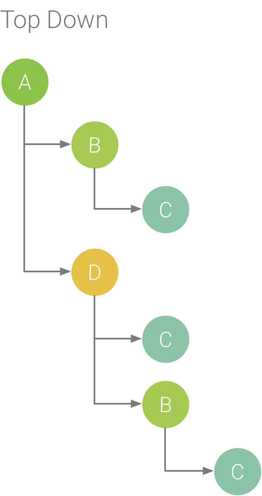
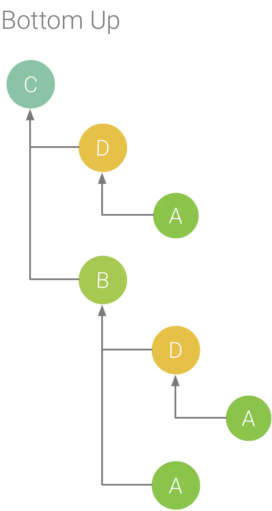

# Profiler

```mermaid
mindmap
  root((Android Studio Profiler))
    CPU Profiler
      Call Chart 调用图
      Flame Chart 火焰图
      Top Down 自顶向下
      Bottom Up 自底向上
    Memory Profiler
      Instance View 四个指标
      常见泄漏特征
      MAT 转换 HPROF
      分析技巧 旋转与切换应用
    Network 与 Energy
      网络请求与流量
      唤醒锁与耗电事件
```

---

## 一、CPU Profiler

### 1. Call Chart

Call Chart 是方法调用的图形化表示，水平方向代表方法调用，垂直方向是它的子函数。**黄色代表系统 APIs 函数，绿色代表 app 自己的函数**。

### 2. Flame Chart

Flame Chart 提供了调用栈的**反向调用图**，其中的水平条表示出现在相同的调用序列中同一方法的执行时间，从图中我们很容易发现哪个方法消耗的时间最多。

- 为了理解 Flame Chart，考虑下面的 Call Chart：在方法 D 中多次调用方法 B（B1、B2、B3），方法 B 又多次调用方法 C（C1、C2）。

- 使用聚合后的方法创建 Flame Chart，在 Flame Chart 中，消耗 CPU 时间最多的被调用函数首先出现。

### 3. Top Down 表

Top Down 表显示一系列可以查看子函数的方法列表，箭头从调用者指向被调用者。

- **Self**：执行方法自身代码消耗的时间，不包括子函数；
- **Children**：执行子函数代码消耗的时间，不包括自身代码；
- **Total**：Self + Children。

### 4. Bottom Up 树

Bottom Up 树显示一系列可以查看父函数的方法列表，展开方法 C 能看到它的父函数 B 和 D。

- **Self**：执行自身代码所消耗的时间，不包括子函数。与 Top Down 树相比，它代表了整个记录期间**所有**该方法执行的总时间；
- **Children**：所有子函数的执行时间。与 Top Down 树相比，它代表了整个记录期间所有该方法的子方法执行的总时间。

---

## 二、Memory Profiler

### 1. Instance View

- **Depth**：从任意 GC 根到选定实例的最短跳数；
- **Native Size**：原生内存中此实例的大小。只有在使用 Android 7.0 及更高版本时，才会看到此列；
- **Shallow Size**：Java 内存中此实例的大小；
- **Retained Size**：此实例所支配内存的大小。

### 2. 堆转储中需要留意的内存泄漏特征

- 长时间引用 Activity、Context、View、Drawable 和其他对象，可能会保持对 Activity 或 Context 容器的引用；
- 可以保持 Activity 实例的非静态内部类，如 Runnable；
- 对象保持时间比所需时间长的缓存。

### 3. MAT

MAT 可以将 HPROF 文件从 Android 格式转换为 Java SE HPROF 格式，再进行支配树、泄漏 suspects 等分析。

### 4. 分析内存的技巧

- 在不同的 Activity 状态下，先将设备从纵向旋转为横向，再旋转回来，这样反复旋转多次。旋转设备经常会使应用泄漏 Activity、Context 或 View 对象，因为系统会重新创建 Activity，而如果您的应用在其他地方保持对这些对象其中一个的引用，系统将无法对其进行垃圾回收；
- 在不同的 Activity 状态下，在应用与其他应用之间切换（导航到主屏幕，然后返回到应用），观察对象是否被回收。

---

## 三、Network 与 Energy Profiler

- **Network Profiler**：展示应用实时的网络活动，包括连接、请求列表以及发送/接收的字节数，用于定位流量异常、重复请求和未复用的连接；
- **Energy Profiler**：展示设备上发生的能耗事件（唤醒锁、Alarm、Job、位置、网络等），用于定位后台耗电与不必要的唤醒。

---

## 四、30 秒口述版

CPU 分析看四种视图：**Call Chart**（水平是调用、垂直是子函数，黄色系统、绿色应用）、**Flame Chart**（聚合后的反向调用图，一眼看出最耗时的方法）、**Top Down**（从调用者往下看子函数）和 **Bottom Up**（从被调用者往上看父函数），Self / Children / Total 三个指标要能区分。内存分析重点看 Instance View 的 Depth / Native Size / Shallow Size / Retained Size，堆转储里警惕长期持有 Activity、Context、View、Drawable 的引用和非静态内部类，配合 MAT 转换 HPROF 分析；实践中反复旋转屏幕、切换应用是最容易暴露 Activity 泄漏的操作。
