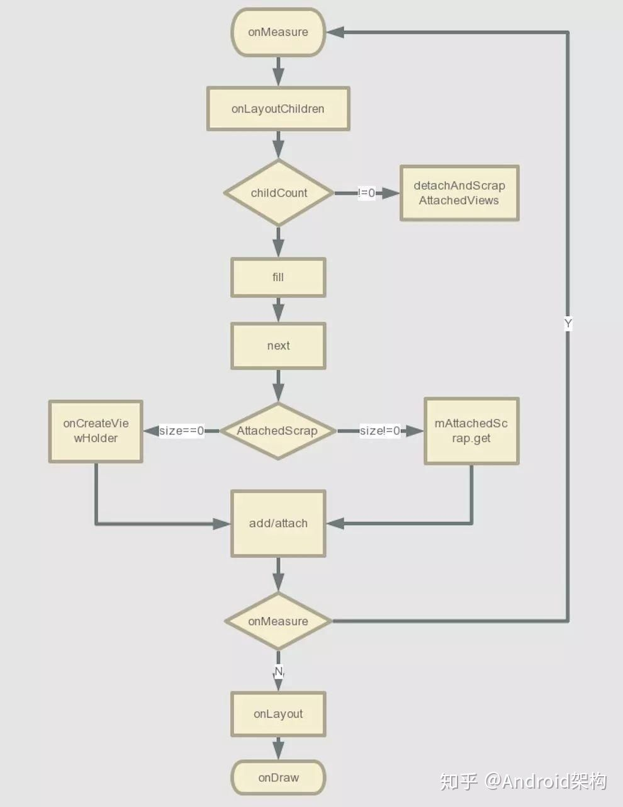

# Recycleview


## 第一部分：核心原理

### 1. 整体架构四大组件（设计思想）

RecyclerView 采用**组件化插拔式设计**，各模块职责解耦：

1. **Adapter**：数据适配器，负责创建 ViewHolder、绑定数据到 ViewHolder。
2. **ViewHolder**：视图缓存容器，缓存 item 内控件引用，避免重复 findViewById。
3. **LayoutManager**：布局、滚动、回收核心，控制 item 测量、摆放、滑动、视图回收复用。内置 Linear、Grid、Staggered 瀑布流，支持自定义。
4. **ItemDecoration**：装饰组件，绘制分割线、背景等；`onDraw`绘制在 item 下层，`onDrawOver`绘制在 item 上层。

> 
> 核心设计思想：视图复用、数据绑定、布局逻辑三者分离，扩展性强。

---

### 2. 四级缓存完整原理（重点）



- 获取的实现在Recycler类中的tryGetViewHolderForPositionByDeadline(int position,boolean dryRun,long deadlineNs)方法

    - 第一步先从getChangedScrapViewForPosition(position)查找mChangedScrap

    - 第二步，如果没有找到视图则从getScrapOrHiddenOrCachedHolderForPosition这个方法中继续找。这个方法的代码就不贴了，简单说下这里的查找顺序：

         - 首先从mAttachedScrap中查找

         - 再次从前面略过的ChildHelper类中的mHiddenViews中查找

         - 最后是从mCachedViews中查找的

    - 第三步， mViewCacheExtension中查找，我们说过这个对象默认是null的，是由我们开发者自定义缓存策略的一层，所以如果你没有定义过，这里是找不到View的。

    - 第四步，从RecyclerPool中查找，前面我们介绍过RecyclerPool,先通过itemType从SparseArray类型的mscrap中拿到ScrapData，不为空继续拿到scrapHeap这个ArrayList，然后取到视图，这里拿到的视图需要重新绑定。

    - 第五步，如果前面几步都没有拿到视图，那么调用了mAdapter.createViewHolder(RecyclerView.this, type)方法，这个方法内部调用了一个抽象方法onCreateViewHolder,是不是很熟悉，没错，就是我们自己写一个Adapter要实现的方法之一。

- 存缓存是调用了 Adapter 的 notifyXxx 方法，这时候就会调用到 Recycler 的 scrapView 方法把屏幕上所有的 ViewHolder 回收到 mAttachedScrap 和 mChangedScrap，区别这两种是看 ViewHolder 是否发生了变化。二级缓存和四级缓存是再重新布局时会发生，或者是在复用时，一级缓存的 ViewHolder 失效了就会移至二级缓存，二级缓存满了就移至 RecyclerViewPool。

**源码入口方法：`tryGetViewHolderForPositionByDeadline()`**
查找顺序：**mAttachedScrap → mChangedScrap → mCachedViews → mViewCacheExtension → RecycledViewPool**

> 
> 概念区分
> Scrap：item 只是临时从布局树 detach，View 仍然依附 RecyclerView，**复用不需要 onBindViewHolder**；仅在本次 layout 布局周期生效。
> Recycle：item 已经彻底滑出屏幕，完全 detach；取出复用一般需要重新绑定数据。

#### ① Scrap 缓存（mAttachedScrap + mChangedScrap）

- 使用场景：屏幕可见 item 发生重布局，如`notifyItemChanged`触发刷新。
- mAttachedScrap：屏幕内 item 临时剥离布局树，按 position 精准匹配，**无需 onBind**，本次 layout 结束清空，滑出屏幕的 item 不会进入这里。
- mChangedScrap：存放屏幕内标记为变更的 item，需要执行 onBind，支持 Payload 局部刷新。

> 
> Scrap 不是滑动缓存，只服务布局重建。

#### ② mCachedViews（滑动缓存）

- 使用场景：手指滑动时，刚刚滑出屏幕的 item。
- 存储：ArrayList，FIFO 队列，默认容量 2，可以通过`setItemViewCacheSize()`修改。队列满后，最早的 ViewHolder 会被挤入 RecycledViewPool。
- 匹配规则：position + viewType 必须同时匹配。
- 是否 bind：❌ 不需要 onBind，保留原有数据。
- 作用：短距离来回滑动时直接复用，提升滑动流畅度；仅属于当前 RV，不可跨 RV 共享。

#### ③ mViewCacheExtension 自定义扩展缓存

系统空实现，留给业务自定义缓存逻辑，业务开发几乎不用。

#### ④ RecycledViewPool（兜底缓存）

- 使用场景：远距离滑出屏幕、被 mCachedViews 淘汰的 ViewHolder。
- 存储结构：`HashMap<viewType, ArrayList<ViewHolder>>`，按 viewType 分组，每种 viewType 默认最多缓存 5 个 VH。
- 匹配规则：**只匹配 viewType，不关心 position**。
- 是否 bind：✅ 必须执行 onBindViewHolder；取出时重置 ViewHolder，清空旧数据。
- 核心特性：**支持多个 RecyclerView 共享同一个 Pool**，典型场景 ViewPager 多页面列表，减少 inflate 开销。

##### 完整 ViewHolder 查找流程

```
根据目标position查找ViewHolder
1. 优先查询mChangedScrap，命中直接返回
2. 查询mAttachedScrap，position匹配直接返回，无需bind
3. 查询mCachedViews，position+viewType匹配直接返回，无需bind
4. 调用mViewCacheExtension自定义获取ViewHolder
5. 前面全部未命中 → 去RecycledViewPool取同viewType的VH
   · 获取成功：复用View外壳，必须执行onBindViewHolder
   · 获取失败：执行onCreateViewHolder，inflate创建全新itemView
```

---

### 3. DiffUtil 完整原理

#### 作用

对比新旧两份 List 数据集，基于**Myers 差分算法**，自动计算出新增、删除、修改、移动的 item 差异。

#### 核心优势

1. 在**子线程**计算差异，不阻塞主线程；
2. 只刷新发生变化的 item，其余缓存保留；
3. 自动调用局部 notify 方法，自带 ItemAnimator 动画；
4. 支持 Payload，实现 item 内部局部 UI 刷新。

#### 两个核心抽象方法

```
// 判断两个对象是否是同一个数据实体（根据唯一id）
public abstract boolean areItemsTheSame(T oldItem, T newItem);
// 如果是同一个实体，判断内容是否发生变化
public abstract boolean areContentsTheSame(T oldItem, T newItem);
```

- `areItemsTheSame`：身份判断，返回 true 才会执行`areContentsTheSame`；返回 false 判定为增删移动。
- `areContentsTheSame`：同一条数据，对比内容是否变更。
- 可选`getChangePayload()`：仅部分字段变更时，返回变更信息，实现增量刷新。

> 
> 重载`onBindViewHolder(holder, payloads)`接收 payload，只更新对应控件，不整 item 刷新。

#### ListAdapter 封装原理

ListAdapter 是系统对 DiffUtil 的封装，内部自动管理 Diff 任务。调用`submitList(newList)`，自动在后台线程做 diff，主线程完成刷新，业务代码更简洁。

#### Myers 算法原理

寻找新旧列表的最长公共子序列，公共部分保留不变；剩余差异部分识别为新增、删除、移动、修改，时间复杂度 O (N)。

---

### 4. Prefetch 预取 & GapWorker 原理

RV 默认开启预取。利用**两次 Vsync 信号之间主线程空闲时间**，提前创建、绑定屏幕外 1~2 个 item，预加载到 mCachedViews。

- GapWorker：主线程任务，负责调度预取任务；
- 收益：滑动到目标位置直接命中缓存，减少 inflate 和 bind 耗时，降低掉帧；
- 关闭：`setItemPrefetchEnabled(false)`

### 5. RecyclerView 嵌套 RecyclerView 复用原理

> 
> 场景：外层 RV 列表，item 内部嵌套横向 / 纵向内层 RecyclerView（卡片横向列表）

1. 内层 RV 是外层 itemView 的子 View，**会跟随外层 ViewHolder 一起被复用，不会每次新建 RecyclerView 实例**。
2. 外层滑动，外层 item 滑出屏幕，外层 VH 回收；当该 VH 复用到新 position 时，内层 RV 还是原来对象，只是要绑定全新数据。
3. 内层 RV 自身也拥有独立四级缓存与私有`RecycledViewPool`。

**复用带来原生问题**

1. **旧数据残留**：外层 VH 复用时，内层 RV 保留上一份数据，出现短暂闪旧 UI；
2. **滚动位置残留**：内层 RV 记录上次滚动偏移，复用时滚动位置没有归零；
3. **内存压力大**：每一个内层 RV 持有独立 Pool，大量内层 RV 会堆积大量 ViewHolder，容易 OOM；
4. **缓存池错乱**：不同内层 RV 的 ViewHolder 混入，viewType 冲突会 UI 错乱、崩溃；
5. **嵌套滑动冲突**：内外 RV 都消费滑动事件，出现滑动卡顿、不灵敏。

**三种业务实现方案**

1. **方案一：内层 RV 实例跟随外层 VH 复用，onBind 重置状态（中小列表）**

> 
> onCreateViewHolder 中一次性初始化内层 RV、LayoutManager、内层 Adapter；**不要在 onBind 中 new 内层 RV/Adapter**。
> onBindViewHolder 只做三件事：重置滚动位置`scrollToPosition(0)`、提交新数据、更新其他控件。
> 缺点：每个内层 RV 独立缓存池，大量 item 场景内存高。

2. **方案二：所有内层 RV 共享同一个 RecycledViewPool（性能最优，推荐）**
全局构造一份共享`RecycledViewPool`，所有内层 RV 统一`setRecycledViewPool(sharedPool)`。

> 
> 优点：减少内层 ViewHolder 对象创建，降低内存，缓存复用率高。
> ⚠️硬性约束：**所有内层 item 的 viewType 必须全局唯一**，不同布局不能复用同一个 type，否则布局错乱崩溃。

3. **方案三：关闭内层 RV 缓存（兜底，不推荐）**
`setItemViewCacheSize(0)`、`setRecycledViewPool(null)`；消除数据残留，但每次进出屏幕都要 inflate，滑动卡顿，仅适合 item 极少场景。

**必做避坑要点**

- onCreateViewHolder 初始化内层 RV，onBind 只更新数据，禁止重复 new；
- 每次 bind 重置内层 RV 滚动位置；
- 内层优先使用`ListAdapter+DiffUtil`，避免 notifyDataSetChanged 闪烁；
- 共享 Pool 严格管控全局 viewType；
- 区分滑动方向处理嵌套触摸冲突。

---

## 第二部分：高频面试题

### Q1：四级缓存每一级区别、是否 bind、适用场景？

1. Scrap 缓存：屏幕内重布局临时复用，按 position 匹配，免 bind；仅布局阶段生效。
2. mCachedViews：刚滑出屏幕 item，position+viewType 匹配，免 bind；优化短距离来回滑动。
3. mViewCacheExtension：自定义扩展缓存，业务极少使用。
4. RecycledViewPool：兜底缓存，仅匹配 viewType，必须 bind；支持多 RV 共享。

### Q2：Scrap 和 RecycledViewPool 的本质区别？

- Scrap：View 没有离开 RecyclerView，只是临时 detach；复用原有数据，免 bind；仅本次 layout 有效。
- RecycledViewPool：item 已经彻底滑出 RV；只复用 View 外壳，数据清空，必须 bind；可以跨 RV 共享。

### Q3：mCachedViews 设置容量是不是越大越好？

不是。容量增大可以提升来回滑动缓存命中率，但每个 ViewHolder 持有完整 View 树，占用大量内存；普通列表默认 2 即可，短视频场景一般设置 10~20，需要权衡内存和流畅度。

### Q4：notifyDataSetChanged 为什么性能差？

1. 全部缓存标记失效；
2. 所有 item 重新执行 onBind；
3. 没有 item 动画；
4. 无法做精准局部刷新。

### Q5：DiffUtil 和 notifyDataSetChanged 的对比？

- DiffUtil：子线程差分计算，只刷新变动 item，原有缓存保留，自带动画。
- notifyDataSetChanged：暴力全量刷新，全部缓存失效，无动画，性能差。

### Q6：areItemsTheSame 和 areContentsTheSame 的区别？

`areItemsTheSame`：判断是不是同一个数据实体（一般用唯一 id 判断）；只有返回 true，才会执行`areContentsTheSame`。
`areContentsTheSame`：判断同一个实体的数据内容是否发生变化，用来决定是否刷新 UI。

### Q7：Payload 的作用是什么？

实现 item 内部**增量局部刷新**。只更新发生变化的控件，不用刷新整个 item 视图，减少 bind 开销。

### Q8：setHasFixedSize (true) 原理？

告知 RecyclerView：RecyclerView 本身整体宽高不会随着 item 内容变化。当 item 数据变更时，RV 不会重复调用 requestLayout 测量自身尺寸，减少布局开销。

> 
> ⚠️ item 高度动态变化场景不能开启，会布局错乱。

### Q9：RecyclerView 相比 ListView 为什么更流畅？

1. 四级分层缓存 + 预取机制，视图复用粒度更细；
2. 支持局部刷新、DiffUtil、Payload 增量刷新；
3. 组件解耦，LayoutManager 支持多种布局；
4. 原生实现 NestedScrolling 嵌套滚动协议；
5. 自带 Item 增删动画。

### Q10：RV 滑动时图片错位是什么原因，怎么解决？

原因：ViewHolder 复用机制，异步图片加载回调延迟，旧的 View 被复用于新 position，老图片覆盖新 item。
解决：

1. onBindViewHolder 中先重置图片，设置占位图；
2. Glide/Coil 绑定 itemView 生命周期，滑动暂停图片加载；
3. 添加标记，图片回调时校验标记，不匹配直接丢弃；
4. 异步回调内不要直接操作 ViewHolder。

### Q11：adapterPosition 和 layoutPosition 的区别？

- layoutPosition：当前布局阶段临时位置，数据更新、未完成布局时，值可能不准确。
- adapterPosition：Adapter 数据集里真实的索引，业务逻辑优先使用`getAdapterPosition()`。

### Q12：RecyclerView 卡顿优化方案？

1. item 布局扁平化，减少嵌套，优先使用 ConstraintLayout；合理开启`setHasFixedSize(true)`；
2. 缓存优化：合理调整`setItemViewCacheSize`，多列表共享 RecycledViewPool，保持预取开启；
3. 刷新优化：禁止使用 notifyDataSetChanged，使用 ListAdapter+DiffUtil+Payload 局部刷新；
4. onBindViewHolder 中禁止网络请求、数据库、复杂计算；
5. 动画优化：不需要动画时`setItemAnimator(null)`；ItemDecoration 避免频繁创建对象，降低过度绘制。

### Q13：DiffUtil 有哪些常见坑？

1. 新旧列表不能使用同一个对象引用，否则 DiffUtil 识别不到数据变更；
2. areItemsTheSame 必须使用唯一 ID 判断，不要直接使用 equals；
3. submitList 是异步执行，提交后不能立刻拿到最新列表数据；
4. 上万条大数据量时 Diff 计算耗时，需要分页加载，避免子线程压力过大。

### Q14：RecyclerView 嵌套滑动冲突怎么处理？

1. **外部拦截（推荐）**：父 ViewGroup 重写 onInterceptTouchEvent，DOWN 事件放行，MOVE 根据滑动方向判断是否拦截事件。
2. **内部拦截**：子 RecyclerView 调用`requestDisallowInterceptTouchEvent(true)`禁止父拦截；父 ViewGroup 不能拦截 DOWN 事件。

> 
> 补充：RV 原生实现 NestedScrollingChild，和 CoordinatorLayout/AppBarLayout 配合，是嵌套滚动协议，不是简单的事件拦截。

### Q15：Prefetch 预取、GapWorker 原理？

利用两次 Vsync 信号之间主线程空闲时间，提前 bind 屏幕外即将进入视野的 item，存入 mCachedViews，减少滑动时主线程工作，提升流畅度。

### Q16：外层 RV 嵌套内层 RV，内层 RV 对象会重新创建吗？出现旧数据闪烁怎么处理？

> 
> 答：不会，内层 RV 跟随外层 ViewHolder 一起复用。
> 旧数据闪烁解决方案：

1. onCreateViewHolder 初始化内层 RV 与 Adapter，onBind 只更新数据；
2. onBind 重置内层 RV 滚动位置；
3. 多个内层 RV 共享 RecycledViewPool，保证 viewType 全局唯一；
4. 内层使用 ListAdapter+DiffUtil 局部刷新。

### Q17：嵌套 RV 共享 RecycledViewPool 有什么优缺点？

优点：复用内层 item 的 ViewHolder，减少 View 实例，降低内存占用，缓存命中率更高。
缺点：要求所有内层 item 的 viewType 全局唯一；viewType 重复但布局不一致会 UI 错乱甚至崩溃；需要合理设置池最大缓存数量。

---

## 面试一句话总结（背诵）

RecyclerView 通过四级分层缓存实现细粒度视图复用：Scrap 负责屏幕内局部复用，mCachedViews 优化短距离回滚滑动，RecycledViewPool 作为全局兜底复用池；搭配 DiffUtil 的 Myers 差分算法实现异步精准局部刷新，再结合 Prefetch 预取填补帧率空隙；嵌套 RecyclerView 场景内层 RV 随外层 ViewHolder 复用，通过共享缓存池、重置状态、DiffUtil 刷新解决旧数据、内存过高问题，整体性能优于 ListView。

