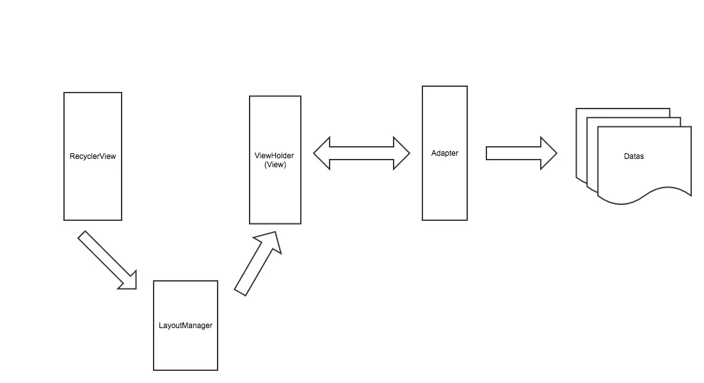
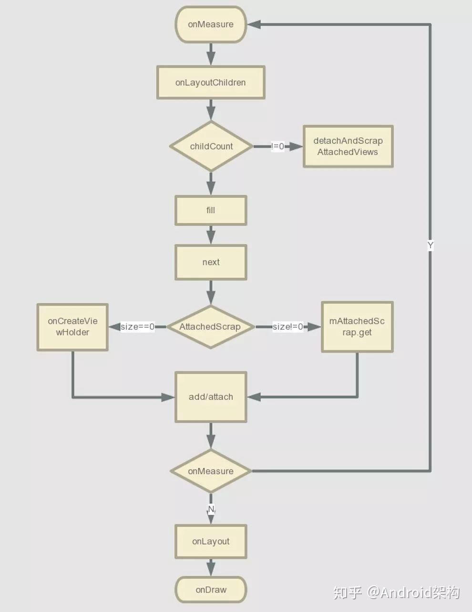

# Recycleview

## 设计思路

- view->datas

- view->viewholder->adapter->datas

- view->layoutmanager->viewholder->adapter->datas

- view->layoutmanager->recycler->viewholder->adapter->datas

- 增加itemanimator

## 代码片段

# view的获取与回收

- 获取的实现在Recycler类中的tryGetViewHolderForPositionByDeadline(int position,boolean dryRun,long deadlineNs)方法

    - 第一步先从getChangedScrapViewForPosition(position)查找mChangedScrap

    - 第二步，如果没有找到视图则从getScrapOrHiddenOrCachedHolderForPosition这个方法中继续找。这个方法的代码就不贴了，简单说下这里的查找顺序：

         - 首先从mAttachedScrap中查找

         - 再次从前面略过的ChildHelper类中的mHiddenViews中查找

         - 最后是从mCachedViews中查找的

    - 第三步， mViewCacheExtension中查找，我们说过这个对象默认是null的，是由我们开发者自定义缓存策略的一层，所以如果你没有定义过，这里是找不到View的。

    - 第四步，从RecyclerPool中查找，前面我们介绍过RecyclerPool,先通过itemType从SparseArray类型的mscrap中拿到ScrapData，不为空继续拿到scrapHeap这个ArrayList，然后取到视图，这里拿到的视图需要重新绑定。

    - 第五步，如果前面几步都没有拿到视图，那么调用了mAdapter.createViewHolder(RecyclerView.this, type)方法，这个方法内部调用了一个抽象方法onCreateViewHolder,是不是很熟悉，没错，就是我们自己写一个Adapter要实现的方法之一。

- 存缓存是调用了 Adapter 的 notifyXxx 方法，这时候就会调用到 Recycler 的 scrapView 方法把屏幕上所有的 ViewHolder 回收到 mAttachedScrap 和 mChangedScrap，区别这两种是看 ViewHolder 是否发生了变化。二级缓存和四级缓存是再重新布局时会发生，或者是在复用时，一级缓存的 ViewHolder 失效了就会移至二级缓存，二级缓存满了就移至 RecyclerViewPool。

## 优化措施

- 一般在版本升级中都会静默享受一些优化措施，比如在 25 版本以上，默认添加了 Prefetch 功能，即数据预取功能。

- 如果 Item 高度固定，可以 setHasFixedSize(true) 来避免 requestLayout。如果不需要动画，也可以关闭默认动画。

- 通过 setItemViewCacheSize 来加大 RecyclerView 缓存，如果多个 RecyclerView 的 Adapter 是一样的，比如嵌套的 RecyclerView 中存在一样的 Adapter，可以设置 setRecycledViewPool 来共用一个 RecyclerViewPool。

- 对 ItemView 设置监听器，不要对每个 Item 都调用 addXxxListener，应该共用一个 Listener，然后根据 id 来进行不同的操作，避免创过多的内部类。

- 如果一个 ItemView 就占一屏，可以通过重写 LayoutManager 的 getExtraLayoutSpace 来增加 RecyclerView 预留的额外空间，也就是显示范围之外，应该额外缓存的空间。

- notifyDataSetChanged和notifyItemChanged

    - 在调用notifyDataSetChanged方法后，所有的子view会被标记，这个标记导致它们最后都被缓存到RecyclerPool中，然后重新绑定数据。并且由于RecyclerPool有容量限制，如果不够最后就要重新创建新的视图了。

    - 但是使用notifyItemChanged等方法会将视图缓存到mChangedScrap和mAttachedScrap中，这两个缓存是没有容量限制的，所以基本不会重新创建新的视图，只是mChangedScrap中的视图需要重新绑定一下。

