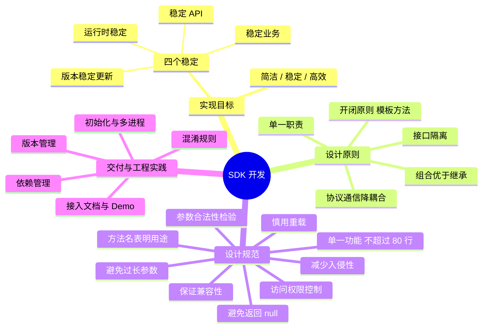

# Android SDK 开发

> SDK：Software Development Kit，软件开发工具包。

---

## 一、实现目标

**简洁、稳定、高效。**其中"稳定"最核心，包含四个方面：

1. **对外提供稳定的 API**：SDK 的 API 一旦确定，除非特殊情况不可更改，提供方变更 API 的成本非常大；
2. **对外提供稳定的业务**：在提供了稳定的 API 后，必须要有稳定的业务作为支撑；
3. **运行时的稳定**：确保 SDK 自身稳定运行，不能出现因为接入了 SDK 而导致宿主应用不稳定的情况；
4. **版本稳定更新**：SDK 版本迭代非常缓慢，要尽可能对使用者屏蔽迭代过程，避免带来不必要的适配成本。

---

## 二、设计原则

1. **单一职责原则**：将系统拆分为多个小模块，每个模块保持相对独立，降低实现类的复杂度；
2. **接口隔离原则**：为每个模块定义契约接口，接口的粒度要小，功能要细，越细小越易维护；
3. **模块之间通过协议或接口通信**：避免直接相互依赖，以降低耦合，互相了解最少，体现了迪米特法则；
4. **开闭原则**：定义各个模块的公共行为，通过模版方法设计模式提供骨架实现，易于功能扩展；
5. **组合优于继承**：当多个模块功能叠加时，使用类的组合保证设计的灵活性。

---

## 三、设计规范

1. **方法名表明其用途**：命名要见名知意，避免含义模糊的缩写，让调用方不看文档也能猜到行为；
2. **参数的合法性检验**：
   - 对于公开方法，显式检查并抛出异常，并使用 `@throws` 来说明抛出异常的原因；
   - 检查构造方法的参数合法性，以使对象处在统一状态；
3. **方法只实现单一功能**：一个方法应该具有单一的功能，尽可能做更少、更专的事情，这也是单一职责原则的体现。"阿里巴巴代码规约"规定一个方法最好不要超过 80 行，对庞大的方法要拆分成更小的；
4. **访问权限控制**：坚持最小可见性，对外只暴露必要的 API，其余成员收敛到 private / 包级可见，避免把实现细节暴露成"事实上的接口"；
5. **避免过长参数**：参数过多（经验上超过 4~5 个）时应封装成参数对象，提升可读性，也便于后续扩展参数而不破坏兼容性；
6. **慎用方法重载**：重载过多容易让调用方困惑，尤其多个重载参数类型相近时，很容易出现"写反了也能编译通过"的隐患；
7. **避免方法直接返回 null**：能返回空集合/空对象就返回（如 `Collections.emptyList()`），减少调用方的判空负担和 NPE 风险；
8. **保证兼容性**：已发布的 API 不删除、不改签名，只做新增；确需废弃时标注 `@Deprecated` 并给出替代方案；
9. **减少入侵性**：不强制宿主实现多余的接口、不污染宿主的命名空间，初始化尽量自动化，让接入方"无感"。

---

## 四、交付与工程实践

1. **接入文档与 Demo 示例**：交付物不止是产物本身，接入文档和可运行的 Demo 示例同样重要，直接决定接入效率；
2. **混淆规则**：把 SDK 需要保留的类以 consumer 混淆规则的方式随产物提供（`consumerProguardFiles`），由宿主打包时自动合并，避免接入方漏配导致运行时崩溃；
3. **版本管理**：遵循语义化版本（主版本号.次版本号.修订号）——不兼容的改动升主版本，向下兼容的功能新增升次版本，修复升修订号；同时维护清晰的版本日志；
4. **依赖管理**：尽量不把第三方库以强依赖方式暴露给宿主，避免版本冲突；只对外暴露必要的依赖（`api`），内部实现依赖用 `implementation`/`compileOnly` 收敛；
5. **初始化与多进程**：提供显式的初始化入口并保证幂等；如采用 ContentProvider 自动初始化，要注意多进程场景下会各自初始化一次，需按进程做区分。

---

## 五、30 秒口述版

SDK 开发的目标是简洁、稳定、高效，其中稳定包含 API 稳定、业务稳定、运行时稳定和版本稳定更新四点——因为 SDK 一旦接入，API 变更和版本迭代的成本都会转嫁给所有接入方。设计上遵循单一职责、接口隔离、协议通信降耦合、开闭原则（模板方法给骨架）和组合优于继承。规范上要求命名自解释、参数校验、方法单一（不超过 80 行）、最小可见性、避免长参数和重载、不返回 null、保证兼容性、减少入侵性。交付时接入文档和 Demo 要齐全，混淆规则通过 consumer 规则随包提供，版本遵循语义化版本。
