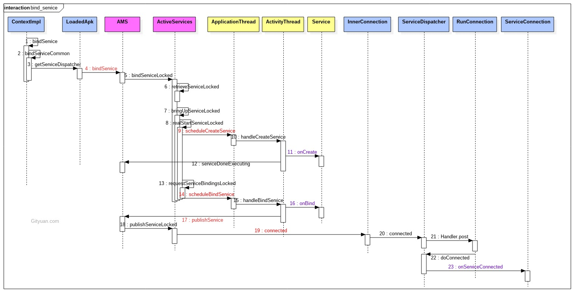

# Service

# startService
生命周期为onCreate,onStartCommand,OnDestroy,多次调用 startService(Intent) 会回调 onStartCommand 方法，而多次调用 stopService ，一次便结束，只有第一次会回调 onDestory 方法。onStartCommand() 方法必须返回整型数。整型数是一个值，用于描述系统应该如何在服务终止的情况下继续运行服务（如上所述，IntentService 的默认实现将为您处理这种情况，不过您可以对其进行修改）。从 onStartCommand() 返回的值必须是以下常量之一：

- START_NOT_STICKY如果系统在 onStartCommand() 返回后终止服务，则除非有挂起 Intent 要传递，否则系统不会重建服务。这是最安全的选项，可以避免在不必要时以及应用能够轻松重启所有未完成的作业时运行服务。

- START_STICKY，当Service因内存不足而被系统kill后，一段时间后内存再次空闲时，系统将会尝试重新创建此Service，一旦创建成功后将回调onStartCommand方法，但其中的Intent将是null，除非有挂起的Intent，如pendingintent，这个状态下比较适用于不执行命令、但无限期运行并等待作业的媒体播放器或类似服务。

- START_REDELIVER_INTENT如果系统在 onStartCommand()返回后终止服务，则会重建服务，并通过传递给服务的最后一个 Intent 调用onStartCommand()。任何挂起 Intent 均依次传递。这适用于主动执行应该立即恢复的作业（例如下载文件）的服务。

## bindService

生命周期，onCreate、onBind、onUnbind、onDestroy，只有在最后一个绑定的组件，比如activity解绑后，才会想要onUnbind，onDestroy.图中蓝色代表的是Client进程(发起端), 红色代表的是system_server进程, 黄色代表的是target进程(service所在进程);

- Client进程: 通过getServiceDispatcher获取Client进程的匿名Binder服务端，即LoadedApk.ServiceDispatcher.InnerConnection,该对象继承于IServiceConnection.Stub； 再通过bindService调用到system_server进程;

- system_server进程: 依次通过scheduleCreateService和scheduleBindService方法, 远程调用到target进程;

- target进程: 依次执行onCreate()和onBind()方法; 将onBind()方法的返回值IBinder(作为target进程的binder服务端)通过publishService传递到system_server进程;

- system_server进程: 利用IServiceConnection代理对象向Client进程发起connected()调用, 并把target进程的onBind返回Binder对象的代理端传递到Client进程;

- Client进程: 回调到onServiceConnection()方法, 该方法的第二个参数便是target进程的binder代理端. 到此便成功地拿到了target进程的代理, 可以畅通无阻地进行交互.

## IntentService
已经废弃，8.0考虑使用androidx.work.WorkManager或androidx.core.app.JobIntentService

- 它创建一个默认的工作线程，此工作线程用来处理Service接收到的Intent请求。

- 工作线程由HandlerThread + 用来将Intent分发给onHandleIntent()方法的Handler实例组成。

- 在所有的开始请求执行完成后，会自动调用stopSelf()方法，因此不需要自己手动调用。

- 提供默认的会返回null的onBind()方法。

- 提供onStartCommand()的默认实现，它将Intent发送到工作队列，然后转发到onHandleIntent()。

## startForegroundService,前台服务

- 申请 FOREGROUND_SERVICE 权限，它是普通权限

- 在 onStartCommand 中必须要调用 startForeground 构造一个通知栏，不然 ANR

- 前台服务只能是启动服务，不能是绑定服务

## 如何保证 Service 不被杀死

- 在 Service 的 onStartCommand 中返回 START_STICKY，该标志使得 Service 被杀死后尝试再次启动 Service

- 提高 Service 优先级，比如设置成前台服务

- 在 Activity 的 onDestory 发送广播，在广播接收器的 onReceiver 重启 Service

