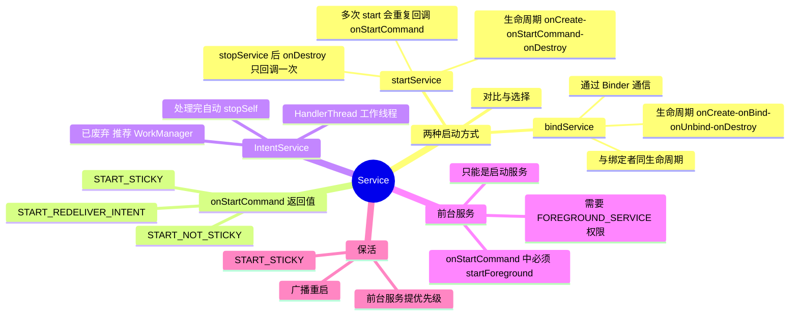
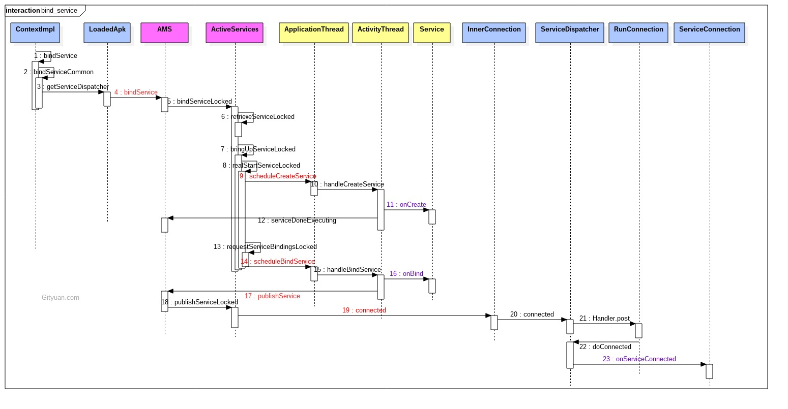

# Service

```mermaid
mindmap
  root((Service))
    两种启动方式
      startService
        生命周期 onCreate-onStartCommand-onDestroy
        多次 start 会重复回调 onStartCommand
        stopService 后 onDestroy 只回调一次
      bindService
        生命周期 onCreate-onBind-onUnbind-onDestroy
        与绑定者同生命周期
        通过 Binder 通信
      对比与选择
    onStartCommand 返回值
      START_NOT_STICKY
      START_STICKY
      START_REDELIVER_INTENT
    IntentService
      HandlerThread 工作线程
      处理完自动 stopSelf
      已废弃 推荐 WorkManager
    前台服务
      需要 FOREGROUND_SERVICE 权限
      onStartCommand 中必须 startForeground
      只能是启动服务
    保活
      START_STICKY
      前台服务提优先级
      广播重启
```

> Service 默认运行在宿主进程的**主线程**，因此不能在 `onCreate`、`onStartCommand` 里做耗时操作，否则会 ANR；耗时任务需要自己开子线程（或使用 IntentService）。

---

## 一、两种启动方式

### 1. startService：启动服务

- 生命周期为 `onCreate → onStartCommand → onDestroy`。
- 多次调用 `startService(Intent)` 会重复回调 `onStartCommand` 方法；而 `stopService` 调用一次服务便结束，`onDestroy` 只会在最终销毁时回调一次。
- 启动后 Service 独立于启动者：启动者退出，Service 仍可继续运行，直到被 `stopService`/`stopSelf` 停止或被系统回收。

### 2. bindService：绑定服务

- 生命周期为 `onCreate → onBind → onUnbind → onDestroy`，只有在最后一个绑定的组件（比如 Activity）解绑后，才会回调 `onUnbind`、`onDestroy`。
- 图中蓝色代表 Client 进程（发起端），红色代表 system_server 进程，黄色代表 target 进程（Service 所在进程）：
  1. **Client 进程**：通过 `getServiceDispatcher` 获取 Client 进程的匿名 Binder 服务端，即 `LoadedApk.ServiceDispatcher.InnerConnection`，该对象继承于 `IServiceConnection.Stub`；再通过 `bindService` 调用到 system_server 进程。
  2. **system_server 进程**：依次通过 `scheduleCreateService` 和 `scheduleBindService` 方法，远程调用到 target 进程。
  3. **target 进程**：依次执行 `onCreate()` 和 `onBind()` 方法；将 `onBind()` 方法的返回值 IBinder（作为 target 进程的 Binder 服务端）通过 `publishService` 传递到 system_server 进程。
  4. **system_server 进程**：利用 `IServiceConnection` 代理对象向 Client 进程发起 `connected()` 调用，并把 target 进程 `onBind` 返回的 Binder 对象的代理端传递到 Client 进程。
  5. **Client 进程**：回调到 `onServiceConnection()` 方法，该方法的第二个参数便是 target 进程的 Binder 代理端。到此便成功拿到了 target 进程的代理，可以畅通无阻地进行交互。

### 3. 两种方式对比

| 维度 | startService | bindService |
| --- | --- | --- |
| 生命周期 | onCreate → onStartCommand → onDestroy | onCreate → onBind → onUnbind → onDestroy |
| 与调用者关系 | 独立，调用者退出后仍可运行 | 与绑定者同生命周期，最后一个绑定者解绑后销毁 |
| 通信方式 | 无法直接通信 | 通过 `onBind` 返回的 IBinder 直接交互 |
| 停止方式 | `stopService`/`stopSelf` | `unbindService`（最后一个绑定者解绑） |
| 典型用途 | 后台任务、前台服务 | 需要与 Activity 交互的服务 |

> 同一个 Service 可以既被 `startService` 启动、又被 `bindService` 绑定，此时要同时满足"已停止"与"已全部解绑"两个条件才会销毁。

---

## 二、onStartCommand 的返回值

`onStartCommand()` 方法必须返回整型数，用于描述系统应该如何在服务终止的情况下继续运行服务（IntentService 的默认实现会处理这种情况，也可以自行修改）。返回值必须是以下常量之一：

- **START_NOT_STICKY**：如果系统在 `onStartCommand()` 返回后终止服务，则除非有挂起 Intent 要传递，否则系统不会重建服务。这是最安全的选项，可以避免在不必要时以及应用能够轻松重启所有未完成的作业时运行服务。
- **START_STICKY**：当 Service 因内存不足而被系统 kill 后，一段时间后内存再次空闲时，系统将会尝试重新创建此 Service，一旦创建成功将回调 `onStartCommand` 方法，但其中的 Intent 将是 null，除非有挂起的 Intent（如 PendingIntent）。比较适用于不执行命令、但无限期运行并等待作业的媒体播放器或类似服务。
- **START_REDELIVER_INTENT**：如果系统在 `onStartCommand()` 返回后终止服务，则会重建服务，并通过传递给服务的最后一个 Intent 调用 `onStartCommand()`。任何挂起 Intent 均依次传递。适用于主动执行、应该立即恢复的作业（例如下载文件）的服务。

---

## 三、IntentService

> 已经废弃，8.0 以后考虑使用 `androidx.work.WorkManager` 或 `androidx.core.app.JobIntentService`。

- 它创建一个默认的工作线程，此工作线程用来处理 Service 接收到的 Intent 请求。
- 工作线程由 **HandlerThread + 用来将 Intent 分发给 `onHandleIntent()` 方法的 Handler 实例**组成。
- 在所有的开始请求执行完成后，会自动调用 `stopSelf()` 方法，因此不需要自己手动调用。
- 提供默认的会返回 null 的 `onBind()` 方法。
- 提供 `onStartCommand()` 的默认实现，它将 Intent 发送到工作队列，然后转发到 `onHandleIntent()`。

---

## 四、startForegroundService 与前台服务

- 需要申请 `FOREGROUND_SERVICE` 权限，它是普通权限。
- 在 `onStartCommand` 中必须要调用 `startForeground` 构造一个通知栏，不然会 ANR。
- 前台服务只能是启动服务，不能是绑定服务。

---

## 五、如何保证 Service 不被杀死

- 在 Service 的 `onStartCommand` 中返回 **START_STICKY**，该标志使得 Service 被杀死后系统尝试再次启动它。
- 提高 Service 优先级，比如设置成前台服务。
- 在 Activity 的 `onDestroy` 发送广播，在广播接收器的 `onReceive` 重启 Service。

---

## 六、30 秒口述版

Service 有两种用法：`startService` 走 `onCreate → onStartCommand → onDestroy`，多次 start 会重复回调 `onStartCommand`，启动后独立于调用者；`bindService` 走 `onCreate → onBind → onUnbind → onDestroy`，通过 `onBind` 返回的 IBinder 与调用者通信，最后一个绑定者解绑后销毁。区别的核心是**生命周期是否绑定**与**能否直接通信**。`onStartCommand` 的返回值决定被杀后是否重建（START_STICKY 等）；前台服务需要在 `onStartCommand` 里调用 `startForeground`，否则 ANR。Service 默认跑在主线程，耗时任务必须交给子线程或 WorkManager。
