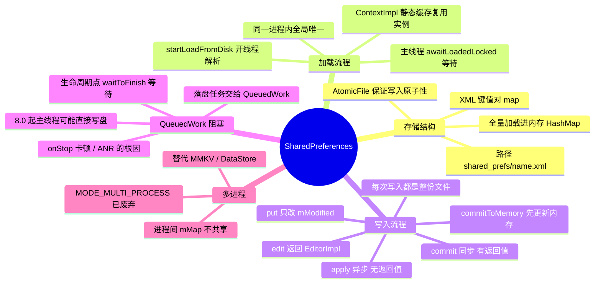

# SharedPreferences



> `apply()` 并不是"不阻塞"，它只是把阻塞从调用点挪到了 Activity/Service 的生命周期回调里（`QueuedWork.waitToFinish()`）；`commit()` 则是当场同步写盘。二者都会把**整份文件**重新序列化，这是 SharedPreferences 一切性能问题的总根源。

---

## 一、存储结构与基本用法

### 1. 文件位置与格式

| 项 | 说明 |
| --- | --- |
| 接口 / 实现 | `SharedPreferences` → `SharedPreferencesImpl`，编辑器 `Editor` → `EditorImpl` |
| 文件路径 | `/data/data/<package>/shared_prefs/<name>.xml`（`name` 就是 `getSharedPreferences(name, mode)` 的第一个参数） |
| 文件格式 | XML，根节点 `<map>`，每个键值对是一个带 `name` 属性的子标签 |
| 支持类型 | `String`、`int`、`long`、`float`、`boolean`、`Set<String>` |
| 内存结构 | 加载后全部放在 `mMap`（`HashMap<String, Object>`）中常驻内存 |

文件长这样：

```xml
<?xml version='1.0' encoding='utf-8' standalone='yes' ?>
<map>
    <string name="token">abcdef</string>
    <int name="loginCount" value="3" />
    <boolean name="isVip" value="true" />
</map>
```

- `mode` 常用 `MODE_PRIVATE`（值为 0，默认）；`MODE_WORLD_READABLE` / `MODE_WORLD_WRITEABLE` 在 Android 7.0 起会直接抛 `SecurityException`；`MODE_MULTI_PROCESS` 已废弃（见第五节）。
- 写盘由 `AtomicFile` 完成：先写一份备份文件，再替换正式文件，**保证进程被杀时不会写出半份损坏的 XML**。
- `Activity.getPreferences()` 是 `getSharedPreferences(getLocalClassName(), MODE_PRIVATE)` 的语法糖，即以类名为文件名。

### 2. 为什么"别用 SP 存大数据"

- **加载**：首次加载会把整个 XML 解析成对象塞进 `mMap`，文件多大就解析多久、占用多少内存；
- **写入**：每次 `commit`/`apply` 都是把内存里**全部** K-V 重新序列化写回文件，不是增量更新，是 O(n) 的全量写；
- 所以单个 SP 文件建议控制在 **100KB 以内、K-V 数量控制在百级**，不同业务拆不同文件（`getSharedPreferences("user", ...)`、`getSharedPreferences("config", ...)`）。

---

## 二、加载流程：getSharedPreferences 做了什么

1. `ContextImpl.getSharedPreferences(name, mode)` 先查静态缓存 `sSharedPrefsCache`（`ArrayMap<String, ArrayMap<File, SharedPreferencesImpl>>`）：
   - **命中直接返回**，所以 Activity / Service / Application 用同样的 name 拿到的是**同一个实例**，进程内共享同一份 `mMap`；
   - 缓存 key 是**文件对象**，同一个文件只会存在一个 `SharedPreferencesImpl`。
2. 未命中则 `new SharedPreferencesImpl(file, mode)`，构造函数里调用 `startLoadFromDisk()`：**新起一个线程**解析 XML 到 `mMap`，解析完把 `mLoaded = true` 并 `notifyAll()`。
3. 所有读取方法（`getString` 等）第一件事都是 `awaitLoadedLocked()`：

```java
if (!mLoaded) {
    mLock.wait();   // 加载没完成就等着
}
```

   **如果主线程 `getSharedPreferences` 之后立刻读，就会卡在这个 wait 上**——文件越大、低端机磁盘越慢，卡得越久。这也是"启动阶段读取 SP 导致启动变慢/白屏"的经典原因。

> 结论：SP 是典型的"**全量加载 + 内存常驻**"模型，它的"快"建立在文件小、读多写少的前提上。

---

## 三、写入流程：commit 与 apply

### 1. 内存修改与提交

```
SharedPreferences.edit()  →  new EditorImpl()        // 每次 edit 都是新的 Editor
editor.putString(...)     →  只写进 EditorImpl.mModified
editor.apply()/commit()   →  commitToMemory()        // mModified 合并进 mMap，生成 MemoryCommitResult
                          →  enqueueDiskWrite()      // 写盘
```

- **`commitToMemory()` 是同步执行的**：无论 `apply` 还是 `commit`，内存中的 `mMap` 都会立刻更新，并且会立刻通知 `OnSharedPreferenceChangeListener`。所以 **`apply()` 之后马上 `get` 读到的就是新值**。
- 一次 `edit()` 中的多次 `put` 是一个**原子事务**，要么全生效，要么全不生效（`commitToMemory` 一次性合并）。

### 2. commit vs apply（必问）

| 维度 | commit() | apply() |
| --- | --- | --- |
| 返回值 | `boolean`，是否写盘成功 | 无返回值（`void`） |
| 写盘时机 | 同步阻塞，等写盘完成才返回 | 异步写盘，立即返回 |
| 调用线程 | 没有并发写时直接在当前线程写，否则排队，且都会阻塞等到落盘完成 | 交给 `QueuedWork` 的 HandlerThread 执行 |
| 内存更新 | 立即生效 | 立即生效 |
| 阻塞风险 | 调用点直接阻塞（主线程调用即 ANR 风险） | 阻塞转移到生命周期回调（见第四节） |
| 适用场景 | 必须确认落盘成功、且不在主线程（如子线程写关键配置） | 绝大多数场景，主线程也推荐用它 |

> 一个常见误区：**`apply()` 后用 `commit()` 会更保险**。实际上 `commit()` 会先把自己 join 到 apply 的队列里排队等待，吞吐反而更差，二者混用是纯粹的负优化。

---

## 四、apply 的隐藏阻塞：QueuedWork

这是 SharedPreferences 最高频的深水区问题。

1. `apply()` 把写盘任务交给 `QueuedWork.queue()`，由内部名为 `queued-work-looper` 的 HandlerThread 串行执行；同时把一个 `awaitCommit`（内部是 `CountDownLatch`）加入 finishers 等待队列。
2. 系统在**组件生命周期关键节点**调用 `QueuedWork.waitToFinish()`，把等待队列里所有 finisher 挨个等完。典型位置：
   - `ActivityThread.handleStopActivity()`——"退出页面卡一下"的常见来源；
   - Service 停止/销毁等流程。
3. Android 8.0 起 `waitToFinish()` 内部会先执行 `processPendingWork()`：**把还没执行的写盘任务直接拿到当前线程执行**。而它多半是被主线程调用的，于是**主线程亲自做文件 IO**，慢 IO 就会直接掉帧甚至 ANR。

所以：

- `apply()` 的错误用法是**高频写**——频繁 apply 会把大量的整份文件写任务堆到 `QueuedWork`，最终在主线程的 `onStop` 一次性还债；
- 正确姿势：**合并写入**（多次修改攒成一次 `edit` 提交）、**子线程写**（该场景用 `commit()` 也无妨，因为不在主线程）、**减小文件**、**非关键数据考虑 MMKV/DataStore**。

> 顺带一提：`StrictMode` 的 `detectDiskWrites` 可以帮你抓到主线程的 SP 读写，排查这类问题时非常有用。

---

## 五、多进程：为什么不能靠 MODE_MULTI_PROCESS

- 每个进程都有一份独立的 `mMap` 和静态缓存，**进程 A 写入后进程 B 的内存副本不会更新**；
- `MODE_MULTI_PROCESS` 在 API 23 之后已被废弃且不再生效——它当年的实现仅仅是"每次读取前重载文件"，既有性能问题，也无法解决并发写的覆盖与一致性问题；
- 多进程下还会出现"后写的进程把先写的进程数据覆盖"（各自持有过期的 `mMap`，整份写回）。

多进程安全的替代方案：

| 方案 | 原理 | 特点 |
| --- | --- | --- |
| [MMKV](https://github.com/chaoyueLin/mmkvDemo)（腾讯） | mmap 映射文件 + protobuf 编码 + 文件锁 | 增量写、多进程安全、崩溃不丢数据、性能比 SP 高一个量级（见 [MMAP 在 Android 中使用](../MMAP在Android中使用/MMAP在Android中使用.md)） |
| Jetpack DataStore | 协程 + Flow + protobuf | 官方推荐的新方案，事务性、异步无生命周期阻塞，但**同样不支持多进程** |
| ContentProvider 封装 | 由单一进程持有数据，其余进程通过 [Binder](../Binder/Binder.md) 访问 | 数据一致，但读写有跨进程开销 |

---

## 六、几个容易踩的坑

### 1. 类型混用直接崩

同一个 key 先 `putString` 再 `getInt`，会抛 `ClassCastException`——因为 `mMap` 里存的是真实类型对象，取值时强转失败。多人协作的配置项建议 key 加业务前缀，避免撞 key。

### 2. 监听器可能收不到回调

`SharedPreferencesImpl` 内部用 **`WeakHashMap`** 保存 `OnSharedPreferenceChangeListener`：

```java
private final WeakHashMap<OnSharedPreferenceChangeListener, Object> mListeners;
```

- 如果监听器只在 `registerOnSharedPreferenceChangeListener` 时传了一次、外部没有强引用，它随时可能被 GC，回调就"莫名其妙"地不来了——必须自己持有一个成员变量强引用；
- 回调**执行在触发修改的那个线程**（`commitToMemory` 里通知），主线程 apply 就在主线程回调，注意别在回调里做重活。

### 3. 数据丢失

- `commit()` 返回 true 表示已落盘，不会丢；
- `apply()` 是异步的，正常退出流程会被 `onStop` 的 `waitToFinish()` 兜住；但进程被 `kill -9`、崩溃、断电等场景下确实可能丢，关键数据要 `commit` 或换方案。

---

## 七、面试高频问答

### 1. SP 存哪里？什么格式？支持哪些类型？

`/data/data/<包名>/shared_prefs/<name>.xml`，XML 格式；支持 `String`、`int`、`long`、`float`、`boolean`、`Set<String>`，不支持对象与其他集合（要存对象得自己序列化成 String）。

### 2. 描述 SP 的加载过程

`ContextImpl` 静态缓存按文件复用 `SharedPreferencesImpl`；首次创建时 `startLoadFromDisk()` 开子线程解析 XML 到 `mMap`；期间任何读取都会走 `awaitLoadedLocked()` 等待加载完成，主线程会因此阻塞。

### 3. apply 和 commit 的区别

`commit` 同步写盘、有返回值、调用线程会阻塞；`apply` 先把内存改掉，再把写盘任务丢给 `QueuedWork` 异步执行、无返回值。两者内存更新都是立刻生效的，都会全量写文件。

### 4. 为什么 apply 之后马上 get 能拿到新值？

因为 `apply` 内部先执行的是同步的 `commitToMemory()`，`mMap` 已经更新，异步的只是磁盘写。

### 5. apply 真的不阻塞主线程吗？

不是。它把阻塞推迟到了 `QueuedWork.waitToFinish()`——Activity `onStop`、Service 停止等时机主线程会等所有 apply 落盘；Android 8.0 起 `waitToFinish()` 还会把待执行的写盘任务拿到主线程直接跑，慢 IO 会导致卡顿甚至 ANR。高频 apply + 大文件是典型元凶。

### 6. SP 线程安全吗？进程安全吗？

- **线程安全**：是。内存操作有锁，`edit` 返回独立 Editor，多线程并发 put 不会互相破坏；但"读-改-写"这类复合操作仍需自己加锁，否则会互相覆盖。
- **进程不安全**：每个进程一份内存副本，`MODE_MULTI_PROCESS` 已废弃，多进程共享请用 MMKV / ContentProvider。

### 7. 为什么 SP 不适合存储大规模数据？

- 首次加载会**全量解析** XML 并常驻内存；
- 每次提交都会**全量序列化**整份文件（不是增量），写入代价与文件大小正相关；
- 数据量大时首次访问的阻塞 + 写盘耗时会在主线程的生命周期回调里集中爆发。

### 8. 如何优化 SP 的使用？

拆文件（按模块）、控制 K-V 数量与体积、避免主线程首次读取（提前异步预热）、合并写入减少 apply 次数、不在主线程 commit、apply 后不要紧跟 commit、监听器自己持强引用、必要时用 MMKV/DataStore 替代。

### 9. MMKV 为什么比 SP 快？

| 维度 | SharedPreferences | MMKV |
| --- | --- | --- |
| 写入 | 全量序列化，每次 O(n) | protobuf 增量编码，只追加变更 |
| 落盘 | 系统调用 `write`，经 QueuedWork | **mmap** 内存映射，写内存即写文件 |
| 读 | 全量解析进 HashMap | mmap 直接读，首次加载后常驻 |
| 多进程 | 不支持 | 支持（文件锁 + CRC 校验） |
| 崩溃安全 | 靠 AtomicFile 备份 | 靠 CRC + 增量追加，异常数据可丢弃 |

### 10. 用一句话总结 SP

"**小配置的进程内缓存**"：读多写少、文件小、不需要跨进程时，它足够好用；一旦踩到高频写、大文件、多进程这三条红线，就该换 MMKV 或 DataStore。
