# View

## view,activity,window关系

- window创建过程-->ActivityThread.perfomLaunchActivity()的attach()创建PhoneWindow,mWindow = new PhoneWindow(this, window, activityConfigCallback);mWindow.setWindowManager((WindowManager)context.getSystemService(Context.WINDOW_SERVICE),mToken,
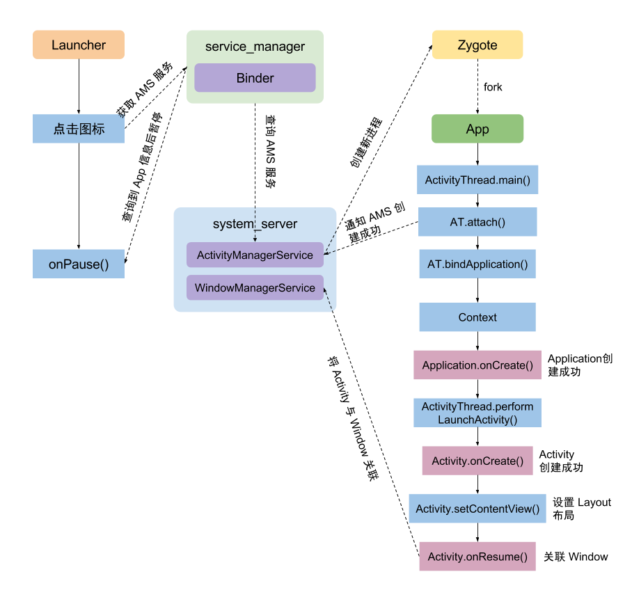

- onResume() Window 显示过程,ActivityThread.performResumeActivity-->onResume-->WindowManagerImpl.addView-->new ViewRootImpl
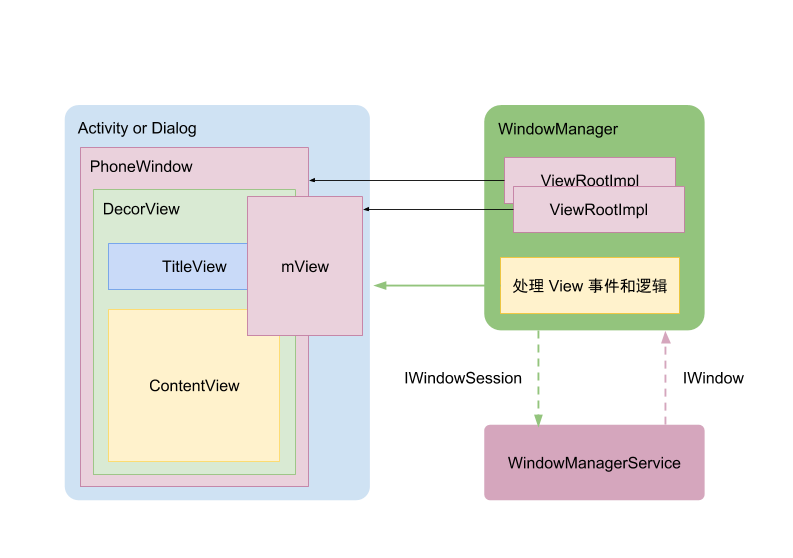

- ViewRootImpl，ViewRoot是GUI管理系统与GUI呈现系统之间的桥梁。每一个ViewRootImpl关联一个Window，ViewRootImpl最终会通过它的setView方法绑定Window所对应的View，并通过其performTraversals方法对View进行布局、测量和绘制

## 绘制流程
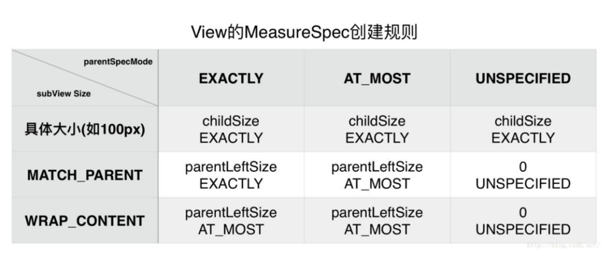
- measure

    - MeasureSpec的大小和模式设计

         - UNSPECIFIED：父元素不对子元素施加任何束缚，子元素可以得到任意想要的大小；ListView就是用到这个

         - EXACTLY：父元素决定子元素的确切大小，子元素将被限定在给定的边界里而忽略它本身大小；这里我们理解为控件的宽或者高被设置为 match_parent 或者指定大小，比如20dp；

         - AT_MOST：子元素至多达到指定大小的值；这里我们理解为控件的宽或者高被设置为wrap_content。

    - 对于子View而言，其本身宽高直接受限于父View的 布局要求，举例来说，父View被限制宽度为40px,子View的最大宽度同样也需受限于这个数值。因此，在测量子View之时，子View必须已知父View的布局要求，这个 布局要求， Android中通过使用 MeasureSpec 类来进行描述。

    - 对于完整的测量流程而言，父控件必然依赖子控件宽高的测量；若子控件本身未测量完毕，父控件自身的测量亦无从谈起。Android中View的测量流程中使用了非常经典的 递归思想

    - 单个控件的测量，整个过程需要定义三个重要的函数

         - final void measure(int widthMeasureSpec, int heightMeasureSpec)：执行测量的函数;

         - void onMeasure(int widthMeasureSpec, int heightMeasureSpec)：真正执行测量的函数，开发者需要自己实现自定义的测量逻辑;

              - measurechild

         - final void setMeasuredDimension(int measuredWidth, int measuredHeight)：完成测量的函数；

    - 自定义View为何需要重写onMeasure方法，从getDefaultSize的实现来看，View的宽高从specSize决定，所以**直接继承View的自定义控件需要重写onMeasure方法并设置wrap_content时的自身大小，否则在布局中使用wrap_content相当于使用match_parent**。这是因为如果View使用wrap_content，那么其specMode对应AT_MOST，且由上面代码可以看出宽高为specSize；在由上面的表得知，此时View的specSize就是parentSize，而parentSize就是父容器可用剩余空间。这种效果和在布局中使用match_parent效果一样。解决办法就是给View指定一个默认的内部宽高，在wrap_content时设置即可。

- layout

    - void layout(int l, int t, int r, int b)：控件自身整个布局流程的函数;

    - void onLayout(boolean changed, int left, int top, int right, int bottom)：ViewGroup布局逻辑的函数，开发者需要自己实现自定义布局逻辑;

         - setChildFrame

    - void setFrame(int left, int top, int right, int bottom)：保存最新布局位置信息的函数;

- draw

    - Carvans从哪里来，如果硬件加速不支持或者被关闭，则使用软件绘制，生成的Canvas即Canvas.class的对象；如果支持硬件加速，则生成的是DisplayListCanvas.class的对象；在View.updateDisplayListIfDirty中final DisplayListCanvas canvas = renderNode.start(width, height);

    - dirtyOpaque标志位判断是否要绘制，如果view是透明的，不会绘制

- View执行onMeasure,onLayout的次数

    - performTraversals()中measureHierarch()中有三处performMeasure()调用，是为了测量mRootView和window的宽度，但是一般只会调用一次。然后再调用performMeasuer(),performLayout(),performDraw()。所以至少有两次performMeasue()调用。但是不一定回调两次onMeasue()

    - 1.如果flag不为forceLayout或者与上次测量规格（MeasureSpec）相比未改变，那么将不会进行重新测量（执行onMeasure方法），直接使用上次的测量值；

    - 2.如果满足非强制测量的条件，即前后二次测量规格不一致，会先根据目前测量规格生成的key索引缓存数据，索引到就无需进行重新测量;如果targetSDK小于API 20则二级测量优化无效，依旧会重新测量，不会采用缓存测量值。

- 重新绘制
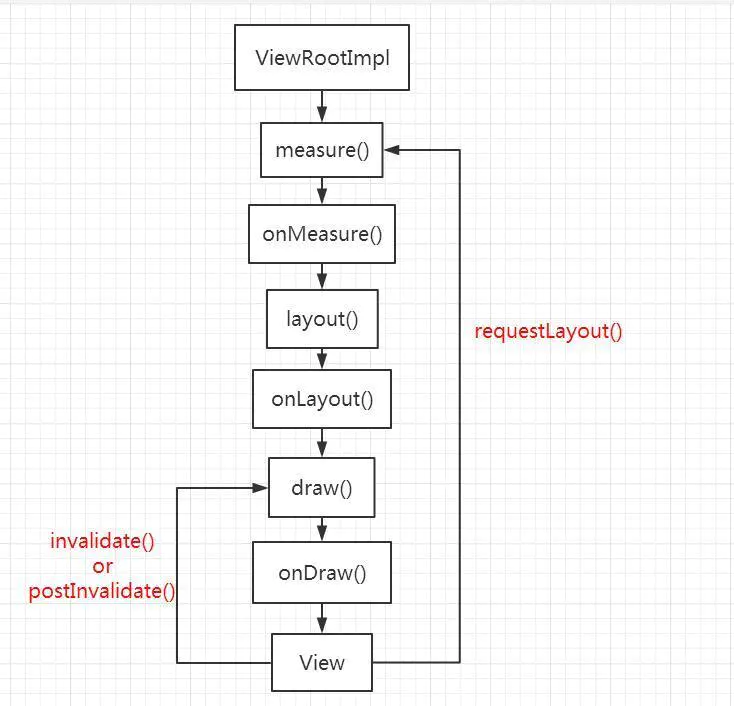

    - requestlayout,在requestLayout方法中，首先先判断当前View树是否正在布局流程，接着为当前子View设置标记位，该标记位的作用就是标记了当前的View是需要进行重新布局的，接着调用mParent.requestLayout方法，这个十分重要，因为这里是向父容器请求布局，即调用父容器的requestLayout方法，为父容器添加PFLAG_FORCE_LAYOUT标记位，而父容器又会调用它的父容器的requestLayout方法，即requestLayout事件层层向上传递，直到DecorView，即根View，而根View又会传递给ViewRootImpl，也即是说子View的requestLayout事件，最终会被ViewRootImpl接收并得到处理。ViewRootImpl会通过scheduleTraversals再调用performTraversals,执行view绘制的三个流程，message,layout,draw

    - invalidate

         - View.invalidate() 开始，nvalidate->invalidateInternal->ViewGroup#invalidateChild该方法内部，先设置当前视图的标记位，接着有一个do...while...循环，该循环的作用主要是不断向上回溯父容器，求得父容器和子View需要重绘的区域的并集(dirty)。到最后会调用到ViewRootImpl的invalidateChildInParent方法,该方法把dirty区域的信息保存在mDirty中,最后调用 parent.invalidateChildInParent() 方法。

         - ViewRootImpl.invalidateChildInParent() 最终调用到 scheduleTraversals() 方法，其中建立同步屏障之后，通过 Choreographer.postCallback() 方法提交了任务 mTraversalRunnable，这个任务就是负责 View 的测量，布局，绘制。由于没有添加measure和layout的标记位，因此measure、layout流程不会执行，而是直接从draw流程开始。

         - Choreographer.postCallback() 方法通过 DisplayEventReceiver.nativeScheduleVsync() 方法向系统底层注册了下一次 vsync 信号的监听。当下一次 vsync 来临时，系统会回调其 dispatchVsync() 方法，最终回调 FrameDisplayEventReceiver.onVsync() 方法。

         - FrameDisplayEventReceiver.onVsync() 方法中取出之前提交的 mTraversalRunnable 并执行。这样就完成了整个绘制流程。

- 硬件加速

    - 页面渲染

         - 页面渲染时，被绘制的元素最终要转换成矩阵像素点（即多维数组形式，类似安卓中的Bitmap），才能被显示器显示。

         - 页面由各种基本元素组成，例如圆形、圆角矩形、线段、文字、矢量图（常用贝塞尔曲线组成）、Bitmap等。

         - 元素绘制时尤其是动画绘制过程中，经常涉及插值、缩放、旋转、透明度变化、动画过渡、毛玻璃模糊，甚至包括3D变换、物理运动（例如游戏中常见的抛物线运动）、多媒体文件解码（主要在桌面机中有应用，移动设备一般不用GPU做解码）等运算。

         - 绘制过程经常需要进行逻辑较简单、但数据量庞大的浮点运算。

    - CPU与GPU结构对比,黄色的Control为控制器，用于协调控制整个CPU的运行，包括取出指令、控制其他模块的运行等；绿色的ALU（Arithmetic Logic Unit）是算术逻辑单元，用于进行数学、逻辑运算；橙色的Cache和DRAM分别为缓存和RAM，用于存储信息。
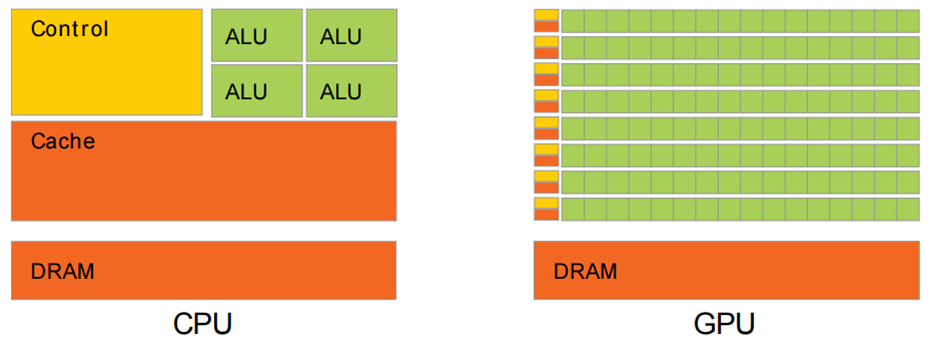

    - Android硬件加速

         - DisplayList

              - DisplayList是一个基本绘制元素，包含元素原始属性（位置、尺寸、角度、透明度等），对应Canvas的drawXxx()方法（如下图）。

              - 信息传递流程：Canvas(Java API) —> OpenGL(C/C++ Lib) —> 驱动程序 —> GPU。

              - 在Android 4.1及以上版本，DisplayList支持属性，如果View的一些属性发生变化（比如Scale、Alpha、Translate），只需把属性更新给GPU，不需要生成新的DisplayList。

         - RenderNode包含若干个DisplayList，通常一个RenderNode对应一个View，包含View自身及其子View的所有DisplayList。

    - 绘制流程
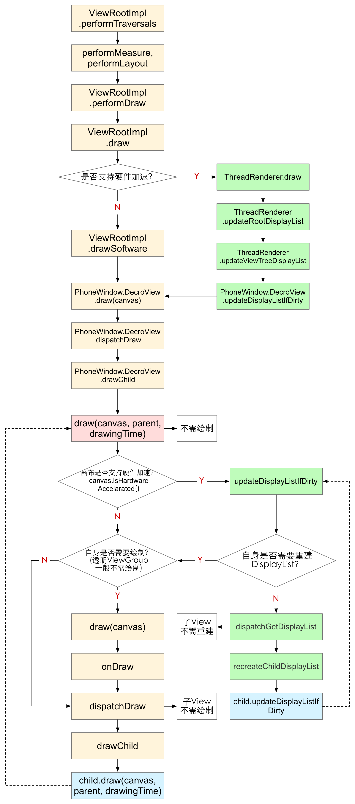
         - 从ViewRootImpl.performTraversals到PhoneWindow.DecroView.drawChild是每次遍历View树的固定流程，首先根据标志位判断是否需要重新布局并执行布局；然后进行Canvas的创建等操作开始绘制。

              - 如果硬件加速不支持或者被关闭，则使用软件绘制，生成的Canvas即Canvas.class的对象；

              - 如果支持硬件加速，则生成的是DisplayListCanvas.class的对象；

              - 两者的isHardwareAccelerated()方法返回的值分别为false、true，View根据这个值判断是否使用硬件加速。

         - View中的draw(canvas,parent,drawingTime) - draw(canvas) - onDraw - dispachDraw - drawChild这条递归路径（下文简称Draw路径），调用了Canvas.drawXxx()方法，在软件渲染时用于实际绘制；在硬件加速时，用于构建DisplayList。

         - View中的updateDisplayListIfDirty - dispatchGetDisplayList - recreateChildDisplayList这条递归路径（下文简称DisplayList路径），仅在硬件加速时会经过，用于在遍历View树绘制的过程中更新DisplayList属性，并快速跳过不需要重建DisplayList的View。

    - 总结

         - CPU更擅长复杂逻辑控制，而GPU得益于大量ALU和并行结构设计，更擅长数学运算。

         - 页面由各种基础元素（DisplayList）构成，渲染时需要进行大量浮点运算。

         - 硬件加速条件下，CPU用于控制复杂绘制逻辑、构建或更新DisplayList；GPU用于完成图形计算、渲染DisplayList。

         - 硬件加速条件下，刷新界面尤其是播放动画时，CPU只重建或更新必要的DisplayList，进一步提高渲染效率。

         - 实现同样效果，应尽量使用更简单的DisplayList，从而达到更好的性能（Shape代替Bitmap等）

## 事件分发

- WMS,InputManagerService,inputManager,Window,ViewRootImpl

- ActivityThread负责控制Activity的启动过程，在ActivityThread.performLaunchActivity()流程中，ActivityThread会针对Activity创建对应的PhoneWindow和DecorView实例，而在ActivityThread.handleResumeActivity()流程中，ActivityThread会将获取当前Activity的WindowManager，并将DecorView和WindowManager.LayoutParams(布局参数)作为参数调用addView()函数,ActivityThread.handleResumeActivity()流程中最终创建了ViewRootImpl，并通过setView()函数对DecorView开始了绘制流程的三个步骤。

    - Android中Window和InputManagerService之间的通信实际上使用的InputChannel,InputChannel是一个pipe，底层实际是通过socket进行通信。在ViewRootImpl.setView()过程中，也会同时注册InputChannel。ViewRootImpl.setView()函数，在该函数的执行过程中，会在ViewRootImpl中创建InputChannel，InputChannel实现了Parcelable， 所以它可以通过Binder传输。

    - Android提供了InputEventReceiver类，以接收分发这些消息,ViewRootImpl.WindowInputEventReceiver

- ViewRootImpl.setView()函数非常重要，该函数也正是ViewRootImpl本身职责的体现：

    - 1.链接WindowManager和DecorView的纽带，更广一点可以说是Window和View之间的纽带；

    - 2.完成View的绘制过程，包括measure、layout、draw过程；

    - 3.向DecorView分发收到的用户发起的InputEvent事件。

- UI事件的分发

    - DecorView作为View树的根节点，接收到屏幕触摸事件MotionEvent时，应该通过递归的方式将事件分发给子View，这似乎理所当然。但实际设计中，设计者将DecorView接收到的事件首先分发给了Activity，Activity又将事件分发给了其Window，最终Window才将事件又交回给了DecorView，形成了一个小的循环,对于DecorView而言，它承担了2个职责：

         - 1.在接收到输入事件时，DecorView不同于其它View，它需要先将事件转发给最外层的Activity，使得开发者可以通过重写Activity.onTouchEvent()函数以达到对当前屏幕触摸事件拦截控制的目的，这里DecorView履行了自身（根节点）特殊的职责；

         - 2.从Window接收到事件时，作为View树的根节点，将事件分发给子View，这里DecorView履行了一个普通的View的职责。

    - 事件分发的本质原理就是递归，而目前其实现方式是，每接收一个新的事件，都需要进行一次递归才能找到对应消费事件的View，并依次向上返回事件分发的结果。

    - 事件序列 的概念，当接收到一个ACTION_DOWN时，意味着一次完整事件序列的开始，通过递归遍历找到View树中真正对事件进行消费的Child，并将其进行保存，这之后接收到ACTION_MOVE和ACTION_UP行为时，则跳过遍历递归的过程，将事件直接分发给Child这个事件的消费者；当接收到ACTION_DOWN时，则重置整个事件序列,根据View的树形结构，设计了一个TouchTarget类，为作为一个成员属性，描述ViewGroup下一级事件分发,应用到了树的 深度优先搜索算法（Depth-First-Search，简称DFS算法），正如代码所描述的，每个ViewGroup都持有一个mFirstTouchTarget, 当接收到一个ACTION_DOWN时，通过递归遍历找到View树中真正对事件进行消费的Child，并保存在mFirstTouchTarget属性中，依此类推组成一个完整的分发链。用到了dispatchTouchEvent和onThouchEvent,再加上事件拦截onInterceptTouchEvent就完整了

    - 事件拦截机制，增加事件分发 过程中的灵活性，Android为ViewGroup层级设计了onInterceptTouchEvent()函数并向外暴露给开发者，以达到让ViewGroup跳过子View的事件分发，提前结束 递流程 ，并自身决定是否消费事件，并将结果反馈给上层级的ViewGroup处理。

    - Action_cancel的触发条件，ChildView原先拥有事件处理权，后面由于某些原因，该处理权需要交回给上层去处理，ChildView便会收到ACTION_CANCEL事件（代码逻辑上是：上层判断之前交给ChildView的事件处理权需要收回来了，便会做事件的拦截处理，拦截时给ChildView发一个ACTION_CANCEL事件）。举个例子：上层 View 是一个 RecyclerView，它收到了一个 ACTION_DOWN 事件，由于这个可能是点击事件，所以它先传递给对应 ItemView，询问 ItemView 是否需要这个事件，然而接下来又传递过来了一个 ACTION_MOVE 事件，且移动的方向和 RecyclerView 的可滑动方向一致，所以 RecyclerView 判断这个事件是滚动事件，于是要收回事件处理权，这时候对应的 ItemView 会收到一个 ACTION_CANCEL ，并且不会再收到后续事件。

## 动画

- 帧动画，帧动画相比较属性动画而言可能会出现OOM，因为在家的每一帧的图片会占用很大的内存空间。帧动画不会出现内存泄露的问题,private WeakReference<Callback> mCallback = null;
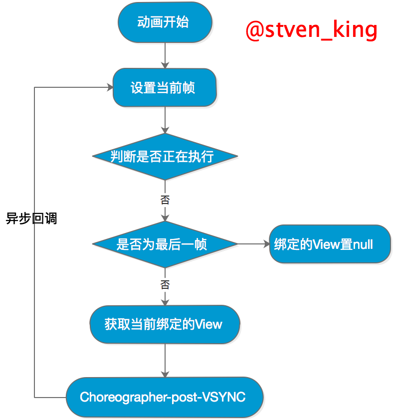

- 补间动画，通过对场景里的对象做图像变换（Translate、Scale、Rotate、Alpha）从而产生动画效果。不会有内存泄漏
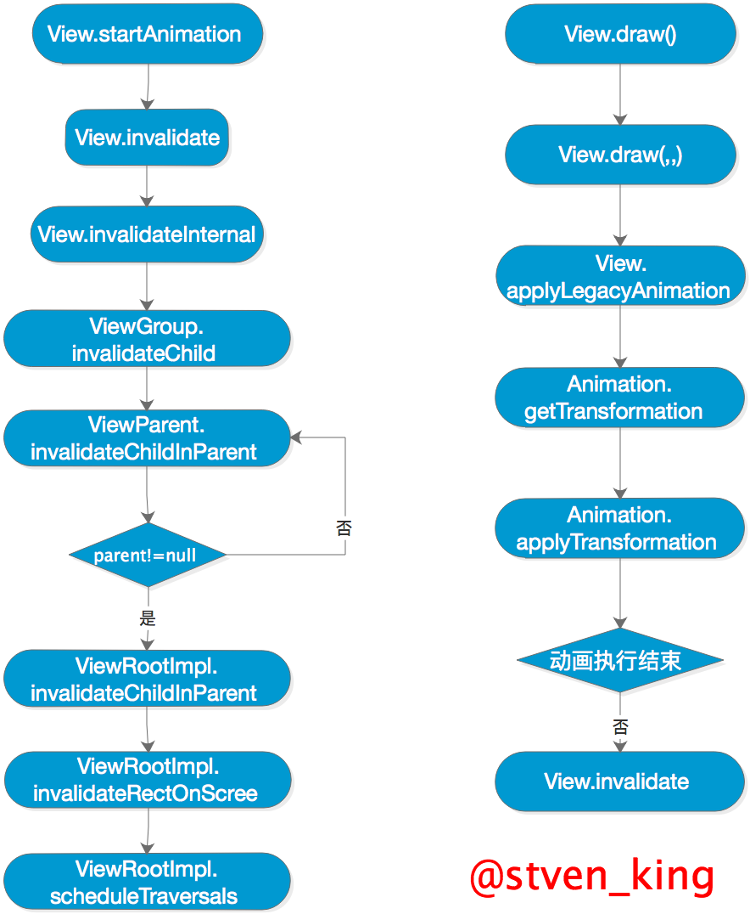

    - 补间动画只能作用域某个View视图，使用受限。

    - 只改变view视图效果，无法改变真实属性。

    - 差值器主要是用来定义动画变化过程中的变化速率的一个工具。在android中提供了很多类型的插值器

    - view的方法中*boolean *draw(Canvas canvas, ViewGroup parent, *long *drawingTime) 中会判断是animation还是绘制本身，Animation产生的动画数据实际并不是应用在View本身的，而是应用在RenderNode或者Canvas上的，这就是为什么Animation不会改变View的属性的根本所在。

- 属性动画，通过动态改变对象的属性从而达到动画效果，属性动画为Android 3.0（API 11）的新特性。属性动画的使用范围不在局限于view，同时还可以根据需要实现各种效果。
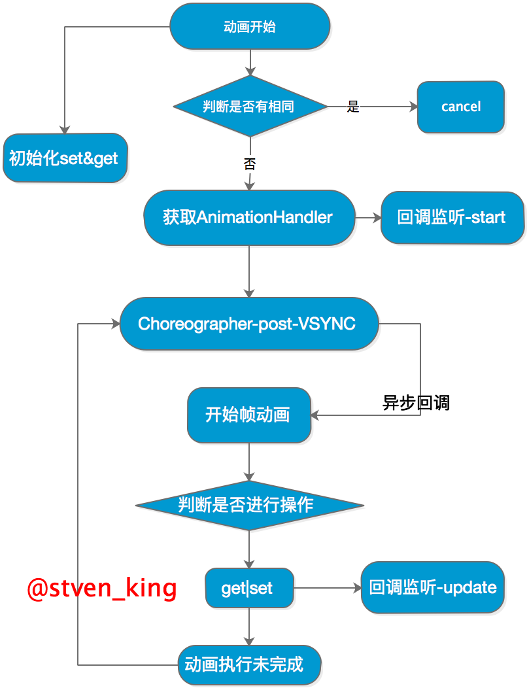

    - ValueAnimator：通过不断控制值的变化，再不断手动赋给对象的属性，从而实现动画效果。

    - ObjectAnimator：直接对对象的属性值进行改变操作，通过不断控制值的变化，再不断自动赋给对象的属性，从而实现动画效果。其实现继承了ValueAnimator。

    - Evaluator称之为估值器，其作用类似于之前的插值器。

    - 指定关键帧，PropertyValuesHolder这个类的意义就是，它其中保存了动画过程中所需要操作的属性和对应的值。我们通过ofFloat(Object target, String propertyName, float… values)构造的动画，ofFloat()的内部实现其实就是将传进来的参数封装成PropertyValuesHolder实例来保存动画状态。在封装成PropertyValuesHolder实例以后，后期的各种操作也是以PropertyValuesHolder为主的。setAnimatedValue()用到了反射设置

    - 内存泄漏

         - ValueAnimator.AnimationHandler.doAnimationFrame 的时候说过，这个方法会循环执行。因为 ValueAnimator.AnimationHandler.doAnimationFrame 每次执行完动画（如果动画没有结束），都在再一次请求Vsync同步信号回调给自己。

         - Choreographer 的回调都配post进入了当前线程的looper队列中。mChoreographer.postCallback(Choreographer.CALLBACK_ANIMATION, this, null);

         - mRepeatCount 无穷大，会导致该循环会一直执行下去，即使关闭当前的页面也不会停止。

- Transition Animation：过渡动画，主要是实现Activity或View过渡动画效果。

- 问题

    - 内存泄漏

    - OOM

    - 硬件加速

    - View动画对View的影像做动画，并不是真正的改变View的状态，因此有时候会出现动画完成后View无法影藏的现象，即setVisibility(View.GONE)失效了，这个时候只要调用view.clearAnimation()清除View动画即可解决此问题。

    - 将View移动（平移）后，在Android3.0之前的系统上，不管是View动画还是属性动画，新位置均无法触发单击事件，同时老位置任然可以触发单击事件。尽管View已经在视觉上不存在了，将View移回原位置以后，原位置的单击事件继续生效。从3.0开始，属性动画的单击事件触发位置为移动以后的位置，但View动画仍然在原位置。

## LayoutInflater,setContentView
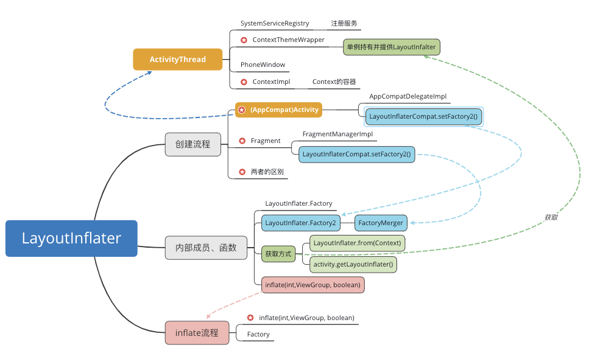

- 无论是哪种方式获取到的LayoutInflater,都是通过ContextImpl.getSystemService()获取的，并且在Activity等组件的生命周期内保持单例；

- 即使是Activity.setContentView()函数,本质上也还是通过LayoutInflater.inflate()函数对布局进行解析和创建。

- SetContentView时AppCompatDelegate代理实现不同版本，LayoutInflater.inflate布局加载到android.R.id.content
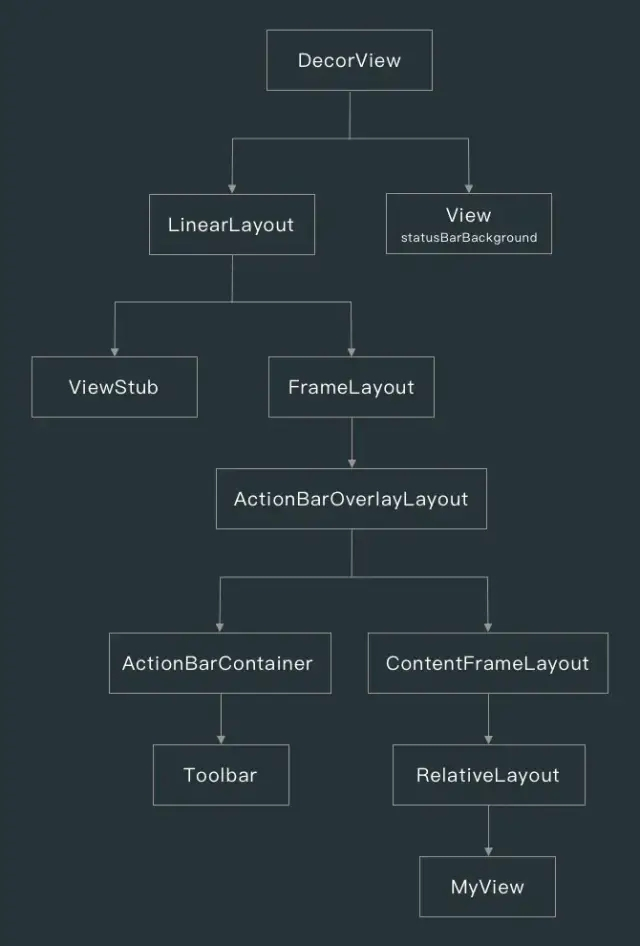
    - getWindow().setContentView(layoutResID); mContentParent.addView(view, params);mContentParent = generateLayout(mDecor);
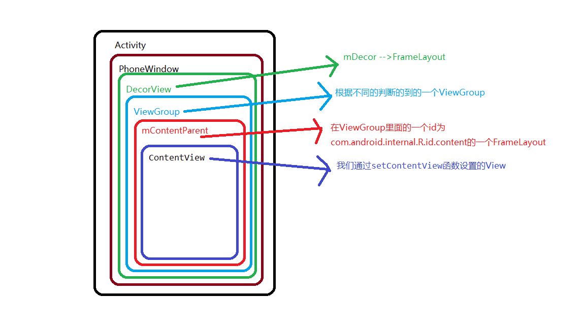
    - 在android21以前一般是使用控件TextView等控件，在21以后出了相关的AppCompat控件，这个时候怎么让开发者写的TextView自动转换为AppCompatTextView,LayoutInflaterCompat.setFactory(layoutInflater, this)

## GestureDetector手势检测器
用来辅助检测用户的单击、滑动、长按、双击等行为。

## View的滑动

- layout()layout()方法会调用onLayout()来设置显示的位置，传入left、top、right、bottom四个参数即可。

- offsetLeftAndRight()/offsetTopAndBottom()此方法和layout()差不多，offsetLeftAndRight()传入x轴方向的偏移，offsetTopAndBottom()传入y轴方向的偏移。比较推荐这种方法

- LayoutParams

- 动画通过动画改变，主要是操作View的translationX和translationY两个属性

- scrollTo()/scrollBy()scrollBy调用了scrollTo，前者是相对于当前位置的相对滑动，后者是绝对滑动。

## 两种坐标系

- Android坐标系

- View坐标系

## 矢量图

- 可缩放矢量图形（ScalableVector Graphics，SVG）是一种基于可扩展标记语言（XML），用于描述二维矢量图形的图形格式。SVG由W3C制定，是一个开放标准。 Android中对矢量图的支持就是对SVG的支持，其是W3C组织推荐的矢量图标准。

- VectorDrawable是一个矢量图，定义在一个XML文件中的点、线和曲线，和它们相关颜色的信息集合。VectorDrawable定义了一个静态Drawable对象。和SVG格式非常相似，每个Vector图形被定义成一个树型结构，它由path和group对象组成。每条path包含对象轮廓的几何形状，每个group包含了变化的详细信息。所有path的绘制顺序和它们在XML出现的顺序相同；

- 优点

    - 图片扩展性：它可以进行缩放并且不损失图片的质量，这意味着使用同一个文件对不同屏幕密度调整大小并不损失图片的质量；（提高了安卓机型分辨率适配性）

    - 图片大小更小：同样大小和内容图片下相比，矢量图比PNG图片更小，这样就能得到更小的APK文件和更少的维护工作；（可减小apk安装包的体积）

- 缺点，系统渲染VectorDrawable需要花费更多时间。因为矢量图的初始化加载会比相应的光栅图片消耗更多的CPU周期，但是两者之间的内存消耗和性能接近。因此我们可以只考虑在显示小图片的时候使用矢量图（建议限制矢量图在200*200dp），越大的图片在屏幕上显示会消耗更长的时间进行绘制；
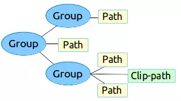

## 移动

- 内容就像报纸，屏幕就像放大镜，scrollby()移动的是屏幕

- scroller用法，需要与View的computeScroll()方法配合使用

