# View 体系

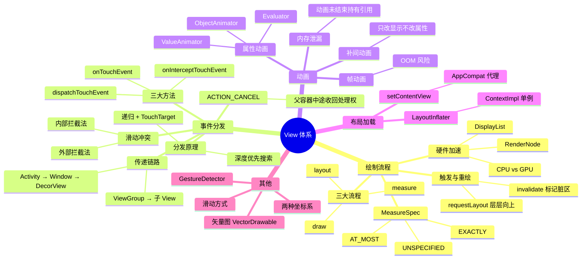
```mermaid
mindmap
  root((View 体系))
    绘制流程
      三大流程
        measure
        layout
        draw
      MeasureSpec
        EXACTLY
        AT_MOST
        UNSPECIFIED
      触发与重绘
        requestLayout 层层向上
        invalidate 标记脏区
      硬件加速
        DisplayList
        RenderNode
        CPU vs GPU
    事件分发
      传递链路
        Activity → Window → DecorView
        ViewGroup → 子 View
      三大方法
        dispatchTouchEvent
        onInterceptTouchEvent
        onTouchEvent
      分发原理
        递归 + TouchTarget
        深度优先搜索
      ACTION_CANCEL
        父容器中途收回处理权
      滑动冲突
        外部拦截法
        内部拦截法
    动画
      帧动画
        OOM 风险
      补间动画
        只改显示不改属性
      属性动画
        ValueAnimator
        ObjectAnimator
        Evaluator
      内存泄漏
        动画未结束持有引用
    布局加载
      LayoutInflater
        ContextImpl 单例
      setContentView
        AppCompat 代理
    其他
      滑动方式
      GestureDetector
      两种坐标系
      矢量图 VectorDrawable
```

---

## 一、绘制流程

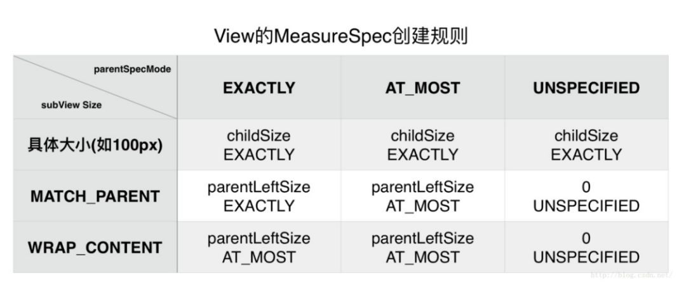

View 的绘制分为 **measure（测量）、layout（布局）、draw（绘制）** 三大流程，由 `ViewRootImpl.performTraversals()` 驱动，本质是**递归**：父控件依赖子控件的测量结果，子控件未测量完，父控件自身的测量也无从谈起。

### 1. measure 与 MeasureSpec

MeasureSpec 的大小和模式设计（三种模式）：

| 模式 | 含义 | 对应布局写法 |
| --- | --- | --- |
| UNSPECIFIED | 父元素不对子元素施加任何束缚，子元素可以得到任意想要的大小 | ListView 测量子项时用到 |
| EXACTLY | 父元素决定子元素的确切大小，子元素被限定在给定边界内而忽略自身大小 | `match_parent` 或指定具体值（如 20dp） |
| AT_MOST | 子元素至多达到指定大小的值 | `wrap_content` |

- 子 View 本身的宽高直接受限于父 View 的布局要求：父 View 被限制宽度为 40px，子 View 的最大宽度同样受限于这个数值。因此测量子 View 时，子 View 必须已知父 View 的布局要求，这个布局要求在 Android 中通过 **MeasureSpec** 类描述。
- 单个控件的测量涉及三个重要函数：
  - `final void measure(int widthMeasureSpec, int heightMeasureSpec)`：执行测量的函数；
  - `void onMeasure(int widthMeasureSpec, int heightMeasureSpec)`：真正执行测量的函数，开发者需要自己实现自定义的测量逻辑（内部会调 `measureChild`）；
  - `final void setMeasuredDimension(int measuredWidth, int measuredHeight)`：完成测量的函数。

### 2. 自定义 View 为什么必须重写 onMeasure

从 `getDefaultSize` 的实现看，View 的宽高由 specSize 决定，所以**直接继承 View 的自定义控件需要重写 onMeasure 方法并设置 wrap_content 时的自身大小，否则在布局中使用 wrap_content 相当于使用 match_parent**。

原因：View 使用 `wrap_content` 时 specMode 对应 AT_MOST，由上面的表可知此时宽高为 specSize，而 specSize 就是 parentSize（父容器可用剩余空间）——效果和 `match_parent` 一样。解决办法是给 View 指定一个默认的内部宽高，在 `wrap_content` 时设置即可。

### 3. layout

- `void layout(int l, int t, int r, int b)`：控件自身整个布局流程的函数；
- `void onLayout(boolean changed, int left, int top, int right, int bottom)`：ViewGroup 布局逻辑的函数，开发者需要自己实现自定义布局逻辑（内部会调 `setChildFrame`）；
- `void setFrame(int left, int top, int right, int bottom)`：保存最新布局位置信息的函数。

### 4. draw

- **Canvas 从哪里来**：如果硬件加速不支持或者被关闭，则使用软件绘制，生成的 Canvas 即 `Canvas.class` 的对象；如果支持硬件加速，则生成的是 `DisplayListCanvas.class` 的对象——在 `View.updateDisplayListIfDirty` 中 `final DisplayListCanvas canvas = renderNode.start(width, height)`。
- **dirtyOpaque 标志位**：判断是否需要绘制，如果 View 是透明的，不会绘制。

### 5. onMeasure / onLayout 的执行次数

`performTraversals()` 中 `measureHierarchy()` 里有三处 `performMeasure()` 调用，是为了测量 mRootView 和 window 的宽度，但一般只会调用一次；然后再调用 `performMeasure()`、`performLayout()`、`performDraw()`。所以**至少有两次 performMeasure() 调用，但不一定回调两次 onMeasure()**：

1. 如果 flag 不为 forceLayout、或与上次测量规格（MeasureSpec）相比未改变，则不会重新测量（不执行 onMeasure），直接使用上次的测量值；
2. 如果满足非强制测量的条件，即前后两次测量规格不一致，会先根据当前测量规格生成的 key 索引缓存数据，索引到就无需重新测量；如果 targetSdk 小于 API 20，则二级测量优化无效，依旧会重新测量，不会采用缓存测量值。

### 6. 重新绘制：requestLayout 与 invalidate

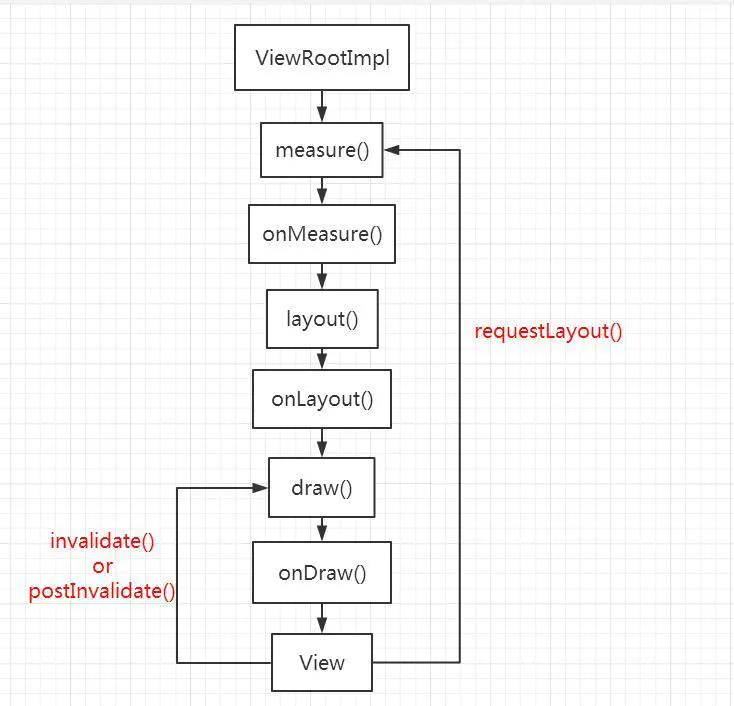

**requestLayout**：先判断当前 View 树是否正在布局流程，接着为当前子 View 设置标记位（标记该 View 需要重新布局），然后调用 `mParent.requestLayout()`——这一步十分重要，因为这是**向父容器请求布局**，为父容器添加 `PFLAG_FORCE_LAYOUT` 标记位；父容器又会调用它父容器的 requestLayout，即 requestLayout 事件层层向上传递，直到 DecorView（根 View），根 View 再传递给 ViewRootImpl。也就是说，子 View 的 requestLayout 事件最终会被 ViewRootImpl 接收并处理：通过 `scheduleTraversals` 再调用 `performTraversals`，执行 View 绘制的三个流程 measure、layout、draw。

**invalidate**：

1. 从 `View.invalidate()` 开始：`invalidate → invalidateInternal → ViewGroup#invalidateChild`。该方法内部先设置当前视图的标记位，接着有一个 `do...while...` 循环，作用是不断向上回溯父容器，求得父容器和子 View 需要重绘区域的**并集（dirty）**。最后调用到 ViewRootImpl 的 `invalidateChildInParent` 方法，把 dirty 区域的信息保存在 `mDirty` 中，最后调用 `parent.invalidateChildInParent()`。
2. `ViewRootImpl.invalidateChildInParent()` 最终调用到 `scheduleTraversals()` 方法：建立同步屏障之后，通过 `Choreographer.postCallback()` 提交任务 `mTraversalRunnable`，这个任务负责 View 的测量、布局、绘制。**由于没有添加 measure 和 layout 的标记位，因此 measure、layout 流程不会执行，而是直接从 draw 流程开始**。
3. `Choreographer.postCallback()` 通过 `DisplayEventReceiver.nativeScheduleVsync()` 向系统底层注册下一次 vsync 信号的监听。当下一次 vsync 来临时，系统回调其 `dispatchVsync()` 方法，最终回调 `FrameDisplayEventReceiver.onVsync()`。
4. `FrameDisplayEventReceiver.onVsync()` 中取出之前提交的 `mTraversalRunnable` 并执行，完成整个绘制流程。

### 7. 硬件加速

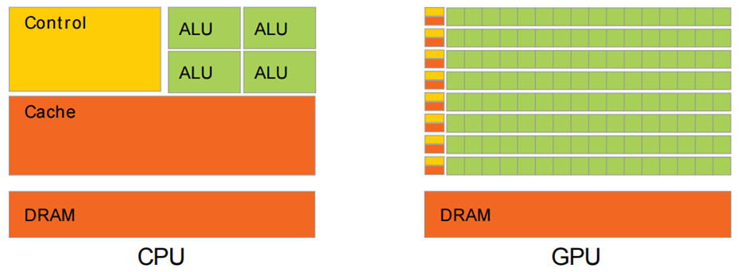

#### （1）页面渲染

- 页面渲染时，被绘制的元素最终要转换成矩阵像素点（即多维数组形式，类似安卓中的 Bitmap），才能被显示器显示。
- 页面由各种基本元素组成：圆形、圆角矩形、线段、文字、矢量图（常用贝塞尔曲线组成）、Bitmap 等。
- 元素绘制时尤其是动画绘制过程中，经常涉及插值、缩放、旋转、透明度变化、动画过渡、毛玻璃模糊，甚至包括 3D 变换、物理运动（如游戏中常见的抛物线运动）、多媒体文件解码（主要在桌面机中有应用，移动设备一般不用 GPU 做解码）等运算。
- 绘制过程经常需要进行逻辑较简单、但数据量庞大的**浮点运算**。

**CPU 与 GPU 结构对比**：黄色的 Control 为控制器，用于协调控制整个 CPU 的运行，包括取出指令、控制其他模块的运行等；绿色的 ALU（Arithmetic Logic Unit）是算术逻辑单元，用于进行数学、逻辑运算；橙色的 Cache 和 DRAM 分别为缓存和 RAM，用于存储信息。

#### （2）Android 硬件加速

- **DisplayList**：一个基本绘制元素，包含元素原始属性（位置、尺寸、角度、透明度等），对应 Canvas 的 `drawXxx()` 方法。信息传递流程：`Canvas(Java API) → OpenGL(C/C++ Lib) → 驱动程序 → GPU`。在 Android 4.1 及以上版本，DisplayList 支持属性——如果 View 的一些属性发生变化（比如 Scale、Alpha、Translate），只需把属性更新给 GPU，不需要生成新的 DisplayList。
- **RenderNode**：包含若干个 DisplayList，通常一个 RenderNode 对应一个 View，包含 View 自身及其子 View 的所有 DisplayList。

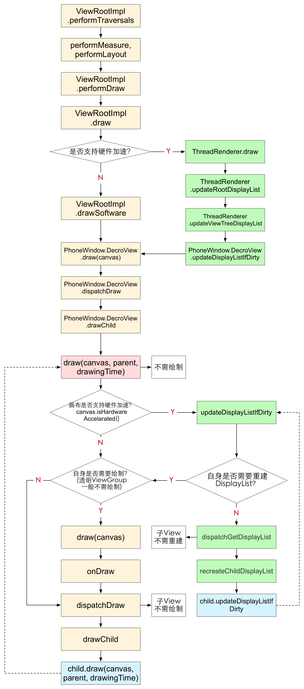

**绘制流程**：从 `ViewRootImpl.performTraversals` 到 `PhoneWindow.DecorView.drawChild` 是每次遍历 View 树的固定流程——首先根据标志位判断是否需要重新布局并执行布局，然后进行 Canvas 的创建等操作开始绘制。

- 如果硬件加速不支持或者被关闭，则使用软件绘制，生成的 Canvas 即 `Canvas.class` 的对象；
- 如果支持硬件加速，则生成的是 `DisplayListCanvas.class` 的对象；
- 两者的 `isHardwareAccelerated()` 方法返回值分别为 false、true，View 根据这个值判断是否使用硬件加速。

两条递归路径：

- `View.draw(canvas, parent, drawingTime) - draw(canvas) - onDraw - dispatchDraw - drawChild`（简称 **Draw 路径**）：调用 `Canvas.drawXxx()` 方法，在软件渲染时用于实际绘制，在硬件加速时用于构建 DisplayList。
- `View.updateDisplayListIfDirty - dispatchGetDisplayList - recreateChildDisplayList`（简称 **DisplayList 路径**）：仅在硬件加速时会经过，用于在遍历 View 树绘制的过程中更新 DisplayList 属性，并快速跳过不需要重建 DisplayList 的 View。

**总结**：

- CPU 更擅长复杂逻辑控制，GPU 得益于大量 ALU 和并行结构设计，更擅长数学运算；
- 页面由各种基础元素（DisplayList）构成，渲染时需要进行大量浮点运算；
- 硬件加速条件下，CPU 用于控制复杂绘制逻辑、构建或更新 DisplayList，GPU 用于完成图形计算、渲染 DisplayList；
- 硬件加速条件下，刷新界面尤其是播放动画时，CPU 只重建或更新必要的 DisplayList，进一步提高渲染效率；
- 实现同样效果，应尽量使用更简单的 DisplayList，从而达到更好的性能（Shape 代替 Bitmap 等）。

---

## 二、事件分发

### 1. 系统级事件输入流程

- 涉及角色：WMS、InputManagerService、InputManager、Window、ViewRootImpl。
- `ActivityThread` 负责控制 Activity 的启动过程：在 `ActivityThread.performLaunchActivity()` 流程中，会针对 Activity 创建对应的 PhoneWindow 和 DecorView 实例；在 `ActivityThread.handleResumeActivity()` 流程中，会获取当前 Activity 的 WindowManager，并将 DecorView 和 `WindowManager.LayoutParams`（布局参数）作为参数调用 `addView()`；该流程中最终创建了 **ViewRootImpl**，并通过 `setView()` 函数对 DecorView 开始了绘制流程的三个步骤。
  - Android 中 Window 和 InputManagerService 之间的通信实际使用的是 **InputChannel**：InputChannel 是一个 pipe，底层实际通过 socket 通信。`ViewRootImpl.setView()` 过程中也会同时注册 InputChannel——该函数执行过程中会在 ViewRootImpl 中创建 InputChannel，InputChannel 实现了 `Parcelable`，所以它可以通过 Binder 传输。
  - Android 提供了 `InputEventReceiver` 类来接收分发这些消息，即 `ViewRootImpl.WindowInputEventReceiver`。
- `ViewRootImpl.setView()` 函数非常重要，它正是 ViewRootImpl 本身职责的体现：
  1. 链接 WindowManager 和 DecorView 的纽带，更广一点可以说是 Window 和 View 之间的纽带；
  2. 完成 View 的绘制过程，包括 measure、layout、draw 过程；
  3. 向 DecorView 分发收到的用户发起的 InputEvent 事件。

### 2. 分发流程与基础概念

- 触摸事件载体：`MotionEvent`；
- 一次完整事件序列：**DOWN → 若干 MOVE → UP / CANCEL**；
- 重点：**DOWN 事件如果没有任何 View 消费，整条事件序列直接作废，后续 MOVE、UP 不会下发**；
- 事件传递链路：`Activity → DecorView(根 ViewGroup) → ViewGroup → 子 ViewGroup → View`；
- 三大核心方法：

| 方法 | 归属 | 作用 |
| --- | --- | --- |
| `dispatchTouchEvent()` | Activity、ViewGroup、View 全部拥有 | 事件分发入口 |
| `onInterceptTouchEvent()` | **仅 ViewGroup 独有** | 判断是否拦截事件 |
| `onTouchEvent()` | ViewGroup、View 都具备 | 消费事件 |

### 3. Activity 层

- `Activity.dispatchTouchEvent()` → Window → DecorView（根 ViewGroup）。
- DecorView 作为 View 树的根节点，接收到屏幕触摸事件 MotionEvent 时，应该通过递归的方式将事件分发给子 View，这似乎理所当然。但实际设计中，设计者将 DecorView 接收到的事件**首先分发给了 Activity**，Activity 又将事件分发给了其 Window，最终 Window 才将事件又交回给了 DecorView，形成了一个小的循环。对 DecorView 而言，它承担了 2 个职责：
  1. 在接收到输入事件时，DecorView 不同于其它 View，它需要先将事件转发给最外层的 Activity，使得开发者可以通过重写 `Activity.onTouchEvent()` 达到对当前屏幕触摸事件拦截控制的目的——这里 DecorView 履行了自身（根节点）特殊的职责；
  2. 从 Window 接收到事件时，作为 View 树的根节点将事件分发给子 View——这里 DecorView 履行了一个普通 View 的职责。

### 4. ViewGroup 分发逻辑

```text
ViewGroup.dispatchTouchEvent()
    ↓
执行 onInterceptTouchEvent()
├─ 返回 true：拦截事件，不再下发子View，交给当前ViewGroup onTouchEvent()
└─ 返回 false：不拦截，从上层子View到下层（倒序遍历）递归分发
        ↓
        子View.dispatchTouchEvent()
            ├─ 子View消费成功(true) → 终止传递，逐层向上返回true
            └─ 所有子View都不消费 → 当前ViewGroup执行自身onTouchEvent()
```

**关键规则**：如果在 **DOWN 事件返回 true 拦截**，同一事件序列后续 MOVE、UP **不会再次调用 onInterceptTouchEvent**！

### 5. View 分发逻辑（普通控件，无拦截方法）

```text
View.dispatchTouchEvent()
    1. 优先执行 OnTouchListener -> onTouch()
        ├ onTouch返回true：直接消费，不再执行onTouchEvent
        └ onTouch返回false：继续调用onTouchEvent()
    2. onTouchEvent()
        ├ true：消费事件，传递终止
        └ false：事件向上抛给父容器尝试处理
```

- 执行优先级：`onTouchListener > onTouchEvent > onClickListener`；
- onClick 触发必要条件：收到 UP 事件，且中途没有被拦截、提前消费。

### 6. 分发原理：递归 + TouchTarget

- 事件分发的本质原理就是**递归**，目前的实现方式是：每接收一个新的事件，都需要进行一次递归才能找到对应消费事件的 View，并依次向上返回事件分发的结果。
- **事件序列**的概念：当接收到一个 ACTION_DOWN 时，意味着一次完整事件序列的开始，通过递归遍历找到 View 树中真正对事件进行消费的 Child 并保存；之后接收到 ACTION_MOVE 和 ACTION_UP 时，则跳过遍历递归的过程，将事件直接分发给 Child 这个事件的消费者；当再次接收到 ACTION_DOWN 时，则重置整个事件序列。
- 根据 View 的树形结构，设计了 **TouchTarget** 类作为成员属性描述 ViewGroup 下一级事件分发，应用了树的**深度优先搜索算法（Depth-First-Search，简称 DFS）**：每个 ViewGroup 都持有一个 `mFirstTouchTarget`，当接收到 ACTION_DOWN 时，通过递归遍历找到 View 树中真正对事件进行消费的 Child，并保存在 `mFirstTouchTarget` 属性中，依此类推组成一个完整的分发链。用到了 `dispatchTouchEvent` 和 `onTouchEvent`，再加上事件拦截 `onInterceptTouchEvent` 就完整了。
- **事件拦截机制**：为增加事件分发过程中的灵活性，Android 为 ViewGroup 层级设计了 `onInterceptTouchEvent()` 函数并暴露给开发者，以达到让 ViewGroup 跳过子 View 的事件分发、提前结束传递流程，并自身决定是否消费事件，再将结果反馈给上层级的 ViewGroup 处理。

### 7. ACTION_CANCEL 的触发条件

ChildView 原先拥有事件处理权，后面由于某些原因，该处理权需要交回给上层去处理，ChildView 便会收到 ACTION_CANCEL 事件（代码逻辑上：上层判断之前交给 ChildView 的事件处理权需要收回来了，便会做事件的拦截处理，拦截时给 ChildView 发一个 ACTION_CANCEL 事件）。

举例：上层 View 是一个 RecyclerView，它收到了一个 ACTION_DOWN 事件，由于这可能是点击事件，所以先传递给对应 ItemView，询问 ItemView 是否需要这个事件；然而接下来又传递过来了一个 ACTION_MOVE 事件，且移动的方向和 RecyclerView 的可滑动方向一致，所以 RecyclerView 判断这是滚动事件，于是要收回事件处理权——这时候对应的 ItemView 会收到一个 ACTION_CANCEL，并且不会再收到后续事件。

### 8. 三大方法返回值含义

1. **boolean onInterceptTouchEvent()（ViewGroup 专属）**
   - `true`：拦截事件，停止向下分发；
   - `false`：放行，事件继续传递给子 View。
2. **boolean onTouchEvent()**
   - `true`：消费事件，传递结束；
   - `false`：不消费，事件向上回溯父容器。
3. **requestDisallowInterceptTouchEvent(boolean)**
   - `true`：子 View 请求**禁止父 ViewGroup 拦截**；
   - `false`：恢复父容器拦截权限；
   - 生效范围：**同一条触摸事件序列（DOWN~UP）**；
   - 最佳调用时机：ACTION_DOWN 中调用。

### 9. 滑动冲突两大解决方案（面试核心）

#### （1）方案 1：外部拦截法【推荐】

逻辑写在父 ViewGroup，在 `onInterceptTouchEvent` 根据滑动方向、区域动态决定是否拦截。
优点：逻辑收敛在父容器，耦合低，不容易出现 CANCEL 异常。

```kotlin
class ConflictParentLayout @JvmOverloads constructor(
    context: Context, attrs: AttributeSet? = null
) : ViewGroup(context, attrs) {
    private var lastX = 0f
    private var lastY = 0f

    override fun onInterceptTouchEvent(ev: MotionEvent): Boolean {
        val x = ev.x
        val y = ev.y
        return when (ev.action) {
            MotionEvent.ACTION_DOWN -> {
                lastX = x
                lastY = y
                // DOWN禁止拦截，否则子View无法接收点击事件
                false
            }
            MotionEvent.ACTION_MOVE -> {
                val dx = x - lastX
                val dy = y - lastY
                // 示例：纵向滑动父容器拦截，横向交给子View
                kotlin.math.abs(dy) > kotlin.math.abs(dx)
            }
            MotionEvent.ACTION_UP, MotionEvent.ACTION_CANCEL -> false
            else -> false
        }
    }

    override fun onTouchEvent(event: MotionEvent): Boolean = true
    override fun layout(l: Int, t: Int, r: Int, b: Int) {}
    override fun onMeasure(widthMeasureSpec: Int, heightMeasureSpec: Int) {}
}
```

#### （2）方案 2：内部拦截法

子 View 主动调用 `requestDisallowInterceptTouchEvent` 阻止父容器拦截。
适合无法修改父容器源码场景。

```kotlin
childView.setOnTouchListener { view, event ->
    val parent = view.parent as ViewGroup
    when (event.action) {
        MotionEvent.ACTION_DOWN -> {
            parent.requestDisallowInterceptTouchEvent(true)
        }
        MotionEvent.ACTION_UP, MotionEvent.ACTION_CANCEL -> {
            parent.requestDisallowInterceptTouchEvent(false)
        }
    }
    false // 不消费事件，继续走原有onTouchEvent逻辑
}
```

### 10. 经典冲突实战场景

- **场景 1：ScrollView 嵌套 RecyclerView（竖向冲突）**
  - 现象：滑动 RecyclerView 时，ScrollView 优先滚动；
  - 解决思路：
    - 内部拦截：RecyclerView 滑动时禁止父 ScrollView 拦截；
    - 外部拦截：自定义 ScrollView，判断触摸区域，RecyclerView 区域不拦截纵向滑动。
- **场景 2：ViewPager（横向）嵌套横向 RecyclerView**
  - 横向滑动冲突；
  - 方案：RecyclerView 检测到左右滑动时，禁止 ViewPager 拦截。
- **场景 3：ViewGroup 局部可滑动、区域可点击**
  - 重写 onInterceptTouchEvent：DOWN 一律放行；MOVE 滑动距离超过阈值后再拦截；
  - 禁忌：不要拦截 DOWN 事件，否则子 View 无法响应点击。

### 11. 高频坑点 & 面试追问

1. DOWN 事件一旦被父容器拦截，子 View 收不到任何事件，点击直接失效；
2. `requestDisallowInterceptTouchEvent` **仅对直接父容器生效，不能跨隔代 ViewGroup**；
3. ACTION_CANCEL 触发时机：父容器中途拦截事件，子 View 收到 CANCEL，业务需要重置拖拽、按压状态；
4. onClick 失效常见原因：父提前拦截、onTouch 返回 true 消费事件、UP 事件被截断；
5. 事件序列断裂：DOWN 无人消费，后续 MOVE/UP 全部丢弃。

### 12. 面试背诵标准答案

> Android 触摸事件从 Activity 开始分发，传递顺序：Activity → ViewGroup → View。
> ViewGroup 通过 `onInterceptTouchEvent` 决定是否拦截；不拦截则继续向下分发子 View。View 没有拦截方法，依靠 `onTouchEvent` 消费事件。整体遵循**先下发，消费后向上回溯**的规则。
>
> 滑动冲突主流两种方案：
> 外部拦截法：重写父 ViewGroup `onInterceptTouchEvent`，根据滑动方向动态拦截，优先推荐；
> 内部拦截法：子 View 调用 `requestDisallowInterceptTouchEvent` 禁止父拦截。
>
> 外部拦截优势：代码集中在父容器，耦合更低，减少 CANCEL 事件带来的状态异常。

### 13. 延伸面试题（含答案）

#### （1）外部拦截与内部拦截各自优缺点？

**外部拦截法**：

- 优点：
  - 拦截逻辑集中在父容器一处，代码清晰，**不侵入子 View**，子 View 无需任何改动；
  - 父容器主导事件分发符合 ViewGroup 设计，拦截时机可在 MOVE 中根据滑动方向、距离动态判断；
  - 子 View 完全无感知，仍按普通 View 处理事件，问题易定位。
- 缺点：
  - 必须自定义父 ViewGroup；父容器是系统/第三方控件（如 ScrollView）时需继承重写，改动面在父容器；
  - 拦截规则若需参考子 View 内部状态（如子 View 是否还能滑动），父容器会与子 View 产生耦合。

**内部拦截法**：

- 优点：
  - 拦截决策点在子 View，**子 View 最了解自己是否需要事件**（如 RecyclerView 知道自己能否滑动），判断更准确；
  - 适合父容器不便改源码的场景（父容器只需保证 DOWN 不拦截即可，ViewGroup 默认实现天然支持 FLAG_DISALLOW_INTERCEPT）；
  - 事件先到子 View，可以先消费、后"还"给父容器，滑动中途可动态让权。
- 缺点：
  - 需**父容器 + 子 View 双方配合**：父容器 DOWN 不能拦截、子 View 必须在 DOWN 中调用 `requestDisallowInterceptTouchEvent(true)`，缺一不可，容易遗漏；
  - `requestDisallowInterceptTouchEvent` 仅对直接父容器生效，多层嵌套时需逐层请求；
  - 侵入子 View 的事件处理逻辑，子 View 改动多。

#### （2）多层嵌套 ViewGroup 滑动冲突怎么处理？

- 核心原则：**方向分流 + 逐层解决**
  - 先按滑动方向做正交分流：横向容器只处理横向、纵向容器只处理纵向，让每层父容器只关心与"直接子层"的冲突；
- 逐层外部拦截：从最外层 ViewGroup 开始，每层用外部拦截法解决本层冲突，拦截规则只涉及本层与子层；
- 逐层 `requestDisallowInterceptTouchEvent`：子 View 需要滑动时，循环向上调用 `parent.requestDisallowInterceptTouchEvent(true)` 直到根（注意它只对直接父生效，必须逐层传递）；
- 布局设计上规避：遵循"横向容器套纵向容器"的规范结构，**避免同向可滑动容器互相嵌套**（如竖向 ScrollView 里套竖向 RecyclerView）；
- 使用 NestedScrolling 嵌套滚动机制：RecyclerView 等自带 NestedScrollingChild 实现，让子 View 通过 `dispatchNestedPreScroll` 把滑动量交给父容器决策，用协议代替手动拦截，减少 CANCEL；
- 兜底：实在无法解耦的深层冲突，由根 ViewGroup 统一收口事件再手动分发。

#### （3）CANCEL 事件业务上有哪些注意事项？

- 语义：CANCEL 表示事件处理权被父容器**中途收回**，子 View 不会再收到后续 MOVE/UP，属于"被中止"而非"正常结束"；
- **必须重置按压态**：pressed 状态、item 高亮背景、水波纹等，否则界面停留在按压视觉上；
- 拖动/缩放状态要复位：拖拽中的位置偏移、缩放倍率等要做还原或定格处理，不能停在半路；
- **不要假设 UP 一定会来**：收尾逻辑（状态机终止、动画结束回调、手势判定）必须同时覆盖 CANCEL 路径，不能只写在 UP 分支；
- 取消 DOWN 时启动的延时任务：如长按计时器，否则 CANCEL 后长按仍会误触发；
- 埋点/统计要提前定义：CANCEL 是否算一次完整手势，避免与 UP 重复上报或漏报。

#### （4）为什么 DOWN 事件尽量不要拦截？

- DOWN 是事件序列的起点：`ViewGroup.dispatchTouchEvent` 在 ACTION_DOWN 分支会重置 FLAG_DISALLOW_INTERCEPT 和 mFirstTouchTarget；父容器一旦在 DOWN 拦截，**子 View 连第一手事件都收不到**，后续整条序列与子 View 无关，点击、按压、长按全部失效；
- DOWN 阶段无法判断意图：DOWN 只有"按下"动作，没有方向与位移信息，此时拦截是盲目的——用户可能只是想点击子 View 的按钮；
- 破坏内部拦截法的前提：子 View 只有在 DOWN 中调用 `requestDisallowInterceptTouchEvent(true)` 才有效，父容器 DOWN 拦截则此机制直接失效；
- 正确做法：DOWN 一律放行，MOVE 中根据滑动方向与距离（超过 `ViewConfiguration.getScaledTouchSlop()`）再决定是否拦截；拦截时子 View 会收到 CANCEL，状态可控；
- 例外：父容器区域完全不需要子 View 响应任何事件（如纯拖拽面板）时，可拦截 DOWN 以简化分发。

---

## 三、动画

### 1. 帧动画

帧动画相比属性动画可能会出现 OOM，因为加载的每一帧图片会占用很大的内存空间。帧动画不会出现内存泄漏的问题（源码中 `private WeakReference<Callback> mCallback = null;`）。

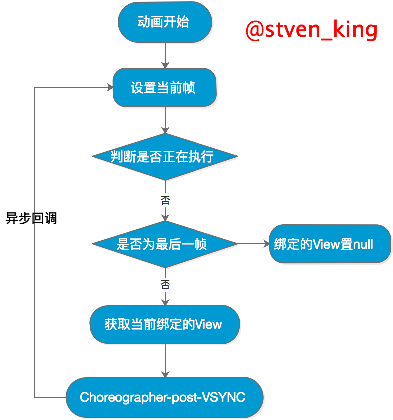

### 2. 补间动画

通过对场景里的对象做图像变换（Translate、Scale、Rotate、Alpha）从而产生动画效果，不会有内存泄漏。

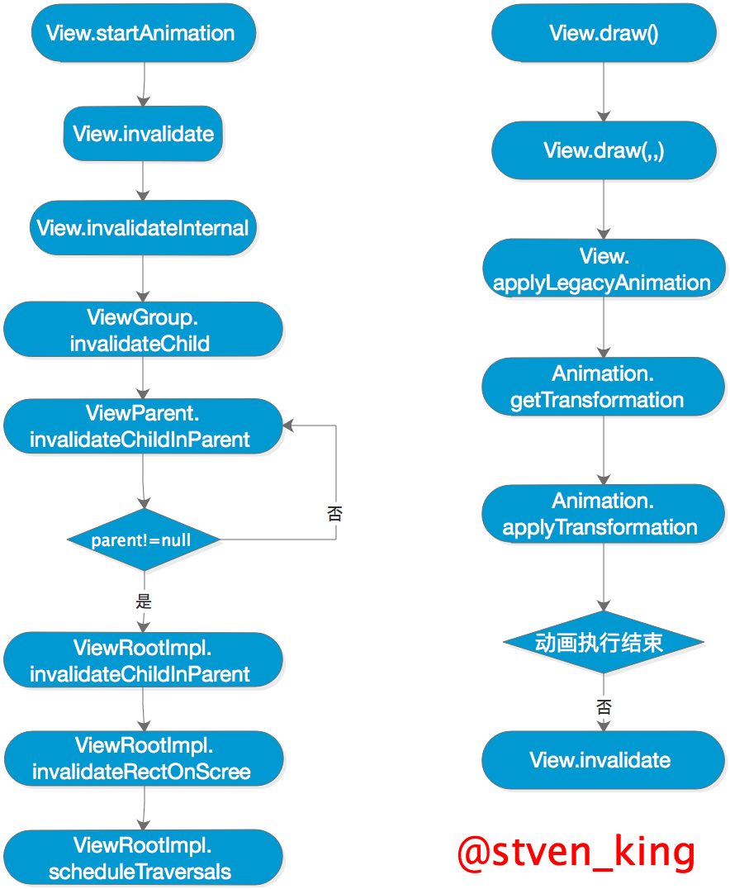

- 补间动画只能作用于某个 View 视图，使用受限；
- 只改变 View 视图效果，无法改变真实属性；
- 插值器（Interpolator）主要是用来定义动画变化过程中的变化速率的一个工具，Android 中提供了很多类型的插值器；
- View 的方法 `boolean draw(Canvas canvas, ViewGroup parent, long drawingTime)` 中会判断是 Animation 还是绘制本身——Animation 产生的动画数据实际并不是应用在 View 本身，而是应用在 RenderNode 或者 Canvas 上，**这就是 Animation 不会改变 View 属性的根本所在**。

### 3. 属性动画

通过动态改变对象的属性从而达到动画效果。属性动画是 Android 3.0（API 11）的新特性，使用范围不再局限于 View，同时还可以根据需要实现各种效果。

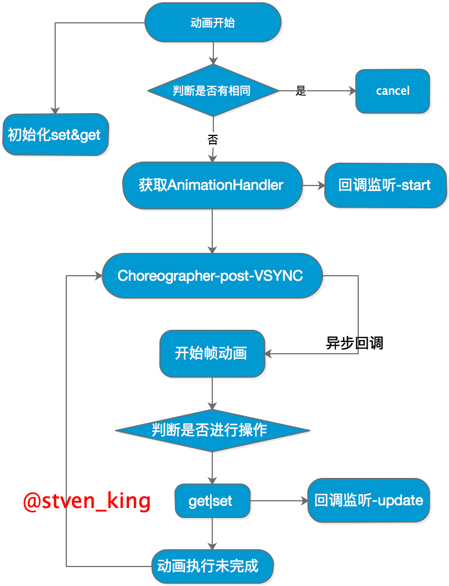

- **ValueAnimator**：通过不断控制值的变化，再不断手动赋给对象的属性，从而实现动画效果；
- **ObjectAnimator**：直接对对象的属性值进行改变操作，通过不断控制值的变化，再不断自动赋给对象的属性，从而实现动画效果——其实现继承了 ValueAnimator；
- **Evaluator**（估值器）：其作用类似于之前的插值器；
- **关键帧**：`PropertyValuesHolder` 类的意义就是保存动画过程中所需要操作的属性和对应的值。通过 `ofFloat(Object target, String propertyName, float… values)` 构造的动画，`ofFloat()` 的内部实现其实就是将传进来的参数封装成 PropertyValuesHolder 实例来保存动画状态；封装以后，后期的各种操作也是以 PropertyValuesHolder 为主的，`setAnimatedValue()` 用到了反射设置。

### 4. 属性动画的内存泄漏

- `ValueAnimator.AnimationHandler.doAnimationFrame` 会循环执行：每次执行完动画（如果动画没有结束），都会再一次请求 vsync 同步信号回调给自己；
- Choreographer 的回调都通过 post 进入了当前线程的 Looper 队列中：`mChoreographer.postCallback(Choreographer.CALLBACK_ANIMATION, this, null);`
- `mRepeatCount` 无穷大，会导致该循环一直执行下去，即使关闭当前页面也不会停止。

### 5. Transition Animation

过渡动画，主要实现 Activity 或 View 过渡动画效果。

### 6. 动画常见问题

- 内存泄漏；
- OOM；
- 硬件加速；
- View 动画对 View 的影像做动画，并不是真正改变 View 的状态，因此有时候会出现动画完成后 View 无法隐藏的现象，即 `setVisibility(View.GONE)` 失效了——这个时候只要调用 `view.clearAnimation()` 清除 View 动画即可解决；
- 将 View 移动（平移）后，在 Android 3.0 之前的系统上，不管是 View 动画还是属性动画，新位置均无法触发单击事件，同时老位置仍然可以触发单击事件（尽管 View 已经在视觉上不存在了，将 View 移回原位置以后，原位置的单击事件继续生效）。从 3.0 开始，属性动画的单击事件触发位置为移动以后的位置，但 View 动画仍然在原位置。

---

## 四、LayoutInflater 与 setContentView

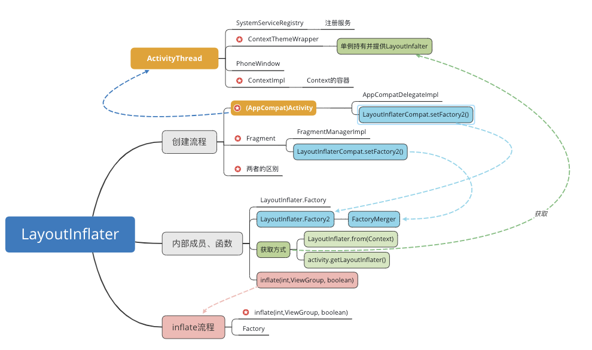

- 无论是哪种方式获取到的 LayoutInflater，都是通过 `ContextImpl.getSystemService()` 获取的，并且在 Activity 等组件的生命周期内保持单例；
- 即使是 `Activity.setContentView()` 函数，本质上也还是通过 `LayoutInflater.inflate()` 函数对布局进行解析和创建；
- SetContentView 时 AppCompatDelegate 代理实现不同版本，`LayoutInflater.inflate` 布局加载到 `android.R.id.content`。

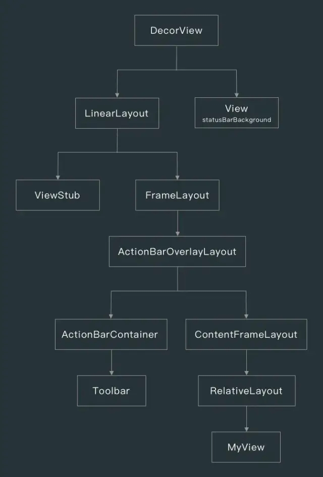

- `getWindow().setContentView(layoutResID);` → `mContentParent.addView(view, params);` → `mContentParent = generateLayout(mDecor);`

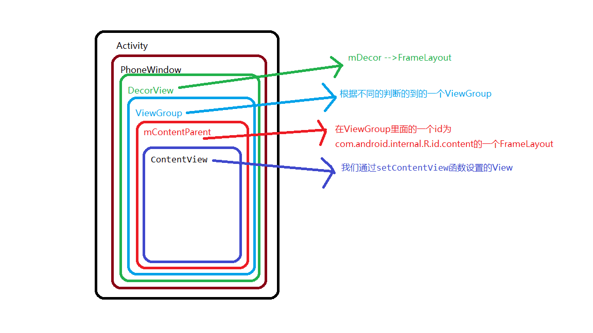

- 在 Android 21 以前一般使用 TextView 等控件，21 以后出了相关的 AppCompat 控件。要让开发者写的 TextView 自动转换为 AppCompatTextView，通过 `LayoutInflaterCompat.setFactory(layoutInflater, this)` 实现。

---

## 五、View 的滑动与坐标系

### 1. 滑动方式

- **layout()**：会调用 onLayout() 来设置显示的位置，传入 left、top、right、bottom 四个参数即可；
- **offsetLeftAndRight() / offsetTopAndBottom()**：和 layout() 差不多，offsetLeftAndRight() 传入 x 轴方向的偏移，offsetTopAndBottom() 传入 y 轴方向的偏移——**比较推荐这种方法**；
- **LayoutParams**；
- **动画**：通过动画改变，主要是操作 View 的 `translationX` 和 `translationY` 两个属性；
- **scrollTo() / scrollBy()**：scrollBy 调用了 scrollTo，前者是相对于当前位置的相对滑动，后者是绝对滑动。
  - 理解上：内容就像报纸，屏幕就像放大镜，`scrollBy()` 移动的是**屏幕**；
  - Scroller 的用法需要与 View 的 `computeScroll()` 方法配合使用。

### 2. 两种坐标系

- **Android 坐标系**：以屏幕左上角为原点；
- **View 坐标系**：以父容器左上角为原点。

---

## 六、GestureDetector 手势检测器

用来辅助检测用户的单击、滑动、长按、双击等行为。

---

## 七、矢量图

- **可缩放矢量图形（Scalable Vector Graphics，SVG）**是一种基于可扩展标记语言（XML）、用于描述二维矢量图形的图形格式。SVG 由 W3C 制定，是一个开放标准。Android 中对矢量图的支持就是对 SVG 的支持。
- **VectorDrawable**：定义在一个 XML 文件中的点、线和曲线，和它们相关颜色的信息集合。VectorDrawable 定义了一个静态 Drawable 对象，和 SVG 格式非常相似——每个 Vector 图形被定义成一个树型结构，由 path 和 group 对象组成：每条 path 包含对象轮廓的几何形状，每个 group 包含变化的详细信息；所有 path 的绘制顺序和它们在 XML 出现的顺序相同。
- **优点**：
  - 图片扩展性：可以进行缩放并且不损失图片质量，这意味着使用同一个文件对不同屏幕密度调整大小并不损失图片质量（提高了安卓机型分辨率适配性）；
  - 图片大小更小：同样大小和内容图片下相比，矢量图比 PNG 图片更小，这样就能得到更小的 APK 文件和更少的维护工作（可减小 APK 安装包的体积）。
- **缺点**：系统渲染 VectorDrawable 需要花费更多时间——矢量图的初始化加载会比相应的光栅图片消耗更多的 CPU 周期，但是两者之间的内存消耗和性能接近。因此可以考虑只在显示小图片的时候使用矢量图（建议限制矢量图在 200*200dp），越大的图片在屏幕上显示会消耗更长的时间进行绘制。

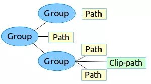

---

## 八、30 秒口述版

View 体系可以按三条主线回答：**绘制**上，measure/layout/draw 三大流程由 ViewRootImpl.performTraversals 驱动、递归测量，MeasureSpec 三种模式决定子 View 尺寸，requestLayout 层层向上标记强制布局、invalidate 只标记脏区走 draw（配合同步屏障 + vsync 生效）；硬件加速下用 DisplayList/RenderNode 让 CPU 只构建与更新、GPU 负责渲染。**事件**上，链路是 Activity → ViewGroup → View，核心是 dispatchTouchEvent / onInterceptTouchEvent / onTouchEvent 三个方法与 TouchTarget 递归缓存，滑动冲突用外部拦截法（推荐）或内部拦截法解决，DOWN 不拦截、拦截要处理 CANCEL。**动画**上，帧动画有 OOM 风险、补间动画只改显示不改属性、属性动画才是真正改属性，注意无限循环动画（mRepeatCount 无穷大）导致的内存泄漏。
