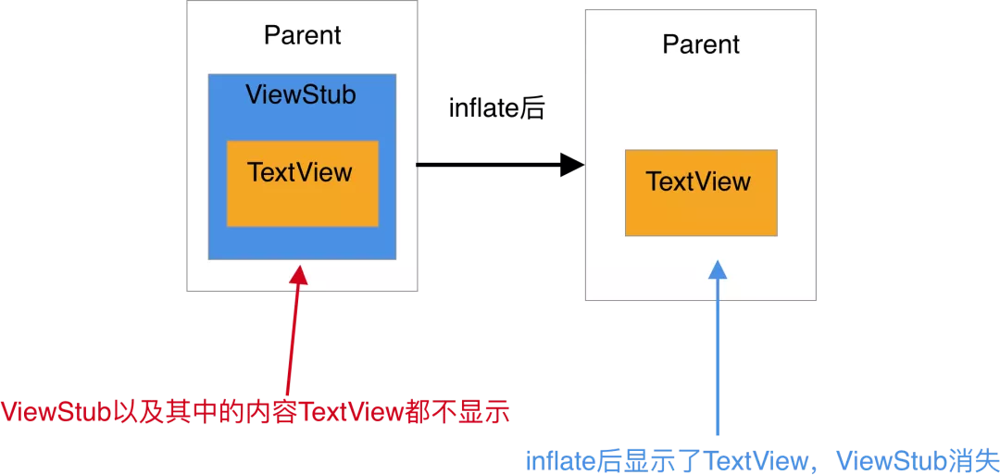

# ViewStub
* ViewStub 是一个看不见的，没有大小，不占布局位置的 View，可以用来懒加载布局。onMessage设置为0，setMeasuredDimension(0, 0);
* 当 ViewStub 变得可见或 inflate() 的时候，布局就会被加载（替换 ViewStub）。因此，ViewStub 一直存在于视图层次结构中直到调用了 setVisibility(int) 或 inflate()。ViewStub只能用来Inflate一个布局文件，而不是某个具体的View，当然也可以把View写在某个布局文件中。
* 在 ViewStub 加载完成后就会被移除，它所占用的空间就会被新的布局替换。否则会报错：ViewStub must have a non-null ViewGroup viewParent。

* ViewStub为何不绘制，setWillNotDraw中设置flag,setFlags(willNotDraw ? WILL_NOT_DRAW : 0, DRAW_MASK);设置WILL_NOT_DRAW之后，onDraw()不会被调用，通过略过绘制的过程，优化了性能。

* 不能引入包含merge标签的布局到ViewStub中。否则会报错：android.view.InflateException: Binary XML file line #1:  can be used only with a valid ViewGroup root and attachToRoot=true

