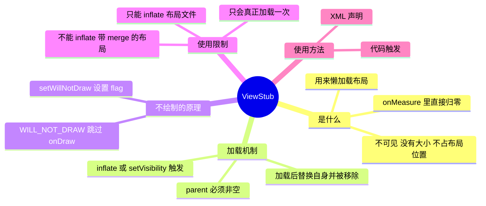
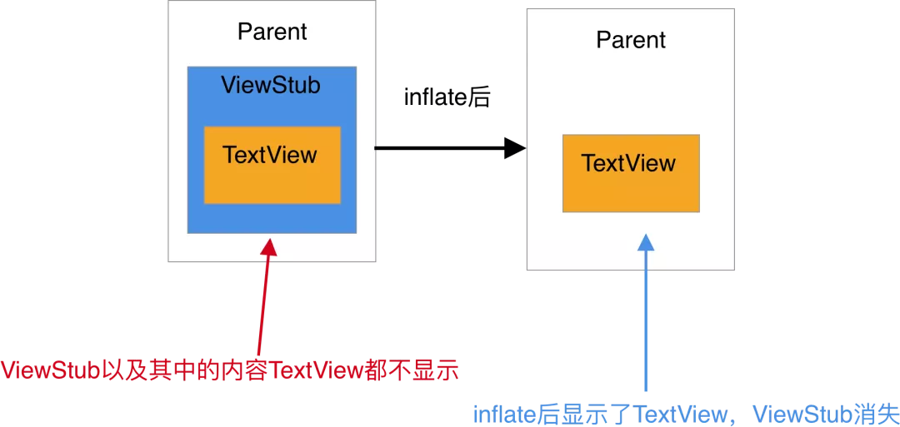

# ViewStub


```mermaid
mindmap
  root((ViewStub))
    是什么
      不可见 没有大小 不占布局位置
      用来懒加载布局
      onMeasure 里直接归零
    加载机制
      inflate 或 setVisibility 触发
      加载后替换自身并被移除
      parent 必须非空
    不绘制的原理
      setWillNotDraw 设置 flag
      WILL_NOT_DRAW 跳过 onDraw
    使用限制
      不能 inflate 带 merge 的布局
      只能 inflate 布局文件
      只会真正加载一次
    使用方法
      XML 声明
      代码触发
```

---

## 一、ViewStub 是什么

ViewStub 是一个**看不见的、没有大小、不占布局位置**的 View，可以用来**懒加载布局**——布局在真正需要之前不会被加载和解析。

这一点从源码就能看出来：ViewStub 在 `onMeasure` 中直接调用 `setMeasuredDimension(0, 0)`，把自身尺寸置为 0，所以它不会占用任何布局空间。

---

## 二、加载机制与生命周期

- 当 ViewStub **变得可见**或调用 **`inflate()`** 的时候，布局就会被加载（并替换 ViewStub）。
- 因此，ViewStub 会一直存在于视图层次结构中，**直到调用了 `setVisibility(int)` 或 `inflate()`**。
- ViewStub 只能用来 inflate 一个**布局文件**，而不是某个具体的 View（当然，也可以把 View 写在某个布局文件中）。
- 在 ViewStub 加载完成后就会被移除，它所占用的空间会被新的布局替换。同一个 ViewStub 只会真正加载一次，之后 `inflate()` 返回的已经是加载出来的那个 View。

如果触发加载时 ViewStub 没有父容器，会报错：

```text
ViewStub must have a non-null ViewGroup viewParent
```



---

## 三、为什么不绘制：setWillNotDraw

ViewStub 本身不参与绘制，原因在 `setWillNotDraw` 设置的 flag：

```java
setFlags(willNotDraw ? WILL_NOT_DRAW : 0, DRAW_MASK);
```

设置 `WILL_NOT_DRAW` 之后，`onDraw()` 不会被调用，通过**略过绘制的过程**优化了性能。

---

## 四、使用限制与常见错误

1. **不能引入包含 `merge` 标签的布局到 ViewStub 中**，否则会报错：

   ```text
   android.view.InflateException: Binary XML file line #1: <merge /> can be used only with a valid ViewGroup root and attachToRoot=true
   ```

2. 触发加载时 ViewStub 必须已经 attach 到 ViewGroup 上，否则报第二节提到的 `non-null ViewGroup viewParent` 错误。
3. 只能 inflate 布局文件，不能直接 inflate 一个 View 对象。

---

## 五、使用方法

XML 中声明（`android:layout` 指定要懒加载的布局，`android:inflatedId` 可指定加载后 View 的 id）：

```xml
<ViewStub
    android:id="@+id/stub_import"
    android:layout_width="match_parent"
    android:layout_height="wrap_content"
    android:inflatedId="@+id/panel_import"
    android:layout="@layout/layout_import" />
```

代码中触发加载：

```java
ViewStub stub = findViewById(R.id.stub_import);
stub.setVisibility(View.VISIBLE);   // 等价于先 inflate() 再设为可见
// 或者直接 stub.inflate();

View panel = findViewById(R.id.panel_import);   // 加载后的布局
```

**与 `include` 的区别**：`include` 在布局解析时立即加载；ViewStub 延迟到真正需要时才加载，适合详情页、引导页、错误页、二级面板这类**不是立刻展示**的布局，可以缩短首次布局时间。

---

## 六、30 秒口述版

ViewStub 是一个宽高为 0、不占布局位置的占位 View，用来懒加载布局：调用 `inflate()` 或 `setVisibility(VISIBLE)` 时才把目标布局加载进来并**替换掉自己**，加载完就从视图树中移除。它通过 `setWillNotDraw(WILL_NOT_DRAW)` 跳过 `onDraw`，进一步省掉绘制开销。使用上有两个坑：目标布局里不能带 `<merge>` 标签，触发加载前必须已经 attach 到父容器。
