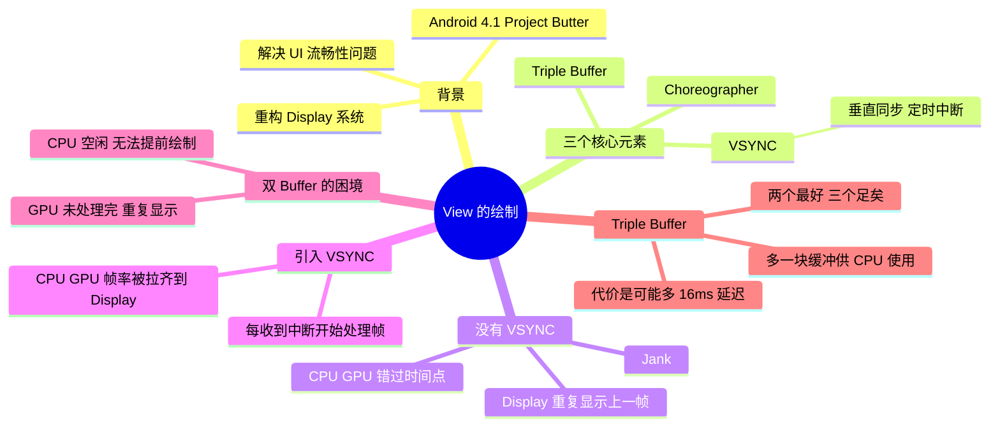
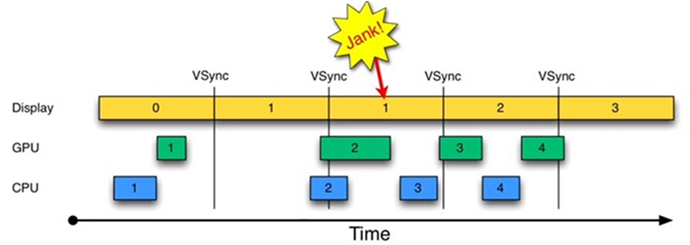
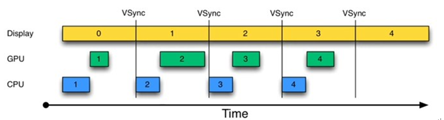

# View 的绘制：VSYNC、Triple Buffer 与 Choreographer

---

## 一、背景：Project Butter

从 **Android 4.1（Jelly Bean）**开始，Android OS 开发团队力图在每个版本中解决一个重要问题。作为严重影响 Android 口碑的问题之一，**UI 流畅性差**首先在 Android 4.1 中得到了有效处理，解决方法就是 **Project Butter**。

Project Butter 对 Android Display 系统进行了重构，引入了三个核心元素：

1. **VSYNC**
2. **Triple Buffer**
3. **Choreographer**

其中 **VSYNC 是理解 Project Butter 的核心**。VSYNC 是 Vertical Synchronization（垂直同步）的缩写，是一种在 PC 上早已广泛使用的技术，可以简单地把它认为是一种**定时中断**。

后续讨论以 Display 为基准，把它划分成 **16ms** 长度的时间段，每一时间段中 Display 显示一帧数据（相当于每秒 60 帧），时间段从 1 开始编号。

---

## 二、没有 VSYNC 的情况

由图 1 可知：

- 时间从 0 开始，进入第一个 16ms：Display 显示第 0 帧，CPU 处理完第 1 帧后，GPU 紧接其后继续处理第 1 帧。三者互不干扰，一切正常。
- 时间进入第二个 16ms：因为上一个 16ms 内第 1 帧已经由 CPU、GPU 处理完毕，Display 可以直接显示第 1 帧。但在本 16ms 期间，CPU 和 GPU 并未及时去绘制第 2 帧数据（注意前面的空白区），而是在本周期快结束时才去处理第 2 帧。
- 时间进入第 3 个 16ms：此时 Display 应该显示第 2 帧，但由于 CPU 和 GPU 还没有处理完第 2 帧，Display 只能继续显示第 1 帧，结果使得**第 1 帧多画了一次**（对应时间段上标注了一个 **Jank**）。

发生 Jank 的关键问题在于：**CPU/GPU 不知道什么时候该处理 UI 绘制**。第 1 个 16ms 段内 CPU 可能在忙别的事情（比如某个应用通过 sleep 固定时间来实现动画的逐帧显示），一旦想起来要去处理第 2 帧数据，时间又错过了。

---

## 三、引入 VSYNC

为解决上面的问题，Project Butter 引入了 **VSYNC**，它类似于时钟中断：**每收到 VSYNC 中断，CPU 就开始处理各帧数据**，整个过程非常完美。

不过仔细琢磨会发现一个新问题：图 2 中 CPU 和 GPU 处理数据的速度似乎都能在 16ms 内完成，而且还有时间空余——也就是说，CPU/GPU 的 FPS（帧率，Frames Per Second）要高于 Display 的 FPS。确实如此，由于 CPU/GPU 只在收到 VSYNC 时才开始数据处理，它们的 FPS 被拉低到与 Display 的 FPS 相同。这种处理并没有什么问题，因为 Android 设备的 Display FPS 一般是 60，对应的显示效果非常平滑。

---

## 四、CPU/GPU 帧率不足：双 Buffer 的困境

如果 CPU/GPU 的 FPS **小于** Display 的 FPS，会是什么情况呢？

由图 3 可知：在第二个 16ms 时间段，Display 本应显示 B 帧，但却因为 GPU 还在处理 B 帧，导致 **A 帧被重复显示**。

同理，在第二个 16ms 时间段内 CPU 无所事事，因为 A Buffer 被 Display 在使用、B Buffer 被 GPU 在使用。注意，**一旦过了 VSYNC 时间点，CPU 就不能被触发以处理绘制工作了**。

为什么 CPU 不能在第二个 16ms 处开始绘制工作呢？原因就是**只有两个 Buffer**。如果有第三个 Buffer 的存在，CPU 就能直接使用它，而不至于空闲——出于这一思路就引出了 **Triple Buffer**。

---

## 五、Triple Buffer

由图 4 可知：第二个 16ms 时间段，CPU 使用 C Buffer 绘图。虽然还是会多显示 A 帧一次，但后续显示就比较顺畅了。

**是不是 Buffer 越多越好呢？回答是否定的。** 由图 4 可知，在第二个时间段内，CPU 绘制的第 C 帧数据要到第四个 16ms 才能显示，这比双 Buffer 情况多了 16ms 延迟。所以，**Buffer 最好还是两个，三个足矣**。

---

## 六、Project Butter 的三个关键点

回顾上面的分析，Project Butter 的关键点有三个：

1. **VSYNC 定时中断**：这是核心关键。
2. **Triple Buffer**：当双 Buffer 不够使用时，系统可分配第三块 Buffer。
3. **把绘制工作统一到 VSYNC 时间点上**：这是一个非常隐秘的关键点，也就是 **Choreographer** 的作用。

Choreographer 是一个极富诗意的词，意为**舞蹈编导**。在它的统一指挥下，应用的绘制工作都将变得井井有条——`Choreographer.postCallback` 会把绘制任务统一安排到下一次 VSYNC 信号到来时执行（可结合 [View 绘制的顺序缓存](../View绘制的顺序缓存/View绘制的顺序缓存.md) 与 Handler 机制中 `DisplayEventReceiver` 的 VSYNC 监听一起理解）。

---

## 七、30 秒口述版

Android 4.1 的 Project Butter 为了解决 UI 卡顿，引入了三样东西：**VSYNC**（类似时钟中断的垂直同步信号，每 16ms 一次，告诉 CPU/GPU 该画下一帧了）、**Triple Buffer**（双 Buffer 时 CPU 和 GPU 会互相等，加一块缓冲让 CPU 能提前绘制，代价是最多多 16ms 延迟，所以"两个最好、三个足矣"）、**Choreographer**（把绘制任务统一编排到 VSYNC 时间点）。三者配合让应用的绘制节奏和 Display 的 60Hz 刷新对齐，从而消除 Jank。
