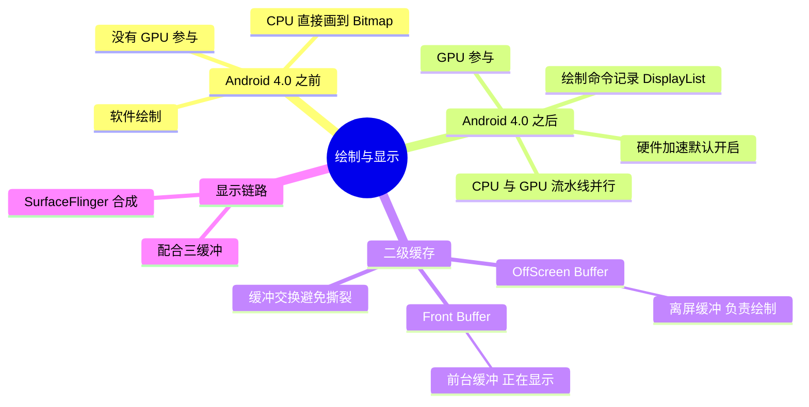
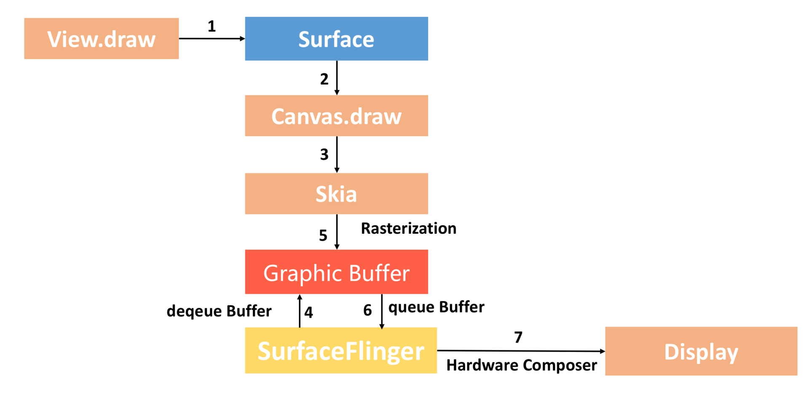
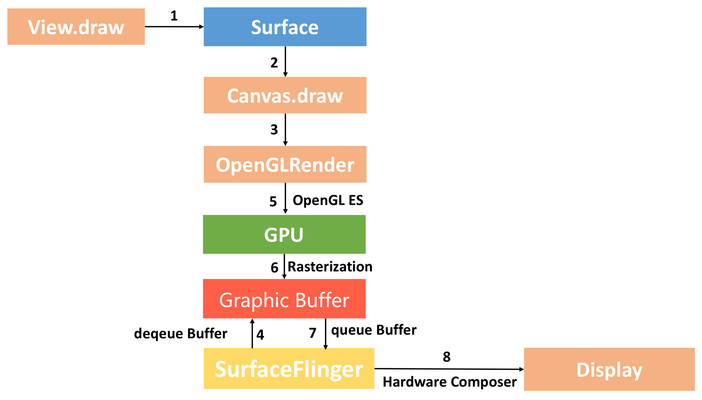

# View 绘制与显示：从软件绘制到硬件加速

---

## 一、Android 4.0 之前：软件绘制

早期 Android 没有让 GPU 参与 UI 绘制，View 的绘制完全由 **CPU** 完成：

- View 树的 `draw` 通过 `Canvas` 直接把内容绘制到 Surface 对应的 Bitmap 上；
- CPU 既要做测量、布局等计算，又要逐像素地完成绘制，绘制复杂界面时负担重、容易掉帧。

---

## 二、Android 4.0 之后：GPU 参与，开启硬件加速

Android 3.0 引入硬件加速，**4.0 起默认开启**。开启之后 **GPU 参与绘制**，绘制方式发生了变化：

- CPU 不再直接画像素，而是把 View 的绘制操作记录成 **DisplayList（显示列表）**——相当于一份"绘制命令清单"；
- GPU 拿到 DisplayList 后负责真正的光栅化，把内容渲染到图形缓冲区中；
- CPU 记录命令与 GPU 渲染可以**流水线并行**：CPU 记录下一帧命令的同时，GPU 正在渲染上一帧，整体绘制效率大幅提升。

需要注意硬件加速下个别 `Canvas` 绘制操作不受支持，这类 View 会退化为软件绘制（单独渲染到一个软件图层）。

---

## 三、显示阶段的二级缓存：OffScreen Buffer 与 Front Buffer

绘制出来的内容并不会直接画在屏幕上，中间要经过**两级缓冲**：

| 缓冲 | 作用 |
| --- | --- |
| **OffScreen Buffer（离屏缓冲）** | GPU 渲染的目标，也就是"正在画"的那块缓冲，不直接显示 |
| **Front Buffer（前台缓冲）** | Display 当前正在读取、显示的那块缓冲 |

工作方式是：绘制始终在 OffScreen Buffer 上进行，一帧画完之后再与 Front Buffer **交换**（由 SurfaceFlinger 合成后送显）。这样做的好处是**避免"边画边显示"造成的画面撕裂（tearing）**——如果直接在正在显示的缓冲上绘制，用户就会看到画了一半的画面。

配合 [View 的绘制](../View的绘制/View的绘制.md) 里讲的三缓冲（Triple Buffer），CPU 绘制、GPU 渲染、Display 显示可以各用一块缓冲同时进行，进一步减少卡顿。

---

## 四、30 秒口述版

Android 4.0 之前 UI 是**软件绘制**，CPU 直接往 Bitmap 上画，负担重；4.0 之后默认开启**硬件加速**，CPU 只负责把绘制命令记录成 DisplayList，真正的渲染交给 GPU，两者流水线并行。绘制完成后并不是直接上屏，而是先渲染到**离屏缓冲（OffScreen Buffer）**，画完再和**前台缓冲（Front Buffer）**交换，由 SurfaceFlinger 合成显示，用双缓冲/三缓冲避免画面撕裂。
